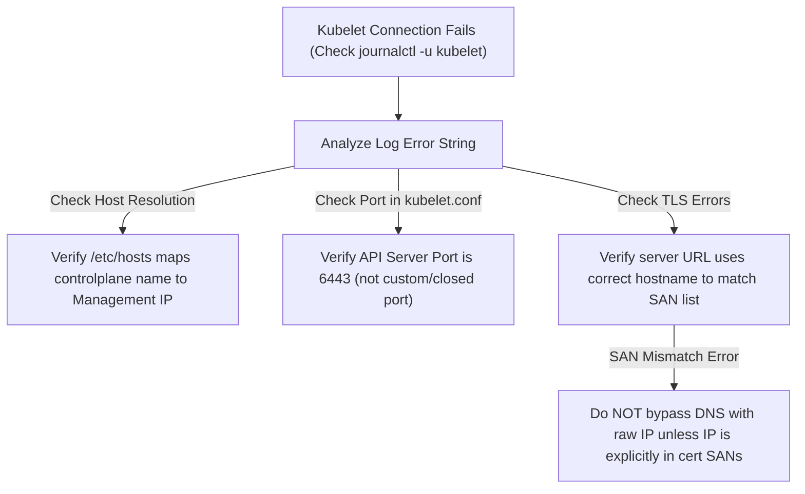

# Lecture: TLS, mTLS & Hostname Resolution Troubleshooting in Kubelet

This reference note documents the troubleshooting mechanics of Kubelet-to-APIServer connection failures, focusing on local hostname resolution, Mutual TLS (mTLS), and Subject Alternative Name (SAN) certificate validation constraints.

---

## 🗺️ Cognitive Map: Troubleshooting Flow of Kubelet Connections



---

## 1. Node01 Local Hostname Resolution Mechanics

When a worker node starts up, the `kubelet` daemon must initialize and establish connection to the API server before participating in cluster operations.
*   **The Bootstrapping Dependency:** Because Kubelet starts *before* CoreDNS or any containerized network overlays are active, it cannot resolve DNS names through Kubernetes service discovery.
*   **Linux `/etc/hosts` Resolution:** Kubelet relies on standard local Linux resolver files. The hostname of the control plane (e.g. `controlplane`) is hardcoded to the management network IP in `/etc/hosts`:
    ```plaintext
    # /etc/hosts on worker node01
    192.24.132.5    controlplane
    ```
*   **Verification in Logs:** If the log outputs:
    `Get "https://controlplane:6553/...": dial tcp 192.24.132.5:6553: connect: connection refused`
    This proves name resolution was successful (it resolved `controlplane` to `192.24.132.5`), and the port was the sole failure point.

---

## 2. The Subject Alternative Names (SANs) Validation Constraints

Bypassing hostname resolution by substituting the raw node IP (e.g. changing `https://controlplane:6443` to `https://192.24.132.5:6443` inside `/etc/kubernetes/kubelet.conf`) often breaks communication due to **TLS certificate validation rules**.

### A. The Client-Side SAN Validation
During Mutual TLS (mTLS):
1.  Kubelet connects to the address configured in its kubeconfig (`kubelet.conf`).
2.  The API Server presents its TLS certificate (`apiserver.crt`).
3.  The client (Kubelet) verifies the certificate's authenticity, and then compares the string it dialed against the **Subject Alternative Names (SANs)** list stamped on the certificate.
4.  If the certificate only lists DNS names like `controlplane` and cluster IPs like `10.96.0.1`, but does not explicitly contain `192.24.132.5`, Kubelet drops the connection with an x509 validation error:
    `x509: certificate is valid for controlplane, not 192.24.132.5`

### B. Changing IPs in Production
If you must change the control plane IP or access it via a new domain name:
1.  Update the `certSANs` block in the cluster Configuration.
2.  Delete the old certificates (`apiserver.crt` and `apiserver.key`).
3.  Regenerate the certificates: `kubeadm init phase certs apiserver`.
4.  Restart the API Server static pod.

---

## 3. Mutual TLS (mTLS) Cryptographic Handshake

Kubernetes uses mTLS for all control plane communication. This guarantees that both the client and server mathematically prove their identities.

### Step 1: Establishing the Certificate Authority (Root of Trust)
The Certificate Authority (CA) consists of:
*   **CA Private Key (`ca.key`):** Kept strictly confidential on the control plane. Used to sign (stamp) certificates.
*   **CA Public Key (`ca.crt`):** Distributed to all nodes. Used to verify signatures.

### Step 2: The Two-Way Verification Flow

```
[ Kubelet (Client) ]                                      [ API Server ]
        |                                                       |
        | ------------ 1. TCP Connection Initiated ------------>|
        |<------------ 2. Sends APIServer Certificate ----------|
        |                 (Contains Name/IP SANs & CA Signature)|
        |                                                       |
        |-- 3. Verifies Signature using local ca.crt ----------|
        |-- 4. Verifies SAN matches dialed hostname -----------|
        |                                                       |
        | ------------ 5. Sends Kubelet Certificate ----------->|
        |                 (Signed by Cluster CA)                |
        |                                                       |
        |                               |-- 6. Verifies Kubelet Signature --|
        |                               |-- 7. Checks CN (e.g. system:node) |
        |<----------- 8. Secure TLS Session Established ------->|
```

1.  **Server Verification:** The API Server sends its certificate. The Kubelet computes the hash of the plain-text certificate data, decrypts the attached digital signature using `ca.crt`, and verifies they match.
2.  **Client Verification:** Kubelet sends its node certificate. The API Server decrypts its signature using its copy of `ca.crt` to verify authenticity. It then reads the Subject Common Name (`CN=system:node:node01`) to authorize permissions via RBAC.
