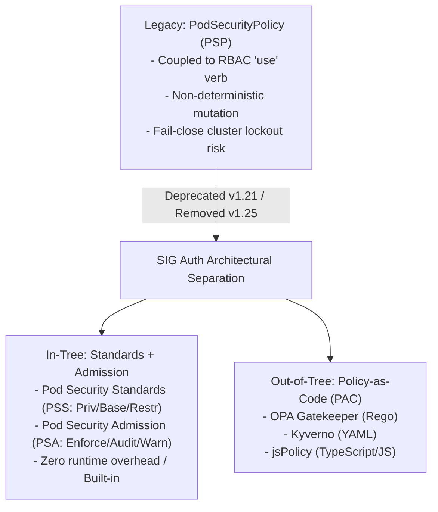

# KubeCon Presentation: SIG Auth Update & The Evolutionary Demise of PodSecurityPolicy

**Source Talk:** [SIG Auth Update and Deep Dive – Mo Khan, Red Hat; Mike Danese, Google; & Tim Allclair, Google](https://youtu.be/SFtHRmPuhEw)  
**Breadcrumbs:** [[0-Index - Kubernetes|🏠 Kubernetes Reference MOC]] > [[Reference Notes/0-7-2_pod_security_standards_and_admission|Module 0-7-2]] > **SIG Auth KubeCon Session**

---

## 🧭 Executive Summary & Architectural Context

In this milestone KubeCon session, the Kubernetes Auth Special Interest Group (SIG Auth) formally diagnosed the systemic architectural and usability failures of **PodSecurityPolicy (PSP)**, declared the technical consensus for its deprecation (formalized in Kubernetes v1.21 and removed in v1.25), and unveiled the architectural roadmap for:
1. **In-Tree Native Standards:** The **Pod Security Standards (PSS)** and **Pod Security Admission (PSA)** (spearheaded in KEP-2579).
2. **Out-of-Tree Programmable Policy-as-Code (PAC):** The rise of dynamic webhook engines (OPA Gatekeeper, Kyverno, jsPolicy) to manage custom organizational logic.



---

## 1. The 5 Inherent Flaws of PodSecurityPolicy (PSP)

During the deep dive, SIG Auth maintainers detailed the exact technical reasons why PSP could not be incrementally fixed without introducing breaking changes:

### 1.1 Confusing & Indirect Application of PSPs (The Controller Problem)
* **The Root Issue:** RBAC controls access to API resources (like Deployments, ReplicaSets, and Pods), but does not inspect the fields inside the resource manifest.
* **The Indirect Creation Trap:** When a developer submits a Deployment, the developer does not create a Pod. The `kube-controller-manager` creates the ReplicaSet, which submits the Pod creation request.
* **Authorization Misalignment:** The admission request arrives at `kube-apiserver` authenticated as the workload's **ServiceAccount**, not the deploying human. If the ServiceAccount lacked explicit RBAC permissions (`use` verb on the PSP), pod creation failed silently inside the controller's event log, causing deep confusion for cluster operators.

### 1.2 Limited Visibility & Non-Deterministic Evaluation Order
* If a ServiceAccount or user had access to multiple PSPs, `kube-apiserver` evaluated them in alphabetical order.
* The first PSP that could successfully mutate or validate the Pod was applied.
* **Consequence:** Renaming a policy (e.g. from `01-permissive` to `99-permissive`) altered which policy matched first, introducing silent, un-trackable security regressions.

### 1.3 Unpredictable Mutation & GitOps Drift
* PSP had mutating capabilities (e.g. injecting default Linux capabilities, applying default `runAsUser` UIDs).
* These silent runtime mutations caused the actual running state in `etcd` to diverge from the declarative YAML manifests stored in version control (GitOps drift).

### 1.4 Lack of Audit Mode or Dry-Run Capability
* PSP operated strictly as a blocking gate (fail-close).
* Administrators could not deploy a new policy to measure how many workloads would break before enforcing it. This made retrofitting security to existing production clusters nearly impossible without risking severe downtime.

### 1.5 The Cluster Lockout Risk: Infeasibility of Enabling by Default
* Because PSP had no safe defaults, enabling `--enable-admission-plugins=PodSecurityPolicy` on a live cluster without pre-existing policies and RBAC bindings instantly blocked **all** pod creations across all namespaces—including system components like CoreDNS and CNI networking plugins.
* Consequently, cloud providers and downstream distributions could never enable PSP by default.

---

## 2. The Successor Dual-Ecosystem Architecture

To resolve these challenges sustainably, SIG Auth partitioned workload security into two distinct architectural tiers:

### 2.1 Tier 1: In-Tree Pod Security Standards (PSS) & Admission (PSA)
* **Pod Security Standards (PSS):** Universal, vendor-neutral definitions of workload security:
  * **`Privileged`:** Unrestricted access for infrastructure (CNIs, storage drivers).
  * **`Baseline`:** Minimally restrictive default profile preventing known privilege escalations.
  * **`Restricted`:** Hardened profile following zero-trust best practices (non-root, dropped capabilities, restricted volumes).
* **Pod Security Admission (PSA):** A built-in, non-mutating admission controller evaluated dynamically via namespace labels:
  * `pod-security.kubernetes.io/enforce`: Blocks offending pods.
  * `pod-security.kubernetes.io/audit`: Permits pods but logs violations to the Kubernetes audit log.
  * `pod-security.kubernetes.io/warn`: Permits pods but returns HTTP warning banners to `kubectl`.

### 2.2 Tier 2: Out-of-Tree Policy-as-Code (PAC) Engines
For requirements beyond the fixed 3-tier PSS profiles (such as mutating pod manifests, enforcing internal image registry whitelists, or mandating organizational billing labels), SIG Auth recommended deploying dynamic webhook admission controllers:
* **OPA Gatekeeper:** Declarative policy evaluation using the Rego declarative query language.
* **Kyverno:** Kubernetes-native policy management using standard YAML syntax.
* **jsPolicy:** High-performance policy execution using JavaScript/TypeScript.

---

## 3. Practical Migration Staging: From PSP to PSA

The presentation emphasized a safe, staged migration framework to eliminate downtime when transitioning off PSP:

```mermaid
sequenceDiagram
    autonumber
    actor Admin as Cluster Administrator
    participant API as kube-apiserver (PSA)
    participant Log as API Audit Logs
    participant Team as Development Teams

    Admin->>API: 1. Set Namespace Label (audit=restricted, warn=restricted)
    Note over API: Workloads are NOT blocked; warnings emitted
    API->>Team: 2. kubectl apply returns warning headers
    API->>Log: 3. Audit annotations logged for violations
    Admin->>Log: 4. Review audit logs to identify non-compliant workloads
    Team->>Team: 5. Update manifests (runAsNonRoot: true, drop: [ALL], seccomp)
    Admin->>API: 6. Switch Namespace Label (enforce=restricted)
    Note over API: Full enforcement active with zero unexpected downtime!
```

---

## 🔗 Related Vault Notes
* Core Foundation Note: [[Reference Notes/0-7-2_pod_security_standards_and_admission|Module 0-7-2: Pod Security Standards, PSP & PSA]]
* Atomic Landing Note: [[Main Notes/pod-security-policy|Pod Security Policy (Legacy PSP)]]
* Modern Landing Note: [[Main Notes/pod-security-admission|Pod Security Admission (PSA)]]
* Deeper Concept: [[Main Notes/pod-security-admission - Standards and Modes|PSA Standards and Modes]]
* Exam Playbook: [[Projects/CKS/Practice Playbook - CKS Exam Hardening and Speed Hacks#Scenario 10: Pod Security Admission (PSA), Standards Hardening & Legacy PSP|CKS Exam Playbook - Scenario 10]]
