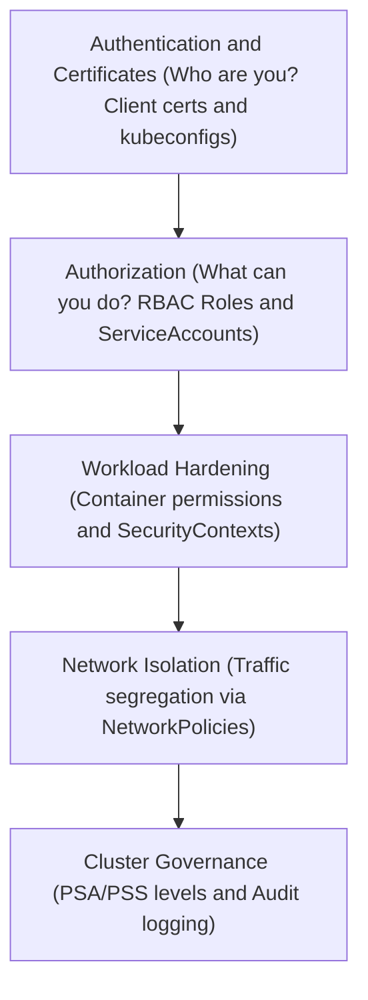
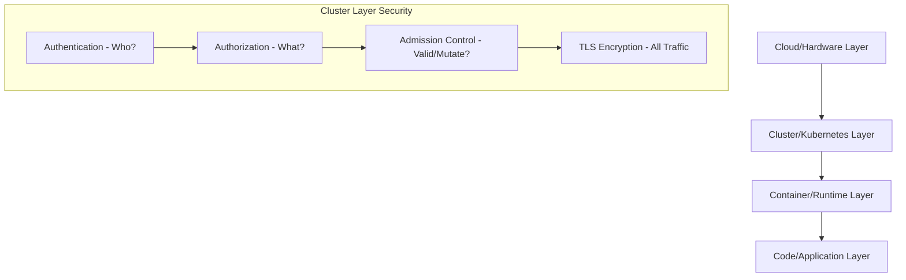
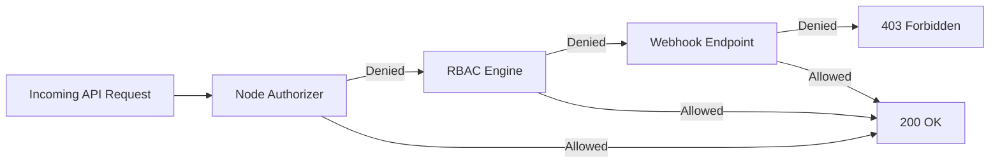
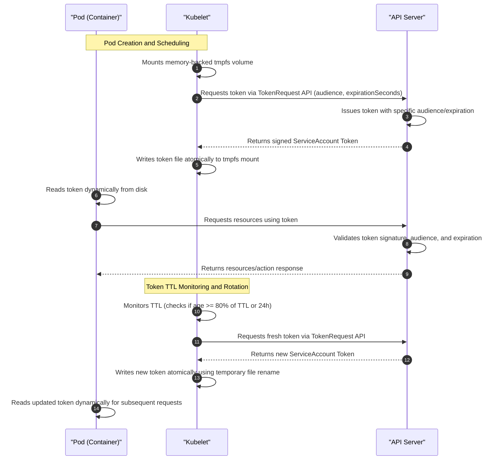
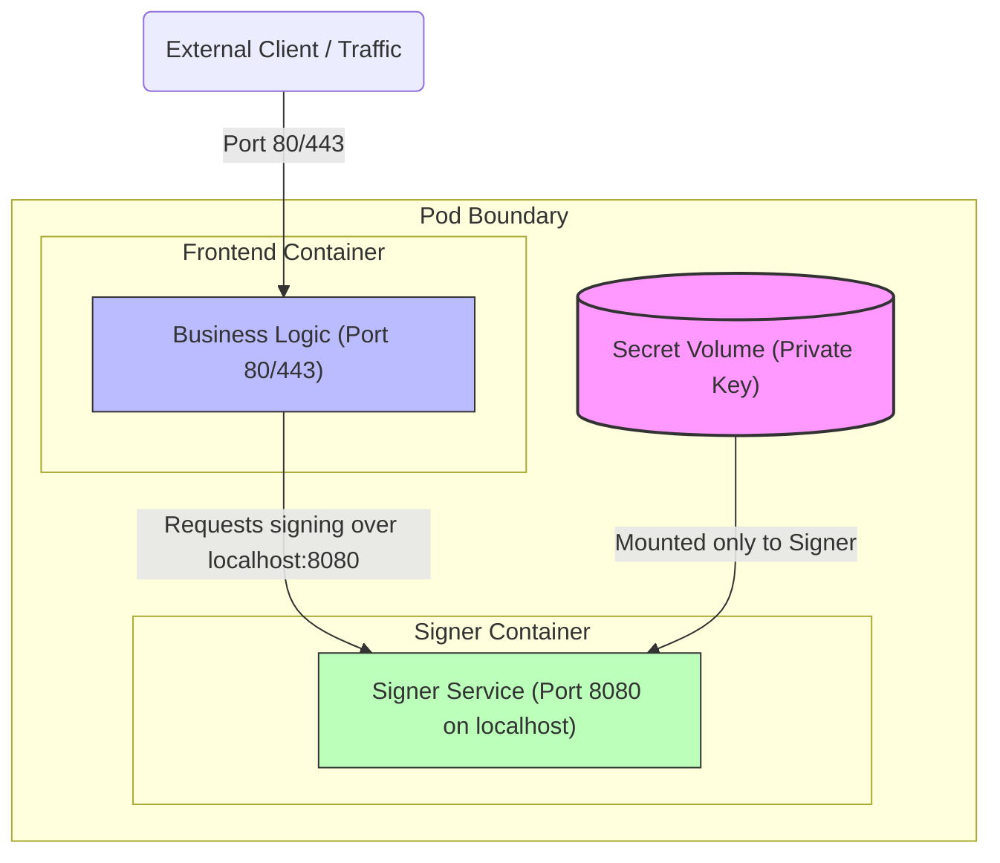

# Kubernetes Security and Network Policies

This reference note compiles core security configurations, certificate management protocols, RBAC structures, authentication systems, workload security contexts, and network policies within a Kubernetes cluster. It is structured to serve as both a CKA exam study guide and a production-grade operations manual.

---

## 🗺️ Cognitive Map: How to Think About the Flow of Knowledge

To build a strong intuition for Kubernetes security, think of the topics as a series of protective layers, moving from cluster admission to workload access, kernel containment, network filtering, and cluster-wide governance:



1. **Step 1: Authentication & Certificates (Sections 1 & 2):** We start at the cluster border. We study how users, administrators, and daemons identify themselves using X.509 Client Certificates, the Certificates API, and connection profiles (`kubeconfig` files).
2. **Step 2: Authorization (Sections 3 & 4):** Once inside the cluster, we restrict API access. We design Role-Based Access Control (RBAC) rules using Roles and ClusterRoles, mapping them to users and automated ServiceAccounts to enforce least-privilege access.
3. **Step 3: Workload Hardening (Section 5 & 11):** We secure the container process at the kernel level. We apply `securityContexts` inside container specs to drop Linux capabilities, restrict system calls, block root execution, and secure config injection.
4. **Step 4: Network Isolation (Section 6 & 10):** We limit lateral movement between workloads. We apply NetworkPolicies to implement a default-deny posture and selectively whitelist ingress/egress routes using namespace and pod label selectors.
5. **Step 5: Cluster Governance (Sections 7, 8, 9, 12, 13 & 14):** Finally, we enforce high-level compliance. We leverage Pod Security Admission (PSA) namespace labels (Privileged, Baseline, Restricted), turn on API Auditing, and verify the cluster configuration against industry-standard security checklists.

By following this flow, you progress from **Cluster Boundary (Authentication) → API Access Control (Authorization) → Process Sandboxing (Workloads) → Traffic Segregation (Networking) → Compliance Auditing (Governance)**.

---


## 1. Kubernetes Security Primitives and Authentication

Kubernetes security is structured around the **4Cs of Cloud Native Security**: Cloud, Cluster, Container, and Code. Security controls at each layer guard against specific threat vectors.



### 1.1 Cluster Access Control Flow
Every request to the `kube-apiserver` passes through three distinct phases:
1. **Authentication (AuthN):** Validates *who* is making the request (identity).
2. **Authorization (AuthZ):** Determines *what* the authenticated identity can do.
3. **Admission Control:** Inspects and optionally modifies or rejects the request payload based on cluster policies (e.g., resource quotas, security constraints).

### 1.2 User Categories
Kubernetes distinguishes between two main classes of users:
- **Human Users (Admins & Developers):** Managed externally. Kubernetes does not have database records representing human users. It relies on trusted certificate authorities, external OIDC providers, or webhooks.
- **ServiceAccounts (Robots/Applications):** Managed natively by Kubernetes. Used by processes running inside Pods (e.g., monitoring agents, CI/CD tools) to authenticate to the API.

### 1.3 Authentication Methods
Kubernetes supports multiple authentication mechanisms, configured via flags on the `kube-apiserver`:

| Method | Flag / Configuration | Description | Production Suitability |
| :--- | :--- | :--- | :--- |
| **X.509 Client Certificates** | `--client-ca-file=ca.crt` | Client presents a certificate signed by a trusted cluster CA. CN is user, O is group. | **High** (used for internal control plane components) |
| **OpenID Connect (OIDC)** | `--oidc-issuer-url`, `--oidc-client-id` | Delegates authentication to external OAuth2 providers (Azure AD, Okta, Keycloak). | **High** (recommended for human users) |
| **Webhook Token** | `--token-auth-file` (legacy webhook) | Delegates token verification to an external REST service. | **High** (used for cloud provider auth integration) |
| **Static Token File** | `--token-auth-file=tokens.csv` | Hardcoded tokens file: `token,user,uid,"group1,group2"`. | **Zero (Removed/Deprecated)**. Insecure, requires API restarts to change. |
| **Static Password File** | `--basic-auth-file=users.csv` | Basic auth: `password,user,uid,"group1,group2"`. | **Zero (Removed/Deprecated)**. Transmits raw credentials, completely insecure. |

> [!WARNING]
> Basic authentication (`--basic-auth-file`) and static token authentication (`--token-auth-file`) were deprecated and have been completely removed in modern Kubernetes versions (removed in v1.22+). Do not use them in production or when building new clusters.

---

## 2. TLS Basics & TLS in Kubernetes

Kubernetes requires TLS for all internal control plane communications. Symmetric encryption (same key for encrypting and decrypting) is used for data in transit after a secure exchange. Asymmetric encryption (public/private key pair) is used for the initial handshake and authentication.

### 2.1 Kubernetes PKI Architecture
Kubernetes uses separate Certificate Authorities (CAs) to isolate trust domains. A typical deployment has:
1. **Cluster CA:** Used for components (apiserver, kubelet, controller-manager, scheduler).
2. **ETCD CA:** Restricts ETCD membership and access to the API server.
3. **Front Proxy CA:** Used for API aggregation layers (extension API servers).

```
+-------------------------------------------------------------------------------------------------+
|                                          CLUSTER CA                                             |
|                                         (ca.crt/key)                                            |
+------------------------------------+----------------------------------+-------------------------+
                                     |                                  |
                                     v                                  v
                       +---------------------------+      +---------------------------+
                       |    Server Certificates    |      |    Client Certificates    |
                       +---------------------------+      +---------------------------+
                       | - kube-apiserver          |      | - kube-admin              |
                       | - kubelet serving         |      | - kube-controller-manager |
                       |                           |      | - kube-scheduler          |
                       |                           |      | - kube-proxy              |
                       |                           |      | - apiserver-to-kubelet    |
                       +---------------------------+      +---------------------------+
```

### 2.2 Manual Certificate Generation (OpenSSL & CFSSL)
Below are the step-by-step commands to generate keys and sign certificates for a cluster.

#### A. Generate Certificate Authority (CA)
The CA certificate and key act as the root of trust.
```bash
# Generate root private key
openssl genrsa -out ca.key 2048

# Generate Self-Signed Root CA Certificate
openssl req -x509 -new -nodes -key ca.key -subj "/CN=KUBERNETES-CA" -days 3650 -out ca.crt
```

#### B. Generate Admin Client Certificate
The admin certificate is a client certificate. Its Common Name (`CN`) acts as the username, and the Organization (`O`) represents the group. To obtain administrator privileges, the Organization must be `system:masters`.
```bash
# Generate private key
openssl genrsa -out admin.key 2048

# Create Certificate Signing Request (CSR)
openssl req -new -key admin.key -subj "/CN=kube-admin/O=system:masters" -out admin.csr

# Sign the certificate using Cluster CA
openssl x509 -req -in admin.csr -CA ca.crt -CAkey ca.key -CAcreateserial -out admin.crt -days 365
```

#### C. Generate Kube-APIServer Server Certificate
The API Server certificate must contain Subject Alternative Names (SANs) because it is accessed by nodes, pods, and users under multiple names (local host IP, cluster IP, DNS names).

1. Create an openssl configuration file `openssl.cnf`:
```ini
[req]
req_extensions = v3_req
distinguished_name = req_distinguished_name
[req_distinguished_name]
[ v3_req ]
basicConstraints = CA:FALSE
keyUsage = nonRepudiation, digitalSignature, keyEncipherment
subjectAltName = @alt_names
[alt_names]
DNS.1 = kubernetes
DNS.2 = kubernetes.default
DNS.3 = kubernetes.default.svc
DNS.4 = kubernetes.default.svc.cluster.local
DNS.5 = master-node.example.com
IP.1 = 10.96.0.1
IP.2 = 192.168.1.10
IP.3 = 127.0.0.1
```

2. Run the generation commands:
```bash
# Generate private key
openssl genrsa -out apiserver.key 2048

# Generate CSR using the configuration file
openssl req -new -key apiserver.key -subj "/CN=kube-apiserver" -config openssl.cnf -out apiserver.csr

# Sign using Cluster CA and the SAN configuration
openssl x509 -req -in apiserver.csr -CA ca.crt -CAkey ca.key -CAcreateserial -out apiserver.crt -extensions v3_req -extfile openssl.cnf -days 365
```

#### D. Generate Kubelet Client/Server Certificate
Kubelet certificates must have the CN format `system:node:<node-name>` and the Organization `system:nodes`. This matches the requirements of the Node Authorizer.
```bash
# Generate private key for worker node 'node01'
openssl genrsa -out node01.key 2048

# Generate CSR
openssl req -new -key node01.key -subj "/CN=system:node:node01/O=system:nodes" -out node01.csr

# Sign using Cluster CA
openssl x509 -req -in node01.csr -CA ca.crt -CAkey ca.key -CAcreateserial -out node01.crt -days 365
```

#### E. Alternative: Generating Certificates using CFSSL
CFSSL (Cloudflare's PKI toolkit) uses JSON configurations, which reduces syntax errors.

1. **CA Configuration (`ca-config.json`):**
```json
{
  "signing": {
    "default": {
      "expiry": "87600h"
    },
    "profiles": {
      "kubernetes": {
        "usages": ["signing", "key encipherment", "server auth", "client auth"],
        "expiry": "87600h"
      }
    }
  }
}
```

2. **CA CSR (`ca-csr.json`):**
```json
{
  "CN": "Kubernetes-CA",
  "key": {
    "algo": "rsa",
    "size": 2048
  }
}
```

3. **Generate CA:**
```bash
cfssl gencert -initca ca-csr.json | cfssljson -bare ca
# Outputs: ca.pem (ca.crt) and ca-key.pem (ca.key)
```

4. **API Server Certificate Configuration (`apiserver-csr.json`):**
```json
{
  "CN": "kube-apiserver",
  "hosts": [
    "127.0.0.1",
    "192.168.1.10",
    "10.96.0.1",
    "kubernetes",
    "kubernetes.default",
    "kubernetes.default.svc",
    "kubernetes.default.svc.cluster.local"
  ],
  "key": {
    "algo": "rsa",
    "size": 2048
  }
}
```

5. **Generate and Sign API Server Certificate:**
```bash
cfssl gencert \
  -ca=ca.pem \
  -ca-key=ca-key.pem \
  -config=ca-config.json \
  -profile=kubernetes \
  apiserver-csr.json | cfssljson -bare apiserver
```

### 2.3 Auditing Certificate Details
When troubleshooting TLS handshake errors, use the following commands to check certificate attributes:

```bash
# Audit certificate validity, issuer, and subject
openssl x509 -in /etc/kubernetes/pki/apiserver.crt -text -noout

# Verify specifically the expiration dates
openssl x509 -in /etc/kubernetes/pki/apiserver.crt -enddate -noout

# Audit SANs (Subject Alternative Names) specifically
openssl x509 -in /etc/kubernetes/pki/apiserver.crt -text -noout | grep -A 1 "Subject Alternative Name"

# Verify if a certificate matches a private key (modulus hashes must be identical)
openssl x509 -noout -modulus -in apiserver.crt | openssl md5
openssl rsa -noout -modulus -in apiserver.key | openssl md5
```

### 2.4 Control Plane TLS Flags
Kubeadm deploys control plane components as static pods. Audit certificates in `/etc/kubernetes/manifests/`:

#### Kube-APIServer Config Highlights (`/etc/kubernetes/manifests/kube-apiserver.yaml`):
```yaml
spec:
  containers:
  - command:
    - kube-apiserver
    - --tls-cert-file=/etc/kubernetes/pki/apiserver.crt
    - --tls-private-key-file=/etc/kubernetes/pki/apiserver.key
    - --client-ca-file=/etc/kubernetes/pki/ca.crt
    # API Server to Kubelet Client Credentials
    - --kubelet-client-certificate=/etc/kubernetes/pki/apiserver-kubelet-client.crt
    - --kubelet-client-key=/etc/kubernetes/pki/apiserver-kubelet-client.key
    # API Server to ETCD Client Credentials
    - --etcd-cafile=/etc/kubernetes/pki/etcd/ca.crt
    - --etcd-certfile=/etc/kubernetes/pki/apiserver-etcd-client.crt
    - --etcd-keyfile=/etc/kubernetes/pki/apiserver-etcd-client.key
```

#### ETCD Config Highlights (`/etc/kubernetes/manifests/etcd.yaml`):
```yaml
spec:
  containers:
  - command:
    - etcd
    - --cert-file=/etc/kubernetes/pki/etcd/server.crt
    - --key-file=/etc/kubernetes/pki/etcd/server.key
    - --trusted-ca-file=/etc/kubernetes/pki/etcd/ca.crt
    - --client-cert-auth=true
    - --peer-cert-file=/etc/kubernetes/pki/etcd/peer.crt
    - --peer-key-file=/etc/kubernetes/pki/etcd/peer.key
    - --peer-trusted-ca-file=/etc/kubernetes/pki/etcd/ca.crt
```

---

## 3. Certificates API

The Kubernetes Certificates API allows users to request certificates by submitting a `CertificateSigningRequest` (CSR) object to the API server. This removes the need to log into the master node to sign certificates.

### 3.1 CSR Flow
```
[Client] -(Generates Key & CSR file)-> [Admin] -(Creates YAML with Base64)-> [K8s API]
                                                                                |
[Client] <--(Downloads Certificate file)--- [Admin] <--(Approves CSR)-----------+
```

### 3.2 Submitting a Certificate Signing Request
1. User generates private key and CSR file:
```bash
openssl genrsa -out jane.key 2048
openssl req -new -key jane.key -subj "/CN=jane" -out jane.csr
```

2. Base64-encode the CSR file (without newlines):
```bash
cat jane.csr | base64 | tr -d '\n'
```

3. Create the `CertificateSigningRequest` manifest (`jane-csr.yaml`):
```yaml
apiVersion: certificates.k8s.io/v1
kind: CertificateSigningRequest
metadata:
  name: jane-csr
spec:
  # Base64 encoded contents of jane.csr
  request: MIICTAIBADAbMRkwFwYDVQQDDBBqYW5lMIIBIjANBgkqhkiG9w0BAQEFAAOC...
  signerName: kubernetes.io/kube-apiserver-client
  usages:
  - client auth
```

> [!NOTE]
> Since the promotion of the CSR API to `v1`, the `signerName` field is required. For client certificates accessing the API server, use `kubernetes.io/kube-apiserver-client`. For serving certificates (like Kubelets), use `kubernetes.io/kubelet-serving`.

### 3.3 CSR Management CLI
```bash
# Create the CSR resource
kubectl apply -f jane-csr.yaml

# List pending CSRs
kubectl get csr

# Approve the CSR
kubectl certificate approve jane-csr

# Deny the CSR
kubectl certificate deny jane-csr

# Export the signed certificate from the CSR object
kubectl get csr jane-csr -o jsonpath='{.status.certificate}' | base64 --decode > jane.crt

# Delete the CSR resource
kubectl delete csr jane-csr
```

### 3.4 Kubelet TLS Bootstrapping
Kubelet TLS bootstrapping allows new worker nodes to join the cluster and obtain valid TLS certificates automatically:
1. When a new node boots, it uses a temporary **Bootstrap Token** to authenticate to the API.
2. The Kubelet submits a CSR requesting a client certificate (`kubernetes.io/kube-apiserver-client-kubelet`).
3. The `kube-controller-manager` approves the CSR if the node's token matches.
4. Kubelet downloads its signed client certificate and uses it for subsequent communication.
5. Kubelet automatically requests a certificate renewal before expiration.

---

## 4. Kubeconfig and API Connection Profiles

Kubeconfig files manage cluster access information, client credentials, and contexts. `kubectl` uses these configuration profiles to locate, authenticate, and route commands to target Kubernetes clusters.

### 4.1 KUBECONFIG Components
A KUBECONFIG file organizes connection information using three collections:
* **Clusters:** Defines cluster API server endpoints and their associated Certificate Authority (CA) data:
  * `server`: The target API server URL.
  * `certificate-authority` or `certificate-authority-data`: The file path or base64-encoded CA certificate used to verify the server's certificate.
* **Users:** Stores the credentials used to authenticate against the clusters (e.g., client certificates, tokens, or cloud provider SSO details).
* **Contexts:** Binds a specific `user` to a specific `cluster` and default `namespace` (e.g., `context: user-admin + prod-cluster`).

```yaml
apiVersion: v1
kind: Config
preferences: {}

clusters:
- name: prod-cluster
  cluster:
    server: https://192.168.1.10:6443
    certificate-authority: /etc/kubernetes/pki/ca.crt # Or certificate-authority-data (base64)

users:
- name: admin-user
  user:
    client-certificate: /etc/kubernetes/pki/users/admin.crt # Or client-certificate-data (base64)
    client-key: /etc/kubernetes/pki/users/admin.key # Or client-key-data (base64)

contexts:
- name: prod-admin-context
  context:
    cluster: prod-cluster
    user: admin-user
    namespace: default

current-context: prod-admin-context
```

### 4.2 Config Management & CLI Selection
* **Default Path:** `kubectl` searches for a config file at `${HOME}/.kube/config` unless overridden.
* **Environment Variable Merging:** You can specify multiple configuration paths using the `KUBECONFIG` environment variable (separated by colons on Linux/macOS). `kubectl` merges these configurations at runtime.
* **Command Override:** You can target a specific config file directly using the `--kubeconfig` flag:
  ```bash
  kubectl --kubeconfig=/path/to/custom/config get pods
  ```
* **Context Management & Switching:**
  ```bash
  # View the merged active kubeconfig configuration details
  kubectl config view
  
  # Switch the current-context
  kubectl config use-context prod-admin-context
  
  # Set the default namespace for the current context
  kubectl config set-context --current --namespace=finance
  
  # Create a new cluster entry
  kubectl config set-cluster staging-cluster \
    --server=https://192.168.1.20:6443 \
    --certificate-authority=/etc/kubernetes/pki/ca.crt \
    --embed-certs=true
  
  # Create a new user entry
  kubectl config set-credentials dev-user \
    --client-certificate=/etc/kubernetes/pki/users/dev-user.crt \
    --client-key=/etc/kubernetes/pki/users/dev-user.key \
    --embed-certs=true
  
  # Create a new context entry binding user and cluster
  kubectl config set-context dev-context \
    --cluster=staging-cluster \
    --user=dev-user \
    --namespace=dev
  ```

### 4.3 TLS Trust and Certificate Validation
* **TLS Handshake:** During the initial connection, the API server sends its certificate. `kubectl` uses the configured `certificate-authority` data to verify that the certificate was signed by a trusted authority.
* **Bypass Verification:** For test environments, you can disable TLS verification, though this exposes the connection to man-in-the-middle attacks:
  ```yaml
  insecure-skip-tls-verify: true
  ```
* **KinD Clusters:** KinD generates a KUBECONFIG file during cluster bootstrap using `kubeadm` commands executed inside control-plane containers, storing the TLS certs automatically.

### 4.4 Merging Kubeconfigs manually
If you have multiple separate Kubeconfig files and need to consolidate them:
```bash
# Concatenate files in the KUBECONFIG environment variable, then flatten and save
KUBECONFIG=~/.kube/config:/path/to/second-config:/path/to/third-config \
  kubectl config view --flatten > ~/.kube/config.merged

# Overwrite the original config with the merged version
mv ~/.kube/config.merged ~/.kube/config
```

---

## 5. Authorization Modes

Authorization occurs after successful authentication. If multiple modes are configured, Kubernetes processes them in the order specified. A request is allowed as soon as one mode approves it.

### 5.1 Mode Configuration
Configure authorization modes on the `kube-apiserver` command line:
```yaml
- --authorization-mode=Node,RBAC,Webhook
```

### 5.2 Key Authorization Modes



- **Node Authorization:** A specialized authorizer that grants permissions to Kubelets based on the pods assigned to their nodes. This ensures a compromised node cannot access secrets or modify resources outside its scope.
- **RBAC (Role-Based Access Control):** Uses the Kubernetes API to manage authorization dynamically. It groups permissions into Roles and binds them to users/groups.
- **Webhook Authorization:** Delegates authorization decisions to an external HTTP server. Commonly used for policy engines like OPA Gatekeeper or Kyverno.
- **ABAC (Attribute-Based Access Control):** Uses local JSON policies. Not recommended because changes require restarting the API server.
- **AlwaysAllow / AlwaysDeny:** Bypasses authorization checks (Allows all or Denies all). Used for local testing and debugging.

---

## 6. Role-Based Access Control (RBAC)

RBAC controls API access using Roles and RoleBindings. 

### 6.1 Authentication vs. Authorization
* **Authentication (AuthN):** Verifies the identity of the client sending the request (e.g., verifying TLS certificates, tokens, or Single Sign-On credentials).
* **Authorization (AuthZ):** Determines what actions the authenticated client is permitted to perform.
* **Zero-Trust Default Policy:** Kubernetes operates on a zero-trust model. By default, authenticated users have zero authorizations and cannot access any cluster resources until explicitly configured.

### 6.2 Namespaced vs. Cluster-Scoped Resources
Resources in Kubernetes are either Namespaced or Cluster-scoped:
- **Namespaced:** Pods, Services, Deployments, ConfigMaps, Secrets, PVCs.
- **Cluster-scoped:** Nodes, Namespaces, PersistentVolumes, ClusterRoles, ClusterRoleBindings, CustomResourceDefinitions (CRDs).

```bash
# List namespaced resources
kubectl api-resources --namespaced=true

# List cluster-scoped resources
kubectl api-resources --namespaced=false
```

### 6.3 RBAC Primitives
- **Role:** Defines rules (apiGroups, resources, verbs) *within a single namespace*. Confined to a single namespace and cannot authorize access to cluster-scoped resources (such as Nodes or PVs).
- **RoleBinding:** Assigns a Role to subjects (Users, Groups, ServiceAccounts) *within that namespace*.
- **ClusterRole:** Defines rules *cluster-wide* (applies to non-namespaced resources, or all namespaces). Used to manage cluster-scoped resources or namespaced resources across all namespaces.
- **ClusterRoleBinding:** Assigns a ClusterRole to subjects *cluster-wide*.
- **RoleBinding to ClusterRole:** If you bind a ClusterRole using a namespaced `RoleBinding`, the permissions defined in the ClusterRole are restricted to the namespace of that RoleBinding.

```
NAMESPACE SCOPE:
[Role: developer] <=====(RoleBinding)=====> [User: jane] (Applies only to 'dev' namespace)

CLUSTER SCOPE:
[ClusterRole: node-admin] <=====(ClusterRoleBinding)=====> [User: michelle] (Applies to all namespaces and cluster-wide resources)
```

### 6.4 Complete YAML Templates

#### Role (Namespaced)
```yaml
apiVersion: rbac.authorization.k8s.io/v1
kind: Role
metadata:
  name: developer-role
  namespace: dev
rules:
- apiGroups: [""] # Core api group (pods, configmaps, secrets, services)
  resources: ["pods", "pods/log", "services"]
  verbs: ["get", "list", "watch", "create", "update", "delete"]
- apiGroups: ["apps"] # Apps group (deployments, replicasets, daemonsets)
  resources: ["deployments"]
  verbs: ["get", "list", "update", "patch"]
```

#### RoleBinding (Namespaced)
```yaml
apiVersion: rbac.authorization.k8s.io/v1
kind: RoleBinding
metadata:
  name: dev-user-binding
  namespace: dev
subjects:
- kind: User
  name: dev-user
  apiGroup: rbac.authorization.k8s.io
- kind: ServiceAccount
  name: build-agent-sa
  namespace: dev
roleRef:
  kind: Role
  name: developer-role
  apiGroup: rbac.authorization.k8s.io
```

#### ClusterRole (Cluster-scoped)
```yaml
apiVersion: rbac.authorization.k8s.io/v1
kind: ClusterRole
metadata:
  name: cluster-storage-manager
rules:
- apiGroups: [""]
  resources: ["persistentvolumes"] # PVs are cluster-scoped
  verbs: ["get", "list", "watch", "create", "delete"]
- apiGroups: ["storage.k8s.io"]
  resources: ["storageclasses"] # StorageClasses are cluster-scoped
  verbs: ["get", "list", "watch"]
```

#### ClusterRoleBinding (Cluster-scoped)
```yaml
apiVersion: rbac.authorization.k8s.io/v1
kind: ClusterRoleBinding
metadata:
  name: storage-admin-binding
subjects:
- kind: User
  name: storage-admin
  apiGroup: rbac.authorization.k8s.io
roleRef:
  kind: ClusterRole
  name: cluster-storage-manager
  apiGroup: rbac.authorization.k8s.io
```

### 6.5 Restricting Access by Resource Names
You can limit access to specific resource instances using `resourceNames`:
```yaml
apiVersion: rbac.authorization.k8s.io/v1
kind: Role
metadata:
  name: configmap-manager
  namespace: dev
rules:
- apiGroups: [""]
  resources: ["configmaps"]
  resourceNames: ["app-config", "db-config"] # Can only interact with these two
  verbs: ["get", "update"]
```

### 6.6 ClusterRole bound with RoleBinding (Best Practice)
> [!TIP]
> You can bind a `ClusterRole` using a `RoleBinding` in a specific namespace. This grants the permissions of the ClusterRole *only within that namespace*. This allows you to define a single common policy (e.g., `view-only-clusterrole`) and reuse it across multiple namespaces without duplicating Role objects.

### 6.7 Testing and Verifying Permissions (`kubectl auth can-i`)
Verify RBAC configurations using the `can-i` command-line utility. This allows administrators to test and debug API access policies without logging in as the target user:

```bash
# Check if you can perform an action
kubectl auth can-i create deployments

# Check if a specific user can perform an action in a namespace
kubectl auth can-i list secrets --as dev-user --namespace dev

# Verify if a user can create pods (impersonation test)
kubectl auth can-i create pods --as=developer-user

# Check if a ServiceAccount can perform an action
kubectl auth can-i get pods --as system:serviceaccount:dev:build-agent-sa --namespace dev

# Check permissions for a group
kubectl auth can-i delete pv --as-group system:masters
```

* **Interactive Lab HTML Logs:** Refer to the hands-on verification logs: [../Attachments/rbac.html](../Attachments/rbac.html) (embed: `![[../Attachments/rbac.html]]`)

### 6.8 Step-by-Step Walkthrough: Restricting ServiceAccount Access
Following the principle of least privilege, we will create a service account representing an application workspace, grant it read-only access to pods in a specific namespace, and verify the isolation.

#### Step 1: Create an Isolated Namespace
Create a dedicated namespace for testing:
```bash
kubectl create namespace rbac-test
```

#### Step 2: Create a ServiceAccount (Dev User)
Create the `dev-user` service account inside the namespace:
```bash
kubectl create serviceaccount dev-user --namespace rbac-test
```

#### Step 3: Define Permissions with a Role
Create a Role manifest (`role.yaml`) specifying read-only permissions on pods:
```yaml
apiVersion: rbac.authorization.k8s.io/v1
kind: Role
metadata:
  name: pod-reader
  namespace: rbac-test
rules:
- apiGroups: [""] # Core API Group
  resources: ["pods"]
  verbs: ["get", "list", "watch"] # Read-only, no create/delete/update
```
Apply the Role to the cluster:
```bash
kubectl apply -f role.yaml
```

#### Step 4: Connect the ServiceAccount and Role with a RoleBinding
Create a RoleBinding manifest (`rolebinding.yaml`) to bind the `dev-user` to the `pod-reader` role:
```yaml
apiVersion: rbac.authorization.k8s.io/v1
kind: RoleBinding
metadata:
  name: read-pods-binding
  namespace: rbac-test
subjects:
- kind: ServiceAccount
  name: dev-user
  namespace: rbac-test
roleRef:
  kind: Role
  name: pod-reader
  apiGroup: rbac.authorization.k8s.io
```
Apply the RoleBinding to the cluster:
```bash
kubectl apply -f rolebinding.yaml
```

#### Step 5: Verify Permissions with `kubectl auth can-i`
Impersonate the `dev-user` service account using `kubectl auth can-i` to verify that our policy is correctly enforced:
1. **Verify positive case (can list pods):**
   ```bash
   kubectl auth can-i list pods --as system:serviceaccount:rbac-test:dev-user --namespace rbac-test
   ```
   *Expected Output:* `yes`
   
2. **Verify negative case (cannot delete pods):**
   ```bash
   kubectl auth can-i delete pods --as system:serviceaccount:rbac-test:dev-user --namespace rbac-test
   ```
   *Expected Output:* `no`

---

## 7. ServiceAccounts

ServiceAccounts provide identities for processes running in Pods.

### 7.1 Automounting ServiceAccount Tokens
Every namespace has a `default` ServiceAccount. By default, Kubernetes mounts the default ServiceAccount token into all Pods at `/var/run/secrets/kubernetes.io/serviceaccount/token`.

To disable this behavior (highly recommended if the Pod does not need to talk to the API server):

#### Option A: Disable at the ServiceAccount level
```yaml
apiVersion: v1
kind: ServiceAccount
metadata:
  name: non-api-sa
automountServiceAccountToken: false
```

#### Option B: Disable at the Pod level
```yaml
apiVersion: v1
kind: Pod
metadata:
  name: web-app
spec:
  automountServiceAccountToken: false
  containers:
  - name: web
    image: nginx
```

### 7.2 ServiceAccount Tokens in v1.22+ and v1.24+
Modern Kubernetes versions include security enhancements for ServiceAccount tokens:

- **v1.22+ Projected Volumes:** Tokens are no longer static. They are mounted as projected volumes, bound to the Pod lifetime, audience-restricted, and auto-rotated (default lifetime is 1 hour).
- **v1.24+ Token Reduction (KEP-2799):** The API server no longer automatically creates secret objects for new ServiceAccounts. If a long-lived, static token is required, you must create a secret manually.

```bash
# Generate a temporary token via TokenRequest API (valid for 1 hour)
kubectl create token my-service-account
```

#### Manually creating a long-lived token secret:
```yaml
apiVersion: v1
kind: Secret
metadata:
  name: my-sa-token-secret
  annotations:
    kubernetes.io/service-account.name: my-service-account # Binds to the SA
type: kubernetes.io/service-account-token
```

---

## 8. Image Security

To pull images from private registries (like Docker Hub, Quay, or Azure Container Registry), the cluster requires credentials.

### 8.1 Creating a Docker Registry Secret
Create a secret containing your private registry credentials:
```bash
kubectl create secret docker-registry private-registry-cred \
  --docker-server=myprivateregistry.com:5000 \
  --docker-username=registry-user \
  --docker-password=registry-password \
  --docker-email=user@org.com
```

### 8.2 Using ImagePullSecrets in a Pod
Reference the secret in the Pod's `spec.imagePullSecrets` block:
```yaml
apiVersion: v1
kind: Pod
metadata:
  name: private-app
  namespace: default
spec:
  imagePullSecrets:
  - name: private-registry-cred
  containers:
  - name: app-container
    image: myprivateregistry.com:5000/apps/secure-api:v1.2
    imagePullPolicy: IfNotPresent
```

### 8.3 Image Pull Policies
- `Always`: Always query the registry to check if the image has changed, and pull it if so. Default for tags like `:latest`.
- `IfNotPresent`: Only pull the image if it does not exist on the node's local disk.
- `Never`: Never pull the image from a registry. Use only local images.

---

## 9. SecurityContexts

SecurityContexts define privilege and access control settings for Pods and Containers. Pod-level settings apply to all containers in the Pod, while container-level settings override Pod-level settings.

### 9.1 Parameter Scope
- **Pod-level only:** `fsGroup` (volume ownership), `sysctls`.
- **Container-level only:** `capabilities`, `privileged`, `allowPrivilegeEscalation`, `readOnlyRootFilesystem`.
- **Shared (Pod or Container level):** `runAsUser`, `runAsGroup`, `runAsNonRoot`, `seLinuxOptions`.

### 9.2 Comprehensive Workload Template
```yaml
apiVersion: v1
kind: Pod
metadata:
  name: secure-web-pod
spec:
  # Pod-level security context
  securityContext:
    runAsUser: 2000
    runAsGroup: 3000
    runAsNonRoot: true # Enforces that container must run with a non-root UID
    fsGroup: 4000 # Volumes mounted will belong to GID 4000
  containers:
  - name: web-app
    image: nginx:alpine
    ports:
    - containerPort: 8080
    # Container-level security context (overrides pod level where conflicting)
    securityContext:
      runAsUser: 2001
      allowPrivilegeEscalation: false # Process cannot gain more privileges than parent
      readOnlyRootFilesystem: true # Mounts the container rootfs as read-only
      capabilities:
        add: ["NET_BIND_SERVICE"] # Allows binding to privileged ports (<1024)
        drop: ["ALL"] # Drops all default Linux capabilities
```

---

## 10. NetworkPolicies

By default, Kubernetes network traffic is **non-isolated (default-allow)**: any Pod can communicate with any other Pod in the cluster, across all namespaces. NetworkPolicies restrict traffic flow (ingress and egress).

> [!IMPORTANT]
> NetworkPolicies are enforced by the cluster's CNI network plugin (e.g., Calico, Cilium, Weave, Kube-router). If you are using a CNI plugin that does not support network policies (like Flannel), NetworkPolicy manifests will be accepted by the API server but will not be enforced.

### 10.1 Selector Combinations: AND vs. OR
Understanding the syntax for combining namespace and pod selectors inside `from` and `to` blocks is critical:

#### OR Logic (Separate Array Elements)
Traffic is allowed if it matches the namespace selector **OR** the pod selector.
```yaml
  ingress:
  - from:
    - namespaceSelector:
        matchLabels:
          environment: production
    - podSelector:
        matchLabels:
          app: frontend
```
*Matches:* Any pod in a namespace labeled `environment: production` (regardless of pod labels), and any pod in the same namespace labeled `app: frontend`.

#### AND Logic (Single Array Element with Multiple Keys)
Traffic is allowed only if it matches both selectors.
```yaml
  ingress:
  - from:
    - namespaceSelector:
        matchLabels:
          environment: production
      podSelector:
        matchLabels:
          app: frontend
```
*Matches:* Only pods labeled `app: frontend` that reside inside namespaces labeled `environment: production`.

---

### 10.2 Production NetworkPolicy Templates

#### Template 1: Default Deny All Ingress & Egress (Namespace Lockdown)
Run this policy in a namespace to block all traffic by default. Services must then be explicitly allowed.
```yaml
apiVersion: networking.k8s.io/v1
kind: NetworkPolicy
metadata:
  name: default-deny-all
  namespace: secure-app
spec:
  podSelector: {} # Empty selector matches all pods in the namespace
  policyTypes:
  - Ingress
  - Egress
```

#### Template 2: Database Policy (Ingress Only)
Allows inbound database connections on port `5432` only from the API application pods, blocking all other ingress.
```yaml
apiVersion: networking.k8s.io/v1
kind: NetworkPolicy
metadata:
  name: db-policy
  namespace: secure-app
spec:
  podSelector:
    matchLabels:
      role: db
  policyTypes:
  - Ingress
  ingress:
  - from:
    - podSelector:
        matchLabels:
          role: api
    ports:
    - protocol: TCP
      port: 5432
```

#### Template 3: Strict Egress Isolation (Allow DNS and specific backend only)
Restricts app pods to only call DNS (UDP/TCP 53) in the `kube-system` namespace and a specific database in the same namespace.
```yaml
apiVersion: networking.k8s.io/v1
kind: NetworkPolicy
metadata:
  name: app-egress-policy
  namespace: secure-app
spec:
  podSelector:
    matchLabels:
      role: api
  policyTypes:
  - Egress
  egress:
  # Rule 1: Allow DNS resolution
  - to:
    - namespaceSelector:
        matchLabels:
          kubernetes.io/metadata.name: kube-system
      podSelector:
        matchLabels:
          k8s-app: kube-dns
    ports:
    - protocol: UDP
      port: 53
    - protocol: TCP
      port: 53
  # Rule 2: Allow database access
  - to:
    - podSelector:
        matchLabels:
          role: db
    ports:
    - protocol: TCP
      port: 5432
```

#### Template 4: Access to External IP Ranges (Egress with CIDR)
Allows pods to communicate with an external API server outside the cluster (e.g., IP `203.0.113.50`).
```yaml
apiVersion: networking.k8s.io/v1
kind: NetworkPolicy
metadata:
  name: external-egress-policy
  namespace: secure-app
spec:
  podSelector:
    matchLabels:
      role: api
  policyTypes:
  - Egress
  egress:
  - to:
    - ipBlock:
        cidr: 203.0.113.0/24
        except:
        - 203.0.113.10/32 # Block this specific host
    ports:
    - protocol: TCP
      port: 443

---

### 10.3 Step-by-Step Walkthrough: Locking Down a Namespace and Allowing Labeled Traffic
By default, all pods in a cluster can communicate freely. In this walkthrough, we will establish a **Default Deny-All** posture in a test namespace, verify that it blocks untrusted communication, and then explicitly allow traffic from a trusted, labeled client pod.

#### Step 1: Create Namespace and Apply Default Deny-All
Create a test namespace:
```bash
kubectl create namespace netpol-test
```
Create and apply a default deny-all policy (`deny-all.yaml`) that targets all pods (`podSelector: {}`) and blocks all incoming (Ingress) traffic:
```yaml
apiVersion: networking.k8s.io/v1
kind: NetworkPolicy
metadata:
  name: default-deny-all
  namespace: netpol-test
spec:
  podSelector: {} # Empty selector matches all pods in this namespace
  policyTypes:
  - Ingress
```
Apply the policy:
```bash
kubectl apply -f deny-all.yaml
```

#### Step 2: Deploy the Target Web Server
Deploy an Nginx web server and expose it as an internal ClusterIP service:
```bash
kubectl run web-server --image=nginx --labels="app=web-server" -n netpol-test
kubectl expose pod web-server --port=80 --target-port=80 -n netpol-test
```

#### Step 3: Verify Blocked Traffic (Negative Case)
Spin up a temporary, untrusted pod to query the web server. This request should fail (timeout) because of our deny-all policy:
```bash
kubectl run untrusted-client --image=busybox -n netpol-test --rm -it -- wget -qO- --timeout=2 http://web-server
```
*Expected Output:* `wget: download timed out`

#### Step 4: Create a Label-Based Allow Policy
Create an allow policy (`allow-labeled.yaml`) that permits inbound TCP traffic on port `80` to any pod labeled `app: web-server`, but **only if** the sender pod is labeled `access: "true"`:
```yaml
apiVersion: networking.k8s.io/v1
kind: NetworkPolicy
metadata:
  name: allow-web-access
  namespace: netpol-test
spec:
  podSelector:
    matchLabels:
      app: web-server # Target pod to secure
  policyTypes:
  - Ingress
  ingress:
  - from:
    - podSelector:
        matchLabels:
          access: "true" # Allow traffic only from pods with this label
    ports:
    - protocol: TCP
      port: 80
```
Apply the allow policy:
```bash
kubectl apply -f allow-labeled.yaml
```

#### Step 5: Verify Allowed Traffic (Positive Case)
Launch a client pod that contains the matching `access=true` label, and query the web server:
```bash
kubectl run trusted-client --image=busybox --labels="access=true" -n netpol-test --rm -it -- wget -qO- --timeout=2 http://web-server
```
*Expected Output:* The standard HTML source code of the Nginx welcome page, proving the label-based policy successfully permitted the connection.

---

## 11. ConfigMap & Secret Security Management

Decoupling configuration parameters and credentials from container images allows application containers to remain environment-agnostic, running unchanged across development, test, and production stages.

### 11.1 ConfigMaps vs. Secrets
* **ConfigMaps:** Store non-sensitive configuration data (e.g., environment variables, settings, config files) in plaintext.
* **Secrets:** Store sensitive data (e.g., passwords, API keys, certificates) in Base64-encoded format.
  * **Important:** Base64 is NOT encryption. It is merely transport encoding. Anyone who has permission to read the Secret object can easily decode it:
    ```bash
    echo "base64-encoded-string" | base64 --decode
    ```

### 11.2 Cryptographic Transport Encoding vs. Encryption
A common security misconception is that Base64-encoding a Secret provides security or confidentiality. **It does not.** Base64 is a simple transport encoding scheme, whereas cryptography/encryption is a mathematical process of securing data using a secret key.

| Attribute | Base64 Encoding | Cryptography / Encryption |
| :--- | :--- | :--- |
| **Primary Purpose** | Translate binary data into ASCII characters for text-based transport protocols (HTML, JSON, YAML). | Enforce data confidentiality and restrict access only to authorized key holders. |
| **Algorithm Type** | Non-cryptographic, public standard lookup table (RFC 4648). | Cryptographic ciphers (e.g., AES-GCM, ChaCha20) relying on mathematical complexity. |
| **Secret Key Requirement** | None. No password or key is required to encode or decode. | Mandatory. Requires a strong cryptographic key (and optional Initialization Vectors). |
| **Security Level** | **Zero Security.** Anyone who can view the encoded string can immediately reverse it to plaintext. | **High Security.** Without the key, decrypting the ciphertext is mathematically infeasible. |
| **Integrity Check** | None. Tampering with the bytes will corrupt the decoded output but won't be caught by the encoding. | Built-in (e.g., AEAD ciphers generate authentication tags to detect data tampering). |

#### Mathematical Mapping & Character Set Mechanics:
Base64 works by converting 3 bytes (24 bits) of raw binary input data into 4 ASCII characters (each representing 6 bits, since $2^6 = 64$).
1. **Alphabet Index:** The encoding maps each 6-bit value to a specific index in a fixed 64-character public alphabet: `A-Z` (indices 0-25), `a-z` (26-51), `0-9` (52-61), `+` (62), and `/` (63).
2. **Step-by-Step Translation:**
   * Take the string `ABC` $\rightarrow$ ASCII values: `65`, `66`, `67` $\rightarrow$ Binary: `01000001 01000010 01000011`.
   * Re-group these 24 bits into four 6-bit segments: `010000` (16), `010100` (20), `001001` (9), `000011` (3).
   * Map indices to the alphabet: `16` $\rightarrow$ `Q`, `20` $\rightarrow$ `U`, `9` $\rightarrow$ `J`, `3` $\rightarrow$ `D`. Resulting string is `QUJD`.
3. **Padding (`=`):** If the input size is not a multiple of 3 bytes, padding characters (`=`) are appended to complete the 4-character blocks.

Because this mapping is entirely deterministic and does not involve any variable keys, **Base64 provides exactly the same level of security as plaintext**.

### 11.3 Core Secret Types & Manifest Examples
Kubernetes classifies secrets by their intended usage patterns to validate their structures.
*See complete implementation manifest examples and CLI creation commands in [[Projects/kubernetes/Project - Secrets Management and Encryption.md#step-by-step-implementation--configuration|Project - Secrets Management and Encryption.md > Secrets Implementation]].*

* **Opaque Secrets (`Opaque`):** The default type for general-purpose configuration secrets (such as databases or API keys). Keys and values are arbitrary base64-encoded strings.
* **TLS Secrets (`kubernetes.io/tls`):** Designed specifically for storing TLS certificates and private keys. Must contain two keys: `tls.crt` and `tls.key`. Applications (such as Ingress Controllers) rely on these exact keys to load certificates.
* **Docker Registry Secrets (`kubernetes.io/dockerconfigjson`):** Stores credentials for pulling images from private container registries. Configured inside the Pod spec using `imagePullSecrets`.
* **Service Account Secrets (`kubernetes.io/service-account-token`):** Used by Pods to authenticate requests to the Kubernetes API server. The API server generates the token secret automatically when a ServiceAccount is created, and mounts it into the Pod at `/var/run/secrets/kubernetes.io/serviceaccount`.
* **Basic Authentication Secrets (`kubernetes.io/basic-auth`):** Designed for basic HTTP authentication, requiring two keys: `username` and `password`.
* **SSH Authentication Secrets (`kubernetes.io/ssh-auth`):** Used for SSH key credential authentication. The private key is mounted into the container as a read-only volume to prevent modifications.

### 11.4 Linux `tmpfs` Volatile Memory Mechanics
To prevent sensitive data from leaking into non-volatile storage, the Kubelet mounts Secret volumes using a Linux `tmpfs` (Temporary Filesystem) mount.

#### How `tmpfs` Works at the Operating System Level:
* **Virtual Memory File System:** Unlike physical disk-backed filesystems (e.g., ext4, xfs) which format block devices and write data blocks to disk spindles or flash cells, `tmpfs` is a dynamic, memory-based filesystem. It writes files directly into the Linux kernel's **page cache**.
* **RAM and Swap Backing:** Pages allocated for `tmpfs` reside in volatile system RAM. However, if the node runs low on physical memory (memory pressure), the Linux kernel's virtual memory manager (VMM) can page out inactive `tmpfs` data blocks to the node's **swap space** (if swap is enabled on the host).
* **Dynamic Resource Allocation:** A `tmpfs` mount is dynamic. It does not pre-allocate memory. A 1GB `tmpfs` mount holding a 10KB Secret file only consumes 10KB of host memory, growing and shrinking dynamically based on file size.
* **Bypassing Physical Disk Write Queues:** Because writes to `tmpfs` do not hit physical disk block queues, journaling engines, or flash-translation layers, they are executed at RAM speeds and never write dirty pages to block storage.

#### Why Kubernetes Uses `tmpfs` for Secrets:
* **Anti-Forensics & Leak Prevention:** Standard file deletions on mechanical disks or SSDs only delete pointers (inodes) in metadata, leaving the actual file contents intact in physical storage blocks until overwritten. If worker nodes write secrets to disk, anyone who steals the node, gets read access to raw block storage, or recovers deleted files could extract plain-text credentials. `tmpfs` ensures the secrets reside only in volatile memory.
* **Host-to-Container Mount Path:**
  1. When a Pod with a Secret volume is scheduled, the Kubelet creates a volume directory on the host: `/var/lib/kubelet/pods/<pod-uid>/volumes/kubernetes.io~secret/<volume-name>`.
  2. The Kubelet mounts a `tmpfs` instance onto that directory: `mount -t tmpfs -o size=<limit> tmpfs /var/lib/kubelet/pods/<pod-uid>/volumes/kubernetes.io~secret/<volume-name>`.
  3. The Kubelet writes the decrypted Secret values into files inside this mount.
  4. The container runtime (e.g. containerd) bind-mounts this host `tmpfs` directory into the container's mount namespace (`mountPath`).
  5. When the Pod terminates, the Kubelet unmounts the volume (`umount`). The kernel immediately frees the corresponding page cache pages, flushing the secret from RAM. The data never touched the node's physical storage blocks.

### 11.5 Modern TokenRequest API & ServiceAccount Token Projection
The mechanism by which workloads authenticate to the Kubernetes API server has evolved to improve the cluster's security posture:

| Characteristic | Legacy ServiceAccount Token Secrets (`kubernetes.io/service-account-token`) | Modern TokenRequest API & ServiceAccount Token Projection |
| :--- | :--- | :--- |
| **Lifecycle** | Stored in the API server as a persistent `Secret` object. Valid indefinitely until explicitly deleted. | Generated dynamically by the API server. Ephemeral and not stored as a `Secret` resource. |
| **Expiration** | None (non-expiring, long-lived credentials). | Short-lived (typically 1 hour, customizable via `expirationSeconds`). |
| **Rotation** | Manual rotation required if leaked. | Automatic rotation handled by the kubelet prior to expiration. |
| **Audience Binding** | No audience restriction. Token can be used to authenticate to any endpoint/service. | Cryptographically bound to a specific audience (e.g. standard `api` or third-party service). |
| **Workload Binding** | Independent of Pod lifecycle. If the Pod is deleted, the Secret token remains valid. | Cryptographically bound to the running Pod instance. If the Pod is terminated, the token is invalidated. |
| **Kubernetes Version** | Standard until v1.21. Deprecated starting in v1.22+. | Recommended standard for v1.22 and later. |

##### ServiceAccount Token Projection Manifest Example:
```yaml
apiVersion: v1
kind: Pod
metadata:
  name: projected-token-pod
spec:
  containers:
  - name: app-container
    image: alpine
    volumeMounts:
    - name: sa-token-vol
      mountPath: /var/run/secrets/projected/serviceaccount
      readOnly: true
  serviceAccountName: my-serviceaccount
  volumes:
  - name: sa-token-vol
    projected:
      sources:
      - serviceAccountToken:
          audience: api
          expirationSeconds: 3600
          path: token
```

##### ServiceAccount Token Projection & Auto-Rotation Mechanics



When a Pod projects a ServiceAccount token, it uses the `TokenRequest` API instead of reading a static, long-lived Secret. The end-to-end lifecycle operates as follows:

1. **The `TokenRequest` Flow:**
   * During Pod creation, the `kube-apiserver` processes the Pod spec. Seeing the `projected.sources.serviceAccountToken` definition, it initializes the Pod but does not immediately generate the token.
   * When the Pod is scheduled onto a node, the local **Kubelet** handles volume preparation.
   * The Kubelet calls the API server's `TokenRequest` endpoint (a subresource of the ServiceAccount: `POST /api/v1/namespaces/{namespace}/serviceaccounts/{name}/token`).
   * In this API call, the Kubelet specifies the requested **Audience** (`audience`) and **Time-to-Live** (`expirationSeconds`).
   * The API server generates a JSON Web Token (JWT), signs it using the cluster's private service account key (defined by `--service-account-key-file` on the API server), and returns the signed token. The token contains claims that cryptographically bind it to the specific Pod (`kubernetes.io/pod.name` and `kubernetes.io/pod.uid`).
   * The Kubelet receives the token and writes it as a file to a node-local memory-backed (`tmpfs`) volume mount, making it accessible to the container at the configured path (e.g., `/var/run/secrets/projected/serviceaccount/token`).

2. **Automatic Token Rotation:**
   * Because these projected tokens are short-lived (usually expiring in 1 hour), they must be refreshed periodically without interrupting the running container.
   * The Kubelet runs a background manager that tracks the lifetime of all projected tokens on the node.
   * **The Rotation Threshold:** The Kubelet automatically triggers a refresh when either of the following conditions is met:
     * The token's age reaches **80% of its total Time-To-Live (TTL)** (e.g., 48 minutes for a 1-hour token).
     * The token has been active on the node for **24 hours** (for long-lived tokens).
   * **Atomic File Swap:** To write the new token without causing race conditions or corruption (where an application might read a partially-written or empty file), the Kubelet performs an atomic write sequence:
     1. It writes the newly fetched token to a temporary file in the same directory (e.g., `.token.tmp`).
     2. It executes an atomic `rename()` system call (renaming `.token.tmp` to `token`). In Linux, `rename` is atomic at the VFS (Virtual File System) level, ensuring that any read operations on `token` either return the old file completely or the new file completely, with no intermediate state.
   * **Application Hot-Reload:** Most official Kubernetes client libraries (like `client-go`) do not load the token into memory once at startup. Instead, they read the token file dynamically from disk for every new API connection or re-read it periodically. Therefore, when the Kubelet atomically replaces the file, the application automatically uses the rotated token on its next API call without needing a restart.
   * *See complete conceptual guide in [[Main Notes/Secret - ServiceAccount Token Projection.md|Secret - ServiceAccount Token Projection.md]].*

### 11.6 Advanced Workload Isolation: Signer Container Partitioning
To protect highly sensitive secrets (such as private cryptographic keys or signing certificates) from remote code execution (RCE) exploits, the application logic can be split across two containers running inside the same Pod:
1. **Frontend Container:** Handles the public-facing, complex application logic (e.g., HTTP APIs, HTML parsing). It has no access to the Secret key volume.
2. **Signer Container:** An isolated, low-privilege sidecar container that mounts the Secret volume containing the private signing key. It exposes a simple endpoint over localhost (or a shared Unix domain socket) that accepts payload signing requests and returns the signature.



###### Manifest Design:
```yaml
apiVersion: v1
kind: Secret
metadata:
  name: private-signing-key
type: Opaque
stringData:
  hmac-key: "super-secret-signing-key-value"
---
apiVersion: v1
kind: Pod
metadata:
  name: partitioned-signer-pod
spec:
  volumes:
    - name: signing-key-volume
      secret:
        secretName: private-signing-key
    - name: shared-ipc-volume
      emptyDir: {}
  containers:
    # 1. Frontend Container: Handles user requests, no access to the secret key
    - name: app-frontend
      image: nginx:alpine
      volumeMounts:
        - name: shared-ipc-volume
          mountPath: /var/run/signer
    # 2. Signer Container: Accesses the secret key, runs on loopback
    - name: hmac-signer
      image: python:alpine
      command:
        - python
        - -c
        - |
          import socket, hmac, hashlib
          # Read private signing key from mounted volume
          with open('/etc/keys/hmac-key', 'r') as f:
              key = f.read().strip().encode()
          # Set up loopback TCP socket to process signing requests
          server = socket.socket(socket.AF_INET, socket.SOCK_STREAM)
          server.bind(('127.0.0.1', 8080))
          server.listen(5)
          print("Signer service active on 127.0.0.1:8080")
          while True:
              conn, addr = server.accept()
              data = conn.recv(1024)
              if not data: break
              # Compute HMAC-SHA256 signature
              signature = hmac.new(key, data, hashlib.sha256).hexdigest()
              conn.sendall(signature.encode())
              conn.close()
      volumeMounts:
        - name: signing-key-volume
          readOnly: true
          mountPath: "/etc/keys"
        - name: shared-ipc-volume
          mountPath: /var/run/signer
```
*See complete architectural pattern in [[Digital Garden/Pattern - Cryptographic Secret Partitioning and Volatile Memory Mounts.md|Pattern - Cryptographic Secret Partitioning and Volatile Memory Mounts.md]].*

### 11.7 Alternatives to Native Secrets
Instead of creating native Kubernetes Secret objects to manage secrets, you can utilize the following structural alternatives:
* **Projected ServiceAccount Tokens:** For inter-component authentication within the cluster. Workloads authenticate to other apps using auto-rotating, short-lived ServiceAccount tokens projected via volume mounts.
* **External Secret Store Providers:** Use centralized external secret management tools (e.g., HashiCorp Vault, AWS Secrets Manager, Google Secret Manager, Azure Key Vault). Workloads can query these stores directly via HTTPS.
  * **Secrets Store CSI Driver:** Mounts secrets directly from the external vault into Pod volumes, bypassing the creation of persistent API objects.
* **CertificateSigningRequests (CSR):** For workload identity and X.509 certificate issuance. Workloads generate a private key locally on the node, submit a CSR to the Kubernetes API, and receive a signed certificate. This keeps the private key local and prevents it from ever being transmitted across the network or stored in API objects.
* **Device Plugins for Node-Local Encryption Hardware:** Utilize hardware security modules (HSMs) or Trusted Platform Modules (TPM) on worker nodes. Workloads are scheduled on these nodes and interact with the hardware via device plugins, ensuring keys are cryptographically bound to physical hardware.
* **Operator Pattern for Session Token Rotation:** Deploy a custom Kubernetes Operator that fetches short-lived session tokens from an external identity provider (IdP) and dynamically generates/rotates local Kubernetes Secrets.

### 11.8 Immutable ConfigMaps and Secrets
* You can mark ConfigMaps and Secrets as immutable by setting `immutable: true` in their spec:
  ```yaml
  apiVersion: v1
  kind: Secret
  metadata:
    name: mysecret
  immutable: true
  data:
    key: dmFsdWUK
  ```
* **Benefits:**
  * Protects against accidental updates that could cause application outages.
  * Improves cluster performance. For clusters with tens of thousands of Secret to Pod mounts, marking them immutable reduces load on `kube-apiserver` because the kubelet does not need to maintain a watch on them.
* **Caveat:** Once marked immutable, you cannot change the `data` or revert the setting. You must delete and recreate the object.

### 11.9 ETCD Encryption at Rest & Envelope Encryption
By default, secrets are stored in etcd as unencrypted base64 strings. Any user with root access to the master host or etcd can read them. Enable **etcd Encryption at Rest** to encrypt secret resources.

Kubernetes supports several encryption providers to secure secrets in the backing `etcd` store. These are categorized into **Static Providers** and **KMS Envelope Encryption**.

#### 1. Available Encryption Providers Comparison

| Provider Name | Encryption Algorithm | Strength | Speed | Key Length | Key Management & Security Characteristics |
| :--- | :--- | :--- | :--- | :--- | :--- |
| **`identity`** | None | N/A | N/A | N/A | Default provider. Resources written as plaintext JSON/Protobuf. If set as the first provider, resources are decrypted upon write. Does not provide any confidentiality. |
| **`aescbc`** | AES-CBC (PKCS#7 padding) | Moderate/Weak | Fast | 16, 24, 32-byte | Not recommended for high-security environments due to CBC's susceptibility to padding oracle attacks. Raw keys are stored in a plaintext configuration file on the control plane disk. |
| **`aesgcm`** | AES-GCM (Random Nonce) | Strong | Fastest | 16, 24, 32-byte | Extremely fast. Recommended only if an automated key rotation scheme is implemented. GCM nonce reuse becomes unsafe if keys are not rotated every 200,000 writes. Keys are stored locally on the control plane. |
| **`secretbox`** | XSalsa20 + Poly1305 | Strong | Faster | 32-byte | Uses relatively newer cryptographic constructions. May not meet strict corporate compliance standards that mandate standard NIST-approved ciphers. Keys are stored locally on the control plane node. |
| **`kms` v1** | Envelope Encryption (AES-GCM DEK) | Strongest | Slow | 32-byte DEK | delegates key management to external KMS via local gRPC plugin. Kube-apiserver calls KMS to encrypt a unique Data Encryption Key (DEK) generated for each secret write using the KMS Master Key Encryption Key (KEK). Deprecated in v1.28. |
| **`kms` v2** | Envelope Encryption (AES-GCM DEK) | Strongest | Fast | 32-byte DEK | Generates a new DEK per API server instance from a secret seed. KEK rotation occurs externally and is controlled by the user. Recommended for production. Stable from v1.29+. |

#### 2. Wildcard Matching & Resource Exemption Precedence
`EncryptionConfiguration` supports wildcarding to specify which resources should be encrypted.
* **Wildcards:** Use `*.<group>` to match all resources in a group (e.g., `*.apps`), `*.` to match all resources in the core API group, or `*.*` to match all resources (including custom resources added after server startup).
* **Overlap Limitation:** You cannot define overlapping wildcard rules within the same resource list or across multiple entries since part of the configuration would be ineffective.
* **Precedence Rule:** Processing is executed sequentially according to the order listed in the `resources` config array.
* **Exempting Resources:** To exempt specific resources (like Events or ConfigMaps) from a wildcard encryption configuration, you must place a specific resource entry with the `identity` provider **earlier** in the resources list than the wildcard entry.
  ```yaml
  resources:
    - resources:
        - events
        - configmaps
      providers:
        - identity: {} # Exempt: Write plaintext
    - resources:
        - '*.*'
      providers:
        - aescbc:
            keys:
              - name: key1
                secret: <BASE64_KEY>
  ```

#### 3. Zero-Downtime Key Rotation Protocol
Changing or rotating keys without API server downtime requires a precise multi-step roll:
1. **Prepare New Key:** Generate a new 32-byte key (`head -c 32 /dev/urandom | base64`). Add it as the **second** key in the keys array under the active provider on all control plane nodes.
   ```yaml
   providers:
     - aescbc:
         keys:
           - name: key1          # Active key used for encryption
             secret: <OLD_SECRET>
           - name: key2          # New key added for decryption only
             secret: <NEW_SECRET>
   ```
2. **Reload / Restart API Servers (Phase 1):** Restart or reload all `kube-apiserver` processes to ensure every instance is capable of decrypting secrets encrypted with the new key.
3. **Promote New Key (Active):** Modify the config file across all nodes, making the new key (`key2`) the **first** entry in the keys array.
   ```yaml
   providers:
     - aescbc:
         keys:
           - name: key2          # Promoted: Now used for new encryption writes
             secret: <NEW_SECRET>
           - name: key1          # Kept for decrypting old secrets
             secret: <OLD_SECRET>
   ```
4. **Reload / Restart API Servers (Phase 2):** Restart/reload all `kube-apiserver` processes to ensure the promoted key is now used for all new writes.
5. **Re-encrypt Backing Store:** Execute a global update command to rewrite all existing secrets using the new active key:
   ```bash
   kubectl get secrets --all-namespaces -o json | kubectl replace -f -
   ```
6. **Retire Old Key:** Remove the old key (`key1`) from the configuration array and restart/reload all API servers. Any accidental raw plaintext reads will now be rejected.

#### 4. Automatic Configuration Reloading
Instead of manually restarting the `kube-apiserver` pods during key rotation, configure the API server with:
```yaml
--encryption-provider-config-automatic-reload=true
```
When enabled, the API server polls the configuration file every minute. The rotation controller automatically updates the decryption ciphers in memory without process restarts. Monitor reloading status using the `apiserver_encryption_config_controller_automatic_reload_last_timestamp_seconds` metrics.

*See complete implementation steps and the step-by-step etcdctl diagnostic run sheet in [[Projects/kubernetes/Project - Secrets Management and Encryption.md#step-by-step-implementation--configuration|Project - Secrets Management and Encryption.md > ETCD Encryption Setup & Verification]].*

### 11.10 ConfigMap & Secret Injection Methods (Application Runtimes)
ConfigMaps and Secrets can be injected into container runtimes in three ways:

#### A. Environment Variables
Injects keys as environment variables directly available to the application process.
* **YAML Syntax (Individual Keys via `valueFrom`):**
  ```yaml
  spec:
    containers:
      - name: app
        image: my-app
        env:
          - name: LOG_LEVEL
            valueFrom:
              configMapKeyRef:
                name: app-config
                key: LOG_LEVEL
          - name: DB_PASS
            valueFrom:
              secretKeyRef:
                name: app-secret
                key: DB_PASSWORD
  ```
* **YAML Syntax (Bulk Ingestion via `envFrom`):**
  Loads all keys in the ConfigMap or Secret as environment variables, where the key names automatically map to the environment variable names.
  ```yaml
  spec:
    containers:
      - name: app
        image: my-app
        envFrom:
          - configMapRef:
              name: app-config
          - secretRef:
              name: app-secret
  ```
* **Pitfall:** If values are updated in the ConfigMap/Secret, env variables are **NOT** updated inside the running container until the container is restarted.


#### B. Command-Line Arguments
Injects ConfigMap or Secret values as start arguments for the container entrypoint.
```yaml
spec:
  containers:
    - name: app
      image: my-app
      command: ["/bin/sh", "-c"]
      args: ["echo $(MY_CONFIG_VAR)"]
      env:
        - name: MY_CONFIG_VAR
          valueFrom:
            configMapKeyRef:
              name: app-config
              key: MY_CONFIG_VAR
```

#### C. Volume Mounts
You can mount an entire ConfigMap or Secret as a volume, exposing keys as configuration files inside the container filesystem:
* **subPath Usage:** When mounting a configuration file into an existing directory (such as `/etc/nginx/`), configure `subPath` to prevent the volume mount from overwriting other files in that directory.
```yaml
spec:
  containers:
    - name: web
      image: nginx
      volumeMounts:
        - name: nginx-config-vol
          mountPath: /etc/nginx/nginx.conf
          subPath: nginx.conf
  volumes:
    - name: nginx-config-vol
      configMap:
        name: nginx-config
```
* **Advantage:** Kubelet periodically syncs updates. Modifications to the ConfigMap/Secret will automatically propagate as file updates inside the container within a few minutes (without restarting the container). Note that subPath mounts do not receive automatic updates.

### 11.11 Imperative Workflows & Version Control Export
To build configurations quickly, use imperative commands and export them for version control:

#### A. Imperative CLI Creation
* **ConfigMap:**
  ```bash
  kubectl create configmap app-config \
    --from-literal=LOG_LEVEL="INFO" \
    --from-literal=DATABASE_URL="mysql://db:3306"
  ```
* **Generic Secret (Opaque):**
  ```bash
  kubectl create secret generic app-secret \
    --from-literal=DB_PASSWORD="super-secret-password"
  ```
* **Docker Registry Secret:**
  ```bash
  kubectl create secret docker-registry my-registry-secret \
    --docker-server=<registry-server> \
    --docker-username=<username> \
    --docker-password=<password> \
    --docker-email=<email>
  ```

#### B. Exporting to Version Control
To store configurations in git, export the live settings as a clean template YAML:
```bash
kubectl get configmap app-config -o yaml > app-config.yaml
```

### 11.12 Secrets Store CSI Driver Integration
While native secrets (unencrypted Base64) or etcd encryption configurations (static keys stored locally) improve data safety, they do not resolve the problem of keeping credentials out of version control and managing them in a unified system. For production environments, the **Secrets Store CSI Driver** is recommended.

#### 1. How the CSI Secrets Store Driver Works
Rather than synchronizing external secrets (e.g. AWS Secrets Manager, HashiCorp Vault) into Kubernetes `Secret` API objects, the CSI driver pulls credentials at runtime and mounts them directly as files inside a volatile memory-backed `tmpfs` volume in the Pod container. This pattern completely bypasses etcd persistent storage, reducing the cluster attack surface.
* **ServiceAccount IRSA Integration:** On cloud providers (like EKS), the Pod uses a specific ServiceAccount annotated with an IAM Role (AWS IAM Roles for Service Accounts - IRSA). This role authorizes the CSI driver to fetch specific secrets.
* **SecretProviderClass CRD:** Configures the external provider (AWS, Vault, Azure, GCP) and lists the target secret key-value paths to map.
* **CSI Volume Mount:** The Pod spec declares a volume targeting the `secrets-store.csi.k8s.io` driver and links it to the `SecretProviderClass`.
* **Auto-rotation:** The CSI driver can poll the external Secret store periodically (e.g. every 2 minutes) to automatically update the mounted files.

*See complete playbooks and deployment manifests in [[Projects/kubernetes/Project - Secrets Store CSI Driver.md|Project - Secrets Store CSI Driver.md]].*

---

## 12. Pod Security Admission (PSA) and Standards

Pod Security Admission (PSA) is the built-in admission controller that replaces the deprecated PodSecurityPolicy (PSP) to enforce the **Pod Security Standards (PSS)** at the namespace level.

### 12.1 Pod Security Standards (PSS) Levels
1. **`privileged`:** Unrestricted policy. Allows container processes to run as root, execute host-level sysctls, map host hostpaths, and bypass isolation boundaries.
2. **`baseline`:** Default/standard profile. Prevents known privilege escalations. Restricts host network/PID access, block hostpath volume mounts, but permits standard root execution.
3. **`restricted`:** Hardened profile. Enforces strict hardening guidelines:
   * Requires `runAsNonRoot: true`.
   * Requires dropping all capabilities and adding only `NET_BIND_SERVICE` if needed.
   * Restricts volume types (blocks hostpath, permits configmaps/secrets/projected).
   * Restricts ports (<1024 blocked without explicit capability).

### 12.2 PSA Modes of Admission Control
* **`enforce`:** Blocks Pod creation if it violates the target PSS level.
* **`warn`:** Permits Pod creation but returns a user-facing warning header to the client (e.g., during `kubectl apply`).
* **`audit`:** Permits Pod creation but records an audit event in the API audit log.

### 12.3 Applying PSA Namespace Labels
Configure PSA behavior by applying labels to a namespace:
```yaml
apiVersion: v1
kind: Namespace
metadata:
  name: secure-namespace
  labels:
    pod-security.kubernetes.io/enforce: restricted
    pod-security.kubernetes.io/enforce-version: v1.30
    pod-security.kubernetes.io/warn: baseline
    pod-security.kubernetes.io/warn-version: latest
```

> [!CAUTION]
> **Namespace Label Escalation Risk:** Any user with permission to `patch` or `update` Namespace resources (e.g. via a namespaced RoleBinding) can modify these labels. This creates a severe privilege escalation risk, as a user could downgrade a namespace's PSA level from `restricted` to `privileged` to deploy an insecure root Pod. Restrict Namespace label permissions strictly.

---

## 13. Hardening Guide: Dynamic Resource Allocation (DRA) Security

Dynamic Resource Allocation (DRA) (Beta in v1.36) provides advanced scheduling and allocation mechanisms for hardware accelerators (GPUs, ASICs). Because DRA drivers write resource allocation metadata back to the API, secure authorization is required.

### 13.1 Synthetic Subresources
DRA status updates do not modify the main claim object directly; instead, they target synthetic subresources to enforce least-privilege:
1. **`resourceclaims/binding`:** Required to modify `status.allocation` and `status.reservedFor`. Usually granted strictly to the `kube-scheduler` and custom allocation controllers.
2. **`resourceclaims/driver`:** Required to modify `status.devices`. Restricts drivers from tampering with claims managed by other drivers.

### 13.2 Node-Aware Verbs
When configuring RBAC for DRA drivers, use node-aware verbs:
* **`associated-node:<verb>`:** Used for node-local drivers (e.g. GPU agent running on a worker node). The API server verifies node association before validating the request.
* **`arbitrary-node:<verb>`:** Granted only to control-plane or cluster-wide multi-node controllers.

---

## 14. Kubernetes Security Checklist

Ensure a basic security baseline for control planes, hosts, and applications:

### A. Authentication & Authorization
* [ ] Disable basic auth (`--basic-auth-file`) and static tokens (`--token-auth-file`).
* [ ] Enforce mTLS for all control plane communication (APIServer, ETCD).
* [ ] Restrict `system:masters` group assignment (acts as superuser, bypassing RBAC).
* [ ] Periodically audit cluster-level RoleBindings and ClusterRoleBindings.

### B. Host & Network Security
* [ ] Apply a default-deny-all Ingress and Egress `NetworkPolicy` to namespaces.
* [ ] Restrict direct host network access to `kube-apiserver` (port 6443) and `etcd` (ports 2379/2380).
* [ ] Configure worker hosts to use the `systemd` cgroup driver for resource tracking.

### C. Pod & Container hardening
* [ ] Apply `readOnlyRootFilesystem: true` to prevent containers from writing to host directories.
* [ ] Set `runAsNonRoot: true` and define non-root `runAsUser` values.
* [ ] Drop `ALL` Linux capabilities, explicitly adding only what's required.
* [ ] Scan container images for vulnerabilities, pin specific image digests, and pull only from verified registries.
* [ ] Run untrusted workloads inside isolated environments using sandboxed runtimes (e.g. gVisor, Kata Containers) via `RuntimeClass`.

---

## 🛠️ Practical Proof of Concept (PoC): Network Security & RBAC Hardening Lab

### Target Scenario
We will build a secure multi-tenant namespace, deploy database and web frontend workloads, apply a default-deny-ingress network policy, configure custom ingress rules to permit traffic only from the web tier, and verify access. Additionally, we will construct a least-privilege RBAC role for testing namespace access.

### Step-by-Step Guided Steps

1. **Verify or Provision Cluster**:
   Ensure you have a running cluster (e.g., using `kind`):
   ```bash
   kind create cluster --name cka-security-poc
   ```

2. **Setup Isolated Namespaces and Workloads**:
   - Create a dedicated namespace:
     ```bash
     kubectl create namespace secure-apps
     ```
   - Deploy Nginx representational workloads representing the Web tier and Database tier:
     ```bash
     # Web Tier Pod
     kubectl run web-tier -n secure-apps --labels="role=web" --image=nginx:alpine --port=80
     # Database Tier Pod (running an Nginx server listening on port 80 to verify connectivity)
     kubectl run db-tier -n secure-apps --labels="role=db" --image=nginx:alpine --port=80
     # Untrusted External Pod
     kubectl run external-tier -n secure-apps --labels="role=external" --image=nginx:alpine --port=80
     ```

3. **Establish Default-Deny-Ingress Policy**:
   - Apply a default-deny-ingress network policy to isolate the database:
     ```yaml
     cat <<EOF > db-default-deny.yaml
     apiVersion: networking.k8s.io/v1
     kind: NetworkPolicy
     metadata:
       name: db-default-deny
       namespace: secure-apps
     spec:
       podSelector:
         matchLabels:
           role: db
       policyTypes:
       - Ingress
     EOF
     kubectl apply -f db-default-deny.yaml
     ```
   - Verify network isolation. Execute a connection check from both the Web pod and the External pod:
     ```bash
     # Check from external-tier (expected to time out / fail)
     kubectl exec -n secure-apps external-tier -- curl --connect-timeout 3 http://db-tier
     
     # Check from web-tier (expected to time out / fail)
     kubectl exec -n secure-apps web-tier -- curl --connect-timeout 3 http://db-tier
     ```
     Observe that both connection attempts fail, confirming the database pod is successfully isolated.

4. **Allow Specific Ingress from Web Tier**:
   - Apply an ingress allowance policy targeting the database pod:
     ```yaml
     cat <<EOF > db-allow-web.yaml
     apiVersion: networking.k8s.io/v1
     kind: NetworkPolicy
     metadata:
       name: db-allow-web
       namespace: secure-apps
     spec:
       podSelector:
         matchLabels:
           role: db
       policyTypes:
       - Ingress
       ingress:
       - from:
         - podSelector:
             matchLabels:
               role: web
         ports:
         - protocol: TCP
           port: 80
     EOF
     kubectl apply -f db-allow-web.yaml
     ```
   - Verify network connectivity:
     ```bash
     # Check from web-tier (expected to SUCCEED and return Nginx index HTML)
     kubectl exec -n secure-apps web-tier -- curl --connect-timeout 3 http://db-tier
     
     # Check from external-tier (expected to FAIL and time out)
     kubectl exec -n secure-apps external-tier -- curl --connect-timeout 3 http://db-tier
     ```
     Confirm that the Web pod can connect to the Database pod while the External pod is still blocked.

5. **Deploy and Audit Least-Privilege RBAC Controls**:
   - Create a ServiceAccount inside the namespace:
     ```bash
     kubectl create serviceaccount web-auditor -n secure-apps
     ```
   - Create a Role allowing read-only access to Pods only:
     ```yaml
     cat <<EOF > auditor-role.yaml
     apiVersion: rbac.authorization.k8s.io/v1
     kind: Role
     metadata:
       name: pod-auditor
       namespace: secure-apps
     rules:
     - apiGroups: [""]
       resources: ["pods"]
       verbs: ["get", "list"]
     EOF
     kubectl apply -f auditor-role.yaml
     ```
   - Bind the ServiceAccount to the Role:
     ```yaml
     cat <<EOF > auditor-binding.yaml
     apiVersion: rbac.authorization.k8s.io/v1
     kind: RoleBinding
     metadata:
       name: audit-pods
       namespace: secure-apps
     subjects:
     - kind: ServiceAccount
       name: web-auditor
       namespace: secure-apps
     roleRef:
       kind: Role
       name: pod-auditor
       apiGroup: rbac.authorization.k8s.io
     EOF
     kubectl apply -f auditor-binding.yaml
     ```
   - Validate permissions as the ServiceAccount using `can-i`:
     ```bash
     # Can the auditor list pods? (Expected: yes)
     kubectl auth can-i list pods --as=system:serviceaccount:secure-apps:web-auditor -n secure-apps
     
     # Can the auditor delete pods? (Expected: no)
     kubectl auth can-i delete pods --as=system:serviceaccount:secure-apps:web-auditor -n secure-apps
     
     # Can the auditor read services? (Expected: no)
     kubectl auth can-i get services --as=system:serviceaccount:secure-apps:web-auditor -n secure-apps
     ```

6. **Clean Up**:
   ```bash
   kubectl delete namespace secure-apps
   rm -f db-default-deny.yaml db-allow-web.yaml auditor-role.yaml auditor-binding.yaml
   ```
```
