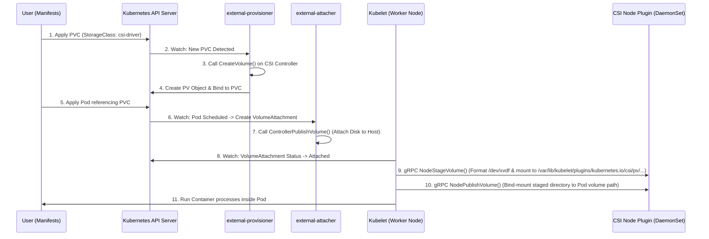
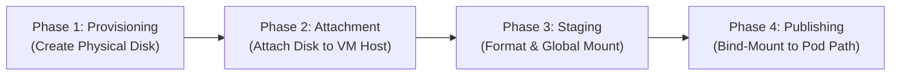

# Module 0-8-1: Storage Primitives (CSI Architecture, emptyDir & hostPath)

**Breadcrumbs:** [[0-Index - Kubernetes|🏠 Kubernetes Reference MOC]] > **Module 0-8-1**

---

## 1. Container Storage Interface (CSI) Architecture

### A. The Evolution of Kubernetes Storage (In-Tree vs. Out-of-Tree)
In early versions of Kubernetes, all volume plugins (e.g., `kubernetes.io/aws-ebs`, `kubernetes.io/gce-pd`, `kubernetes.io/cinder`) were **in-tree**. This meant their driver code was compiled directly into the core Kubernetes binaries (`kube-apiserver`, `kube-controller-manager`, `kubelet`).

This architecture presented significant challenges:
1. **Release Coupling:** Storage vendors had to align bug fixes and features with the Kubernetes core release cycle.
2. **Security & Stability:** Bugs in a third-party storage driver could crash the control plane. In-tree drivers also required high-level privileges in the core components.
3. **Bloat:** Core Kubernetes binaries carried code for dozens of storage systems.

The **Container Storage Interface (CSI)** was introduced to move storage plugins **out-of-tree**. CSI is a standardized, gRPC-based specification that allows container orchestrators (like Kubernetes, Mesos, Nomad, Cloud Foundry) to interact with arbitrary storage backends using standard interfaces.

CSI defines a standardized set of Remote Procedure Calls (RPCs) that storage vendor drivers must implement:
* **`CreateVolume` / `DeleteVolume`**: Invoked by the controller to provision and decommission physical storage volumes on the backend array.
* **`ControllerPublishVolume` / `ControllerUnpublishVolume`**: Invoked to attach and detach volumes to/from host nodes.
* **`NodeStageVolume` / `NodeUnstageVolume`**: Formats raw block storage with filesystems (e.g. `ext4`, `xfs`) and mounts them to global staging directories on the node.
* **`NodePublishVolume` / `NodeUnpublishVolume`**: Bind-mounts the staged filesystem directory into the Pod's private container directory.

---

### B. CSI Control Plane Components (Helper Sidecars)
To bridge the Kubernetes API and the out-of-tree CSI driver, Kubernetes uses a set of standardized helper containers called **sidecars**. These sidecars watch the Kubernetes API and translate API state changes into gRPC calls to the CSI driver.

```
       +-----------------------------------------------------------+
       |                  Kubernetes Control Plane                 |
       |                                                           |
       |  +--------------------+           +--------------------+  |
       |  |  external-         |           |  external-         |  |
       |  |  provisioner       |           |  attacher          |  |
       |  +---------+----------+           +---------+----------+  |
       +------------|--------------------------------|-------------+
                    | (gRPC: CreateVolume)           | (gRPC: ControllerPublish)
                    v                                v
       +-----------------------------------------------------------+
       |                     CSI Driver Pod                        |
       |                                                           |
       |                 CSI Controller Plugin                     |
       +-----------------------------------------------------------+
```

1. **`external-provisioner`:**
   - Watches `PersistentVolumeClaim` (PVC) objects.
   - When a new PVC is created referencing a StorageClass backed by the CSI driver, it invokes the CSI driver's `CreateVolume` gRPC method to provision the physical backend storage.
2. **`external-attacher`:**
   - Watches `VolumeAttachment` objects.
   - Translates them into gRPC calls (`ControllerPublishVolume`) to attach the provisioned physical volume to a specific worker node.
3. **`external-resizer`:**
   - Watches PVC resource modifications.
   - Triggers the `ControllerExpandVolume` gRPC method to expand the size of the volume on the storage backend.
4. **`external-snapshotter`:**
   - Watches `VolumeSnapshot` and `VolumeSnapshotContent` custom resources.
   - Invokes `CreateSnapshot` and `DeleteSnapshot` gRPC calls to manage storage snapshots.
5. **`node-driver-registrar`:**
   - Runs as a sidecar inside the CSI DaemonSet on each worker node.
   - Interacts with Kubelet's local plugin registration service to register the CSI driver's local socket.

---

### C. Controller Plugin vs. Node Plugin
A complete CSI driver deployment is split into two distinct execution topologies:

#### 1. CSI Controller Plugin (Deployment / StatefulSet)
- **Scope:** Cluster-wide control-plane operations.
- **Topology:** Run as a deployment with 1 or more replicas (typically with leader election).
- **Execution Node:** Can run on control plane or infra nodes.
- **Responsibilities:**
  - Creating and deleting physical disks on the storage infrastructure (`CreateVolume`/`DeleteVolume`).
  - Attaching and detaching physical disks to/from virtual instances (`ControllerPublishVolume`/`ControllerUnpublishVolume`).
  - Reporting capacities and creating snapshots.

#### 2. CSI Node Plugin (DaemonSet)
- **Scope:** Local node operations.
- **Topology:** Must run on every worker node in the cluster.
- **Execution Node:** Runs as a privileged DaemonSet.
- **Responsibilities:**
  - **Node Stage Volume (`NodeStageVolume`):** Formats the raw block device (e.g., with `ext4` or `xfs`) and mounts it to a global staging directory on the node.
  - **Node Publish Volume (`NodePublishVolume`):** Performs a bind mount from the global staging directory into the Pod's specific mount directory (enabling the container to access it).
  - **Node Unpublish / Unstage:** Cleans up mounts when Pods are terminated.

---

### D. Driver Discovery and Registration Flow
The Kubelet discovers local CSI drivers by scanning `/var/lib/kubelet/plugins_registry/` for active Unix domain sockets.

```
+--------------------------------------------------------------------------------+
| Worker Node Host                                                               |
|                                                                                |
|  +-------------------------------------+                                       |
|  | Kubelet Daemon                      |                                       |
|  |                                     |                                       |
|  |  [Unix Socket Client]               |                                       |
|  +----------^--------------------------+                                       |
|             | (Registration API Protocol)                                      |
|             v                                                                  |
|  +----------+--------------------------+  (gRPC Call)  +--------------------+  |
|  | node-driver-registrar (Sidecar)     | ------------> | CSI Node Plugin    |  |
|  |                                     |               |                    |  |
|  | - Opens socket in /plugins_registry/|               | - Opens gRPC socket|  |
|  | - Sends plugin registration to Kubelet|             |   in /plugins/     |  |
|  +-------------------------------------+               +--------------------+  |
+--------------------------------------------------------------------------------+
```

1. The `CSI Node Plugin` opens a gRPC socket at `/var/lib/kubelet/plugins/<driver-name>/csi.sock`.
2. The `node-driver-registrar` container opens a registration socket at `/var/lib/kubelet/plugins_registry/<driver-name>-reg.sock`.
3. Kubelet detects the registration socket, connects to it, and requests details about the driver via the Plugin Registration Protocol.
4. Kubelet then establishes direct communication with the CSI driver's main socket `/var/lib/kubelet/plugins/<driver-name>/csi.sock` to execute volume mounting commands.

---

### E. End-to-End Volume Mount Workflow
The following sequence details how Kubernetes provisions, attaches, and mounts a CSI volume:



#### 1. CSI Controller and Node Components
To support third-party storage plugins without compiling code in-tree, Kubernetes delegates volume management to Container Storage Interface (CSI) sidecars and driver binaries:

*   **Control Plane Sidecars (Deployments):**
    *   **`external-provisioner` (The Factory Order Desk):** Watches for new `PersistentVolumeClaims` (PVCs). It calls the cloud provider or storage system API to dynamically create a physical disk (e.g. AWS EBS, GCP PD). It then creates a corresponding `PersistentVolume` (PV) object in Kubernetes and binds it to the PVC.
    *   **`external-attacher` (The Flatbed Delivery Truck):** Watches for a Pod referencing a PVC to be scheduled. It calls the storage API to attach (plug in) the physical disk to the assigned worker node host VM, creating a `VolumeAttachment` resource once complete.
*   **Worker Node Components:**
    *   **`node-driver-registrar` (The Receptionist):** Runs as a node-level sidecar to register the vendor's local Unix domain socket with the host's `Kubelet`.
    *   **`Kubelet` (The Site Construction Manager):** Watches the API server. Once the volume is physically attached to the host node, it initiates direct gRPC communication with the local CSI Node Plugin to stage and publish the volume.
    *   **`CSI Node Plugin` (The Carpenter, Privileged DaemonSet):** Runs on every worker node. It performs local host OS tasks such as formatting block devices, mounting file systems, and bind-mounting.

#### 2. Phase-by-Phase Mount Lifecycle
The lifecycle of mounting a volume moves sequentially through four primary phases:



1.  **Phase 1: Provisioning (Disk Creation)**
    *   **Trigger:** A PVC requesting a CSI-based StorageClass is applied.
    *   **Action:** The `external-provisioner` sidecar intercepts the request and issues a `CreateVolume()` gRPC call to the CSI Driver Controller. The controller API communicates with the cloud infrastructure (e.g., AWS EC2 EBS API) to provision a physical disk.
    *   **Outcome:** A physical volume exists, and a bound PV object is registered in Kubernetes.
2.  **Phase 2: Attachment (Hardware Connection)**
    *   **Trigger:** A Pod referencing the PVC is scheduled to a worker node.
    *   **Action:** The `external-attacher` sidecar issues a `ControllerPublishVolume()` gRPC call. This instructs the cloud/storage provider to attach the disk to the target VM host.
    *   **Outcome:** The raw block device appears on the worker node's host OS (e.g., as `/dev/xvdf`).
3.  **Phase 3: Staging (Formatting & Initial Global Mount)**
    *   **Trigger:** Kubelet detects the volume is attached to its host.
    *   **Action:** Kubelet sends a `NodeStageVolume()` gRPC call to the local `CSI Node Plugin`. The plugin formats the raw device (e.g., formats `/dev/xvdf` with `ext4` or `xfs`) and mounts it to a global staging directory on the node:
        `/var/lib/kubelet/plugins/kubernetes.io/csi/pv/<pv-name>/globalmount`
    *   **Outcome:** The block device is now structured with a filesystem and mounted globally on the host node.
4.  **Phase 4: Publishing (Bind-Mounting to Container Space)**
    *   **Trigger:** Kubelet prepares to start the Pod's containers.
    *   **Action:** Kubelet sends a `NodePublishVolume()` gRPC call to the `CSI Node Plugin`. The plugin performs a bind-mount from the global staging directory to the Pod's specific mount path:
        `/var/lib/kubelet/pods/<pod-uid>/volumes/kubernetes.io~csi/<pv-name>/mount`
    *   **Outcome:** The container runtime starts the container processes, referencing this local bind-mounted directory as its volume target (e.g. `/data`), completing the end-to-end path.

---

## 2. Kubernetes Volume Primitives: `emptyDir` & `hostPath`

In Kubernetes, Pods are transient. **If a container crashes, its local filesystem changes are preserved by the runtime container restart logic;** however, if a Pod is rescheduled or deleted, all data inside it is lost. To persist or share data, you must configure a `volume`.

---

### A. Ephemeral Node Storage: `emptyDir`
An `emptyDir` volume is created when a Pod is assigned to a Node, and exists as long as that Pod is running on that node. It starts empty.

#### 1. Core Mechanics & Pathing
- All **containers in the Pod** can read and write the same files in the `emptyDir` volume, though that volume can be mounted at different paths in each container.
- When a Pod is removed from a node, the data in the `emptyDir` is erased permanently.
- **Physical Path on Host:** `/var/lib/kubelet/pods/<pod-uid>/volumes/kubernetes.io~empty-dir/<volume-name>/`

#### 2. Storage Mediums (Disk vs. RAM)
You can configure the backing medium for `emptyDir`:
- **Default (Disk):** Backed by the node's storage media (SSD/HDD).
- **Memory (RAM-backed tmpfs):** Sets `medium: Memory`. Files are written directly to RAM. 
  - *Warning:* tmpfs volumes count against your container's memory limit. If your app writes data exceeding the container's memory limits, the Pod will be evicted with an **OOMKilled** or **Evicted** status.

#### 3. Common Use Cases
* **Caching:** Storing temporary cache databases (e.g., redis or application caches) to reduce external database queries.
* **Process Checkpoints:** Saving application checkpoints or session logs for long-running processes so they can resume from where they stopped if a container crashes and restarts.
* **Scratch Space:** Providing temporary filesystem space for data sorting, processing, or merging operations.

#### 4. Pod Manifest Example
```yaml
apiVersion: v1
kind: Pod
metadata:
  name: cache-pod
  namespace: default
spec:
  containers:
  - name: web-app
    image: nginx:alpine
    volumeMounts:
    - name: cache-volume
      mountPath: /usr/share/nginx/html
  volumes:
  - name: cache-volume
    emptyDir:
      medium: Memory
      sizeLimit: 100Mi
```

---

### B. Persistent Local Storage: `hostPath`
A `hostPath` volume mounts a file or directory from the host node's filesystem directly into your Pod.

#### 1. Type Options
| Type                | Behavior / Requirements                                                                       |
| :------------------ | :-------------------------------------------------------------------------------------------- |
| `""` (Empty String) | Default. Backward-compatible fallback. No host checks are performed.                          |
| `DirectoryOrCreate` | If nothing exists at the path, an empty directory is created (mode `0755`, owned by Kubelet). |
| `Directory`         | The directory at the specified path must exist on the host node.                              |
| `FileOrCreate`      | If nothing exists at the path, an empty file is created (mode `0644`, owned by Kubelet).      |
| `File`              | The file at the specified path must exist on the host node.                                   |
| `Socket`            | A Unix domain socket at the specified path must exist on the host node.                       |
| `CharDevice`        | A character device at the specified path must exist on the host node.                         |
| `BlockDevice`       | A block device at the specified path must exist on the host node.                             |

#### 2. Host Directory Traversal & Security Risks
> [!CAUTION]
> **Host Escape Vulnerability:**
> Running a Pod with root privileges and a `hostPath` volume pointing to `/` allows the container processes to access, read, and write to the entire host OS filesystem. This bypasses container isolation boundaries. Use `ReadOnly: true` where possible, and restrict `hostPath` using Pod Security Standards (PSS) or Admission Controllers (e.g. Kyverno, OPA Gatekeeper).

#### 3. Host System Configuration (Permissions, SELinux, and Systemd)
- **Linux Execution Permissions (`x`):** 
  * *The Directory Traversal Mechanic:* In Linux filesystem permissions, the execute (`x`) permission on a **directory** governs the ability to **traverse or search** the directory (i.e. `cd` into it or resolve sub-paths), not to execute binaries. Without the `x` bit set for a given UID, the user cannot access any files or subfolders inside, even if those files have full read (`r`) permissions.
  * *The Non-Root Conflict:* If a container runs as a non-root user (e.g. configured with `securityContext.runAsUser: 10001` or utilizing a default non-root image configuration) and mounts a `hostPath` directory with restrictive permissions (e.g., `0700` / `rwx------` owned by `root:root`), the container runtime process running as UID `10001` falls under the "others" class. The kernel will block the directory mount/traversal with a `Permission Denied (EACCES)` error.
  * *Failure Symptoms:* The Pod will transition to `CreateContainerConfigError` or `CrashLoopBackOff`, logging mounting runtime errors such as:
    `mounting "/var/host-dir" to rootfs at "/app/data" caused: permission denied`
  * *Remediation Strategies:*
    1. **Adjust Host Permissions:** Change host directory ownership or grant group/others traversal access (e.g. `chmod o+rx /var/host-dir` or `chown 10001 /var/host-dir`).
    2. **Use Init Containers:** Define a root-privileged init container to adjust permissions before the application container starts:
       ```yaml
       initContainers:
       - name: volume-permissions
         image: busybox
         command: ['sh', '-c', 'chown -R 10001:10001 /data']
         volumeMounts:
         - name: host-volume
           mountPath: /data
       ```
    3. **The `fsGroup` Limitation:** While setting `securityContext.fsGroup` instructs Kubelet to recursively modify group ownership on standard CSI PersistentVolumes, it is **ignored or non-functional for raw `hostPath` mounts** to protect host OS stability from unauthorized permission mutations.
- **SELinux Policies:** On hosts with SELinux (like RHEL, Rocky, Fedora), container access to host directories is blocked by default. You must append `:z` (shared content) or `:Z` (private unshared content) to the volume mount labels, or configure the host's directory with the `container_file_t` context using `chcon` or `semanage`.
- **Systemd Mount Flags:** Host paths that are mounted with restrictive systemd flags (e.g. `ProtectSystem=strict` or `MountFlags=private`) can prevent Kubelet from mounting them cleanly.

#### 4. The Multi-Node Scheduling Disconnect
> [!WARNING]
> Because `hostPath` binds directly to the local node filesystem, if a Pod is rescheduled to a different worker node (due to node failure, drains, or deployments), it will mount the path on the *new* node. This new path will not contain any of the files written on the previous node. Thus, `hostPath` is **not** suitable for clustered persistent stateful workloads unless paired with node affinity or running as a DaemonSet.

#### 5. Pod Manifest Example
```yaml
apiVersion: v1
kind: Pod
metadata:
  name: hostpath-pod
spec:
  containers:
  - name: system-monitor
    image: alpine
    command: ["sh", "-c", "tail -f /host/syslogs"]
    volumeMounts:
    - name: host-log-dir
      mountPath: /host/syslogs
      readOnly: true
  volumes:
  - name: host-log-dir
    hostPath:
      path: /var/log
      type: Directory
```

---

### C. Network File System (`nfs`)
An `nfs` volume mounts an external Network File System export into the Pod over the network.
* **Persistence:** Because the storage is decoupled from the cluster nodes, data is persistent even if Pods are rescheduled to other nodes.
* **Shared Write (RWX):** Multiple Pods running on different nodes can read from and write to the same NFS volume simultaneously, making it suitable for shared file systems.
* **Example Config:**
  ```yaml
  volumes:
    - name: nfs-storage
      nfs:
        server: 192.168.1.8
        path: /mnt/shared
  ```

---
