# Lecture: Local Storage Models, Provisioners, and Scheduling Traps

This reference note documents the architectural differences between Kubernetes local storage implementations, clarifying the boundaries between the Container Storage Interface (CSI), StorageClasses, local PersistentVolumes, and the scheduling implications of volume binding modes.

---

## 🗺️ Cognitive Map: Local Storage Binding and Scheduling Flow

```mermaid
graph TD
    subgraph "Immediate Binding Trap"
        A1["Developer creates PVC"] --> A2["PVC immediately binds to local PV on Node A"]
        A2 --> A3["Scheduler schedules Pod"]
        A3 -->|Pod wants Node B due to resource constraints| A4["Pod stuck in Pending state: volume node affinity conflict"]
    end

    subgraph "Deferred Binding (WaitForFirstConsumer)"
        B1["Developer creates PVC"] --> B2["PVC remains Pending"]
        B2 --> B3["Scheduler evaluates Pod placement"]
        B3 -->|Checks Node resource availability| B4["Scheduler assigns Pod to Node A"]
        B4 --> B5["PVC binds to local PV on Node A"]
        B5 --> B6["Pod successfully starts on Node A"]
    end
```



---

## 1. Architectural Boundaries: CSI vs. StorageClass

Understanding how Kubernetes interfaces with backing storage requires separating the control plane abstractions from the physical/software drivers.

*   **Container Storage Interface (CSI) (Out-of-Tree Plugin):** The CSI is the actual software driver running inside the cluster (usually as a combination of DaemonSets and Deployments). It interfaces with storage hardware or cloud APIs (e.g., AWS EBS API, Ceph, NetApp) to provision, attach, and mount block devices.
*   **StorageClass (Control Plane Bridge):** A `StorageClass` is a non-namespaced Kubernetes API object that represents a storage profile. It defines which CSI driver to invoke (`provisioner`), what parameters to pass (e.g., IOPS, file system type), and how volume binding is managed.
*   **Decoupled Operation:** You can have a CSI driver installed in your cluster without having any `StorageClass` defined. In this state, dynamic provisioning is disabled (no automated creation of storage volumes), but static provisioning remains functional if an administrator manually defines a `PersistentVolume` pointing to a pre-created volume.

---

## 2. Core Local Storage Models: Comparison

When utilizing storage local to the worker nodes (rather than network-attached storage), Kubernetes offers three primary approaches:

| Model | Provisioner Type | StorageClass Requirement | Node Affinity Enforcement | Production Use Case |
| :--- | :--- | :--- | :--- | :--- |
| **`hostPath` (Static)** | None (Bypasses CSI) | None (or explicitly set to `""`) | None (Manual Pod placement needed) | Development, single-node testing, system daemon mounts (e.g., Fluentd logs) |
| **`local` Volume (Static)** | `kubernetes.io/no-provisioner` | Mandatory (Requires `WaitForFirstConsumer`) | Mandatory (Strictly locked to a node) | High-performance bare-metal databases |
| **`local-path` (Dynamic)** | `rancher.io/local-path` | Mandatory (Enforces `WaitForFirstConsumer`) | Automated (Discovered via scheduled Pod) | Local dev environments (e.g., K3s, Minikube) |

---

## 3. Deep-Intuition (AARF) Breakdowns

### A. Static Local Storage (`no-provisioner`)

#### The Answer
To configure static local storage securely, define a `StorageClass` with deferred binding, a `PersistentVolume` with strict node affinity, and a matching `PersistentVolumeClaim`.

```yaml
# storageclass.yaml
apiVersion: storage.k8s.io/v1
kind: StorageClass
metadata:
  name: local-storage
provisioner: kubernetes.io/no-provisioner
volumeBindingMode: WaitForFirstConsumer

---
# pv.yaml
apiVersion: v1
kind: PersistentVolume
metadata:
  name: local-pv-data
spec:
  capacity:
    storage: 10Gi
  accessModes:
    - ReadWriteOnce
  persistentVolumeReclaimPolicy: Retain
  storageClassName: local-storage
  local:
    path: /mnt/fast-ssd # Must exist on node01 before mounting
  nodeAffinity:
    required:
      nodeSelectorTerms:
        - matchExpressions:
            - key: kubernetes.io/hostname
              operator: In
              values:
                - node01

---
# pvc.yaml
apiVersion: v1
kind: PersistentVolumeClaim
metadata:
  name: local-pvc
spec:
  accessModes:
    - ReadWriteOnce
  storageClassName: local-storage
  resources:
    requests:
      storage: 10Gi
```

#### The Assumptions
*   The human cluster administrator must physically format the disk and mount it to `/mnt/fast-ssd` on the specific host (`node01`).
*   The node hostname matches `node01` exactly in the cluster configuration.
*   The developer’s Pod must request `local-pvc` in its volumes block.

#### The Rationale
Since local volumes are physically welded to a specific node's chassis, the Scheduler must evaluate the Pod's scheduling constraints (such as CPU requests, memory requests, taints, and node selectors) *before* binding the PVC. Setting `volumeBindingMode: WaitForFirstConsumer` delays binding until a Pod requesting the PVC is processed. The scheduler then selects an eligible node for the Pod and binds the PVC to the PV on that node.

#### The Failure Loop
If the `StorageClass` is configured with `volumeBindingMode: Immediate` (or omitted, defaulting to Immediate in legacy clusters), the PVC is bound immediately to `local-pv-data` on `node01`. If the Pod is later created and has a `nodeSelector` forcing it to `node02`, or if `node01` runs out of CPU resources, the Pod will enter a `Pending` state. Inspecting `kubectl describe pod <pod-name>` will show:
`Warning  FailedScheduling  <time>  default-scheduler  0/2 nodes are available: 1 node(s) had volume node affinity conflict, 1 node(s) had insufficient cpu.`

#### Alternative Case
For network storage (like AWS EBS or SAN volumes), `Immediate` binding can sometimes be tolerated because the volume can be dynamically attached to whichever node the Scheduler picks. However, even with network storage, `WaitForFirstConsumer` is recommended in multi-AZ environments to ensure the volume is provisioned in the same availability zone as the scheduled Pod.

#### Evolutionary Bridge
Classic UNIX operating systems mount block devices to local paths. Early container orchestration bypasses this cluster-awareness using `hostPath` mounts, which lack scheduling safety. Kubernetes resolved this by building the `local` PV volume source directly into the `kubelet` (In-Tree) and combining it with the `WaitForFirstConsumer` scheduler phase. This bridges local OS file system mechanics with cluster-level scheduling.

---

### B. Manual `hostPath` Volume (Static)

#### The Answer
To run a quick single-node test, bypass dynamic provisioners by setting `storageClassName: ""`.

```yaml
# hostpath-pv.yaml
apiVersion: v1
kind: PersistentVolume
metadata:
  name: manual-hostpath-pv
spec:
  capacity:
    storage: 5Gi
  accessModes:
    - ReadWriteOnce
  storageClassName: ""
  hostPath:
    path: /mnt/data

---
# hostpath-pvc.yaml
apiVersion: v1
kind: PersistentVolumeClaim
metadata:
  name: manual-hostpath-pvc
spec:
  accessModes:
    - ReadWriteOnce
  storageClassName: ""
  resources:
    requests:
      storage: 5Gi
```

#### The Assumptions
*   The system is running on a single-node cluster (like Minikube) or the admin is manually pinning the Pod to a specific node using `nodeName` or `nodeSelector`.
*   The host path directory `/mnt/data` exists on the target node or the `hostPath.type` is set to create it automatically (e.g., `DirectoryOrCreate`).

#### The Rationale
Setting `storageClassName: ""` tells the volume controller to bypass the default StorageClass resolver. It binds the PVC directly to the matching manual PV immediately without invoking any CSI or dynamic provisioners.

#### The Failure Loop
In a multi-node cluster, if the Pod mounts `manual-hostpath-pvc` and lands on `node02`, it will read/write from `/mnt/data` on `node02`. If the Pod is deleted and rescheduled onto `node01`, it will mount `/mnt/data` on `node01`, which contains none of the written data. No scheduling warning or error is printed; data is silently split across hosts.

#### Alternative Case
Use `hostPath` only for system-level daemons (DaemonSets) that run on every node and need to read host system state, such as log shippers mounting `/var/log` or monitoring agents mounting `/proc`.

#### Evolutionary Bridge
`hostPath` is the direct evolution of the original Docker `-v` bind-mount flag. It represents legacy, non-clustered filesystem sharing. While fast, it violates container portability.

---

### C. Rancher Local Path Provisioner (Dynamic `hostPath`)

#### The Answer
For automated hostPath provisioning on local development clusters (e.g., K3s), request storage using the `local-path` StorageClass.

```yaml
# local-path-pvc.yaml
apiVersion: v1
kind: PersistentVolumeClaim
metadata:
  name: dynamic-local-path-pvc
spec:
  accessModes:
    - ReadWriteOnce
  storageClassName: local-path
  resources:
    requests:
      storage: 5Gi
```

#### The Assumptions
*   The Rancher `local-path-provisioner` controller is running in the cluster (standard in K3s).
*   The `local-path` StorageClass is registered.

#### The Rationale
The dynamic provisioner watches for PVCs requesting `local-path`. When a Pod is created using the PVC, the controller detects where the Scheduler placed the Pod, automatically logs onto that node (via host helper pods), creates a unique subdirectory (e.g., `/opt/local-path-provisioner/pvc-uuid`), dynamically generates a matching PV with node affinity, and binds them.

#### The Failure Loop
If the helper pod fails to create the directory (due to read-only root filesystems or permission issues on the host), the PVC will remain `Pending`. Checking the provisioner controller logs via `kubectl logs -n local-path-storage -l app=local-path-provisioner` will show:
`Failed to create directory /opt/local-path-provisioner/pvc-uuid on host: permission denied`

#### Alternative Case
If you require strict hardware isolation or physical disk partitioning (e.g., SSD vs HDD mapping), use static `local` volumes (`no-provisioner`) with dedicated mount points rather than shared root filesystem directories created by `local-path`.

---

## 4. Hands-on Verification Lab

See complete verification steps, failure validation scripts, and dynamic scheduling tests in [[Project - Local Storage Models and Scheduling Traps]].
