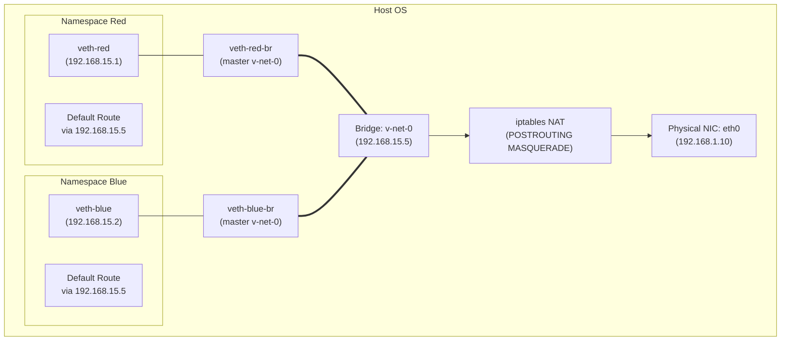
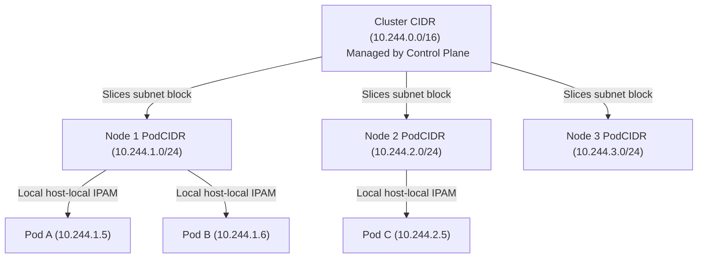
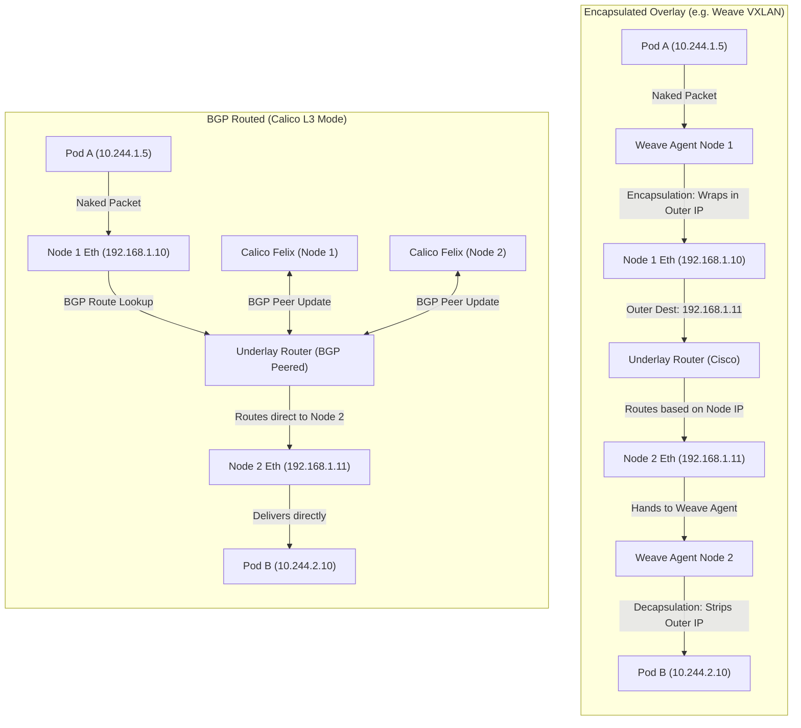
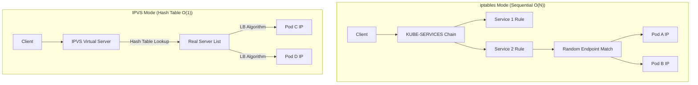

# Module 0-9-1: Linux Networking, CNI & Service Proxying (iptables/IPVS)

**Breadcrumbs:** [[0-Index - Kubernetes|🏠 Kubernetes Reference MOC]] > **Module 0-9-1**

---

## 1. Linux Networking Prerequisites (OS & Kernel Level)

Before analyzing Kubernetes-specific network mechanics, the underlying Linux kernel networking subsystem must be understood. Kubernetes constructs its network overlays, routing, and services directly on top of standard Linux kernel tools.

### 1.1 Switching, Routing, and Gateways

Linux uses network interfaces, routing tables, and ARP tables to move packets across L2 (data link) and L3 (network) boundaries.



#### Diagnostic and Configuration Commands
*   **List Network Interfaces:**
    ```bash
    # Show status and MAC addresses (link/ether)
    ip link
    
    # Show IP addresses assigned to interfaces
    ip addr
    # or
    ip a
    ```
*   **Inspect Host Routing Tables:**
    ```bash
    # Show active routing tables with numerical IPs
    ip route show
    # or
    route -n
    ```
*   **Add L3 Routing Entries:**
    ```bash
    # Route all traffic for 192.168.1.0/24 through gateway 192.168.2.1
    ip route add 192.168.1.0/24 via 192.168.2.1
    ```
*   **Configure the Default Gateway:**
    ```bash
    # Forward all external traffic to the default gateway
    ip route add default via 192.168.2.1
    ```

#### Kernel Packet Forwarding
For a Linux host to act as a router (forwarding packets between different namespaces or interfaces), IPv4 packet forwarding must be explicitly enabled.

*   **Temporary Enablement:**
    ```bash
    # Read status (0 = disabled, 1 = enabled)
    cat /proc/sys/net/ipv4/ip_forward
    
    # Enable temporarily
    echo 1 > /proc/sys/net/ipv4/ip_forward
    # or
    sysctl -w net.ipv4.ip_forward=1
    ```
*   **Permanent Configuration:**
    Edit `/etc/sysctl.conf` or create a drop-in file at `/etc/sysctl.d/99-kubernetes-cri.conf`:
    ```ini
    net.ipv4.ip_forward = 1
    ```
*   **Reload Sysctl Settings:**
    ```bash
    sysctl --system
    ```

---

### 1.2 DNS Resolution on Linux Host
The host resolves human-readable names to IP addresses using configurations in three critical files:

1.  **`/etc/hosts`:** Static local mappings (takes priority by default).
    ```text
    127.0.0.1       localhost
    192.168.1.10    controlplane
    192.168.1.11    node01
    ```
2.  **`/etc/resolv.conf`:** Specifies upstream nameservers.
    ```text
    nameserver 8.8.8.8
    nameserver 1.1.1.1
    options edns0
    ```
3.  **`/etc/nsswitch.conf`:** Dictates the name service lookup order.
    ```text
    hosts:          files dns
    ```
    *(Note: `files` refers to `/etc/hosts`, `dns` refers to resolvers in `/etc/resolv.conf`)*

#### Diagnostic DNS Tools
```bash
# Query A-records for a target host
nslookup google.com

# Verbose lookup printing DNS server replies and query times
dig google.com

# Simple resolution check
host google.com
```

---

### 1.3 Network Namespaces (`netns`)

A network namespace is a logical copy of the network stack, containing its own routing table, firewall (iptables) rules, and network interfaces. This isolation provides the foundation for container/pod networking.

*   **Create Network Namespaces:**
    ```bash
    ip netns add red
    ip netns add blue
    ```
*   **List Network Namespaces:**
    ```bash
    ip netns
    ```
    *(Namespaces are tracked filesystem-wise under `/var/run/netns/`)*
*   **Execute Commands inside a Network Namespace:**
    ```bash
    # View interfaces inside namespace 'red'
    ip netns exec red ip link
    # or using short-hand notation
    ip -n red link
    
    # View routing tables inside namespace 'blue'
    ip netns exec blue ip route
    ```

---

### 1.4 Virtual Ethernet Pairs (`veth`)

A virtual ethernet (`veth`) device is a local tunnel that acts as a bidirectional wire connecting two interfaces. Packets entering one end automatically exit the other. This is used to connect network namespaces to the host.

*   **Create a Virtual Cable (veth pair):**
    ```bash
    ip link add veth-red type veth peer name veth-red-br
    ip link add veth-blue type veth peer name veth-blue-br
    ```
*   **Move One End of the Cable to a Namespace:**
    ```bash
    ip link set veth-red netns red
    ip link set veth-blue netns blue
    ```
*   **Assign IP Addresses to Namespace Interfaces:**
    ```bash
    ip -n red addr add 192.168.15.1/24 dev veth-red
    ip -n blue addr add 192.168.15.2/24 dev veth-blue
    ```

> [!IMPORTANT]
> **Specifying Subnet Netmask:** Always include the CIDR subnet netmask (e.g. `/24`) when assigning namespace IP addresses. Omitting the netmask (e.g. `ip -n red addr add 192.168.15.1 dev veth-red`) will make the interface default to a single host route (`/32`), causing adjacent namespace routing lookups and ping commands to fail.
*   **Bring Interfaces UP:**
    ```bash
    # Bring loopback up inside the namespace
    ip -n red link set lo up
    
    # Bring veth up inside namespaces
    ip -n red link set veth-red up
    ip -n blue link set veth-blue up
    ```
*   **Delete a Virtual Cable:**
    ```bash
    # Deleting one end of a veth pair automatically destroys the peer interface
    ip link del veth-red-br
    ```

---

### 1.5 Linux Bridge Networks

To connect multiple namespaces together, a virtual switch (Linux Bridge) is created on the host OS. The peer ends of the veth pairs are attached to this bridge.

*   **Create a Linux Bridge Interface:**
    ```bash
    ip link add v-net-0 type bridge
    ```
*   **Bring the Bridge Interface UP:**
    ```bash
    ip link set dev v-net-0 up
    ```
*   **Assign an IP to the Bridge (acting as the default gateway for namespaces):**
    ```bash
    ip addr add 192.168.15.5/24 dev v-net-0
    ```
*   **Bind Host-Side Veth Peers to the Bridge:**
    ```bash
    ip link set veth-red-br master v-net-0
    ip link set veth-blue-br master v-net-0
    ```
*   **Bring Host-Side Interfaces UP:**
    ```bash
    ip link set dev veth-red-br up
    ip link set dev veth-blue-br up
    ```
*   **Configure Default Gateways Inside Namespaces:**
    ```bash
    # Direct namespace traffic through the host bridge gateway
    ip netns exec red ip route add default via 192.168.15.5
    ip netns exec blue ip route add default via 192.168.15.5
    ```

#### External Connectivity: NAT (MASQUERADE) and Port Forwarding (DNAT)
By default, traffic from namespaces can reach the bridge, but cannot egress to the host's physical network or external networks.

*   **Enable Egress NAT (IP Masquerade):**
    Allow namespaces to reach external networks by rewriting the source IP to the host's IP upon exit:
    ```bash
    iptables -t nat -A POSTROUTING -s 192.168.15.0/24 -j MASQUERADE
    ```
*   **Enable Ingress Port Forwarding (Destination NAT):**
    Forward incoming traffic on host port `8080` to namespace `blue` IP `192.168.15.2` on port `80`:
    ```bash
    iptables -t nat -A PREROUTING -p tcp --dport 8080 -j DNAT --to-destination 192.168.15.2:80
    ```
*   **List Active NAT Rules:**
    ```bash
    iptables -t nat -nvL
    ```

> [!TIP]
> **Firewall Troubleshooting:** If pings between namespaces fail despite correct routing and IP assignments, local host firewall configurations (like `firewalld` or default `iptables` chains) might be blocking the forward traffic. Ensure IP forwarding is enabled (`/proc/sys/net/ipv4/ip_forward` set to `1`) and that forward chain rules allow traffic between namespaces (e.g. `iptables -P FORWARD ACCEPT` or disabling `firewalld` in educational environments).

---

### 1.6 Docker Bridge Networking Mapping

Docker implements the same underlying Linux network namespaces and bridges described above:
*   Docker creates a default bridge named `docker0` (typically on subnet `172.17.0.0/16` or `172.18.0.0/24`).
*   Running a container starts an isolated network namespace.
*   Docker allocates a veth pair, moving one end (`eth0`) into the container namespace and binding the other end (`vethXXXX`) to `docker0`.

#### Command Mapping & Inspection
```bash
# Start a container on the default bridge network
docker run -d --name web-nginx -p 8080:80 nginx

# Identify container IP address
docker inspect -f '{{range .NetworkSettings.Networks}}{{.IPAddress}}{{end}}' web-nginx

# Inspect iptables NAT rules created by Docker for port forwarding
iptables -t nat -S DOCKER
```
> [!NOTE]
> Docker adds rules directly to a custom `DOCKER` iptables chain. In contrast, Kubernetes bypasses Docker's host port mappings, instead delegating port/routing control to the CNI plugin and Kube-Proxy.

---

## 2. CNI (Container Network Interface) Specifications

The Container Network Interface (CNI) is a CNCF specification that standardizes how container runtimes (such as `containerd` or `CRI-O`) call external plugins to configure networking for container sandboxes.

### 2.0 CNI Specification vs. CNI Plugins

At a system level, there is a strict technical distinction between CNI and CNI plugins:

*   **CNI (Container Network Interface):** A CNCF **specification** (API contract). It dictates the rules of *how* container runtimes (like `containerd` or `CRI-O`) should communicate with network components. Think of it like a wall electrical socket standard; it defines plug dimensions and voltage rules but does not generate electricity.
*   **CNI Plugin:** The actual **executable binary software** that implements the specification. When a Pod is created, the container runtime calls the plugin (e.g. Calico, Cilium, Flannel) to build network namespaces, hook veth pairs, assign IPs, and create host routing rules.

#### A. Vanilla Kubernetes vs. Managed Services
Vanilla Kubernetes has a "batteries not included" philosophy for networking. When bootstraping with `kubeadm`, the cluster will remain in a `NotReady` state indefinitely until you manually download and install a third-party CNI plugin.
However, **Managed Kubernetes Services** configure default CNI plugins automatically:
- **AWS (EKS):** Pre-installs the **Amazon VPC CNI**, giving Pods native AWS VPC private IPs directly.
- **Google Cloud (GKE):** Pre-installs **GKE Native VPC CNI** (often utilizing Dataplane V2 based on Cilium).
- **Azure (AKS):** Pre-installs **Azure CNI** or Kubenet.
- **Kind / Minikube:** Pre-installs simple local testing plugins like **Kindnet** or **Kubenet**.

#### B. Classification of CNI Components
1. **Low-Level "Building Block" Plugins:** Reference plugins maintained directly by the CNI team (e.g., `bridge`, `macvlan`, `ptp`). These are single-purpose, low-level binaries that configure networking on a **single host** only.
2. **"Full Package" CNI Solutions:** Comprehensive third-party network providers (e.g. Calico, Flannel, Cilium) that configure cluster-wide topologies. They assign subnets, manage cross-node routing, and enforce NetworkPolicies. Under the hood, these full solutions often invoke the low-level building blocks (like `bridge`) to wire the local node interface, adding their own routing software layers (like BGP or VXLAN tunnels) on top.
3. **Encapsulation Protocols (e.g. VXLAN):** VXLAN is not a CNI plugin itself, but a tunneling protocol. Full CNI solutions (like Flannel) use VXLAN to encapsulate virtual Pod packets inside standard Node-to-Node underlay IP envelopes to bypass physical network limits.

### 2.1 CNI Concept & Lifecycle Workflow

```
+------------------+                   +-------------------+                   +------------------+
|                  | 1. Create Sandbox |                   | 2. Create NetNS   |                  |
|     Kubelet      |------------------>|    CRI Runtime    |------------------>| Network Namespace|
|                  |                   |  (containerd/CRI) |                   |    (per Pod)     |
+------------------+                   +-------------------+                   +------------------+
         |                                       |
         | 4. Pod Scheduled                      | 3. Invoke CNI (ADD)
         |                                       v
         |                             +-------------------+
         +---------------------------->|    CNI Plugins    |---> Sets up Veth pair
                                       |   (/opt/cni/bin)  |---> Allocates IP (IPAM)
                                       +-------------------+
```

1.  **Pod Creation:** Kubelet instructs the container runtime to create a Pod sandbox.
2.  **Namespace Setup:** The runtime initializes a new network namespace for the Pod.
3.  **CNI Execution:** The runtime invokes CNI plugin binaries (found in `/opt/cni/bin`) with commands:
    *   `ADD`: Configure the network (create veth pair, move to namespace, allocate IP).
    *   `DEL`: Tear down the network resources when the Pod is deleted.
    *   `CHECK`: Verify that the network setup conforms to expectations.
4.  **Information Transfer:** Configuration parameters (including namespace paths, container IDs, and CNI actions) are passed to the plugins via environment variables (`CNI_COMMAND`, `CNI_CONTAINERID`, `CNI_NETNS`, `CNI_IFNAME`) and stdin (JSON configuration).

---

### 2.2 Host and Kubelet CNI Configurations

Kubelet reads configuration files at startup to integrate with CNI plugins.

*   **CNI Binaries Directory:** `--cni-bin-dir` (defaults to `/opt/cni/bin/`).
*   **CNI Configuration Directory:** `--cni-conf-dir` (defaults to `/etc/cni/net.d/`).
*   **Inspect Active Kubelet Environment Flags:**
    ```bash
    # Locate CNI configuration parameters passed to Kubelet
    cat /var/lib/kubelet/kubeadm-flags.env
    
    # Check current systemd service configuration for Kubelet
    systemctl cat kubelet
    ```

---

### 2.3 CNI Directory and Configuration Structures

The `/etc/cni/net.d/` directory contains JSON configuration files. If multiple files are present, Kubelet evaluates them in alphabetical order and uses the first valid file it finds.

*   **List Installed CNI Binaries:**
    ```bash
    ls -l /opt/cni/bin/
    ```
    *Common loopback, bridge, and routing utilities:* `bridge`, `loopback`, `ptp`, `portmap`, `macvlan`, `host-local`, `dhcp`.

*   **Example CNI Configuration List (`/etc/cni/net.d/10-flannel.conflist`):**
    ```json
    {
      "cniVersion": "0.3.1",
      "name": "cbr0",
      "plugins": [
        {
          "type": "flannel",
          "delegate": {
            "hairpinMode": true,
            "isDefaultGateway": true
          }
        },
        {
          "type": "portmap",
          "capabilities": {
            "portMappings": true
          }
        }
      ]
    }
    ```

---

## 3. Cluster and Pod Networking

Kubernetes defines a strict "IP-per-Pod" networking model. This mandates that every Pod gets its own IP address, and Pods must be able to communicate with all other Pods across nodes without NAT.

### 3.1 Node Port Assignments

Kubernetes nodes must maintain specific open ports to facilitate control-plane and worker communications.

| Component | Default Port | Protocol | Purpose |
| :--- | :--- | :--- | :--- |
| **Kube-APIServer** | `6443` | TCP | Control-plane API access |
| **ETCD Client** | `2379` | TCP | Datastore API client access |
| **ETCD Peer** | `2380` | TCP | Datastore clustering peer communication |
| **Kubelet** | `10250` | TCP | Control-plane to node communication |
| **Kube-Scheduler** | `10259` | TCP | Scheduler secure port |
| **Kube-Controller-Manager** | `10257` | TCP | Controller manager secure port |
| **Kube-Proxy** | `10256` | TCP | Health check / metrics port |
| **NodePort Services** | `30000-32767` | TCP/UDP | External service access range |

#### Verification Command
```bash
# List all active listening TCP ports with corresponding process PIDs
netstat -nltp
# or
ss -tulpn
```

---

### 3.2 IP Address Management (IPAM)

IPAM plugins manage the assignment of subnets and IPs to nodes and pods. Without a central runtime coordinator, Kubernetes prevents IP overlapping via a two-tier real estate delegation model.

#### 1. Preventing IP Overlapping (The Two-Tier Model)
1. **Central Delegation:** When initializing the cluster (e.g. `--pod-network-cidr=10.244.0.0/16`), the Control Plane (`kube-controller-manager`) owns the entire Cluster CIDR block. When a worker node joins, the control plane slices off a smaller subnet (e.g. `/24` or 256 IPs) and permanently assigns it to that node as its **`PodCIDR`** (stored in `etcd` under Node specs).
2. **Local Allocation:** On each host, the local CNI plugin (e.g., Flannel/Calico using `host-local` IPAM) operates independently. It reads its assigned `PodCIDR` block and allocates individual pod IPs from its local database (stored under `/var/lib/cni/networks/`).
- **No Conflict Guarantee:** Since Node 1 is restricted to `10.244.1.0/24` and Node 2 is restricted to `10.244.2.0/24`, the nodes can allocate IPs blindly at high speed with mathematical assurance of zero conflict.

#### 📊 Subnet Delegation Diagram


#### 2. Controlling PodCIDR Slices & Math Constraints
The size of the PodCIDR block handed to each node is controlled by the `kube-controller-manager` flag:
`--node-cidr-mask-size` (defaults to `24`).

*   **Subnet Math Example:**
    - Cluster CIDR: `10.244.0.0/16` (65,536 IPs)
    - `--node-cidr-mask-size=24` (256 IPs per node)
    - **Max Supported Nodes:** $2^{(24-16)} = 2^8 = 256$ nodes.
    - If you need 1,000 nodes, configure `--node-cidr-mask-size=26` (64 IPs per node), allowing up to $2^{(26-16)} = 2^{10} = 1,024$ nodes.
*   **The maxPods Kubelet Limit Constraint:**
    - The Kubelet has a default limit of `maxPods: 110` per node.
    - **The Golden Rule:** The allocated `PodCIDR` subnet size must provide at least double the `maxPods` limit to allow for IP recycling delays and container restarts.
    - If `--node-cidr-mask-size` is set to `26` (64 IPs), the node cannot support 110 pods. You **must** configure Kubelet's `maxPods` to around `30` or it will run out of IPs.

---

### 3.2.1 IPAM Configuration Playbook

#### A. Pre-Build Setup (`kubeadm` configuration)
Before initializing the cluster with `kubeadm init`, pass a configuration file:
```yaml
apiVersion: kubeadm.k8s.io/v1beta3
kind: ClusterConfiguration
networking:
  podSubnet: "10.244.0.0/16"      # The overall Cluster CIDR pool
controllerManager:
  extraArgs:
    node-cidr-mask-size: "24"     # Slices 256 IPs per node
```

#### B. Live Cluster Modifications (Static Pod Manifest)
To view or modify this configuration on a live running cluster:
1. Log into the Control Plane master node.
2. Edit `/etc/kubernetes/manifests/kube-controller-manager.yaml`.
3. Modify the startup command flags:
   ```yaml
   spec:
     containers:
     - command:
       - kube-controller-manager
       - --allocate-node-cidrs=true
       - --cluster-cidr=10.244.0.0/16
       - --node-cidr-mask-size=24
   ```
4. Save the manifest. The API Server will automatically detect changes and restart the static pod.

#### C. Node Kubelet Limits
To adjust the maximum allowed pods on a worker node:
1. Edit `/var/lib/kubelet/config.yaml`.
2. Update the property: `maxPods: 110`.
3. Restart the service: `systemctl restart kubelet`.

#### D. Cloud Provider Exception (Direct ENI Allocation)
Managed Kubernetes engines (like AWS EKS running `vpc-cni`) bypass the `kube-controller-manager` IPAM block. Instead of virtual subnets, the CNI calls the AWS API to attach secondary Elastic Network Interfaces (ENIs) to nodes, allocating real AWS VPC IPs directly to Pods.

#### E. Core Directories to Know
- `/etc/cni/net.d/`: JSON configurations detailing network routing setups (IPAM subnet definitions).
- `/opt/cni/bin/`: Location of physical CNI plugin executable binaries (e.g. `bridge`, `loopback`, `host-local`).
- `/var/lib/cni/networks/`: Local database tracking allocated IPs on the node.

---

### 3.3 CNI Plugin Implementations (WeaveNet vs. Calico)

| Feature                   | WeaveNet                         | Calico                                  |
| :------------------------ | :------------------------------- | :-------------------------------------- |
| **Network Type**          | Encapsulated Overlay (VXLAN/UDP) | L3 Routed (No encapsulation by default) |
| **Encapsulation Options** | VXLAN, FastDP (UDP)              | IP-in-IP, VXLAN                         |
| **Routing Protocol**      | Proprietary gossip protocol      | BGP (Border Gateway Protocol)           |
| **Datastore**             | Ring-buffer distributed DB       | Kubernetes CRDs or direct ETCD          |
| **Network Policy**        | Supported (built-in)             | Advanced Policies (highly scalable)     |

#### The Core Concept of Overlay vs. Underlay Networks
An overlay network is a **Software-Defined Networking (SDN)** layer. It runs virtualized networks (`10.x.x.x`) on top of the physical network hardware or physical hosting network, which is the **Underlay** (`192.168.x.x` or AWS VPC fabric).
- **The Flat Switch Illusion:** Overlay networks virtualize multi-rack, multi-router data center networks into a single, flat Layer 2/3 local switch where all pods communicate directly.
- **IP Portability:** Because pod IPs are virtual, Pods can be destroyed and recreated on different nodes with different physical IPs. The overlay network dynamically updates its mapping without needing changes to physical network routers or corporate firewalls.
- **Bypassing Cloud Limits:** Cloud providers (like AWS) drop packets if their source IP doesn't match the elastic network interface (ENI) of the hosting VM. Encapsulation hides the pod IPs, so the cloud provider only sees node-to-node traffic.

#### 📦 Overlay Encapsulation (e.g. WeaveNet)
WeaveNet deploys as a DaemonSet with one agent pod per node. It creates a host bridge named `weave` and builds a virtual overlay network.
1. **The Request:** Pod A (`10.244.1.5`) sends a packet to Pod B (`10.244.2.10`).
2. **The Intercept:** The local `weave` interface intercepts the packet.
3. **Encapsulation:** The Weave agent wraps the raw packet in a larger Outer IP packet (VXLAN or UDP) with a source IP of Node 1 (`192.168.1.10`) and a destination IP of Node 2 (`192.168.1.11`).
4. **Underlay Routing:** The physical network routers route the packet from Node 1 to Node 2 without knowing or caring about the internal Pod IPs.
5. **Decapsulation:** The Weave agent on Node 2 intercepts the outer packet, strips it off, and routes the original naked packet to Pod B.

#### 🔀 Calico L3 Routed Architecture (BGP Mode)
By default, Calico operates without encapsulation, avoiding wrapping/unwrapping overhead to maximize performance.
1. **BGP Peering:** Calico turns every worker node into an L3 router. The Calico agent (`Felix`) uses **BGP (Border Gateway Protocol)** to peer with physical top-of-rack switches or other Linux hosts.
2. **Subnet Broadcast:** Felix broadcasts node subnet maps (e.g., Node 2 hosts `10.244.2.0/24`) directly to physical routers.
3. **Naked Routing:** Packets leave Node 1 without any encapsulation envelope (Source: `10.244.1.5`, Dest: `10.244.2.10`). The underlay physical network routing tables route the raw packet directly to Node 2.
*(Note: Calico can fall back to VXLAN or IP-in-IP encapsulation if the hosting network or cloud provider blocks BGP).*

#### 📊 CNI Packet Routing Diagram


#### Verification Commands:
```bash
# Check CNI pods in kube-system
kubectl get pods -n kube-system -l name=weave-net
# or Calico
kubectl get pods -n kube-system -l k8s-app=calico-node

# View CNI routes inside a container to verify default gateway (usually pointing to CNI bridge IP)
kubectl exec -it <pod-name> -- ip route
```

---

## 4. Service Networking

Kubernetes Services are abstract definitions of logical pod groupings. Since pods are ephemeral, services provide a stable virtual IP (ClusterIP) that routes traffic to backend pods.

### 4.1 Service Virtual IPs and ClusterIP Allocation

A Service's ClusterIP is not assigned to any physical interface. Instead, it is a virtual IP registered in the API server.
*   **IP Range Allocation:** The ClusterIP block is configured at API Server startup using the `--service-cluster-ip-range` flag.
*   **Determine Service Cluster IP Range:**
    ```bash
    ps -aux | grep kube-apiserver | grep service-cluster-ip-range
    ```

### 4.2 Service Types, Port Mapping, and Traffic Flow

*   **`ClusterIP`:** Exposes the service on a cluster-internal IP (default). Backends can only be accessed by other Pods running within the same cluster.
*   **`NodePort`:** Exposes the service on each node's IP at a static port (in the `30000-32767` range). External clients can connect to the Service by querying any node's IP address on the allocated `nodePort`.
*   **`LoadBalancer`:** Provisions an external cloud load balancer pointing to the node's NodePorts. Cloud platforms generate a public IP or DNS name. To optimize cost, organizations typically route external traffic to a single Ingress Controller NodePort/LoadBalancer rather than provisioning a separate LoadBalancer service for every internal microservice.

#### Port Mapping Layout
A Service matches incoming requests to backend container ports:
*   `port`: The port that the Service listens on internally inside the cluster.
*   `targetPort`: The port on the container where the application processes incoming requests. If not explicitly defined, it defaults to the same value as `port`.
*   `nodePort`: The port on the physical/virtual node for external access (only applicable to `NodePort` or `LoadBalancer` services). Must be within the range `30000-32767`. If omitted, Kubernetes automatically assigns a free port from this range.
*   **Named Ports:** You can assign a name to a container port in the Pod spec and reference that name in the Service's `targetPort`. This isolates the Service from changes to the physical port numbers, allowing you to update container port numbers without modifying the Service YAML.

#### Session Affinity
*   **`spec.sessionAffinity`:** Configures session persistence. By default, Service routing is random (`None`). Setting this to `ClientIP` routes all requests from a specific client IP address to the same backend Pod replica.

```yaml
# Example: Pod with Named Port
apiVersion: v1
kind: Pod
metadata:
  name: web-pod-named
  labels:
    app: web-app
spec:
  containers:
  - name: web
    image: nginx
    ports:
    - name: http-web-port
      containerPort: 80
```
---
# Example: ClusterIP Service with Named targetPort
apiVersion: v1
kind: Service
metadata:
  name: web-service-clusterip
  namespace: default
spec:
  type: ClusterIP
  selector:
    app: web-app
  ports:
    - protocol: TCP
      port: 80
      targetPort: http-web-port
---
# Example: NodePort Service
apiVersion: v1
kind: Service
metadata:
  name: web-service-nodeport
  namespace: default
spec:
  type: NodePort
  selector:
    app: web-app
  ports:
    - protocol: TCP
      port: 80
      targetPort: 8080
      nodePort: 30080
### 4.3 Kube-Proxy Modes: iptables vs. IPVS

Kube-Proxy runs as a DaemonSet on every node. It watches the API Server for new Services and Endpoints, translating them into packet forwarding rules on the host.



#### 1. iptables Mode (Default)
In this mode, Kube-Proxy writes rules in the host's iptables NAT table.
*   **Mechanisms:**
    *   Traffic targeting a Service IP matches the `KUBE-SERVICES` chain.
    *   This chain forwards traffic to a service-specific chain (`KUBE-SVC-XXX`).
    *   The service chain uses the iptables `statistic` module to apply probability-based load balancing across endpoint chains (`KUBE-SEP-YYY`). These endpoint chains apply DNAT to redirect traffic to the destination pod IP.
*   **Limitations:**
    *   **Sequential Rule Evaluation:** Rules are evaluated sequentially ($O(N)$ lookup complexity). Large clusters with thousands of services suffer high latency and CPU overhead during packet processing and rule updates.

#### 2. IPVS Mode
In this mode, Kube-Proxy uses IPVS (IP Virtual Server), an L4 transport-layer load balancing mechanism built into the Linux kernel.
*   **Mechanisms:**
    *   Kube-Proxy creates IPVS virtual servers mapped to Service ClusterIPs.
    *   It binds pod endpoints as real servers behind the virtual servers.
    *   Lookup tables are implemented as hash tables ($O(1)$ lookup complexity), maintaining constant performance regardless of service scale.
*   **Algorithms:** IPVS supports various load balancing algorithms:
    *   `rr`: Round Robin
    *   `lc`: Least Connection
    *   `dh`: Destination Hashing
    *   `sh`: Source Hashing

#### Diagnostic Commands for Service Proxying
```bash
# Determine Kube-Proxy proxy mode from logs
kubectl logs -n kube-system -l k8s-app=kube-proxy | grep -E "Using (iptables|ipvs) Proxier"

# Inspect iptables NAT rules for a target service
iptables -t nat -S | grep <service-name>

# View active IPVS virtual servers and real backends (requires ipvsadm)
ipvsadm -ln
```

---

### 4.4 Source IP Preservation (`externalTrafficPolicy`)
When traffic originates from outside the cluster (e.g. hitting a NodePort or LoadBalancer service), the source IP behavior depends on the configured `externalTrafficPolicy`:

*   **`externalTrafficPolicy: Cluster` (Default):**
    *   **Traffic Flow:** Inbound traffic hits any cluster node. Kube-proxy routes it to any backend pod across the cluster. If the pod is on a different node, the packet hop requires SNAT (Source Network Address Translation) to rewrite the source IP to the first node's IP.
    *   **Trade-off:** The backend pod receives the host node's IP as the client source IP, losing visibility of the true client IP. However, load balancing is evenly distributed across all pods in the cluster.
*   **`externalTrafficPolicy: Local`:**
    *   **Traffic Flow:** Traffic is only routed to pods on the node that receives the traffic. No SNAT is applied; the client's original source IP is fully preserved.
    *   **Trade-off:** If a node has no active pods for that service, the packet is dropped. If pods are unevenly distributed across nodes, load balancing will be skewed (nodes with fewer pods receive higher per-pod traffic).

---

### 4.5 Pod & Endpoint Termination Lifecycle Flows
Ensuring high availability during deployments or scaling down requires connection draining and graceful termination:

1.  **Pod marked Terminating:** The API server updates the Pod status to `Terminating` and sets a `deletionTimestamp`.
2.  **Endpoint Removal:** The Endpoint / EndpointSlice controllers detect the terminating pod and remove its IP address from all relevant `Endpoints` and `EndpointSlices`.
3.  **Proxy Update:** Kube-proxy and ingress controllers watch for Endpoint changes and update their local routing rules (e.g., iptables/IPVS) to stop sending new traffic to the terminating pod.
4.  **SIGTERM sent:** Simultaneously with step 2, the Kubelet sends a `SIGTERM` signal to the container processes inside the terminating pod, signaling them to start shutting down.
5.  **Graceful shutdown:** The application continues running, finishes processing active/in-flight connections, and refuses new inbound connections.
6.  **SIGKILL fallback:** Kubelet waits for `terminationGracePeriodSeconds` (default 30s). If the containers are still running after the timer expires, Kubelet sends a `SIGKILL` to force-kill the processes.
7.  **Purge:** The pod record is completely deleted from `etcd`.

> [!WARNING]
> **The Race Condition:** Because endpoint removal (step 2) and SIGTERM (step 4) occur asynchronously and in parallel, there is a race condition where container processes start shutting down before Kube-proxy updates the host routing rules. This causes incoming client requests to hit a shutting-down container and fail with connection refused.
> **Mitigation:** Use a container `preStop` hook to delay the application shutdown (e.g., a simple shell `sleep 5`), giving Kube-proxy enough time to remove the endpoints and drain active connections.
> ```yaml
> spec:
>   containers:
>   - name: web-app
>     image: nginx
>     lifecycle:
>       preStop:
>         exec:
>           command: ["/bin/sh", "-c", "sleep 5 && nginx -s quit"]
> ```

---

### 4.6 Connecting Applications with Services (Routing PoC)
Connecting application workloads securely via service selectors is verified using the following steps:
1.  Verify that pods are properly labeled and matched by the service selector.
2.  Verify endpoint registration using `kubectl get endpoints <service-name>`.
3.  Verify routing rules propagation by running curl inside a test container:
    ```bash
    kubectl run test-curl --rm -it --image=curlimages/curl -- curl http://<service-name>.<namespace>.svc.cluster.local
    ```

### 4.7 💡 CKA Battle-Test FAQ: Service Creation & Exposing

#### Q: What is the difference between `kubectl expose` and `kubectl create service`?

Both commands imperatively generate services, but they operate under completely different mechanisms:

1. **`kubectl expose` (Auto-Detecting / Target-Aware):**
   * **Mechanism:** It inspects an existing resource (e.g., Pod, Deployment, ReplicaSet) and **automatically** copies its labels to configure the Service's `selector`. It also reads the resource's container ports and maps the Service's `port` and `targetPort` accordingly.
   * **Scenario:** You have a running deployment named `webapp` with containers listening on port `8080`. You want to quickly expose it to the cluster without manually writing selectors.
   * **CLI Syntax (ClusterIP default):**
     ```bash
     kubectl expose deployment webapp --port=80 --target-port=8080 --name=webapp-service
     ```
   * **CLI Syntax (NodePort):**
     ```bash
     kubectl expose deployment webapp --port=80 --target-port=8080 --type=NodePort --name=webapp-service-np
     ```

2. **`kubectl create service` (Generic / Manual Mapping):**
   * **Mechanism:** It creates a generic Service from scratch. It is **not aware** of any existing resources. You must manually define the selector mapping, or edit the generated Service to match your workload's labels.
   * **Scenario:** You want to provision a Service *before* the pods exist, or you need to define specialized settings like a headless Service.
   * **CLI Syntax (ClusterIP):**
     ```bash
     kubectl create service clusterip webapp-service --tcp=80:8080
     ```
     *Note:* This generates a selector `app=webapp-service` by default. If your workload labels do not match this, you must edit the Service:
     ```bash
     kubectl set selector service webapp-service app=webapp
     ```
   * **CLI Syntax (NodePort):**
     ```bash
     kubectl create service nodeport webapp-service-np --tcp=80:8080 --node-port=30080
     ```

#### Comparison Matrix

| Feature | `kubectl expose` | `kubectl create service` |
| :--- | :--- | :--- |
| **Workload Awareness** | 🟢 Yes. Inspects resource for ports & labels. | ❌ No. Generates generic skeleton. |
| **Selector Autocompletion** | 🟢 Yes. Automatically copies resource labels. | ❌ No. Defaults to `app=<service-name>`. |
| **Port Mapping** | 🟢 Auto-detects container ports. | ❌ Must be explicitly specified. |
| **Manual NodePort Assignment** | ❌ No. NodePort is randomly allocated (30000-32767). | 🟢 Yes. Can explicitly request via `--node-port`. |
| **Headless Service Support** | ❌ No. | 🟢 Yes. Pass `--clusterip="None"`. |

---

### 4.8 On-Premises Load Balancing (MetalLB)

For bare-metal or on-premises clusters that lack cloud provider integrations, exposing services with standard cloud `LoadBalancer` specs fails. Administrators deploy **MetalLB** to handle this:
*   **Layer 2 Mode (ARP):** MetalLB allocates virtual IP addresses to Services from a configured IP pool. One node acts as the traffic leader, answering ARP requests for the virtual IP on the local network. All traffic routes through this leader node.
*   **BGP Mode (Layer 3):** Cluster nodes establish BGP (Border Gateway Protocol) sessions with network routers, advertising routing paths directly to the Service's virtual IP. This permits true multi-node load balancing and routing redundancy.
*   **Manual External Load Balancing:** Alternatively, you can configure software reverse proxies (such as Nginx/HAProxy) or physical hardware load balancers (such as F5 BIG-IP) by manually registering the cluster node IPs and NodePort values as backend pools.

---

### 4.9 External Services Integrations

Kubernetes allows workloads to connect to external databases, APIs, or legacy servers running outside the cluster while maintaining local DNS addresses.

#### 1. IP-Based Integration (Selectorless Services & EndPointSlices)
To route requests to an external service using its static IP address:
*   **Selectorless Service:** Create a Service without a label selector. Because there is no selector, the control plane does not automatically generate Endpoints or EndPointSlices.
*   **Manual EndPointSlice:** Manually create an `EndPointSlice` mapping to the external resource's IP and port. 
*   *Note:* Kubernetes does **not** perform automatic health checking or liveness checks on manually registered external endpoints.

#### 2. DNS-Based Integration (ExternalName Services)
Maps a Service to a CNAME DNS record pointing to an external domain.
*   **Mechanism:** When a pod queries the local DNS for the Service, CoreDNS returns a `CNAME` pointing to the external domain (e.g. `db.external.net`). The client pod's network stack then resolves the external domain and routes traffic directly.
*   **YAML Template:**
    ```yaml
    apiVersion: v1
    kind: Service
    metadata:
      name: external-db
    spec:
      type: ExternalName
      externalName: db.external.net
    ```
*   **Interactive Lab HTML Logs:** Refer to the External Services configuration logs: [../Attachments/service+discovery+-+lab02+-+resources 1.html](../Attachments/service+discovery+-+lab02+-+resources 1.html) (embed: `![[../Attachments/service+discovery+-+lab02+-+resources 1.html]]`)

---

### 4.10 Local Port Forwarding and Verification

Administrators and developers can inspect, test, and debug internal Services locally without exposing them to the internet:

#### 1. Testing Internal Routing via Client Pod
Launch a temporary interactive client pod containing troubleshooting tools (such as curl). The `--rm` flag ensures the pod is automatically destroyed when you exit the shell:
```bash
kubectl run client-pod --image=curlimages/curl -it --rm -- sh
```
Inside the container, test resolution and load-balancing against the service FQDN:
```bash
curl my-clusterip-service.default.svc.cluster.local
```

#### 2. Local Port Forwarding
Forward connections from a local port on your workstation directly to a ClusterIP service port:
```bash
kubectl port-forward svc/my-clusterip-service 8080:80
```
Traffic sent to `http://localhost:8080` will be tunnelled securely to the service's port `80` inside the cluster.

---
