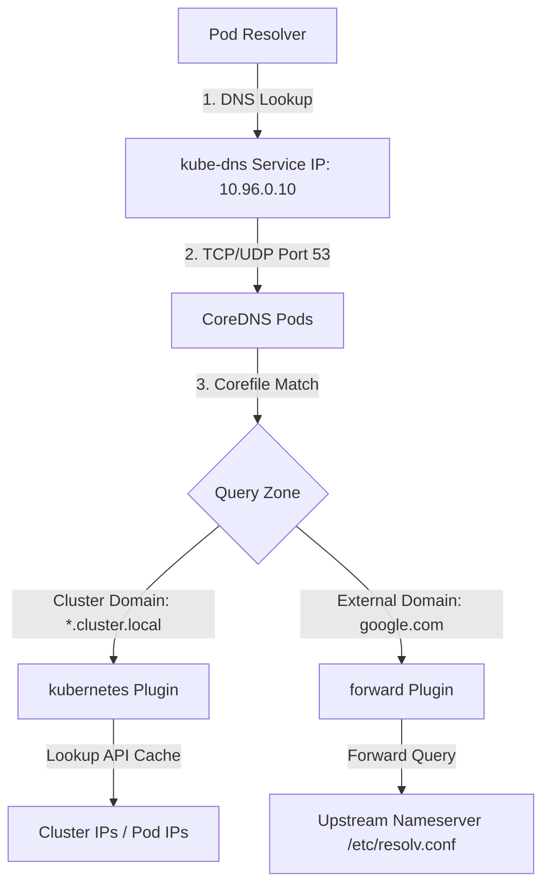

# Module 0-9-2: CoreDNS Architecture, Service Resolution & Corefile

**Breadcrumbs:** [[0-Index - Kubernetes|🏠 Kubernetes Reference MOC]] > **Module 0-9-2**

---

## 5. DNS in Kubernetes

DNS services in the cluster allow pods to resolve services and other pods using human-readable names.

### 5.1 CoreDNS Architecture

CoreDNS is deployed as a Deployment in the `kube-system` namespace. It exposes a service named `kube-dns` with a static ClusterIP (conventionally `10.96.0.10`).



#### Kubelet ClusterDNS Integration
Kubelet injects the `kube-dns` service IP as the DNS nameserver for every container it starts.
*   **Verify Kubelet Configuration:**
    ```bash
    cat /var/lib/kubelet/config.yaml | grep -A2 clusterDNS
    ```
    *Expected output:*
    ```yaml
    clusterDNS:
    - 10.96.0.10
    clusterDomain: cluster.local
    ```

---

### 5.2 CoreDNS ConfigMap & Corefile Details

The Corefile dictates how DNS requests are processed. It is stored in a ConfigMap named `coredns` in the `kube-system` namespace.

*   **View CoreDNS ConfigMap:**
    ```bash
    kubectl describe configmap coredns -n kube-system
    ```

```nginx
# Example Corefile Configuration
.:53 {
    errors          # Log errors to standard output
    health {
        lameduck 5s # Wait 5s before shutdown to drain connections
    }
    ready           # Exposes readiness endpoint on port 8181
    kubernetes cluster.local in-addr.arpa ip6.arpa {
        pods insecure
        fallthrough in-addr.arpa ip6.arpa
        ttl 30
    }
    prometheus :9153  # Exposes metrics on port 9153
    forward . /etc/resolv.conf # Forward non-cluster requests to upstream servers
    cache 30        # Enable a 30-second TTL cache for records
    loop            # Detect forwarding loops
    reload          # Enable dynamic reloading when the ConfigMap changes
}
```

#### Corefile Directives Explained:
*   **`kubernetes`:** Configures CoreDNS to resolve names in the `cluster.local` domain.
    *   `pods insecure`: Resolves pod IPs based on query formatting without verifying their existence in the API server. Alternative options: `verified` (queries the API server to confirm the pod exists before resolving) or `disabled` (prevents pod IP lookup entirely).
    *   `fallthrough`: Forwards requests to subsequent plugins if the local Kubernetes zone lookup yields no results.
*   **`forward`:** Resolves external queries (e.g. `google.com`) by forwarding them to the host resolver configuration at `/etc/resolv.conf`.

---

### 5.3 FQDN and Record Formats

The cluster DNS assigns a Fully Qualified Domain Name (FQDN) to Services, Pods, and StatefulSet members.

#### Service A-Record Format
```text
<service-name>.<namespace>.svc.<cluster-domain>
```
*Example:* `web-service.default.svc.cluster.local` resolves to the Service's ClusterIP.

#### Pod A-Record Format
```text
<ip-with-dashes>.<namespace>.pod.<cluster-domain>
```
*Example:* A pod with IP `10.244.1.4` in namespace `apps` resolves to `10-244-1-4.apps.pod.cluster.local`.

#### StatefulSet Hostname Format
For headless services (with `clusterIP: None`), DNS points directly to the backing pod IPs.
```text
<pod-name>.<service-name>.<namespace>.svc.<cluster-domain>
```
*Example:* `db-statefulset-0.mysql.database.svc.cluster.local` resolves directly to the pod's IP.

---

### 5.4 Pod Name Resolution & `/etc/resolv.conf`

Inside every Pod container, Kubelet configures `/etc/resolv.conf` to direct DNS lookups to CoreDNS and define default search paths.

*   **Inspect Resolver Configuration inside a Pod:**
    ```bash
    kubectl exec -it <pod-name> -- cat /etc/resolv.conf
    ```
    *Expected output:*
    ```text
    nameserver 10.96.0.10
    search default.svc.cluster.local svc.cluster.local cluster.local
    options ndots:5
    ```

#### Search Path and `ndots` Resolution Logic:
*   **`ndots:5`:** Any query containing fewer than 5 dots is treated as a relative query. The resolver appends the search paths sequentially until it finds a match.
*   **Example 1 (Same Namespace):** A pod in namespace `apps` resolving `web-service` will check `web-service.apps.svc.cluster.local`. This yields a match in the first search path.
*   **Example 2 (Cross Namespace):** A pod in namespace `apps` resolving a database service in namespace `db` must use the namespace-qualified name: `db-service.db`. The resolver queries:
    1.  `db-service.db.apps.svc.cluster.local` (Fails)
    2.  `db-service.db.svc.cluster.local` (Matches)

> [!WARNING]
> High `ndots` values (e.g. `ndots:5`) can cause significant DNS latency. Absolute queries (like `google.com`) contain fewer than 5 dots, forcing the resolver to search all internal search domains (e.g., `google.com.default.svc.cluster.local`) before querying external servers.

---

### 5.5 Custom DNS Configurations

You can modify CoreDNS to resolve custom domains or redirect queries to specific private nameservers (e.g. on corporate networks) by updating the Corefile ConfigMap.

#### Forwarding Private DNS Queries to a Corporate Nameserver
To route all queries ending in `mycorp.com` to a private enterprise DNS server at `10.10.0.53`, add a new zone block to the Corefile ConfigMap (`coredns` in the `kube-system` namespace):

```yaml
apiVersion: v1
kind: ConfigMap
metadata:
  name: coredns
  namespace: kube-system
data:
  Corefile: |
    .:53 {
        errors
        health
        kubernetes cluster.local in-addr.arpa ip6.arpa {
           pods insecure
           fallthrough in-addr.arpa ip6.arpa
        }
        prometheus :9153
        forward . /etc/resolv.conf
        cache 30
        loop
        reload
    }
    mycorp.com:53 {
        errors
        cache 30
        forward . 10.10.0.53
    }
```

#### Explanation of the Custom Corefile Block:
*   **`mycorp.com:53`**: Declares a new DNS zone block targeting any incoming queries ending in `mycorp.com` on port `53`. Because CoreDNS selects the most specific matching zone block, queries for `mycorp.com` will bypass the default cluster block (`.:53`).
*   **`forward . 10.10.0.53`**: Instructs CoreDNS to forward any queries matching this zone to the designated corporate upstream nameserver at `10.10.0.53`.
*   **`cache 30`**: Configures a 30-second TTL cache for resolved queries in this zone to reduce query traffic load on the corporate nameserver.
*   **`errors`**: Enables logging of DNS resolution errors to CoreDNS pod standard output for troubleshooting.

#### Command to Edit Corefile Live:
To apply this modification to a running cluster, edit the ConfigMap resource:
```bash
kubectl edit configmap coredns -n kube-system
```
*(Because Corefile uses the `reload` plugin in its default configuration, CoreDNS will automatically detect, reload, and apply the Corefile updates within 30 seconds without requiring a pod restart).*

---
