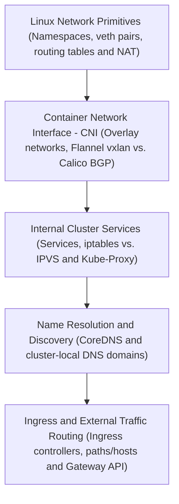
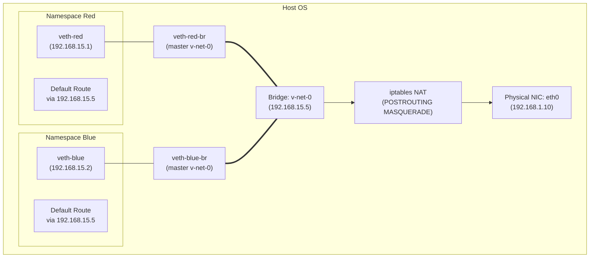
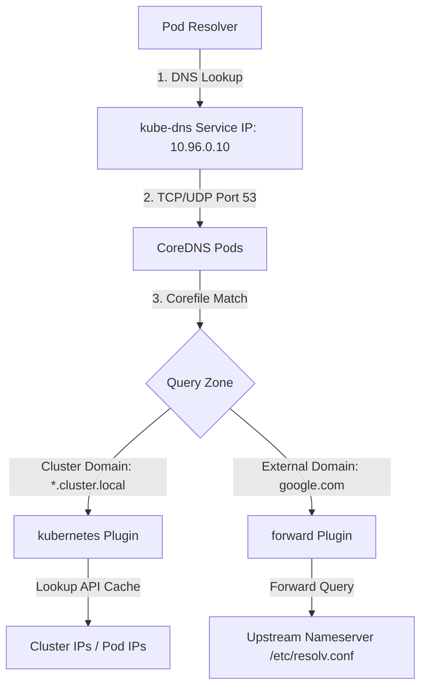
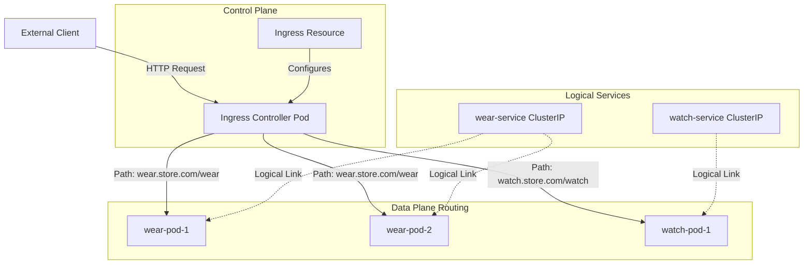

# Kubernetes Networking, DNS, and Ingress Reference Module

This module provides an exhaustive, production-grade reference for Linux networking prerequisites, the Container Network Interface (CNI) specification, Kubernetes cluster/pod networking, service networking (iptables vs. IPVS), CoreDNS architecture, and Ingress controllers/resources using modern API specifications.

---

## 🗺️ Cognitive Map: How to Think About the Flow of Knowledge

To build a strong intuition for Kubernetes networking, think of the topics as moving from host-level Linux networking up to cluster-wide software overlays, traffic proxying, name resolution, and external access:



1. **Step 1: Linux Network Primitives (Section 1):** We start at the operating system kernel. We study network namespaces, build virtual ethernet (veth) pairs, link bridge interfaces, write routing tables, and establish NAT rules to connect isolated processes.
2. **Step 2: Container Network Interface - CNI (Sections 2 & 3):** We extend networking across host nodes. We study the CNI specification, compare overlay encapsulation (Flannel's vxlan) with direct routing (Calico's BGP), and map how pods receive unique IP addresses.
3. **Step 3: Internal Cluster Services (Section 4):** To handle ephemeral pod IPs, we route traffic through stable abstractions. We configure Kubernetes Services (ClusterIP, NodePort, LoadBalancer), compare `kube-proxy` translation modes (iptables vs. IPVS), and manage the pod termination lifecycle.
4. **Step 4: Name Resolution & Discovery (Section 5):** Rather than using hardcoded IPs, we discover workloads dynamically by name. We study cluster-local DNS schemas and configure the CoreDNS ConfigMap Corefile to resolve and forward private DNS queries.
5. **Step 5: Ingress & External Traffic Routing (Section 6):** Finally, we route internet traffic into the cluster. We implement Ingress controllers (host-based vs. path-based routing), manage TLS termination, and leverage the next-generation Gateway API.

By following this flow, you progress from **OS Host Networking (Linux) → Cluster Network Fabrics (CNI) → East-West Traffic Routing (Services) → Workload Discovery (DNS) → North-South Traffic Entry (Ingress/Gateway API)**.

---


## 1. Linux Networking Prerequisites (OS & Kernel Level)

Before analyzing Kubernetes-specific network mechanics, the underlying Linux kernel networking subsystem must be understood. Kubernetes constructs its network overlays, routing, and services directly on top of standard Linux kernel tools.

### 1.1 Switching, Routing, and Gateways

Linux uses network interfaces, routing tables, and ARP tables to move packets across L2 (data link) and L3 (network) boundaries.



#### Diagnostic and Configuration Commands
*   **List Network Interfaces:**
    ```bash
    # Show status and MAC addresses (link/ether)
    ip link
    
    # Show IP addresses assigned to interfaces
    ip addr
    # or
    ip a
    ```
*   **Inspect Host Routing Tables:**
    ```bash
    # Show active routing tables with numerical IPs
    ip route show
    # or
    route -n
    ```
*   **Add L3 Routing Entries:**
    ```bash
    # Route all traffic for 192.168.1.0/24 through gateway 192.168.2.1
    ip route add 192.168.1.0/24 via 192.168.2.1
    ```
*   **Configure the Default Gateway:**
    ```bash
    # Forward all external traffic to the default gateway
    ip route add default via 192.168.2.1
    ```

#### Kernel Packet Forwarding
For a Linux host to act as a router (forwarding packets between different namespaces or interfaces), IPv4 packet forwarding must be explicitly enabled.

*   **Temporary Enablement:**
    ```bash
    # Read status (0 = disabled, 1 = enabled)
    cat /proc/sys/net/ipv4/ip_forward
    
    # Enable temporarily
    echo 1 > /proc/sys/net/ipv4/ip_forward
    # or
    sysctl -w net.ipv4.ip_forward=1
    ```
*   **Permanent Configuration:**
    Edit `/etc/sysctl.conf` or create a drop-in file at `/etc/sysctl.d/99-kubernetes-cri.conf`:
    ```ini
    net.ipv4.ip_forward = 1
    ```
*   **Reload Sysctl Settings:**
    ```bash
    sysctl --system
    ```

---

### 1.2 DNS Resolution on Linux Host
The host resolves human-readable names to IP addresses using configurations in three critical files:

1.  **`/etc/hosts`:** Static local mappings (takes priority by default).
    ```text
    127.0.0.1       localhost
    192.168.1.10    controlplane
    192.168.1.11    node01
    ```
2.  **`/etc/resolv.conf`:** Specifies upstream nameservers.
    ```text
    nameserver 8.8.8.8
    nameserver 1.1.1.1
    options edns0
    ```
3.  **`/etc/nsswitch.conf`:** Dictates the name service lookup order.
    ```text
    hosts:          files dns
    ```
    *(Note: `files` refers to `/etc/hosts`, `dns` refers to resolvers in `/etc/resolv.conf`)*

#### Diagnostic DNS Tools
```bash
# Query A-records for a target host
nslookup google.com

# Verbose lookup printing DNS server replies and query times
dig google.com

# Simple resolution check
host google.com
```

---

### 1.3 Network Namespaces (`netns`)

A network namespace is a logical copy of the network stack, containing its own routing table, firewall (iptables) rules, and network interfaces. This isolation provides the foundation for container/pod networking.

*   **Create Network Namespaces:**
    ```bash
    ip netns add red
    ip netns add blue
    ```
*   **List Network Namespaces:**
    ```bash
    ip netns
    ```
    *(Namespaces are tracked filesystem-wise under `/var/run/netns/`)*
*   **Execute Commands inside a Network Namespace:**
    ```bash
    # View interfaces inside namespace 'red'
    ip netns exec red ip link
    # or using short-hand notation
    ip -n red link
    
    # View routing tables inside namespace 'blue'
    ip netns exec blue ip route
    ```

---

### 1.4 Virtual Ethernet Pairs (`veth`)

A virtual ethernet (`veth`) device is a local tunnel that acts as a bidirectional wire connecting two interfaces. Packets entering one end automatically exit the other. This is used to connect network namespaces to the host.

*   **Create a Virtual Cable (veth pair):**
    ```bash
    ip link add veth-red type veth peer name veth-red-br
    ip link add veth-blue type veth peer name veth-blue-br
    ```
*   **Move One End of the Cable to a Namespace:**
    ```bash
    ip link set veth-red netns red
    ip link set veth-blue netns blue
    ```
*   **Assign IP Addresses to Namespace Interfaces:**
    ```bash
    ip -n red addr add 192.168.15.1/24 dev veth-red
    ip -n blue addr add 192.168.15.2/24 dev veth-blue
    ```
*   **Bring Interfaces UP:**
    ```bash
    # Bring loopback up inside the namespace
    ip -n red link set lo up
    
    # Bring veth up inside namespaces
    ip -n red link set veth-red up
    ip -n blue link set veth-blue up
    ```
*   **Delete a Virtual Cable:**
    ```bash
    # Deleting one end of a veth pair automatically destroys the peer interface
    ip link del veth-red-br
    ```

---

### 1.5 Linux Bridge Networks

To connect multiple namespaces together, a virtual switch (Linux Bridge) is created on the host OS. The peer ends of the veth pairs are attached to this bridge.

*   **Create a Linux Bridge Interface:**
    ```bash
    ip link add v-net-0 type bridge
    ```
*   **Bring the Bridge Interface UP:**
    ```bash
    ip link set dev v-net-0 up
    ```
*   **Assign an IP to the Bridge (acting as the default gateway for namespaces):**
    ```bash
    ip addr add 192.168.15.5/24 dev v-net-0
    ```
*   **Bind Host-Side Veth Peers to the Bridge:**
    ```bash
    ip link set veth-red-br master v-net-0
    ip link set veth-blue-br master v-net-0
    ```
*   **Bring Host-Side Interfaces UP:**
    ```bash
    ip link set dev veth-red-br up
    ip link set dev veth-blue-br up
    ```
*   **Configure Default Gateways Inside Namespaces:**
    ```bash
    # Direct namespace traffic through the host bridge gateway
    ip netns exec red ip route add default via 192.168.15.5
    ip netns exec blue ip route add default via 192.168.15.5
    ```

#### External Connectivity: NAT (MASQUERADE) and Port Forwarding (DNAT)
By default, traffic from namespaces can reach the bridge, but cannot egress to the host's physical network or external networks.

*   **Enable Egress NAT (IP Masquerade):**
    Allow namespaces to reach external networks by rewriting the source IP to the host's IP upon exit:
    ```bash
    iptables -t nat -A POSTROUTING -s 192.168.15.0/24 -j MASQUERADE
    ```
*   **Enable Ingress Port Forwarding (Destination NAT):**
    Forward incoming traffic on host port `8080` to namespace `blue` IP `192.168.15.2` on port `80`:
    ```bash
    iptables -t nat -A PREROUTING -p tcp --dport 8080 -j DNAT --to-destination 192.168.15.2:80
    ```
*   **List Active NAT Rules:**
    ```bash
    iptables -t nat -nvL
    ```

---

### 1.6 Docker Bridge Networking Mapping

Docker implements the same underlying Linux network namespaces and bridges described above:
*   Docker creates a default bridge named `docker0` (typically on subnet `172.17.0.0/16` or `172.18.0.0/24`).
*   Running a container starts an isolated network namespace.
*   Docker allocates a veth pair, moving one end (`eth0`) into the container namespace and binding the other end (`vethXXXX`) to `docker0`.

#### Command Mapping & Inspection
```bash
# Start a container on the default bridge network
docker run -d --name web-nginx -p 8080:80 nginx

# Identify container IP address
docker inspect -f '{{range .NetworkSettings.Networks}}{{.IPAddress}}{{end}}' web-nginx

# Inspect iptables NAT rules created by Docker for port forwarding
iptables -t nat -S DOCKER
```
> [!NOTE]
> Docker adds rules directly to a custom `DOCKER` iptables chain. In contrast, Kubernetes bypasses Docker's host port mappings, instead delegating port/routing control to the CNI plugin and Kube-Proxy.

---

## 2. CNI (Container Network Interface) Specifications

The Container Network Interface (CNI) is a CNCF specification that standardizes how container runtimes (such as `containerd` or `CRI-O`) call external plugins to configure networking for container sandboxes.

### 2.1 CNI Concept & Lifecycle Workflow

```
+------------------+                   +-------------------+                   +------------------+
|                  | 1. Create Sandbox |                   | 2. Create NetNS   |                  |
|     Kubelet      |------------------>|    CRI Runtime    |------------------>| Network Namespace|
|                  |                   |  (containerd/CRI) |                   |    (per Pod)     |
+------------------+                   +-------------------+                   +------------------+
         |                                       |
         | 4. Pod Scheduled                      | 3. Invoke CNI (ADD)
         |                                       v
         |                             +-------------------+
         +---------------------------->|    CNI Plugins    |---> Sets up Veth pair
                                       |   (/opt/cni/bin)  |---> Allocates IP (IPAM)
                                       +-------------------+
```

1.  **Pod Creation:** Kubelet instructs the container runtime to create a Pod sandbox.
2.  **Namespace Setup:** The runtime initializes a new network namespace for the Pod.
3.  **CNI Execution:** The runtime invokes CNI plugin binaries (found in `/opt/cni/bin`) with commands:
    *   `ADD`: Configure the network (create veth pair, move to namespace, allocate IP).
    *   `DEL`: Tear down the network resources when the Pod is deleted.
    *   `CHECK`: Verify that the network setup conforms to expectations.
4.  **Information Transfer:** Configuration parameters (including namespace paths, container IDs, and CNI actions) are passed to the plugins via environment variables (`CNI_COMMAND`, `CNI_CONTAINERID`, `CNI_NETNS`, `CNI_IFNAME`) and stdin (JSON configuration).

---

### 2.2 Host and Kubelet CNI Configurations

Kubelet reads configuration files at startup to integrate with CNI plugins.

*   **CNI Binaries Directory:** `--cni-bin-dir` (defaults to `/opt/cni/bin/`).
*   **CNI Configuration Directory:** `--cni-conf-dir` (defaults to `/etc/cni/net.d/`).
*   **Inspect Active Kubelet Environment Flags:**
    ```bash
    # Locate CNI configuration parameters passed to Kubelet
    cat /var/lib/kubelet/kubeadm-flags.env
    
    # Check current systemd service configuration for Kubelet
    systemctl cat kubelet
    ```

---

### 2.3 CNI Directory and Configuration Structures

The `/etc/cni/net.d/` directory contains JSON configuration files. If multiple files are present, Kubelet evaluates them in alphabetical order and uses the first valid file it finds.

*   **List Installed CNI Binaries:**
    ```bash
    ls -l /opt/cni/bin/
    ```
    *Common loopback, bridge, and routing utilities:* `bridge`, `loopback`, `ptp`, `portmap`, `macvlan`, `host-local`, `dhcp`.

*   **Example CNI Configuration List (`/etc/cni/net.d/10-flannel.conflist`):**
    ```json
    {
      "cniVersion": "0.3.1",
      "name": "cbr0",
      "plugins": [
        {
          "type": "flannel",
          "delegate": {
            "hairpinMode": true,
            "isDefaultGateway": true
          }
        },
        {
          "type": "portmap",
          "capabilities": {
            "portMappings": true
          }
        }
      ]
    }
    ```

---

## 3. Cluster and Pod Networking

Kubernetes defines a strict "IP-per-Pod" networking model. This mandates that every Pod gets its own IP address, and Pods must be able to communicate with all other Pods across nodes without NAT.

### 3.1 Node Port Assignments

Kubernetes nodes must maintain specific open ports to facilitate control-plane and worker communications.

| Component | Default Port | Protocol | Purpose |
| :--- | :--- | :--- | :--- |
| **Kube-APIServer** | `6443` | TCP | Control-plane API access |
| **ETCD Client** | `2379` | TCP | Datastore API client access |
| **ETCD Peer** | `2380` | TCP | Datastore clustering peer communication |
| **Kubelet** | `10250` | TCP | Control-plane to node communication |
| **Kube-Scheduler** | `10259` | TCP | Scheduler secure port |
| **Kube-Controller-Manager** | `10257` | TCP | Controller manager secure port |
| **Kube-Proxy** | `10256` | TCP | Health check / metrics port |
| **NodePort Services** | `30000-32767` | TCP/UDP | External service access range |

#### Verification Command
```bash
# List all active listening TCP ports with corresponding process PIDs
netstat -nltp
# or
ss -tulpn
```

---

### 3.2 IP Address Management (IPAM)

IPAM plugins manage the assignment of subnets and IPs to nodes and pods.
*   **`host-local`:** Allocates IP addresses out of a locally defined subnet range on each host. It stores state locally under `/var/lib/cni/networks/`.
*   **`dhcp`:** Delegates IP allocation to an external DHCP server on the network.

---

### 3.3 CNI Plugin Implementations (WeaveNet vs. Calico)

| Feature | WeaveNet | Calico |
| :--- | :--- | :--- |
| **Network Type** | Encapsulated Overlay (VXLAN/UDP) | L3 Routed (No encapsulation by default) |
| **Encapsulation Options** | VXLAN, FastDP (UDP) | IP-in-IP, VXLAN |
| **Routing Protocol** | Proprietary gossip protocol | BGP (Border Gateway Protocol) |
| **Datastore** | Ring-buffer distributed DB | Kubernetes CRDs or direct ETCD |
| **Network Policy** | Supported (built-in) | Advanced Policies (highly scalable) |

#### WeaveNet Overlay Architecture
WeaveNet deploys as a DaemonSet with one agent pod per node. It creates a host bridge named `weave` and builds a virtual overlay network.

*   **Overlay Routing:** Packets between pods on different nodes are captured by the `weave` interface, encapsulated in VXLAN (or UDP/FastDP), and sent to the peer agent on the target node.
*   **Verification Commands:**
    ```bash
    # Check weave pods in kube-system
    kubectl get pods -n kube-system -l name=weave-net
    
    # View weave log output
    kubectl logs -n kube-system daemonset/weave-net -c weave
    
    # View routes inside a container to verify default gateway (usually pointing to weave bridge IP)
    kubectl exec -it <pod-name> -- ip route
    ```

---

## 4. Service Networking

Kubernetes Services are abstract definitions of logical pod groupings. Since pods are ephemeral, services provide a stable virtual IP (ClusterIP) that routes traffic to backend pods.

### 4.1 Service Virtual IPs and ClusterIP Allocation

A Service's ClusterIP is not assigned to any physical interface. Instead, it is a virtual IP registered in the API server.
*   **IP Range Allocation:** The ClusterIP block is configured at API Server startup using the `--service-cluster-ip-range` flag.
*   **Determine Service Cluster IP Range:**
    ```bash
    ps -aux | grep kube-apiserver | grep service-cluster-ip-range
    ```

---

### 4.2 Service Types & Traffic Flow

*   **`ClusterIP`:** Exposes the service on a cluster-internal IP (default).
*   **`NodePort`:** Exposes the service on each node's IP at a static port (in the `30000-32767` range).
*   **`LoadBalancer`:** Provisions an external cloud load balancer pointing to the node's NodePorts.

```yaml
# Example: ClusterIP and NodePort Service Templates
apiVersion: v1
kind: Service
metadata:
  name: web-service-clusterip
  namespace: default
spec:
  type: ClusterIP
  selector:
    app: web-app
  ports:
    - protocol: TCP
      port: 80
      targetPort: 8080
---
apiVersion: v1
kind: Service
metadata:
  name: web-service-nodeport
  namespace: default
spec:
  type: NodePort
  selector:
    app: web-app
  ports:
    - protocol: TCP
      port: 80
      targetPort: 8080
      nodePort: 30080
```

---

### 4.3 Kube-Proxy Modes: iptables vs. IPVS

Kube-Proxy runs as a DaemonSet on every node. It watches the API Server for new Services and Endpoints, translating them into packet forwarding rules on the host.

```mermaid
graph TD
    subgraph iptables Mode (Sequential O(N))
        Client1[Client] --> KubeServices[KUBE-SERVICES Chain]
        KubeServices --> ServiceRule1[Service 1 Rule]
        KubeServices --> ServiceRule2[Service 2 Rule]
        ServiceRule2 --> RandomSEP[Random Endpoint Match]
        RandomSEP --> PodA[Pod A IP]
        RandomSEP --> PodB[Pod B IP]
    end
    subgraph IPVS Mode (Hash Table O(1))
        Client2[Client] --> IPVS_VS[IPVS Virtual Server]
        IPVS_VS -- Hash Table Lookup --> RealServer[Real Server List]
        RealServer -- LB Algorithm --> PodC[Pod C IP]
        RealServer -- LB Algorithm --> PodD[Pod D IP]
    end
```

#### 1. iptables Mode (Default)
In this mode, Kube-Proxy writes rules in the host's iptables NAT table.
*   **Mechanisms:**
    *   Traffic targeting a Service IP matches the `KUBE-SERVICES` chain.
    *   This chain forwards traffic to a service-specific chain (`KUBE-SVC-XXX`).
    *   The service chain uses the iptables `statistic` module to apply probability-based load balancing across endpoint chains (`KUBE-SEP-YYY`). These endpoint chains apply DNAT to redirect traffic to the destination pod IP.
*   **Limitations:**
    *   **Sequential Rule Evaluation:** Rules are evaluated sequentially ($O(N)$ lookup complexity). Large clusters with thousands of services suffer high latency and CPU overhead during packet processing and rule updates.

#### 2. IPVS Mode
In this mode, Kube-Proxy uses IPVS (IP Virtual Server), an L4 transport-layer load balancing mechanism built into the Linux kernel.
*   **Mechanisms:**
    *   Kube-Proxy creates IPVS virtual servers mapped to Service ClusterIPs.
    *   It binds pod endpoints as real servers behind the virtual servers.
    *   Lookup tables are implemented as hash tables ($O(1)$ lookup complexity), maintaining constant performance regardless of service scale.
*   **Algorithms:** IPVS supports various load balancing algorithms:
    *   `rr`: Round Robin
    *   `lc`: Least Connection
    *   `dh`: Destination Hashing
    *   `sh`: Source Hashing

#### Diagnostic Commands for Service Proxying
```bash
# Determine Kube-Proxy proxy mode from logs
kubectl logs -n kube-system -l k8s-app=kube-proxy | grep -E "Using (iptables|ipvs) Proxier"

# Inspect iptables NAT rules for a target service
iptables -t nat -S | grep <service-name>

# View active IPVS virtual servers and real backends (requires ipvsadm)
ipvsadm -ln
```

---

### 4.4 Source IP Preservation (`externalTrafficPolicy`)
When traffic originates from outside the cluster (e.g. hitting a NodePort or LoadBalancer service), the source IP behavior depends on the configured `externalTrafficPolicy`:

*   **`externalTrafficPolicy: Cluster` (Default):**
    *   **Traffic Flow:** Inbound traffic hits any cluster node. Kube-proxy routes it to any backend pod across the cluster. If the pod is on a different node, the packet hop requires SNAT (Source Network Address Translation) to rewrite the source IP to the first node's IP.
    *   **Trade-off:** The backend pod receives the host node's IP as the client source IP, losing visibility of the true client IP. However, load balancing is evenly distributed across all pods in the cluster.
*   **`externalTrafficPolicy: Local`:**
    *   **Traffic Flow:** Traffic is only routed to pods on the node that receives the traffic. No SNAT is applied; the client's original source IP is fully preserved.
    *   **Trade-off:** If a node has no active pods for that service, the packet is dropped. If pods are unevenly distributed across nodes, load balancing will be skewed (nodes with fewer pods receive higher per-pod traffic).

---

### 4.5 Pod & Endpoint Termination Lifecycle Flows
Ensuring high availability during deployments or scaling down requires connection draining and graceful termination:

1.  **Pod marked Terminating:** The API server updates the Pod status to `Terminating` and sets a `deletionTimestamp`.
2.  **Endpoint Removal:** The Endpoint / EndpointSlice controllers detect the terminating pod and remove its IP address from all relevant `Endpoints` and `EndpointSlices`.
3.  **Proxy Update:** Kube-proxy and ingress controllers watch for Endpoint changes and update their local routing rules (e.g., iptables/IPVS) to stop sending new traffic to the terminating pod.
4.  **SIGTERM sent:** Simultaneously with step 2, the Kubelet sends a `SIGTERM` signal to the container processes inside the terminating pod, signaling them to start shutting down.
5.  **Graceful shutdown:** The application continues running, finishes processing active/in-flight connections, and refuses new inbound connections.
6.  **SIGKILL fallback:** Kubelet waits for `terminationGracePeriodSeconds` (default 30s). If the containers are still running after the timer expires, Kubelet sends a `SIGKILL` to force-kill the processes.
7.  **Purge:** The pod record is completely deleted from `etcd`.

> [!WARNING]
> **The Race Condition:** Because endpoint removal (step 2) and SIGTERM (step 4) occur asynchronously and in parallel, there is a race condition where container processes start shutting down before Kube-proxy updates the host routing rules. This causes incoming client requests to hit a shutting-down container and fail with connection refused.
> **Mitigation:** Use a container `preStop` hook to delay the application shutdown (e.g., a simple shell `sleep 5`), giving Kube-proxy enough time to remove the endpoints and drain active connections.
> ```yaml
> spec:
>   containers:
>   - name: web-app
>     image: nginx
>     lifecycle:
>       preStop:
>         exec:
>           command: ["/bin/sh", "-c", "sleep 5 && nginx -s quit"]
> ```

---

### 4.6 Connecting Applications with Services (Routing PoC)
Connecting application workloads securely via service selectors is verified using the following steps:
1.  Verify that pods are properly labeled and matched by the service selector.
2.  Verify endpoint registration using `kubectl get endpoints <service-name>`.
3.  Verify routing rules propagation by running curl inside a test container:
    ```bash
    kubectl run test-curl --rm -it --image=curlimages/curl -- curl http://<service-name>.<namespace>.svc.cluster.local
    ```

### 4.7 💡 CKA Battle-Test FAQ: Service Creation & Exposing

#### Q: What is the difference between `kubectl expose` and `kubectl create service`?

Both commands imperatively generate services, but they operate under completely different mechanisms:

1. **`kubectl expose` (Auto-Detecting / Target-Aware):**
   * **Mechanism:** It inspects an existing resource (e.g., Pod, Deployment, ReplicaSet) and **automatically** copies its labels to configure the Service's `selector`. It also reads the resource's container ports and maps the Service's `port` and `targetPort` accordingly.
   * **Scenario:** You have a running deployment named `webapp` with containers listening on port `8080`. You want to quickly expose it to the cluster without manually writing selectors.
   * **CLI Syntax (ClusterIP default):**
     ```bash
     kubectl expose deployment webapp --port=80 --target-port=8080 --name=webapp-service
     ```
   * **CLI Syntax (NodePort):**
     ```bash
     kubectl expose deployment webapp --port=80 --target-port=8080 --type=NodePort --name=webapp-service-np
     ```

2. **`kubectl create service` (Generic / Manual Mapping):**
   * **Mechanism:** It creates a generic Service from scratch. It is **not aware** of any existing resources. You must manually define the selector mapping, or edit the generated Service to match your workload's labels.
   * **Scenario:** You want to provision a Service *before* the pods exist, or you need to define specialized settings like a headless Service.
   * **CLI Syntax (ClusterIP):**
     ```bash
     kubectl create service clusterip webapp-service --tcp=80:8080
     ```
     *Note:* This generates a selector `app=webapp-service` by default. If your workload labels do not match this, you must edit the Service:
     ```bash
     kubectl set selector service webapp-service app=webapp
     ```
   * **CLI Syntax (NodePort):**
     ```bash
     kubectl create service nodeport webapp-service-np --tcp=80:8080 --node-port=30080
     ```

#### Comparison Matrix

| Feature | `kubectl expose` | `kubectl create service` |
| :--- | :--- | :--- |
| **Workload Awareness** | 🟢 Yes. Inspects resource for ports & labels. | ❌ No. Generates generic skeleton. |
| **Selector Autocompletion** | 🟢 Yes. Automatically copies resource labels. | ❌ No. Defaults to `app=<service-name>`. |
| **Port Mapping** | 🟢 Auto-detects container ports. | ❌ Must be explicitly specified. |
| **Manual NodePort Assignment** | ❌ No. NodePort is randomly allocated (30000-32767). | 🟢 Yes. Can explicitly request via `--node-port`. |
| **Headless Service Support** | ❌ No. | 🟢 Yes. Pass `--clusterip="None"`. |

---

---

## 5. DNS in Kubernetes

DNS services in the cluster allow pods to resolve services and other pods using human-readable names.

### 5.1 CoreDNS Architecture

CoreDNS is deployed as a Deployment in the `kube-system` namespace. It exposes a service named `kube-dns` with a static ClusterIP (conventionally `10.96.0.10`).



#### Kubelet ClusterDNS Integration
Kubelet injects the `kube-dns` service IP as the DNS nameserver for every container it starts.
*   **Verify Kubelet Configuration:**
    ```bash
    cat /var/lib/kubelet/config.yaml | grep -A2 clusterDNS
    ```
    *Expected output:*
    ```yaml
    clusterDNS:
    - 10.96.0.10
    clusterDomain: cluster.local
    ```

---

### 5.2 CoreDNS ConfigMap & Corefile Details

The Corefile dictates how DNS requests are processed. It is stored in a ConfigMap named `coredns` in the `kube-system` namespace.

*   **View CoreDNS ConfigMap:**
    ```bash
    kubectl describe configmap coredns -n kube-system
    ```

```nginx
# Example Corefile Configuration
.:53 {
    errors          # Log errors to standard output
    health {
        lameduck 5s # Wait 5s before shutdown to drain connections
    }
    ready           # Exposes readiness endpoint on port 8181
    kubernetes cluster.local in-addr.arpa ip6.arpa {
        pods insecure
        fallthrough in-addr.arpa ip6.arpa
        ttl 30
    }
    prometheus :9153  # Exposes metrics on port 9153
    forward . /etc/resolv.conf # Forward non-cluster requests to upstream servers
    cache 30        # Enable a 30-second TTL cache for records
    loop            # Detect forwarding loops
    reload          # Enable dynamic reloading when the ConfigMap changes
}
```

#### Corefile Directives Explained:
*   **`kubernetes`:** Configures CoreDNS to resolve names in the `cluster.local` domain.
    *   `pods insecure`: Resolves pod IPs based on query formatting without verifying their existence in the API server. Alternative options: `verified` (queries the API server to confirm the pod exists before resolving) or `disabled` (prevents pod IP lookup entirely).
    *   `fallthrough`: Forwards requests to subsequent plugins if the local Kubernetes zone lookup yields no results.
*   **`forward`:** Resolves external queries (e.g. `google.com`) by forwarding them to the host resolver configuration at `/etc/resolv.conf`.

---

### 5.3 FQDN and Record Formats

The cluster DNS assigns a Fully Qualified Domain Name (FQDN) to Services, Pods, and StatefulSet members.

#### Service A-Record Format
```text
<service-name>.<namespace>.svc.<cluster-domain>
```
*Example:* `web-service.default.svc.cluster.local` resolves to the Service's ClusterIP.

#### Pod A-Record Format
```text
<ip-with-dashes>.<namespace>.pod.<cluster-domain>
```
*Example:* A pod with IP `10.244.1.4` in namespace `apps` resolves to `10-244-1-4.apps.pod.cluster.local`.

#### StatefulSet Hostname Format
For headless services (with `clusterIP: None`), DNS points directly to the backing pod IPs.
```text
<pod-name>.<service-name>.<namespace>.svc.<cluster-domain>
```
*Example:* `db-statefulset-0.mysql.database.svc.cluster.local` resolves directly to the pod's IP.

---

### 5.4 Pod Name Resolution & `/etc/resolv.conf`

Inside every Pod container, Kubelet configures `/etc/resolv.conf` to direct DNS lookups to CoreDNS and define default search paths.

*   **Inspect Resolver Configuration inside a Pod:**
    ```bash
    kubectl exec -it <pod-name> -- cat /etc/resolv.conf
    ```
    *Expected output:*
    ```text
    nameserver 10.96.0.10
    search default.svc.cluster.local svc.cluster.local cluster.local
    options ndots:5
    ```

#### Search Path and `ndots` Resolution Logic:
*   **`ndots:5`:** Any query containing fewer than 5 dots is treated as a relative query. The resolver appends the search paths sequentially until it finds a match.
*   **Example 1 (Same Namespace):** A pod in namespace `apps` resolving `web-service` will check `web-service.apps.svc.cluster.local`. This yields a match in the first search path.
*   **Example 2 (Cross Namespace):** A pod in namespace `apps` resolving a database service in namespace `db` must use the namespace-qualified name: `db-service.db`. The resolver queries:
    1.  `db-service.db.apps.svc.cluster.local` (Fails)
    2.  `db-service.db.svc.cluster.local` (Matches)

> [!WARNING]
> High `ndots` values (e.g. `ndots:5`) can cause significant DNS latency. Absolute queries (like `google.com`) contain fewer than 5 dots, forcing the resolver to search all internal search domains (e.g., `google.com.default.svc.cluster.local`) before querying external servers.

---

### 5.5 Custom DNS Configurations

You can modify CoreDNS to resolve custom domains or redirect queries to specific private nameservers (e.g. on corporate networks) by updating the Corefile ConfigMap.

#### Forwarding Private DNS Queries to a Corporate Nameserver
To route all queries ending in `mycorp.com` to a private enterprise DNS server at `10.10.0.53`, add a new zone block to the Corefile ConfigMap (`coredns` in the `kube-system` namespace):

```yaml
apiVersion: v1
kind: ConfigMap
metadata:
  name: coredns
  namespace: kube-system
data:
  Corefile: |
    .:53 {
        errors
        health
        kubernetes cluster.local in-addr.arpa ip6.arpa {
           pods insecure
           fallthrough in-addr.arpa ip6.arpa
        }
        prometheus :9153
        forward . /etc/resolv.conf
        cache 30
        loop
        reload
    }
    mycorp.com:53 {
        errors
        cache 30
        forward . 10.10.0.53
    }
```

#### Explanation of the Custom Corefile Block:
*   **`mycorp.com:53`**: Declares a new DNS zone block targeting any incoming queries ending in `mycorp.com` on port `53`. Because CoreDNS selects the most specific matching zone block, queries for `mycorp.com` will bypass the default cluster block (`.:53`).
*   **`forward . 10.10.0.53`**: Instructs CoreDNS to forward any queries matching this zone to the designated corporate upstream nameserver at `10.10.0.53`.
*   **`cache 30`**: Configures a 30-second TTL cache for resolved queries in this zone to reduce query traffic load on the corporate nameserver.
*   **`errors`**: Enables logging of DNS resolution errors to CoreDNS pod standard output for troubleshooting.

#### Command to Edit Corefile Live:
To apply this modification to a running cluster, edit the ConfigMap resource:
```bash
kubectl edit configmap coredns -n kube-system
```
*(Because Corefile uses the `reload` plugin in its default configuration, CoreDNS will automatically detect, reload, and apply the Corefile updates within 30 seconds without requiring a pod restart).*

---

## 6. Ingress Control and Resources

An Ingress controller is an L7 reverse proxy that routes external HTTP/HTTPS traffic into cluster services. An Ingress resource defines the routing rules that configure the controller.



### 6.1 Ingress Controller vs Ingress Resource

1.  **Ingress Controller:** The running application pod (e.g. Nginx Ingress Controller, Traefik, HAProxy) that acts as the data plane. It watches the API server for changes to Ingress resources and dynamically updates its configuration.
2.  **Ingress Resource:** The control plane configuration file defining matching paths, hosts, SSL secrets, and backend target services.

> [!NOTE]
> Most Ingress controllers bypass Kube-Proxy Service ClusterIPs. Instead, they extract Endpoint pod IPs directly from the API Server and route traffic directly to the pods. This avoids an extra routing hop and preserves client source IPs.

---

### 6.2 Ingress Resource Spec (`networking.k8s.io/v1`)

```yaml
apiVersion: networking.k8s.io/v1
kind: Ingress
metadata:
  name: app-ingress
  namespace: default
  annotations:
    nginx.ingress.kubernetes.io/rewrite-target: /
spec:
  ingressClassName: nginx # Explicitly bind to the Nginx Ingress Controller
  rules:
  - host: my-app.local
    http:
      paths:
      - path: /api
        pathType: Prefix # Matches anything starting with /api
        backend:
          service:
            name: api-service
            port:
              number: 8080
```

---

### 6.3 Routing Patterns

#### Path-Based Routing (Single Host, Multiple Paths)
```yaml
spec:
  rules:
  - http:
      paths:
      - path: /wear
        pathType: Prefix
        backend:
          service:
            name: wear-service
            port:
              number: 80
      - path: /watch
        pathType: Prefix
        backend:
          service:
            name: watch-service
            port:
              number: 80
```

#### Host-Based Routing (Multiple Hosts, Distinct Paths)
```yaml
spec:
  rules:
  - host: wear.my-online-store.com
    http:
      paths:
      - path: /
        pathType: Prefix
        backend:
          service:
            name: wear-service
            port:
              number: 80
  - host: watch.my-online-store.com
    http:
      paths:
      - path: /
        pathType: Prefix
        backend:
          service:
            name: watch-service
            port:
              number: 80
```

---

### 6.4 SSL/TLS Termination

Ingress controllers can terminate SSL connections using private keys and certificates stored in Kubernetes Secrets.

*   **Generate a TLS Secret:**
    ```bash
    kubectl create secret tls store-tls-secret \
      --cert=path/to/tls.crt \
      --key=path/to/tls.key \
      --namespace=default
    ```
*   **Associate the Secret with the Ingress Resource:**
    ```yaml
    apiVersion: networking.k8s.io/v1
    kind: Ingress
    metadata:
      name: secure-ingress
      namespace: default
    spec:
      ingressClassName: nginx
      tls:
      - hosts:
        - my-online-store.com
        secretName: store-tls-secret
      rules:
      - host: my-online-store.com
        http:
          paths:
          - path: /
            pathType: Prefix
            backend:
              service:
                name: secure-service
                port:
                  number: 443
    ```

---

### 6.5 Advanced Annotations: Rewrite Target

When an Ingress matches paths like `/pay` and forwards them to a backend service, the backend service must expect requests on the `/pay` path. If the backend service is configured to handle traffic on the root path `/` instead, the Ingress controller must rewrite the URL path before forwarding the request.

#### Basic URL Path Rewrite
```yaml
metadata:
  annotations:
    nginx.ingress.kubernetes.io/rewrite-target: /
```
*   *Request:* `http://my-store.com/pay` → *Forwarded to service as:* `http://pay-service:80/`

#### Dynamic Regex Rewrite
For complex path schemes, capture groups can be used to dynamically rewrite forwarded paths.
```yaml
metadata:
  annotations:
    nginx.ingress.kubernetes.io/rewrite-target: /$2
spec:
  rules:
  - host: store.com
    http:
      paths:
      - path: /service1(/|$)(.*)
        pathType: Prefix
        backend:
          service:
            name: service1
            port:
              number: 80
```
*   *Request:* `http://store.com/service1/login` → *Forwarded to service as:* `http://service1:80/login`

---

## 7. Advanced Service Networking & Modern APIs

As Kubernetes has scaled, legacy APIs like `Ingress` and `Endpoints` have shown limitations. Modern Kubernetes networking introduces specialized resources to handle L4/L7 routing, multi-tenancy, and routing efficiency.

### 7.1 The Gateway API
The **Gateway API** is an official, open-source set of resources that extends service networking in Kubernetes. Designed as the successor to `Ingress`, it offers a role-oriented, expressive, and extensible model.

```
                  [ GatewayClass ] (Managed by Infra Provider)
                         |
                    [ Gateway ]    (Managed by Cluster Operator)
                   /           \
           [ HTTPRoute ]   [ GPCRoute ] (Managed by App Developers)
           /           \         |
      [ service-a ] [ service-b ] [ service-c ]
```

#### 1. Role-Oriented Design & Hierarchy:
*   **`GatewayClass` (Cluster-Scoped):** Defines a template for a gateway implementation (e.g., an Envoy-backed load balancer, an F5 hardware appliance, or an AWS load balancer). Managed by the **Infrastructure Provider**.
*   **`Gateway` (Namespace-Scoped):** Requests an entry point for traffic. It defines the listeners (port, protocol, TLS config) and references a `GatewayClass`. Managed by the **Cluster Operator**.
*   **`HTTPRoute` / `GRPCRoute` / `TCPRoute` / `TLSRoute`:** Defines protocol-specific routing rules from a `Gateway` listener to backends. Managed by **Application Developers**.

#### 2. Comparison with Ingress:
| Feature | Legacy Ingress API | Modern Gateway API |
| :--- | :--- | :--- |
| **Configuration Model** | Monolithic (everything in one resource) | Distributed (split across classes, gateways, and routes) |
| **Multi-tenancy** | Poor (hard to delegate paths to namespaces safely) | Built-in (routes in other namespaces bind to gateways) |
| **Portability** | Heavy reliance on custom annotations | Native, standardized resource fields |
| **Protocols Supported** | Primarily HTTP/HTTPS | HTTP, HTTPS, gRPC, TCP, UDP, TLS |

#### Example Gateway API Manifest (Gateway & HTTPRoute):
```yaml
apiVersion: gateway.networking.k8s.io/v1
kind: Gateway
metadata:
  name: prod-gateway
  namespace: infra-ns
spec:
  gatewayClassName: internal-envoy
  listeners:
  - name: http
    protocol: HTTP
    port: 80
    allowedRoutes:
      namespaces:
        from: Selector
        selector:
          matchLabels:
            shared-gateway: "true"
---
apiVersion: gateway.networking.k8s.io/v1
kind: HTTPRoute
metadata:
  name: app-route
  namespace: app-ns
spec:
  parentRefs:
  - name: prod-gateway
    namespace: infra-ns
  rules:
  - matches:
    - path:
        type: PathPrefix
        value: /v1
    backendRefs:
    - name: web-service
      port: 8080
      weight: 90
    - name: canary-service
      port: 8080
      weight: 10
```

---

### 7.2 EndpointSlices
**EndpointSlices** provide a highly scalable way to track network endpoints (usually Pod IPs) within a Kubernetes cluster. They replace the monolithic legacy `Endpoints` resources.

#### 1. The Scalability Bottleneck of Legacy Endpoints:
The original `Endpoints` resource listed *every* Pod IP for a Service in a single object. If a Service had 5,000 pods, this object grew to megabytes. When a single pod crashed or was rescheduled:
1.  The entire `Endpoints` object had to be updated in the API server.
2.  The entire object was serialized and transmitted over the network to *every* node running `kube-proxy`.
3.  This caused high CPU usage on the control plane and node bottlenecks.

#### 2. The EndpointSlice Solution:
`EndpointSlices` slice the backend endpoints into smaller chunks (default: **100 endpoints per slice**). 
*   If a Service has 5,000 backend pods, Kubernetes creates 50 `EndpointSlice` objects.
*   When a pod IP changes, only one small slice is updated and transmitted, reducing network volume by $O(N)$ where $N$ is the number of pods.

#### 3. Endpoint Conditions:
Every endpoint tracked in an `EndpointSlice` maintains three conditions:
*   `Ready`: Indicates the Pod is healthy and ready to accept traffic.
*   `Serving`: Maps to the Pod's readiness probe status. Unlike `Ready`, it remains `true` even during Pod termination to support graceful shutdown drains.
*   `Terminating`: Indicates the Pod is actively shutting down (`SIGTERM` has been sent) but is still draining. `kube-proxy` can use this to complete current connections while ignoring the Pod for new requests.

```yaml
# Example EndpointSlice snippet
apiVersion: discovery.k8s.io/v1
kind: EndpointSlice
metadata:
  name: web-service-abcde
  labels:
    kubernetes.io/service-name: web-service
addressType: IPv4
ports:
  - name: http
    port: 80
    protocol: TCP
endpoints:
  - addresses:
      - "10.244.1.45"
    conditions:
      ready: true
      serving: true
      terminating: false
    nodeName: worker-node-1
    topology:
      kubernetes.io/zone: us-east-1a
```

---

### 7.3 Topology Aware Routing & Internal Traffic Policies
To optimize routing, reduce latency, and avoid cross-availability-zone data transfer costs, Kubernetes offers advanced traffic-routing parameters.

#### 1. Topology Aware Routing (Zone Preference):
When you enable Topology Aware Routing, the `EndpointSlice` controller appends topology "hints" to endpoints. These hints instruct `kube-proxy` to route traffic to endpoints in the same availability zone.
*   **Enabling:** Add the following annotation to a Service:
    ```yaml
    metadata:
      annotations:
        service.kubernetes.io/topology-mode: Auto
    ```
*   **Constraints:**
    *   **Even Spread:** Pods must be spread evenly across zones (e.g., using `topologySpreadConstraints`).
    *   **Minimum Threshold:** If a zone has too few endpoints relative to its incoming traffic (usually less than 3 endpoints), the controller disables routing hints, falling back to cross-zone traffic to ensure service availability.

#### 2. Internal Traffic Policy (`Cluster` vs `Local`):
Controls how in-cluster clients (Pods) send traffic to Services:
*   `spec.internalTrafficPolicy: Cluster` (Default): Traffic is routed to any available endpoint in the cluster.
*   `spec.internalTrafficPolicy: Local`: Traffic is restricted to endpoints located **only on the same node** as the calling Pod.
    *   *Benefits:* Zero network latency (node-local routing), avoiding network hops.
    *   *Risk:* If the local node has no Pod matching the Service selector, traffic is dropped (no fallback to other nodes). Useful for routing ingress controller traffic to node-level local pods.

```yaml
apiVersion: v1
kind: Service
metadata:
  name: node-local-service
spec:
  selector:
    app: node-agent
  ports:
  - port: 80
    targetPort: 8080
  internalTrafficPolicy: Local
```

---

### 7.4 Service ClusterIP Allocation & CIDR Management (v1.26+)
To prevent collisions when assigning virtual IPs (ClusterIPs) to Services, modern Kubernetes clusters use advanced allocation engines.

#### 1. Range Reservation Mechanics (v1.26+):
Before v1.26, manually assigning a static `clusterIP` carried the risk of colliding with an automatically assigned (dynamic) ClusterIP. To prevent this, Kubernetes reserves a segment of the `service-cluster-ip-range`:
*   The Service CIDR is divided into two bands based on the formula: `bandOffset = min(max(16, cidrSize / 16), 256)`.
*   The **lower band** (from the start of the range up to the `bandOffset` size) is reserved for static allocations (user-specified IPs).
*   The **upper band** is preferred for dynamic allocations (automatically chosen IPs).
*   Dynamic allocations will only use the lower band if the upper band is completely exhausted, preventing collisions between automated and manual IP assignments.

#### 2. Dynamic Service CIDR Expansion (v1.29+):
If a cluster runs out of Service IPs, updating the `--service-cluster-ip-range` on `kube-apiserver` is highly disruptive. v1.29+ introduces stable dynamic expansion via the `ServiceCIDR` API:
*   A cluster can have multiple `ServiceCIDR` resources.
*   The `MultiCIDRServiceAllocator` allocator pools these ranges, dynamically allocating IPs from the newly added blocks without API server restarts.

```yaml
apiVersion: networking.k8s.io/v1alpha1
kind: ServiceCIDR
metadata:
  name: extra-service-range
spec:
  cidrs:
  - 10.96.128.0/20
```

---

## 8. Diagnostics and Verification Cheat Sheet

Use these command patterns to troubleshoot networking, DNS, Ingress, and Gateway routing issues in the cluster.

```bash
# ==============================================================================
# Host Network and Namespace Inspection
# ==============================================================================
# List network interfaces on the current host node
ip link show

# Execute network status check inside a containerd container's namespace
# 1. Identify container runtime task PID
docker inspect <container-id> --format '{{.State.Pid}}'
# 2. Query interface mappings using nsenter
nsenter -t <pid> -n ip addr show

# ==============================================================================
# CNI and IPAM Diagnostics
# ==============================================================================
# View the configured CNI configuration list file
cat /etc/cni/net.d/*.conflist

# Check WeaveNet status and peer mappings
kubectl exec -n kube-system daemonset/weave-net -c weave -- weave status

# ==============================================================================
# Service, EndpointSlice, and Routing Debugging
# ==============================================================================
# List EndpointSlices for a specific service
kubectl get endpointslice -l kubernetes.io/service-name=<service-name>

# Inspect EndpointSlice conditions (Ready, Serving, Terminating)
kubectl get endpointslice <slice-name> -o yaml

# Inspect iptables NAT chains to identify service endpoints
iptables -t nat -L KUBE-SERVICES -n -v

# Inspect IPVS routing rules if kube-proxy is operating in IPVS mode
ipvsadm -ln

# Query the ClusterIP range configured for API Server services
ps -aux | grep kube-apiserver | grep -oE "\-\-service-cluster-ip-range=[^ ]+"

# Check if ServiceCIDR expansion is active (v1.29+)
kubectl get servicecidrs

# ==============================================================================
# DNS Operations and Resolution Checks
# ==============================================================================
# Resolve a service name using a debug pod
kubectl run dns-tester --image=busybox:1.28 --restart=Never --rm -it -- nslookup kubernetes.default.svc.cluster.local

# View logs from CoreDNS to identify query resolution failures
kubectl logs -n kube-system -l k8s-app=kube-dns --tail=100

# ==============================================================================
# Ingress and Gateway Routing Verification
# ==============================================================================
# Check detailed configurations for a deployed Ingress resource
kubectl describe ingress <ingress-name>

# Check log output from the Nginx Ingress Controller
kubectl logs -n ingress-nginx deployment/ingress-nginx-controller

# Query Gateway API resources in the cluster
kubectl get gatewayclasses,gateways,httproutes -A

# Inspect a Gateway's status for bind or listener errors
kubectl describe gateway <gateway-name> -n <namespace>
```
