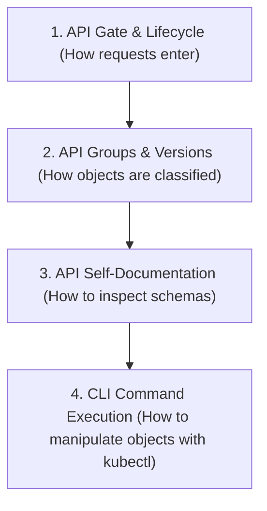

# Module 01: Kubernetes API Mechanics & kubectl CLI

This module covers the core communication layer of Kubernetes: the API server, how the API organizes resources, self-documentation, event-driven change notifications (Watch), and how to interact with the API efficiently using `kubectl`.

---

## 🗺️ Cognitive Map: How to Think About the Flow of Knowledge

To build a strong intuition for this module, think of the topics as a logical progression from API internals to hands-on command-line execution:



1. **Step 1: API Gate & Lifecycle (Section 1):** We start at the front door. The `kube-apiserver` acts as the REST gateway, handling request authentication, authorization, validation, and status updates.
2. **Step 2: API Groups & Versions (Section 2):** To manage a complex catalog of resources, Kubernetes classifies its API into groups (Core vs. Named Groups) and tracks stability through API versioning (Alpha, Beta, v1).
3. **Step 3: API Self-Documentation (Section 3):** To write valid manifests, we query the live API schema directly from the cluster using introspection tools like `kubectl api-resources`, `kubectl api-versions`, and `kubectl explain`.
4. **Step 4: CLI Command Execution (Sections 4 & 5):** Finally, we interact with the API. We master imperative commands, dry-run manifest generation, and advanced output parsing (JSONPath, Custom Columns) to extract exact state data.

By following this flow, you progress from **Abstract Entry (API Request) $\rightarrow$ Structural Classification (API Groups) $\rightarrow$ Schema Inspection (Exploration) $\rightarrow$ Production Command Execution (kubectl CLI)**.

---


## 1. The Kubernetes API Server (`kube-apiserver`)

The `kube-apiserver` is the front gate to the control plane. For its architectural placement and role in High Availability (HA) topologies, see [Module 02: Cluster Architecture & Control Plane Components](02_cluster_architecture_and_components.md#2-control-plane-core-components-deep-dive).
* **Central Hub:** Every component (nodes, scheduler, controllers, users) communicates with the API server. No component (except the API server) is permitted to access the backend database (`etcd`) directly.
* **REST Interface:** The API server exposes an HTTP REST API. Its main job is to receive requests, validate them, authorize them, and manipulate the state of **API Objects** (e.g., Pods, Deployments, Services, ConfigMaps).
* **Declarative Configuration:** When you submit a YAML file, you declare your "desired state". The API server stores this in `etcd`, and controller loops work to reconcile the "actual state" with this desired state.

### A. API Server Request Lifecycle (Creation Flow)
When a client (like `kubectl` or a raw `curl` POST request) requests the creation of a Pod:

```
[ Client / kubectl ] --(1) POST Request --> [ kube-apiserver ]
                                                  |
                                            (2) Authenticate & Validate
                                                  |
                                            (3) Write to etcd (as Pending)
                                                  |
                                            (4) Notify Client (Success)
                                                  |
                                            (5) Watches trigger Scheduler
                                                  |
                                            (6) Bind Node in etcd
                                                  |
                                            (7) Kubelet watches -> Runs container
                                                  |
                                            (8) Status Sync -> etcd
```

1. **Authentication & Authorization:** The API server authenticates the sender (e.g. via TLS certificates or tokens) and validates their RBAC permissions (e.g. NodeRestriction, custom Roles).
2. **Admission & Schema Validation:** The request passes through admission plugins (e.g., `NamespaceLifecycle`, `LimitRanger`, `ServiceAccount`, `ResourceQuota`) and is validated against the OpenAPI schema.
3. **Initial State Commit (No Node Assignment):** The API server constructs the Pod object definition. At this stage, the Pod's `spec.nodeName` field is empty (unassigned). It commits the state to `etcd` as `Pending`.
4. **Client Notification:** The API server replies to the client confirming the object was successfully created.
5. **Scheduler Intervention:** The `kube-scheduler` watches the API server via the HTTP chunked watch mechanism, detecting the new Pod without a node assignment. It runs its Filtering & Ranking algorithms, selects a node, and submits a binding API request back to the API server.
6. **Node Binding Commit:** The API server writes the selected node name (`spec.nodeName`) to the Pod definition in `etcd`.
7. **Node Execution (Kubelet):** The `kubelet` running on the selected worker node watches the API server, detects that a Pod has been assigned to it, and instructs the CRI to deploy the container.
8. **Status Synchronization:** Once the container is running or fails, the `kubelet` reports the container status back to the API server, which updates the record in `etcd`.

---

## 2. API Groups and Versioning

To organize hundreds of different resources, Kubernetes divides its API into **API Groups**.

### A. The Core Group
* **Description:** The legacy, foundational resources of Kubernetes.
* **Syntax:** In YAML, the API group is omitted, looking simply like: `apiVersion: v1`.
* **Resources:** `Pods`, `Services`, `Namespaces`, `ConfigMaps`, `Secrets`, `PersistentVolumeClaims`.

### B. Named Groups
* **Description:** Grouped logically as the project expanded.
* **Syntax:** `apiVersion: <group>/<version>`.
* **Examples:**
  * `apps/v1`: `Deployments`, `ReplicaSets`, `StatefulSets`, `DaemonSets`.
  * `networking.k8s.io/v1`: `Ingresses`, `NetworkPolicies`.
  * `rbac.authorization.k8s.io/v1`: `Roles`, `RoleBindings`, `ClusterRoles`, `ClusterRoleBindings`.

### C. Version Maturity Lifecycle
* **Alpha (e.g., `v1alpha1`):** Experimental, disabled by default. Schema can change without notice.
* **Beta (e.g., `v1beta1`):** Well-tested, enabled by default, but schema could undergo minor changes.
* **Stable (e.g., `v1`):** Production-ready. Schema is backward-compatible.

> [!TIP]
> **CKA Exam Cheat Command:**
> If you forget the exact API Group or version of a resource, use:
> ```bash
> kubectl api-resources
> ```
> This lists the short names, API groups, and namespaced status of all resources in the cluster.

---

## 3. OpenAPI Schema & `kubectl explain`

The API server contains the full OpenAPI schema loaded into memory. This schema dictates exactly what fields are valid for every single API Object. When you run `kubectl apply`, the API server validates your manifest against this schema (rejecting typos like `imgae` instead of `image`).

### Drilling Down with `kubectl explain`
Instead of searching online during the exam, ask the API server directly:
* **Get top-level fields:**
  ```bash
  kubectl explain pod
  ```
* **Drill into nested fields (use dot notation):**
  ```bash
  kubectl explain pod.spec.containers.livenessProbe
  ```
* **Explore the entire hierarchy structure (recursive skeleton):**
  ```bash
  kubectl explain pod --recursive
  ```

---

## 4. The Watch Mechanism (`-w`)

To avoid crushing the API server with constant HTTP polling (e.g., asking "any updates?" every second), Kubernetes uses a **Watch** mechanism.
* **Event-Driven:** Clients open a single, long-lived HTTP connection to the API server.
* **Streaming Updates:** The API server pushes events instantly down this pipeline as they happen:
  * `ADDED`: A new resource is created.
  * `MODIFIED`: A resource is updated (e.g., a Pod's phase changes from `Pending` to `Running`).
  * `DELETED`: A resource is deleted.
* **Real-time Troubleshooting:** In `kubectl`, append `-w` or `--watch` to view state changes in real time.

---

## 5. Anatomy of a `kubectl` Command

Every `kubectl` command conforms to a standard template:
```bash
kubectl [command] [TYPE] [NAME] [flags]
```
1. **`[command]` (Verb):** What you want to do (`get`, `describe`, `create`, `apply`, `delete`, `edit`).
2. **`[TYPE]` (Resource):** Use short names to save time:
   * `po` = pods, `deploy` = deployments, `svc` = services, `ns` = namespaces, `no` = nodes.
3. **`[NAME]` (Identifier):** The specific resource name. Omit to act on all resources in the namespace.
4. **`[flags]` (Modifiers):** e.g., `-n dev` (namespace), `-A` (all namespaces), `-o wide` (extra columns).

---

## 6. Output Formatting & Dry Runs

### A. Extended Information (`-o wide`)
Adds columns like internal IP address and node scheduling assignments:
```bash
kubectl get po -o wide
```

### B. Extract YAML (`-o yaml`)
Fetch the live manifest of a running resource:
```bash
kubectl get deploy frontend -o yaml > live-deployment.yaml
```

### C. Manifest Generation (The Dry-Run Trick)
Generate perfectly formatted, error-free YAML without actually creating the resource in the cluster:
```bash
kubectl run redis-pod --image=redis --dry-run=client -o yaml > redis.yaml
```
> [!IMPORTANT]
> **CKA Pro-Tip:** Never write YAML from scratch. Always use `--dry-run=client -o yaml` to generate the skeletal template, open it in Vim, modify it, and apply.

---

## 🛠️ Practical Proof of Concept (PoC)

### Target Scenario
We will query the API server directly via `kubectl` raw paths, generate a YAML template, deploy a pod, and use the watch mechanism to monitor its state changes.

### Step-by-Step Guided Steps

1. **Verify Cluster Access:**
   Ensure your `kind` cluster is active:
   ```bash
   kubectl cluster-info
   ```

2. **Query the Raw REST API (OpenAPI Validation Demonstration):**
   Request the raw API endpoints directly from the API server to see the API Groups structure:
   ```bash
   kubectl get --raw /apis
   ```
   To query the core group `v1`:
   ```bash
   kubectl get --raw /api/v1/namespaces
   ```

3. **Explore Schema and Pathing:**
   Search for how to specify the container port under a pod spec:
   ```bash
   kubectl explain pod.spec.containers.ports
   ```

4. **Generate a Pod YAML Template via Dry Run:**
   Create a Pod template named `poc-api-pod` running `nginx`:
   ```bash
   kubectl run poc-api-pod --image=nginx --port=80 --dry-run=client -o yaml > api-pod.yaml
   ```

5. **Start a Live Watch in the Terminal:**
   Open a watch on pods to capture events:
   ```bash
   kubectl get po -w
   ```
   *(Note: Keep this terminal running, or run the next step in another terminal session / in the background)*

6. **Create the Pod and Observe Events:**
   Apply the generated manifest:
   ```bash
   kubectl apply -f api-pod.yaml
   ```
   In the watch terminal, you should see the status transition in real-time:
   ```plaintext
   poc-api-pod   0/1   Pending            0   0s
   poc-api-pod   0/1   ContainerCreating  0   0s
   poc-api-pod   1/1   Running            0   2s
   ```

7. **Clean up Resources:**
   Delete the pod and observe the final `DELETED` event:
   ```bash
   kubectl delete -f api-pod.yaml
   rm api-pod.yaml
   ```

---

## 🔗 Related Modules
- [Module 02: Cluster Architecture & Control Plane Components](02_cluster_architecture_and_components.md) - Deep dive into where the API server resides and how other control plane components talk to it.
- [Module 03: Node Mechanics & Resource Limits](03_node_mechanics_and_resource_limits.md) - Details on how the `kubelet` registers nodes and communicates with the API server.
- [Module 04: Workload Lifecycle & Self-Healing](04_workload_lifecycle_and_healing.md) - Focuses on controller reconciliation and Pod lifecycles.
- [Module 05: Containers, Runtimes, and Lifecycle Management](05_containers_runtimes_and_lifecycle.md) - Covers container image pull mechanics, the Container Runtime Interface (CRI), lifecycle hooks, init containers, sidecars, and ephemeral containers.
