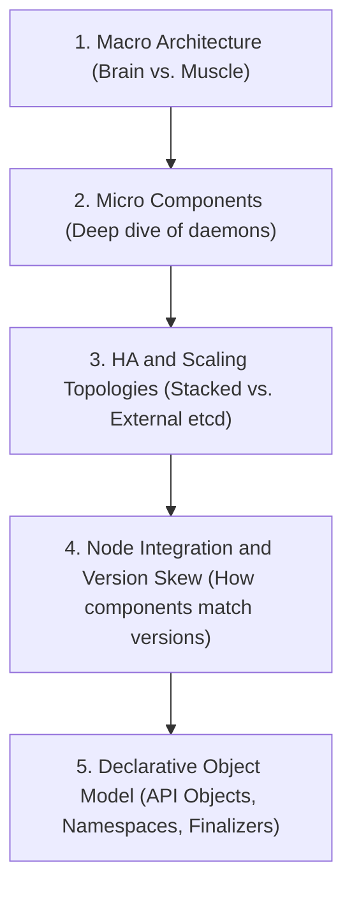
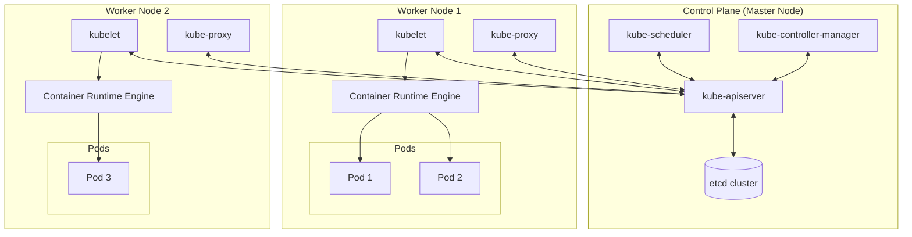

# Module 02: Cluster Architecture & Control Plane Components

This module covers the macro and micro architecture of a Kubernetes cluster, diving deep into the roles of control plane and worker components, High Availability (HA) topologies, Cloud integration (CCM), and Version Skew proxying.

---

## 🗺️ Cognitive Map: How to Think About the Flow of Knowledge

To build a strong intuition for this module, think of the topics as moving from macro cluster layout to micro component interactions, scalability, and the object model:



1. **Step 1: Macro Architecture (Section 1):** We start with the bird's-eye view, dividing the cluster into the Control Plane (state management) and Worker Nodes (workload execution).
2. **Step 2: Micro Components (Section 2 & 2.1):** We dive deep into the specific daemons running on these hosts—how the `apiserver`, `etcd`, `scheduler`, `controller-manager`, `kubelet`, and `kube-proxy` cooperate to run a Pod.
3. **Step 3: HA & Scaling Topologies (Section 3):** We look at high availability, comparing stacked `etcd` configurations against external topologies to build fault-tolerant control planes.
4. **Step 4: Node Integration & Version Skew (Section 4 & 5):** We examine the mechanics of worker registration and the version skew policies, ensuring components of different release versions can safely co-exist.
5. **Step 5: Declarative Object Model (Section 6):** Finally, we study the metadata and lifecycle rules (Namespaces, Labels, Annotations, OwnerReferences, and Finalizers) that govern how resources are managed and garbage collected inside the cluster.

By following this flow, you progress from **System Topology (Macro) → Daemon Mechanics (Micro) → High Availability Design (Scaling) → API Object Model (Data Schema)**.

---


## 1. Macro View: Control Plane vs. Worker Nodes

A Kubernetes cluster is a distributed system consisting of two primary roles: the **Control Plane** (the brain) and **Worker Nodes** (the muscle). Below is a structural diagram showing how these components interact:



### A. The Control Plane (The Brains)
* **Purpose:** Manages the overall cluster state, schedules workloads, makes global decisions (e.g., detecting node failures), and exposes the API.
* **Core Components:**
  * **`kube-apiserver`**: The front door of the cluster; validates and configures data for API objects (Pods, Services, etc.).
  * **`etcd`**: Key-value data store representing the source of truth for all cluster configuration.
  * **`kube-scheduler`**: Matches unassigned Pods to nodes based on resource capacity, constraints, and affinity rules.
  * **`kube-controller-manager`**: Evaluates and reconciles the actual state of the cluster with the desired state (e.g., node controller, replicaset controller).
* **Workload Hosting:** By default, the control plane does not host user applications. In production, control plane nodes are dedicated and isolated.

### B. Worker Nodes (The Muscle)
* **Purpose:** Runs your containerized applications (Pods).
* **Core Components:**
  * **`kubelet`**: The captain daemon on each worker node; ensures containers are running in a Pod according to the PodSpecs.
  * **`kube-proxy`**: The network manager; maintains host network routing rules to implement Services.
  * **`Container Runtime`**: The container execution engine (e.g., containerd) that downloads images and runs containers.
* **Operation:** Receives instructions from the control plane, pulls images, launches containers, and continuously feeds health telemetry back to the API server. For details on node registration, resources, and leases, see [Module 03: Node Mechanics & Resource Limits](03_node_mechanics_and_resource_limits.md). For Pod lifecycle and probing details, see [Module 04: Workload Lifecycle & Self-Healing](04_workload_lifecycle_and_healing.md).

---

## 2. Control Plane & Core Components (Deep Dive)

### A. `kube-apiserver` (The Front Gate)
* **Central Management:** Serves as the primary entry point for all control operations. Authenticates requests, validates them against OpenAPI schemas, applies admission plug-ins (e.g. `NodeRestriction`, `ResourceQuota`), and updates state.
* **Configurations & Flags:**
  * `--advertise-address`: IP address to advertise to cluster members.
  * `--etcd-servers`: List of backend `etcd` URLs.
  * `--authorization-mode`: Decides auth chain order (e.g. `Node,RBAC`).
  * `--enable-admission-plugins`: Sequence of admission controllers (e.g., `NamespaceLifecycle`, `LimitRanger`, `ServiceAccount`).
* **Verification Paths:**
  * **kubeadm Clusters:** Configured as a Static Pod. Manifest path: `/etc/kubernetes/manifests/kube-apiserver.yaml`.
  * **Manual Setup:** Configured as a systemd service. Service file path: `/etc/systemd/system/kube-apiserver.service`.
  * For runtime process inspection, execute: `ps -aux | grep kube-apiserver`.

### B. `etcd` (The Source of Truth)
* **Key-Value Store vs Relational:** Relational databases use rigid rows/columns. `etcd` is a key-value store, organizing configuration data as independent, nested JSON documents, allowing highly flexible schemas.
* **Consensus & Ports:** Uses the **Raft consensus algorithm** to prevent split-brain. Client communication listens on port **`2379`** (used by API Server), and peer cluster node communication listens on port **`2380`**.
* **Configurations & Flags:**
  * `--listen-client-urls` and `--advertise-client-urls`: Handles inbound API requests.
  * `--initial-cluster`: Lists peers (`controller-0=https://...:2380,controller-1=https://...:2380`) for cluster formation.
  * `--data-dir`: Node-level directory path where keys are persisted (`/var/lib/etcd`).
* **API v2 vs v3 (CKA Essential CLI Tricks):**
  * `etcdctl` defaults to API v2. You must switch it to v3 via `export ETCDCTL_API=3`.
  * API v2 uses `set`/`get` commands. API v3 uses `put`/`get` commands.
  * In API v3, `version` is a subcommand (e.g., `etcdctl version` instead of `--version`).
* **Querying Registry Keys Command:**
  To list all objects registered by the API Server in etcd, target the static pod using certificate flags (required for TLS client authorization):
  ```bash
  kubectl exec -n kube-system etcd-control-plane -- etcdctl \
    --cacert=/etc/kubernetes/pki/etcd/ca.crt \
    --cert=/etc/kubernetes/pki/etcd/server.crt \
    --key=/etc/kubernetes/pki/etcd/server.key \
    get / --prefix --keys-only
  ```

### C. `kube-scheduler` (The Matchmaker)
* **Role:** Watches the API server for unassigned Pods (`spec.nodeName` is blank) and assigns them to nodes.
* **Scheduling Pipeline Phases:**
  1. **Filtering (Predicates):** Evaluates nodes and filters out those unable to accommodate the Pod (e.g. checks CPU/Memory requests, node selectors, taints).
  2. **Ranking (Priorities):** Scores the remaining candidate nodes on a scale of `0` to `10` using priority functions (e.g., resource balance, image locality). The node with the highest score is selected.
  3. **Binding:** Submits a binding object to the API server, which writes the selected node name to `spec.nodeName`. Kubelet then detects and executes this binding.
* **Configurations & Customization:** Schedulers are highly customizable. You can configure multiple custom schedulers in the same cluster and reference them via `spec.schedulerName` in your Pod manifests.
* **Verification Paths:**
  * **kubeadm:** Manifest at `/etc/kubernetes/manifests/kube-scheduler.yaml`.
  * **Manual Setup:** Service file at `/etc/systemd/system/kube-scheduler.service`.
  * Process check: `ps -aux | grep kube-scheduler`.

### D. `kube-controller-manager` (The Enforcer)
* **Mechanism:** Runs multiple asynchronous control loops packaged into a single binary.
* **Reconciliation Loop:** Continually compares the Desired State (from `etcd`) with the Actual State (from the nodes).
* **Key Controllers:**
  * **Node Controller:** Detects when nodes go offline (see node heartbeat eviction timers in [Module 03: Node Mechanics & Resource Limits](03_node_mechanics_and_resource_limits.md#3-node-heartbeats-the-lease-api)).
  * **ReplicaSet Controller:** Keeps the correct number of Pod replicas running (see replication control in [Module 04: Workload Lifecycle & Self-Healing](04_workload_lifecycle_and_healing.md#1-the-four-pillars-of-self-healing)).
  * **Endpoints Controller:** Links Service objects to the actual Pod IP addresses.
* **Verification Paths:**
  * **kubeadm:** Manifest at `/etc/kubernetes/manifests/kube-controller-manager.yaml`.
  * **Manual Setup:** Service file at `/etc/systemd/system/kube-controller-manager.service`.

### E. `kube-proxy` (The Network Router)
* **Role:** A network agent running on every node that enables cluster-wide network routing for Services.
* **Service Virtual Entity:** Services are virtual entities in the cluster's memory—they do not correspond to any container, network card, or physical interface.
* **Routing Mechanism:** Kube-proxy watches the API Server for new Services and Endpoints. It configures host-level network rules (`iptables` or `IPVS` tables) so that traffic sent to a Service's IP is automatically redirected to the actual IP of an active backend Pod.
* **Verification & Deployment:**
  * **kubeadm:** Deployed as a `DaemonSet` in the `kube-system` namespace.
  * Retrieve DaemonSet configuration: `kubectl get daemonset -n kube-system kube-proxy`.
  * List instances: `kubectl get pods -n kube-system -l k8s-app=kube-proxy`.

---

## 2.1 Component Configuration Paths Quick Reference

| Component | Installation Mode | Config File / Path | Check Status Command |
| :--- | :--- | :--- | :--- |
| **Kube API Server** | kubeadm (Static Pod) | `/etc/kubernetes/manifests/kube-apiserver.yaml` | `kubectl get po -n kube-system -l component=kube-apiserver` |
| | Manual (systemd) | `/etc/systemd/system/kube-apiserver.service` | `systemctl status kube-apiserver` |
| **etcd** | kubeadm (Static Pod) | `/etc/kubernetes/manifests/etcd.yaml` | `kubectl get po -n kube-system -l component=etcd` |
| | Manual (systemd) | `/etc/systemd/system/kube-apiserver.service` | `systemctl status etcd` |
| **Kube Scheduler** | kubeadm (Static Pod) | `/etc/kubernetes/manifests/kube-scheduler.yaml` | `kubectl get po -n kube-system -l component=kube-scheduler` |
| | Manual (systemd) | `/etc/systemd/system/kube-scheduler.service` | `systemctl status kube-scheduler` |
| **Controller Manager** | kubeadm (Static Pod) | `/etc/kubernetes/manifests/kube-controller-manager.yaml` | `kubectl get po -n kube-system -l component=kube-controller-manager` |
| | Manual (systemd) | `/etc/systemd/system/kube-controller-manager.service` | `systemctl status kube-controller-manager` |
| **Kube Proxy** | kubeadm (DaemonSet) | `kubectl edit ds/kube-proxy -n kube-system` | `kubectl get ds -n kube-system -l k8s-app=kube-proxy` |
| | Manual (systemd) | `/etc/systemd/system/kube-proxy.service` | `systemctl status kube-proxy` |

---

## 3. High Availability (HA) Architecture

Running a single control plane node creates a Single Point of Failure (SPOF). HA clusters replicate the control plane (usually across 3 or 5 nodes) to achieve redundancy.

```plaintext
                    [ Load Balancer ]
                     /      |      \
         [ API-Server ] [ API-Server ] [ API-Server ]   (Active-Active)
               \            |            /
             [ etcd ] <--> [ etcd ] <--> [ etcd ]       (Active-Active Consensus)
               |            |            |
         [ Scheduler ]  [ Scheduler ]  [ Scheduler ]    (Active-Passive Leases)
         (Active/Leader)   (Backup)      (Backup)
```

### A. `kube-apiserver` (Active-Active)
* **Stateless:** Stores no local state.
* **HA Mechanism:** All instances run simultaneously. An external Load Balancer routes traffic to them.

### B. `etcd` (Active-Active / Distributed Consensus)
* **Stateful:** Stores the data.
* **HA Mechanism:** All instances run. They replicate data continuously and elect a leader among themselves using Raft. Requires a quorum (majority) to write: `Quorum = N/2 + 1`.

### C. `kube-scheduler` & `kube-controller-manager` (Active-Passive)
* **Stateful Logic:** Running multiple active schedulers/controllers simultaneously would cause conflicts (e.g., scheduling the same pod to different nodes).
* **HA Mechanism:** Uses **Leader Election** based on `Lease` objects. Only one instance holds the lease and acts as the "Active Leader". The others stand by as "Passive Backups", watching the lease and waiting to take over if the leader fails to renew it.

### D. Stacked HA Control Plane Bootstrapping with kubeadm
In a **Stacked Control Plane** topology, etcd members are co-located on the control plane nodes (i.e. every control plane node runs a local `etcd` instance and `kube-apiserver` instance). 

#### 1. Pre-requisite: External Load Balancer
A highly available setup requires a stable endpoint (usually a TCP Load Balancer) in front of all control plane nodes:
1. Configure the load balancer to forward TCP traffic on port `6443` to the backend control plane nodes' IP addresses on port `6443`.
2. Configure a TCP health check on port `6443` to route traffic only to healthy `kube-apiserver` instances.

#### 2. Bootstrapping the First Control Plane Node
Initialize the first control plane node by specifying the load balancer IP and port using the `--control-plane-endpoint` flag, and upload the generated certificates to the cluster using `--upload-certs`:
```bash
sudo kubeadm init \
  --control-plane-endpoint "LOAD_BALANCER_IP:6443" \
  --upload-certs \
  --pod-network-cidr=10.244.0.0/16
```
* **`--control-plane-endpoint`**: Configures the cluster so that all nodes (including workers and subsequent control plane nodes) point to the load balancer as the API Server endpoint rather than a single master node IP.
* **`--upload-certs`**: Automatically encrypts and uploads the control plane certificates and keys (e.g. CA, etcd CA, service account keys) to a temporary Secret in the cluster (`kubeadm-certs` in the `kube-system` namespace). This Secret is decrypted by subsequent control plane nodes when they join, allowing them to participate in the HA setup.

#### 3. Joining Additional Control Plane Nodes
The initialization output will provide a dedicated join command for other control plane nodes containing a certificate key:
```bash
sudo kubeadm join LOAD_BALANCER_IP:6443 \
  --token <token> \
  --discovery-token-ca-cert-hash sha256:<hash> \
  --control-plane \
  --certificate-key <key>
```
* **`--control-plane`**: Tells `kubeadm` to join this node as an additional control plane member.
* **`--certificate-key`**: The decryption key needed to download and local-extract the uploaded certificates.

---

## 4. Cloud Controller Manager (CCM)

Kubernetes splits cloud-specific code out of the core binaries ("out-of-tree" architecture) using the CCM.

* **Purpose:** Decouples Kubernetes from cloud provider API versions (AWS, Azure, GCP).
* **Key Controllers inside CCM:**
  1. **Node Controller:** Identifies cloud VM metadata and deletes the Node object if the instance is terminated in the cloud console.
  2. **Route Controller:** Configures routing tables in the cloud VPC.
  3. **Service Controller:** Commands the cloud provider to provision physical Load Balancers (e.g., AWS NLB) for services marked `type: LoadBalancer`.
* **Initialization Taint:** Nodes register with the taint `node.cloudprovider.kubernetes.io/uninitialized:NoSchedule` until the CCM initializes their cloud parameters.

---

## 5. Mixed Version Proxy (Version Skew Support)

During rolling cluster upgrades, a cluster runs in a **Version Skew** state (e.g., one API server is upgraded to `v1.31` while another is still running `v1.30`).

* **The Problem:** If a client requests a resource type unique to `v1.31`, and the load balancer routes the request to the `v1.30` API server, it will fail with a `404 Not Found`.
* **The Solution:** The Mixed Version Proxy. When enabled, an older API server that receives an unknown resource request will query its peers via the `apiservernetwork.discovery.k8s.io` group. It then transparently reverse-proxies the request internally to a newer API server that supports it.

---

## 🛠️ Practical Proof of Concept (PoC)

### Target Scenario
We will create a multi-node cluster (`1 control-plane, 2 worker nodes`), inspect the static pods running the Control Plane components, and locate the HA Leader Election leases.

### Step-by-Step Guided Steps

1. **Create the `kind-config.yaml` for a Multi-Node Cluster:**
   Write a configuration for 1 control-plane and 2 worker nodes:
   ```yaml
   cat <<EOF > kind-config.yaml
   kind: Cluster
   apiVersion: kind.x-k8s.io/v1alpha4
   nodes:
   - role: control-plane
   - role: worker
   - role: worker
   EOF
   ```

2. **Provision the Cluster:**
   Create the cluster using the config:
   ```bash
   kind create cluster --config kind-config.yaml --name cka-poc
   ```

3. **Verify the Multi-Node Nodes Status:**
   Check the node roles and versions:
   ```bash
   kubectl get nodes -o wide
   ```

4. **Inspect Control Plane Static Pods:**
   Control plane components in kubeadm-based clusters (like `kind`) run as Static Pods. Their manifests live on the control plane node. Check them:
   ```bash
   kubectl get pods -n kube-system -o wide
   ```
   Notice that `kube-apiserver-cka-poc-control-plane`, `kube-controller-manager-...`, `kube-scheduler-...`, and `etcd-...` are all running directly on the control plane node.

5. **Access Manifests inside the Control Plane Container:**
   `kind` nodes run as Docker containers. Exec into the control-plane container to inspect the static pod manifests:
   ```bash
   docker exec -it cka-poc-control-plane ls -la /etc/kubernetes/manifests
   ```
   You will see the YAML templates for `etcd.yaml`, `kube-apiserver.yaml`, `kube-controller-manager.yaml`, and `kube-scheduler.yaml`. The local `kubelet` on this master node reads these files and ensures they are running.

6. **Locate HA Leader Election Leases:**
   List the leases in the `kube-system` namespace to identify the active leaders for the scheduler and controller-manager:
   ```bash
   kubectl get leases -n kube-system
   ```
   Describe one of them to see the current leaseholder:
   ```bash
   kubectl describe lease kube-scheduler -n kube-system
   ```
   Look for the `Holder Identity` (which will be the name of the control plane node).

7. **Clean up Resources:**
   Delete the local cluster:
   ```bash
   kind delete cluster --name cka-poc
   rm kind-config.yaml
   ```

---

## 6. Core Kubernetes Object Model and Metadata

Kubernetes represents its cluster state declaratively using persistent entities called **Objects**. Objects contain specifications describing the desired state and status describing the actual runtime state.

### A. Object Identity & Name Restrictions
Every Kubernetes object has a name that is unique for that resource type within its namespace (or cluster-scoped if global).
* **Names & UIDs:** Objects are identified by a string `name` and a globally unique `UID` generated by the cluster.
* **DNS Subdomain Names (RFC 1123):** Most resource names must conform to RFC 1123 subdomain rules:
  * Maximum 253 characters.
  * Contain only lowercase alphanumeric characters, `-` or `.`.
  * Start and end with an alphanumeric character.
* **RFC 1123 Label Names:** Some object names (like Pods) must be valid RFC 1123 labels:
  * Maximum 63 characters.
  * Contain lowercase alphanumeric characters or `-`.
  * Start and end with an alphanumeric character.
* **RFC 1035 Label Names:** Used by certain resources (like Services):
  * Maximum 63 characters.
  * Lowercase alphanumeric or `-`.
  * Must start with an alphabetic character, and end with an alphanumeric.
  * **Service Exception:** When the `RelaxedServiceNameValidation` feature gate is enabled (default in modern versions), Service names are allowed to start with a digit.

### B. Labels & Selectors
Labels are key/value pairs attached to objects (like Pods) that serve as identifying metadata for organizing and grouping resources.
* **Syntax:** Keys consist of an optional DNS prefix (max 253 chars) followed by a name (max 63 chars), separated by `/`.
  * The prefixes `kubernetes.io/` and `k8s.io/` are strictly reserved for core components.
  * Label values must be 63 characters or less, start/end with an alphanumeric, and can contain `-`, `_`, `.`.
* **Selectors:** Used to query groups of labeled resources.
  * **Equality-based:** `=` or `==` (equals), `!=` (not equal). E.g., `environment=production`.
  * **Set-based:** `in`, `notin`, `exists` (specified by key), and `!exists` (by key negation). E.g., `tier in (frontend, backend)`.
* **ReplicaSet Selector Overlaps:** ReplicaSet selectors must not overlap with other controllers in the same namespace, or controllers will conflict/thrash trying to reclaim pods.

### C. Annotations
Annotations are key/value metadata maps used to attach arbitrary non-identifying data.
* **Characteristics:** Unlike labels, annotations cannot be used to select or query objects. They can contain large, unstructured, or structured data (like JSON configurations, tool audit logs, or deployment history).
* **Syntax:** Keys follow the same prefix/name syntax as labels.

### D. Namespaces (Logical Partitioning)
Namespaces partition cluster resources logically but do not offer network or physical machine boundaries by default.
* **Initial Namespaces:**
  * `default`: For resources with no namespace specified.
  * `kube-system`: For control plane and system-level resources.
  * `kube-public`: Globally readable, used for cluster bootstrapping (e.g. `cluster-info`).
  * `kube-node-lease`: Holds the `Lease` heartbeat objects for nodes.
* **Naming Restrictions:** Custom namespace names must not start with the prefix `kube-` as it is reserved for system namespaces.
* **Production Recommendation:** Avoid deploying workloads in the `default` namespace; create dedicated namespaces with resource limits.

### E. Finalizers
Finalizers are string keys in `metadata.finalizers` that inform Kubernetes to block the garbage collection of an object until specific cleanup criteria are met.
* **Mechanism:** When an object with finalizers is deleted, the API server sets `metadata.deletionTimestamp` but does not remove it. A controller processes the cleanup, removes its finalizer key, and when the list is empty, the object is purged from `etcd`.
* **Common Finalizers:**
  * `kubernetes.io/pvc-protection`: Prevents PV/PVC deletion while a Pod is actively using the volume.
  * `kubernetes.io/pv-protection`: Prevents PV deletion while bound to a PVC.

### F. Owner References & Garbage Collection
Kubernetes uses owner references to track relationships between parent resources (e.g. Deployments, ReplicaSets) and their dependents (e.g. Pods).
* **Owner References:** Set in `metadata.ownerReferences`. Includes resource name, UID, API version, and kind.
* **Cascading Deletion Modes:**
  * **Foreground:** Parent is deleted, but remains in "Terminating" state. The `foregroundDeletion` finalizer blocks deletion until all dependents with `ownerReferences.blockOwnerDeletion=true` are deleted.
  * **Orphan:** Deletes the parent resource, leaving dependents running in the cluster. Their owner references are removed, making them orphans.
* **Cross-Namespace Restrictions:** Cross-namespace owner references are strictly disallowed. A namespaced dependent must have its owner in the same namespace. If a mismatch is detected, Kubernetes ignores the reference and reports an `OwnerRefInvalidNamespace` event.

---

## 🔗 Related Modules
- [Module 01: Kubernetes API Mechanics & kubectl CLI](01_kube_api_and_kubectl.md) - Explains how clients interact with the `kube-apiserver` fronted by the Control Plane.
- [Module 03: Node Mechanics & Resource Limits](03_node_mechanics_and_resource_limits.md) - Deep dive into Kubelet registration, heartbeats, and worker node resource boundaries.
- [Module 04: Workload Lifecycle & Self-Healing](04_workload_lifecycle_and_healing.md) - Explains the reconciliation loops managed by the controllers (e.g. ReplicaSets, Pod self-healing).
- [Module 05: Containers, Runtimes, and Lifecycle Management](05_containers_runtimes_and_lifecycle.md) - Covers container image pull mechanics, the Container Runtime Interface (CRI), lifecycle hooks, init containers, sidecars, and ephemeral containers.
