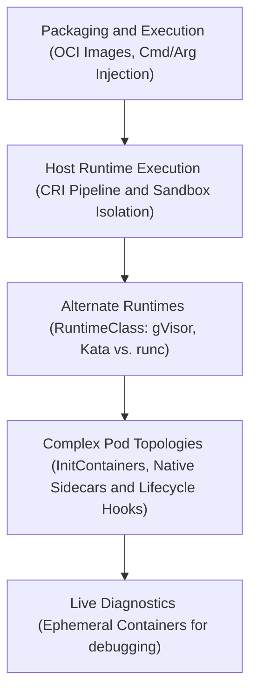
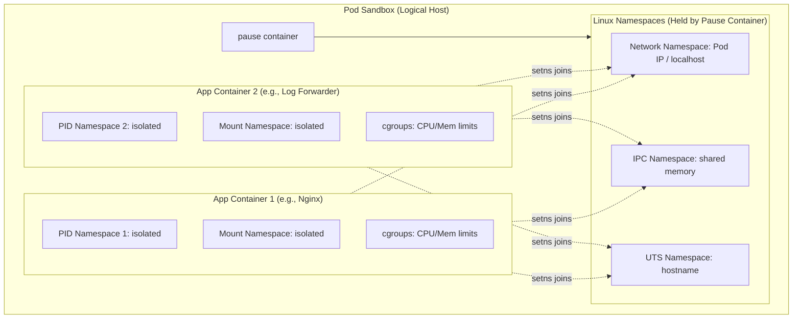
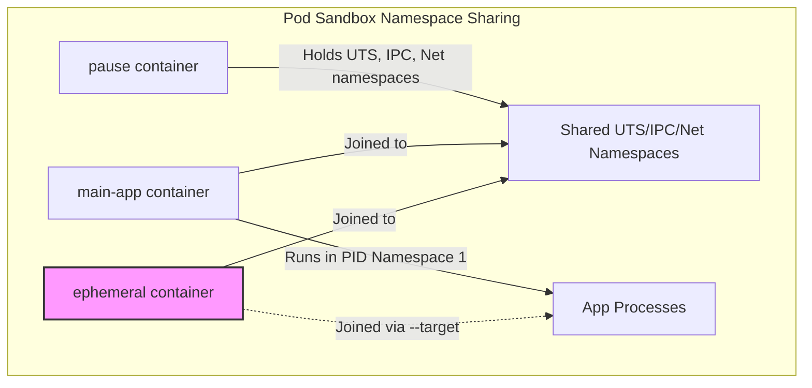

# Module 05: Containers, Runtimes, and Lifecycle Management

This module details how Kubernetes orchestrates, isolates, and manages container workloads. We cover the Open Container Initiative (OCI) image format, the Container Runtime Interface (CRI) execution path, process namespace sharing, advanced isolation via `RuntimeClass`, container hooks, `initContainers`, native `Sidecar` containers, and `ephemeralContainers` for real-time debugging.

---

## 🗺️ Cognitive Map: How to Think About the Flow of Knowledge

To build a strong intuition for this module, think of the topics as a journey from packaging and execution defaults, to host runtime mechanics, advanced security isolation, multi-container layouts, and live troubleshooting:



1. **Step 1: Packaging & Execution (Sections 1 & 5):** We start with the container blueprint. We explore OCI image layers, understand image pull policies, and study how to inject configurations, override entrypoint images, and pass arguments to the container processes.
2. **Step 2: Host Runtime Execution (Sections 2 & 3):** We examine how these blueprints run. We trace the Kubelet-to-CRI request pipeline, learn how the pause container configures the Pod Sandbox namespaces (networking, IPC, hostname), and manage shared process namespaces.
3. **Step 3: Alternate Runtimes (Section 4):** If standard container sandboxing is insufficient, we scale isolation. We configure `RuntimeClass` to route high-security or hardware-exclusive workloads to alternative execution engines like gVisor (kernel-slicing) or Kata Containers (microVMs).
4. **Step 4: Complex Pod Topologies (Sections 6, 7 & 8):** With the runtime configured, we orchestrate startup and lifecycle behavior. We implement sequential setup via Init Containers, mount background utilities via native Sidecars, and invoke PostStart/PreStop hooks to execute custom setup and teardown logic.
5. **Step 5: Live Diagnostics (Section 9):** Finally, we plan for failures. When a container runs in a highly secure, shell-less environment, we inject Ephemeral Containers at runtime to inspect memory, execute debug tools, and run commands inside the target sandbox namespaces.

By following this flow, you progress from **Container Definition (OCI/Args) → Runtime Execution (CRI/Namespaces) → Security Boundaries (RuntimeClass) → Pod Orchestration (Init/Sidecar/Hooks) → Live Diagnostics (Ephemeral)**.

---


## 1. Container Images & Immutable Architecture

At the physical layer of a worker node, a container image is not a single monolith. It is an **Open Container Initiative (OCI)** compliant package composed of two core artifacts:

```
+-------------------------------------------------------------+
| OCI Image Reference                                         |
|                                                             |
|  1. Root Filesystem (Layered Tarballs)                      |
|     [Base OS] -> [App Dependencies] -> [Application Code]   |
|                                                             |
|  2. Execution JSON Config (Metadata Blueprint)               |
|     { ENTRYPOINT, ENV, User, Linux Capabilities, cgroups }  |
+-------------------------------------------------------------+
```

1. **Layered Root Filesystem (Tarballs):** A series of read-only directories containing system binaries, libraries, and application dependencies. The container runtime extracts these onto the worker node's disk and stacks them using an overlay filesystem (e.g., `overlay2`).
2. **Execution JSON Configuration:** A metadata blueprint instructing the container runtime *how* to run the process. It defines the entrypoint command, default environment variables, the system user, required Linux capabilities, and resource limits.

### A. The Golden Rule of Immutability
Containers must remain stateless and immutable:
* **No Live Patching:** Never execute commands (like `apt-get install` or config edits) inside a running container.
* **Code State Changes:** All filesystem changes must be built into a new image version via a CI/CD pipeline, pushed to a registry, and rolled out using a Deployment controller.
* **Consistency Guarantee:** This ensures that if a node crashes and a Pod is recreated on a separate node, the newly started container is byte-for-byte identical to the one that failed.

### B. ImagePullPolicy Mechanics
The `imagePullPolicy` dictates when the `kubelet` queries the external container registry:

| Policy | Behavior | Default Trigger |
| :--- | :--- | :--- |
| `Always` | Queries the registry to resolve the image digest on *every* Pod startup. Pulls layers if the remote digest differs from local cache. | Used if image tag is omitted or set to `:latest`. |
| `IfNotPresent` | Uses the node's cached image layers if they exist. Only pulls from the registry if the image is missing locally. | Used for specific tags (e.g., `nginx:1.21.0`). |
| `Never` | Bypasses the registry entirely. Assumes the image has been pre-loaded onto the node's local storage (e.g., via `kind load` or `ctr images import`). | Must be explicitly configured. |

> [!WARNING]
> Using `:latest` or omitting tags in production forces `Always`, which can bottleneck deployments during registry rate-limiting or network outages. Use cryptographic digests (`image: app@sha256:...`) to guarantee absolute immutability and eliminate tag-drift across nodes.

### C. Troubleshooting Image Pull Failures
When a Pod is stuck in `ImagePullBackOff` or `ErrImagePull`, follow this CLI triage path:
1. **Inspect Events:** Check the node's operations at the bottom of `describe`:
   ```bash
   kubectl describe po <pod-name>
   ```
2. **Analyze the Error Message:**
   * `ManifestUnknown` / `NotFound`: The image registry was reached, but the tag or digest is incorrect (typo in the manifest).
   * `Unauthorized` / `Forbidden`: The registry requires authentication, and either the `imagePullSecrets` are missing or the credentials inside the Secret are invalid.
   * `dial tcp: i/o timeout` / `lookup registry.domain.com: no such host`: The worker node has lost outbound network access or cannot resolve external DNS. Verify node DNS setup (see [Module 03: Node Mechanics & Resource Limits](03_node_mechanics_and_resource_limits.md#b-conditions)).

---

## 2. Container Runtime Interface (CRI) & Namespaces

### A. The Evolution of Container Runtimes
In the early days of Kubernetes, Docker was the only container runtime supported. Because Docker was built as a full developer platform before Kubernetes existed, it contained many tools that Kubernetes did not need (Docker CLI, API endpoints, build tools, volumes, etc.). To support alternative runtimes, the Kubernetes community established the **Container Runtime Interface (CRI)**.

The CRI standardizes how Kubernetes interacts with runtimes that comply with the **Open Container Initiative (OCI)** standards:
1. **OCI Image Specification:** Dictates how container image layers are packaged.
2. **OCI Runtime Specification:** Dictates how containers are run (executing kernel-level namespaces/cgroups).

```
+--------------------------------------------------------------+
| Decoupling History: Dockershim Removal                       |
|                                                              |
| Legacy (v1.23 & older):                                      |
| [Kubelet] -> [Dockershim (bridge)] -> [Docker Daemon]        |
|                                                              |
| Modern (v1.24+):                                             |
| [Kubelet] --(gRPC/CRI)--> [containerd Socket] -> [runc]      |
|                                                              |
| Modern with Docker:                                          |
| [Kubelet] --(gRPC/CRI)--> [cri-dockerd Socket] -> [Docker]   |
+--------------------------------------------------------------+
```

* **The Dockershim Bridge:** Since Docker did not natively implement CRI, the Kubernetes control plane maintained an adapter called **Dockershim** to bridge the gap.
* **Removal in v1.24:** Maintaining Dockershim in core Kubernetes was deprecated and officially removed in v1.24. This decoupled the Kubelet from Docker, removing the Dockershim code from core Kubernetes. This shifted operations directly to native CRI-compatible runtimes like **containerd** or **CRI-O**.
* **Legacy Compatibility (cri-dockerd):** If you still need to run Docker containers in Kubernetes v1.24+, you must use `cri-dockerd`, a standalone service that acts as a CRI adapter. It exposes a CRI-compliant socket (`unix:///var/run/cri-dockerd.sock`) and forwards commands to the Docker Daemon socket (`unix:///var/run/docker.sock`).

### B. Comparison of Runtime CLI Tools
For the CKA exam, you must distinguish between the different CLI tools used to interact with container runtimes on a worker node:

| CLI Tool | Community Developer | Purpose | Scope / Features | Typical Commands |
| :--- | :--- | :--- | :--- | :--- |
| **`ctr`** | containerd Community | Low-level containerd debugging | Bundled with containerd. Minimal features. Not user friendly. | `ctr images pull docker.io/library/redis:alpine`<br>`ctr run docker.io/library/redis:alpine redis` |
| **`nerdctl`** | containerd Community | General-purpose ContainerD CLI | Docker-compatible syntax. Adds advanced containerd features (encrypted images, lazy image pulling via eStargz, P2P distribution, image signing). | `nerdctl run --name redis redis:alpine`<br>`nerdctl run --name webserver -p 80:80 -d nginx` |
| **`crictl`** | Kubernetes Community | CRI troubleshooting and debugging | CRI-compliant, works across runtimes (containerd, CRI-O). Supports listing Pods. **Warning:** Containers created with `crictl` are not registered as Pods in the API server and will be deleted by the Kubelet. | `crictl pull busybox`<br>`crictl images`<br>`crictl ps -a`<br>`crictl pods` |

### C. The Kubelet-CRI Communication Path
The `kubelet` acts as a cluster agent and does not know how to run containers itself; it communicates over a local UNIX socket using gRPC to the CRI implementation.

#### Historical Socket Polling Order:
In older versions of Kubernetes, if the runtime socket was not explicitly set, the Kubelet fell back to checking socket paths in the following priority order:
1. `unix:///var/run/dockershim.sock` (Dockershim)
2. `unix:///run/containerd/containerd.sock` (containerd)
3. `unix:///run/crio/crio.sock` (CRI-O)
4. `unix:///var/run/cri-dockerd.sock` (cri-dockerd)

#### Modern (v1.24+) Socket Requirements:
With the removal of Dockershim in v1.24, `dockershim.sock` is no longer supported. Users are required to explicitly configure the socket path in:
1. **Kubelet startup flags:** Set `--container-runtime=remote` and `--container-runtime-endpoint=unix:///run/containerd/containerd.sock` (or `/run/crio/crio.sock` / `/var/run/cri-dockerd.sock`).
2. **`crictl` configuration:** Configure `crictl` explicitly using the command line flag or environment variables:
   ```bash
   # Set endpoint via flag
   crictl --runtime-endpoint unix:///run/containerd/containerd.sock ps
   
   # Set endpoint persistently for the session
   export CONTAINER_RUNTIME_ENDPOINT=unix:///run/containerd/containerd.sock
   ```

> [!TIP]
> **Troubleshooting: The Container Runtime Upgrade Trap**
> If you upgrade containerd on a live node using a package manager (e.g., `apt upgrade containerd` or `yum update containerd`), the underlying gRPC socket might restart or change its connection parameters. In some cases, the Kubelet will fail its internal gRPC re-dial attempts and show connection errors. 
> To resolve this, perform a hard restart of the Kubelet service after the runtime upgrade:
> `systemctl restart kubelet`

### D. The Dual-Service CRI Architecture
The CRI specification exposes two distinct gRPC service endpoints over the same UNIX socket:

```
                  +-----------------------------------+
                  |              Kubelet              |
                  +-----------------------------------+
                                    |
                           gRPC / UNIX Socket
                                    v
                  +-----------------------------------+
                  |     Container Runtime (CRI)       |
                  |  (e.g., containerd, CRI-O daemon) |
                  +-------------------+---------------+
                                      |
                     +----------------+----------------+
                     |                                 |
                     v                                 v
        +-------------------------+       +-------------------------+
        |      ImageService       |       |     RuntimeService      |
        |  - PullImage            |       |  - RunPodSandbox        |
        |  - ListImages           |       |  - CreateContainer      |
        |  - RemoveImage          |       |  - StartContainer       |
        +-------------------------+       +-------------------------+
```

* **ImageService:** Manages image actions (pulling, querying, cleaning disk space).
* **RuntimeService:** Manages execution mechanics (sandbox allocation, container lifecycle, network/IPC initialization, direct `exec` commands).

### E. High-Level vs. Low-Level Runtimes
Kubernetes splits runtime duties into two layers:
1. **High-Level Runtime (CRI Daemon - e.g., `containerd`, `CRI-O`):** Runs continuously as a background systemd service. It receives gRPC calls from the `kubelet`, resolves storage layers, interacts with CNI networking, and configures the execution environment.
2. **Low-Level Runtime (OCI Executor - e.g., `runc`, `crun`):** A transient binary invoked by the high-level runtime. It interfaces directly with the Linux kernel to create namespaces (`namespaces`), resource limits (`cgroups`), mounts the root directory (`pivot_root`), starts the container's PID 1 process, and then immediately exits.

### F. Zero-Downtime Node Upgrades: The `containerd-shim`
If the low-level `runc` exits immediately after starting the container, how are containers monitored?
For each container, the high-level runtime spawns a **`containerd-shim`** process:

```
[systemd]
   L kubelet
   L containerd (CRI Daemon)
        L containerd-shim (PID: 1042) ---> Monitors Application PID: 1043 (in namespaces)
```

* **Process Parenting:** The shim becomes the host-level parent process of the container's application process.
* **Log & I/O Tracking:** It keeps stdout/stderr streams open and reports exit codes back to `containerd`.
* **Zero-Downtime Daemon Restarts:** Because the shim acts as an intermediary, you can restart or upgrade the main `containerd` daemon on a worker node without disrupting running application containers. The shims keep running, and `containerd` reconnects to them once it comes back online.

### G. The Pod Sandbox & The `pause` Container
A Pod represents a collection of processes sharing the same logical host environment. To achieve this, the CRI uses a **Sandbox** backed by the `pause` container:



1. **Sandbox Allocation:** Before starting your application container, Kubelet instructs the CRI to run `RunPodSandbox`. The runtime pulls a tiny image (typically `registry.k8s.io/pause`) and starts the `pause` process.
2. **Kernel Namespace Locking:** The `pause` container executes a minimal C program calling the `pause()` system call, which puts it to sleep indefinitely. Its sole purpose is to initialize and hold open:
   * **Network Namespace (`net`):** Allocates the Pod IP and port space.
   * **IPC Namespace (`ipc`):** Enables System V IPC / POSIX message queues.
   * **UTS Namespace (`uts`):** Sets the Pod hostname.
3. **Application Container Injection:** When the actual application containers start, the runtime inserts them into the namespaces held open by the `pause` container (using the `setns` system call).
* **Result:** Application containers share the same network stack and hostnames, allowing them to communicate via `localhost` and share storage volumes. They remain isolated in their cgroup limits and Mount/PID namespaces (unless PID namespace sharing is explicitly enabled).

### H. Low-Level Node Debugging with `crictl`
If a node's `kubelet` is failing, or if the API Server is completely unreachable, you must bypass `kubectl` and inspect the node's container runtime directly using `crictl`.

> [!IMPORTANT]
> `crictl` is designed for node-level troubleshooting. Never use it to create or modify containers in a healthy cluster, as it bypasses the API Server and will cause state desynchronization with `etcd`.

#### Configuration File: `/etc/crictl.yaml`
`crictl` requires configuration to bind to the runtime socket:
```yaml
runtime-endpoint: unix:///run/containerd/containerd.sock
image-endpoint: unix:///run/containerd/containerd.sock
timeout: 2
debug: false
```

#### Vital CKA troubleshooting commands:
```bash
# Check runtime version and connection health
crictl info

# List all active Pod sandboxes (checks if kubelet is reaching the socket)
crictl pods

# List all running containers on the host node
crictl ps

# Inspect logs of a specific container directly from disk
crictl logs <container-id>

# Run a command with an explicit runtime socket (bypasses default config)
crictl --runtime-endpoint unix:///run/containerd/containerd.sock ps
```

---

## 3. Container Environment & Service Links

When a container process is executed, the `kubelet` injects state context into the environment.

### A. Environment Injection Contexts
Containers receive environmental data through three vectors:
1. **Layered Filesystem & Volumes:** Extracted images merged with Kubernetes volume mounts (like ConfigMaps or Secrets).
2. **Downward API:** Exposes Pod-level metadata (such as Pod Name, Namespace, IP address, Node Name, or resource limits) to the process as environment variables or projected volumes.
3. **Legacy Service Links:** Legacy cluster discovery mechanism. Kubelet injects environment variables for *every* Service active in the namespace at the time the Pod was scheduled.

### B. Service Links Bloat (Environment Exhaustion)
By default, Kubernetes configures `enableServiceLinks: true` in the Pod spec. In large namespaces containing hundreds of Services, this injects a massive matrix of environment variables (e.g., `<SVC_NAME>_SERVICE_HOST`, `<SVC_NAME>_SERVICE_PORT`) into the container.

* **The Problem:** This behavior causes environmental bloat, increases process memory overhead, and can crash applications that use strict environment parsing.
* **The Solution (CKA Best Practice):** Disable this behavior by setting `enableServiceLinks: false` in the Pod specification, relying entirely on CoreDNS for service resolution.

```yaml
apiVersion: v1
kind: Pod
metadata:
  name: modern-app
spec:
  enableServiceLinks: false  # Disable legacy environment variable injection
  containers:
  - name: web
    image: nginx:1.21.0
```

* **Validation Command:** Inspect the container's environment variables to verify:
  ```bash
  kubectl exec modern-app -- env
  ```

---

## 4. RuntimeClass & Workload Isolation

By default, all containers on a node run using standard `runc`, sharing the host operating system's kernel. For multi-tenant clusters or untrusted workloads, you must establish stronger isolation barriers.

### A. Advanced Isolation Types
* **gVisor (`runsc`):** An application kernel written in Go. It intercepts container system calls in user-space, preventing direct communication with the host Linux kernel.
* **Kata Containers (`kata`):** Runs each Pod inside a dedicated, hardware-virtualized lightweight Virtual Machine (MicroVM) with its own guest kernel.

### B. The RuntimeClass Handshake
To implement isolation, you map a cluster-scoped `RuntimeClass` object to the CRI daemon configurations:

```
[ Pod Spec: runtimeClassName: gvisor ]
             |
             v
[ RuntimeClass Object: handler: runsc ]
             |  (Kubelet reads handler)
             v
[ containerd Socket: RunPodSandbox(handler="runsc") ]
             |  (containerd matches runsc in config.toml)
             v
[ Executed Binary: /usr/local/bin/runsc (gVisor) ]
```

#### Step 1: Cluster-level configuration (Admin)
Create the `RuntimeClass` mapping. The `handler` must match the configuration key in the CRI config (e.g., `/etc/containerd/config.toml` under `plugins."io.containerd.grpc.v1.cri".containerd.runtimes`):
```yaml
apiVersion: node.k8s.io/v1
kind: RuntimeClass
metadata:
  name: gvisor
handler: runsc  # Must match the CRI daemon configuration key exactly
```

#### Step 2: Pod Application (Developer)
Assign the workload to the RuntimeClass:
```yaml
apiVersion: v1
kind: Pod
metadata:
  name: secure-app
spec:
  runtimeClassName: gvisor  # Binds the Pod to the RuntimeClass
  containers:
  - name: worker
    image: alpine
    command: ["sleep", "3600"]
```

### C. Advanced Scheduling & Topology Constraints
Nodes with specialized execution environments (like Kata Virtualization) must have compatible hardware (e.g., VT-x enabled). If the scheduler places a Kata Pod on an incompatible node, the container will crash.

To prevent this, you can configure the `scheduling` block directly inside the `RuntimeClass` resource. The admission controller automatically injects these constraints into the Pod manifest upon creation:

```yaml
apiVersion: node.k8s.io/v1
kind: RuntimeClass
metadata:
  name: kata-vm
handler: kata
scheduling:
  nodeSelector:
    runtime-hardware: kata-capable
  tolerations:
  - key: "isolation"
    operator: "Equal"
    value: "untrusted"
    effect: "NoSchedule"
```

### D. Accounting for the Isolation Tax: Pod Overhead
Logical namespaces consume almost zero resources. In contrast, booting a guest MicroVM (Kata) or running a user-space kernel (gVisor) incurs a fixed CPU and memory cost just to execute the runtime engine.

If the scheduler is unaware of this isolation tax, it will overcommit resources, leading to node memory exhaustion and Kubelet evictions. To prevent this, configure `overhead` to inform the scheduler:

```yaml
apiVersion: node.k8s.io/v1
kind: RuntimeClass
metadata:
  name: kata-vm
handler: kata
overhead:
  podFixed:
    cpu: "250m"      # 0.25 vCPU reserved for the MicroVM guest kernel
    memory: "150Mi"  # 150 Megabytes reserved for VM hypervisor overhead
```

#### Resource Math Formulas:
* **Node Scheduling Calculations:** 
  $$\text{Total Required} = \sum(\text{Container Resource Requests}) + \text{RuntimeClass podFixed Overhead}$$
* **Resource Quota Calculations:** The `podFixed` overhead is subtracted from the Namespace's remaining resource quota, ensuring isolation costs are billed to the tenant's namespace limit.
* **Cgroup Boundaries:** The `kubelet` adds the overhead limits directly to the top-level Pod sandbox parent cgroup (`pod<UID>.slice`).

---

## 5. Container Lifecycle Hooks & Graceful Shutdowns

Lifecycle hooks connect the container orchestrator (`kubelet`) to the application process, enabling custom setup or shutdown logic.

### A. Lifecycle Hook Handlers
* **`exec`:** Runs a specific command inside the container namespaces. The resources consumed by this process count directly against the container's `resources.limits`.
* **`httpGet`:** The `kubelet` daemon sends an HTTP request from the host network directly to the container's IP address and port.
* **`sleep`:** Pauses the lifecycle transition for a fixed time duration.

### B. PostStart Hook Mechanics
* **Execution Flow:** Runs concurrently and asynchronously with the container's main `ENTRYPOINT`.
* **Race Condition:** There is no guarantee the `PostStart` hook completes before the application starts. If you require sequential startup constraints, use `initContainers` instead.
* **API State Impact:** The Pod remains in `ContainerCreating` status until the hook returns successfully (exit code 0 or HTTP 2xx/3xx).
* **Failure State:** If the hook fails or times out, the `kubelet` terminates the container and subjects it to the Pod's `restartPolicy`.

```yaml
spec:
  containers:
  - name: nginx
    image: nginx
    lifecycle:
      postStart:
        exec:
          command: ["/bin/sh", "-c", "echo 'Application Init' > /usr/share/nginx/html/status.html"]
```

### C. PreStop Hook & The Graceful Shutdown Sequence
This is critical for zero-downtime operations. When a Pod is marked for deletion (e.g., during a node drain or Deployment upgrade), the `kubelet` executes a synchronous sequence:

```
[Pod Deletion Signal]
         |
         +--> [1. Endpoints Controller] ---> Instantly removes Pod IP from Service Endpoints
         |                                   (Stops new ingress network traffic routing)
         |
         +--> [2. PreStop Hook] ------------> Kubelet executes PreStop (Blocks SIGTERM)
         |                                   (Allows active connections to drain)
         |
         +--> [3. SIGTERM Signal] ----------> Kubelet sends SIGTERM (15) to PID 1 inside container
         |                                   (Triggers app internal shutdown procedures)
         |
         +--> [4. Grace Period Timer] ------> Counts down from terminationGracePeriodSeconds (starts at step 1)
         |
         +--> [5. SIGKILL Signal] ----------> If timer hits 0 and app is still running, Kubelet sends SIGKILL (9)
```

#### Detailed Timeline:
1. **Endpoint Removal:** The control plane removes the Pod IP from all matching Service Endpoint resources. Client traffic stops routing to this Pod.
2. **PreStop Hook Execution:** Kubelet runs the `PreStop` hook (if configured) inside the container. This blocks the execution path, keeping the container active.
3. **SIGTERM Transmission:** Once the hook exits, Kubelet sends the `SIGTERM` (15) signal to PID 1 of the container.
4. **Grace Period Expiry:** The `terminationGracePeriodSeconds` timer (default: 30s) starts running at the beginning of the deletion sequence (Step 1).
5. **SIGKILL Action:** If the process is still active when the timer hits zero, Kubelet sends `SIGKILL` (9) to terminate the process at the kernel level.

> [!TIP]
> If a PreStop hook needs 40 seconds to drain connections, but `terminationGracePeriodSeconds` is set to 30, the Kubelet will kill the hook and application midway. Always set `terminationGracePeriodSeconds` to exceed the sum of your PreStop hook runtime and application shutdown duration.

### D. Debugging Lifecycle Hooks: Redirecting the "Invisible Logs"
Standard Kubernetes logs (`kubectl logs`) only capture streams written to the main process's stdout and stderr. They **do not** capture lifecycle hook output, which can make debugging failures difficult.

* **Symptoms of failure:** The Pod is stuck in `ContainerCreating` or crash-looping with no output in `kubectl logs`.
* **Verification:** Run `kubectl describe po <pod-name>` and look at the bottom events for `FailedPostStartHook` or `FailedPreStopHook`.
* **Redirection Workaround:** Redirect stdout and stderr from your hook command to the file descriptor of the container's PID 1 process (which maps directly to `kubectl logs`):
  ```yaml
  lifecycle:
    postStart:
      exec:
        command: ["/bin/sh", "-c", "echo 'Hook started' > /proc/1/fd/1"]
  ```

---

## 6. Init Containers

Init Containers are specialized containers that run to completion before the main application containers boot.

```
+-------------------------------------------------------+
| Pod Initialization Sequence                           |
|                                                       |
|   [Pod Sandbox Init]                                  |
|         |                                             |
|         v                                             |
|   [Init Container 1]  (Runs to completion, exits 0)   |
|         |                                             |
|         v                                             |
|   [Init Container 2]  (Runs to completion, exits 0)   |
|         |                                             |
|         v                                             |
|   [App Container 1] & [App Container 2] (Start)       |
+-------------------------------------------------------+
```

### A. Core Execution Rules
* **Sequential Execution:** Init containers execute one after another in the order they are defined in the `initContainers` array.
* **Blocking Sequence:** Init container 1 must exit with code 0 before Init container 2 begins execution.
* **App Container Block:** The main application containers will not start until *all* Init containers have successfully completed.
* **Shared Environment:** Because the Pod sandbox is already established, Init containers share the network namespace, IP address, and storage volumes with the main application containers.

### B. CKA Use Cases
* **Tool Separation (Minimal Images):** Avoid installing diagnostic utilities (`curl`, `git`, database client binaries) in the main production image. Run these utilities inside a secure Init container to fetch configuration, run migrations, or check prerequisites, saving the output to a shared `emptyDir` volume.
* **Privileged System Configuration:** Run tasks that require host-level kernel adjustments (e.g., adjusting `sysctl -w net.core.somaxconn=1024`) inside a privileged Init container, while keeping the main application container unprivileged.

### C. Resource Math Calculations (The "Max" Rule)
How does the scheduler calculate a Pod's resource requirements when it contains sequential Init containers?

* **The Rule:** Since Init containers run sequentially and terminate before the main containers start, they do not consume resources concurrently with the application.
* **Resource Calculation Formula:** The scheduler calculates the Pod's effective resource requests and limits by taking the higher value of:
  * The sum of all application container resource allocations.
  * The single highest resource allocation requested by any Init container.

$$\text{Effective Request} = \max\left( \max(\text{Init Requests}), \sum(\text{App Requests}) \right)$$

#### Resource Calculation Example:
```
Init Container 1:  500Mi Memory
Init Container 2:  2Gi Memory  <--- (Max Init Request)
App Container A:   250Mi Memory
App Container B:   250Mi Memory
                   -----------
Sum of Apps:       500Mi Memory
```
* **Scheduling Requirement:** The scheduler will search for a node with at least **2Gi** of available memory, even though the final running application containers will only consume **500Mi**.

### D. Troubleshooting Init Failures
If an Init container fails, the Pod's status displays `Init:Error` or `Init:CrashLoopBackOff`:
* **State Interrogation:** Look at the events to see which init container is failing:
  ```bash
  kubectl describe po <pod-name>
  ```
* **Check Logs:** Standard log commands fail when the app containers aren't running. You must target the specific init container:
  ```bash
  kubectl logs <pod-name> -c <init-container-name>
  ```

---

## 7. Native Sidecar Containers (v1.29+)

Before Kubernetes v1.29, sidecars (like logging agents or service mesh proxies) were defined alongside application containers. This caused issues: the application could boot before the proxy was ready, leading to failed external requests, or the sidecar could keep running after the application exited, preventing Jobs from terminating.

The **Native Sidecar** feature addresses these issues by using the standard initialization sequence.

### A. Defining a Native Sidecar
A native sidecar is defined inside the `initContainers` array with its `restartPolicy` set to `Always`:

```yaml
spec:
  initContainers:
  - name: mesh-proxy
    image: envoyproxy/envoy
    restartPolicy: Always  # Configures this container as a native sidecar
    startupProbe:
      httpGet:
        path: /ready
        port: 15021
```

### B. The Modified Boot Sequence
1. **Startup Action:** Kubelet starts the native sidecar container.
2. **Readiness Verification:** Kubelet blocks the startup sequence and waits for the sidecar's startup or readiness probe to succeed.
3. **Sequence Continuation:** Once the sidecar is marked ready, Kubelet immediately starts the next init container (or the main application containers).
* **Result:** The sidecar continues running in the background. This ensures that infrastructure services (such as network proxies or secret managers) are fully operational before the application starts up.

### C. The Graceful Teardown Sequence
During Pod termination, native sidecars reverse the startup order to maintain service availability during shutdown:
1. **Application Stop:** Kubelet sends a `SIGTERM` signal to the main application containers. The sidecars continue running to route traffic or flush logs.
2. **Sidecar Stop:** Once the main application containers have terminated, Kubelet sends `SIGTERM` to the sidecars.
3. **Reverse Order:** If multiple native sidecars are defined, Kubelet terminates them in the reverse order of their definition in the `initContainers` array.

### D. Sidecar Resource Math
Because native sidecars run concurrently with the main application containers, the scheduler updates its resource calculation formula:

$$\text{Effective Request} = \sum(\text{App Requests}) + \sum(\text{Sidecar Requests}) + \max(\text{Standard Init Requests})$$

---

## 8. Ephemeral Containers for Debugging

Secure, minimal container images (like distroless or lightweight Alpine builds) often omit troubleshooting binaries like `bash`, `curl`, `ip`, or `netstat`.

```yaml
# A secure, minimal container image contains no shell binaries
# Running `kubectl exec -it app-pod -- /bin/sh` will fail
```

Because Pod specifications are immutable once scheduled, you cannot add debugging containers directly to the manifest. **Ephemeral Containers** address this by using a dedicated API subresource.

### A. The `/ephemeralcontainers` API Subresource
Ephemeral Containers are injected into an existing Pod's sandbox dynamically via the `/ephemeralcontainers` subresource. They run without resource guarantees, do not support readiness/liveness probes, and are not restarted by the `kubelet` if they exit.

### B. Process Namespace Sharing
By default, containers share the network and IPC namespaces but run in isolated Process ID (PID) namespaces. Running `ps aux` inside one container will not show processes running in others.

To debug application processes, you can configure target container targeting. The ephemeral container joins the target container's PID namespace, allowing you to run diagnostic tools like `strace` or `gdb` directly on the application's memory space:



### C. Troubleshooting Workflows
You can inject ephemeral containers using `kubectl debug`.

#### Scenario 1: Interrogating processes inside a running Pod
Use the `--target` flag to join the process namespace of the target container:
```bash
kubectl debug -it <pod-name> --image=busybox:1.28 --target=<application-container-name>
```

#### Scenario 2: Debugging a Pod that crashes on startup
If a Pod is stuck in a crash loop, you cannot attach an ephemeral container because the Pod is not running. In this case, use `--copy-to` to clone the Pod and override its entrypoint command to keep the container active for debugging:
```bash
kubectl debug <crashing-pod-name> -it \
  --copy-to=debug-clone-pod \
  --container=<failing-container-name> \
  -- sh
```
* **Under the hood:** This command clones the Pod specification, removes labels to isolate it from Service traffic, and overrides the entrypoint command with a shell (`sh`) to keep the container running.

---

## 🛠️ Practical Proof of Concept (PoC) using `kind`

We will create a local cluster to demonstrate and verify container lifecycle hooks, environment service link settings, sequential init containers, native sidecars, and ephemeral container debugging.

### Step-by-Step Guided Steps

#### 1. Setup the Local Kind Cluster
Re-use an existing configuration or provision a clean multi-node cluster:
```bash
kind create cluster --name cka-containers-poc --config - <<EOF
apiVersion: kind.x-k8s.io/v1alpha4
kind: Cluster
nodes:
- role: control-plane
- role: worker
EOF
```

#### 2. Verify crictl Configuration on a Worker Node
Access a worker node using docker and inspect its configuration:
```bash
# Log into the worker node's shell
docker exec -it cka-containers-poc-worker bash

# Inside the node, inspect crictl's config and connection
cat /etc/crictl.yaml
crictl info
crictl pods

# Exit the node
exit
```

#### 3. Test Container Environment (Service Links Disabling)
Deploy a Service and two Pods: one with `enableServiceLinks: true` and one with `enableServiceLinks: false`.
Create the manifest:
```yaml
apiVersion: v1
kind: Service
metadata:
  name: target-dummy-service
spec:
  ports:
  - port: 80
    protocol: TCP
    targetPort: 80
  selector:
    app: dummy
---
apiVersion: v1
kind: Pod
metadata:
  name: pod-with-links
spec:
  enableServiceLinks: true
  containers:
  - name: app
    image: busybox:1.28
    command: ["sleep", "3600"]
---
apiVersion: v1
kind: Pod
metadata:
  name: pod-without-links
spec:
  enableServiceLinks: false
  containers:
  - name: app
    image: busybox:1.28
    command: ["sleep", "3600"]
```
Deploy the manifests and check the differences in their environment variables:
```bash
# Apply resources
kubectl apply -f env-links.yaml

# Wait for pods to transition to Running
kubectl wait --for=condition=Ready pod/pod-with-links pod/pod-without-links --timeout=60s

# Query variables inside the pod with links enabled
kubectl exec pod-with-links -- env | grep TARGET_DUMMY

# Query variables inside the pod with links disabled (should return empty)
kubectl exec pod-without-links -- env | grep TARGET_DUMMY
```

#### 4. Test Container Lifecycle Hooks (PostStart Log Redirection & PreStop Hook)
Create a Pod configured to write hook logs to stdout and run a PreStop script:
```yaml
apiVersion: v1
kind: Pod
metadata:
  name: hook-logging-pod
spec:
  terminationGracePeriodSeconds: 15
  containers:
  - name: webserver
    image: nginx:1.21.0
    lifecycle:
      postStart:
        exec:
          command: ["/bin/sh", "-c", "echo '[LIFECYCLE-HOOK] PostStart Hook Completed Successfully' > /proc/1/fd/1"]
      preStop:
        exec:
          command: ["/bin/sh", "-c", "echo '[LIFECYCLE-HOOK] PreStop draining initiated' > /proc/1/fd/1 && sleep 5"]
```
Deploy the Pod and verify:
```bash
# Apply manifest
kubectl apply -f hook-poc.yaml
kubectl wait --for=condition=Ready pod/hook-logging-pod --timeout=60s

# Inspect logs to verify the PostStart message
kubectl logs hook-logging-pod

# Start streaming logs to observe the PreStop hook execution
kubectl logs hook-logging-pod -f &
LOG_PID=$!

# Trigger Pod deletion in a separate process or term
kubectl delete pod hook-logging-pod

# Clean up background process
kill $LOG_PID
```
* **Verify:** You will see `[LIFECYCLE-HOOK] PreStop draining initiated` written to the logs before the container shuts down.

#### 5. Verify Sequential Init Containers & Native Sidecars
Deploy a manifest with standard init containers and a native sidecar:
```yaml
apiVersion: v1
kind: Pod
metadata:
  name: init-sidecar-pod
spec:
  initContainers:
  # Native Sidecar: running in background
  - name: helper-sidecar
    image: busybox:1.28
    restartPolicy: Always
    command: ["sh", "-c", "echo 'Sidecar Running...' > /proc/1/fd/1 && sleep 3600"]
    startupProbe:
      exec:
        command: ["true"]
  # Standard Init Container 1: runs to completion
  - name: init-one
    image: busybox:1.28
    command: ["sh", "-c", "echo 'Running Init Task One...' && sleep 3"]
  # Standard Init Container 2: runs to completion
  - name: init-two
    image: busybox:1.28
    command: ["sh", "-c", "echo 'Running Init Task Two...' && sleep 3"]
  containers:
  - name: main-app
    image: nginx:1.21.0
```
Deploy and monitor:
```bash
# Apply manifest
kubectl apply -f init-poc.yaml

# Watch the startup transitions
kubectl get pods init-sidecar-pod -w
```
* **Expected Output:**
  ```
  init-sidecar-pod   0/1     Init:0/2
  init-sidecar-pod   0/1     Init:1/2
  init-sidecar-pod   0/1     PodInitializing
  init-sidecar-pod   1/1     Running
  ```
* **Verify Logs:**
  ```bash
  kubectl logs init-sidecar-pod -c helper-sidecar
  kubectl logs init-sidecar-pod -c init-one
  kubectl logs init-sidecar-pod -c init-two
  ```

#### 6. Debug via Ephemeral Containers
Target process namespacing using an ephemeral container:
```bash
# Inject a busybox debugging container sharing the main-app PID namespace
kubectl debug -it init-sidecar-pod --image=busybox:1.28 --target=main-app

# Inside the ephemeral container shell, query the process tree
ps aux
# Verify you can see Nginx processes running in the 'main-app' container

# Exit the container shell
exit
```

#### 7. Clean up Resources
Clean up the testing resources:
```bash
kubectl delete svc target-dummy-service
kubectl delete pod pod-with-links pod-without-links init-sidecar-pod --ignore-not-found
rm env-links.yaml hook-poc.yaml init-poc.yaml
kind delete cluster --name cka-containers-poc
```

---

## 🔗 Related Modules
- [Module 01: Kube API Server & Kubectl Mechanics](01_kube_api_and_kubectl.md) - Focuses on API Versioning schemes and the `/ephemeralcontainers` subresource pathing.
- [Module 02: Cluster Architecture & Control Plane Components](02_cluster_architecture_and_components.md) - Explains control plane scheduling and Kubelet loops.
- [Module 03: Node Mechanics & Resource Limits](03_node_mechanics_and_resource_limits.md) - Covers Linux `cgroups` structures, `cgroupfs`/`systemd` drivers, and node eviction boundaries.
- [Module 04: Workload Lifecycle & Self-Healing](04_workload_lifecycle_and_healing.md) - Detailing `restartPolicy` backoffs and local container self-healing.
