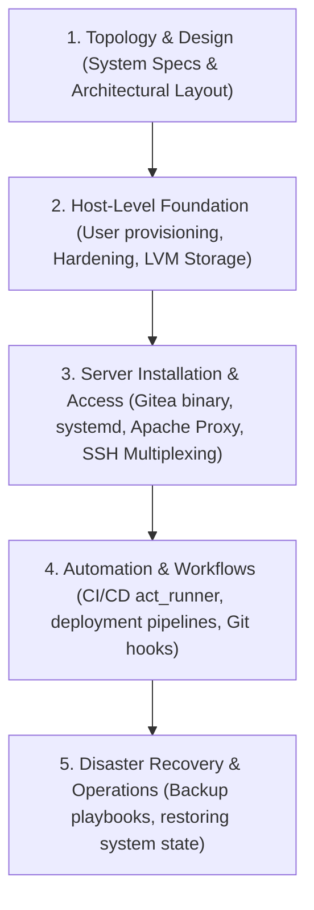
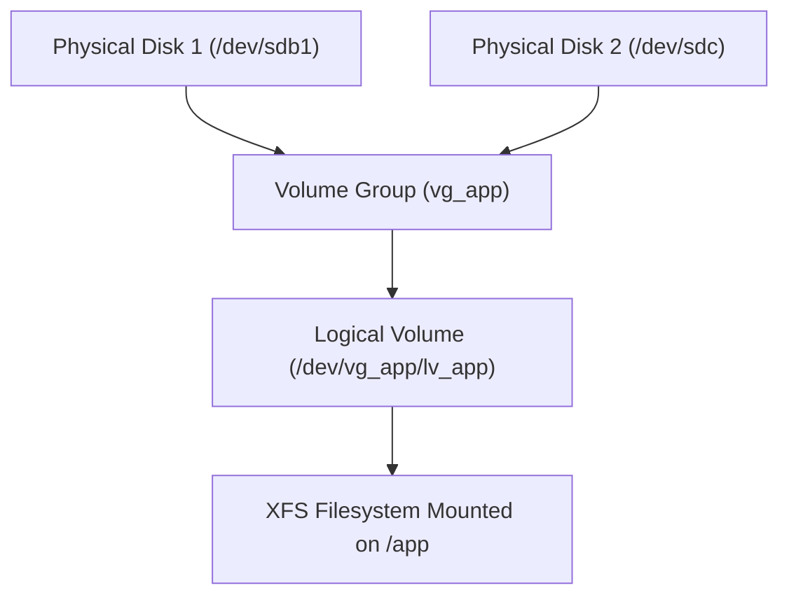
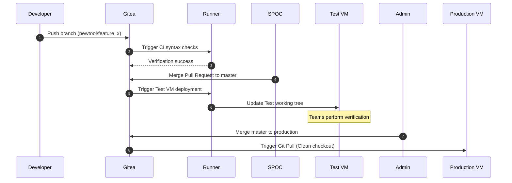

# Gitea Installation, Storage Design, and Workflows on RHEL 8

This reference note provides the system architecture, configuration standards, and deployment playbooks for hosting Gitea on an air-gapped Red Hat Enterprise Linux (RHEL) 8 server. It details system hardening, multi-tenant database integration, LVM storage routing, SSH multiplexing, air-gapped CI/CD runner workflows, server-side Git hooks, and disaster recovery strategies.

---

## 🗺️ Cognitive Map: How to Think About the Flow of Knowledge

To build a strong intuition for this system engineering module, think of the topics as progressing from macro architectural planning to local host configuration, application setup, and operational runbooks:



1. **Step 1: Topology & Design (Section 1):** We start with the high-level plan. We examine the hardware specifications, network parameters, and Active-Passive HA topology for hosting Gitea in an air-gapped RHEL 8 environment.
2. **Step 2: Host-Level Foundation (Sections 2 & 3):** We construct the operating system environment. We create the dedicated unprivileged `git` user, harden file permissions, and build logical volume management (LVM) partitions to host repository blocks.
3. **Step 3: Server Installation & Access (Sections 4 & 5):** We bring the service online. We deploy the Gitea binary, register it as a systemd daemon, route web traffic through an Apache reverse proxy, and implement port-sharing SSH multiplexing.
4. **Step 4: Automation & Workflows (Sections 6 & 7):** With the platform accessible, we configure development pipelines. We set up native host-level `act_runner` agents, implement air-gapped deployment workflows, and write server-side Git hooks to block invalid commits.
5. **Step 5: Disaster Recovery & Operations (Section 8):** Finally, we configure backup schedules. We write automated scripts to dump MySQL metadata and Git repositories, and document recovery steps to restore state on a backup VM.

By following this flow, you progress from **Infrastructure Architecture (Topology) → OS Prerequisites (Users & LVM) → Application Deployment (Gitea/Apache) → Development Lifecycle (CI/CD & Hooks) → Business Continuity (Backup/Restore)**.

---


## 1. System Architecture Overview

The production environment consists of an Active-Passive High-Availability (HA) cluster and a dedicated Testing environment managed via Apache VirtualHosts on different ports.

```mermaid
graph TD
    subgraph "Test VM / Backup Host"
        ApacheTest[Apache VirtualHost :444] -->|Proxy| Gitea[:3000]
        Gitea -->|Data Symlink| LVM_sdb[/app/gitea - 400GB LVM]
        Gitea -->|Metadata| MySQL[(MySQL Server)]
        GiteaRunner[act_runner] -->|Polling| Gitea
        GiteaRunner -->|Native Host Shell| TestEnvTree[/app/www/TAT_Test_Env]
    end
    
    subgraph "Main Production VM"
        ApacheProd[Apache VirtualHost :80] --> ProdEnvTree[/app/www/Transport_Toolbox]
    end

    subgraph "Disaster Recovery"
        BackupVM[Backup VM]
    end

    GiteaRunner -->|Deployment Tunnel SSH| ProdEnvTree
    ProdEnvTree -->|Rsync Cron Daily Backup| BackupVM
    style Gitea fill:#f9f,stroke:#333,stroke-width:2px
```

### Infrastructure Specs
* **Operating System:** Red Hat Enterprise Linux (RHEL) 8
* **Host Resources:** 16 vCPUs, 32 GB RAM
* **Virtualization/Container Engine:** Podman (disabled for runner execution in favor of native host execution)
* **High Availability & Failover:** Managed via `keepalived` for Virtual IP (VIP) routing
* **Disaster Recovery:** Active-passive data mirror maintained via an out-of-band `rsync` cron process running daily (24-hour replication gap)

---

## 2. Service Identity & Process Isolation

To adhere to the **Principle of Least Privilege (PoLP)** and prevent potential Remote Code Execution (RCE) vulnerabilities in Gitea from compromising root access on the RHEL host, Gitea must run under a dedicated system account.

### System User Design Choices
* **UID Range:** System accounts in RHEL 8 occupy UIDs below 1000 (typically 201–999). Bypasses standard password aging/expiration security policies.
* **Shell Allocation:** Standard system services (like Apache or MySQL) run with a non-interactive shell (`/sbin/nologin`). However, Gitea developers authenticate via Git-over-SSH, which requires OpenSSH to start a temporary shell session to run Git receive/upload packets. Therefore, the system user must possess a valid shell (`/bin/bash`), which is locked down using OpenSSH authorized keys restrictions.
* **Home Directory:** A home directory (`/home/git`) must be created to store SSH public keys (`~/.ssh/authorized_keys`) and Git configurations (`~/.gitconfig`).

### User Creation Commands
Run as `root` to create the system group and user:

```bash
# Create system account 'git' with home directory and bash shell
sudo useradd -r -m -c "Gitea Version Control" -s /bin/bash git
```

### Verification
Audit the `/etc/passwd` entry to ensure correct allocation:

```bash
grep 'git' /etc/passwd
```

**Expected Output:**
```text
git:x:991:991:Gitea Version Control:/home/git:/bin/bash
```

---

## 3. Filesystem Hierarchy Standard (FHS) & Storage Design

In the Filesystem Hierarchy Standard (FHS), executable binaries reside in `/usr/local/bin` while variable application data resides in `/var/lib`. However, physical disk constraints require a custom layout.

### Storage Partition Layout
* **Root Volume Group (sda2 + sda3):** Spans physical partitions to provide 50GB allocated to the system root `/var` directory.
* **Storage Partition (sdb1):** A dedicated 400GB partition mounted at `/app`.

> [!WARNING]
> Storing repository assets, database files, and transaction logs directly under the standard `/var/lib/gitea` directory risks filling up the root partition. If the root partition reaches 100% capacity, the RHEL kernel will panic and crash.

### Symlink Abstraction Strategy
To resolve the disk capacity limit while maintaining convention-over-configuration, we create the physical directory structure under `/app` and use a Virtual File System (VFS) symbolic link from `/var/lib/gitea` pointing to the large partition.

```text
/var/lib/gitea (VFS Symlink) ──> /app/gitea (Physical LVM Directory)
                                     ├── custom/
                                     ├── data/
                                     └── log/
```

### Storage Setup Commands
```bash
# 1. Create the physical storage directory structure on sdb1
sudo mkdir -p /app/gitea/{custom,data,log}

# 2. Clean up any existing directory in the standard FHS path
sudo rm -rf /var/lib/gitea

# 3. Create the symbolic link (Signpost)
sudo ln -s /app/gitea /var/lib/gitea

# 4. Verify link structure and metadata transparency
ls -ld /var/lib/gitea
```

**Expected Output:**
```text
lrwxrwxrwx. 1 root root 10 Jun  5 02:50 /var/lib/gitea -> /app/gitea
```

### Permission and Traversability Configuration
The OpenSSH daemon and Gitea binary require precise ownership across both the symbolic link and the target directories.

```bash
# Change owner of target directories
sudo chown -R git:git /app/gitea
sudo chmod -R 750 /app/gitea

# Change owner of the symlink file itself (using -h flag to set link metadata)
sudo chown -h git:git /var/lib/gitea
```

#### Directory Traversal (The Execute 'x' Bit)
If the parent directory `/app` is restricted to `root:root` with permissions like `700` (`drwx------`), the kernel will block the `git` user from traversing into `/app/gitea`. The VFS requires the execute (`x`) permission on every parent directory in a path to access a subdirectory.

To resolve this without altering `/app` ownership or exposing its contents to all users, apply a File Access Control List (FACL) to grant the `git` user traversal rights:

```bash
# Grant traversal (execute) permission on the parent folder to the git user
sudo setfacl -m u:git:x /app

# Verify the ACL configuration (+ sign indicates active ACLs)
ls -ld /app
```

> [!TIP]
> To display active ACL permissions on a directory, use the `getfacl` command:
> `getfacl /app`

### Logical Volume Management (LVM) Architecture

To prevent rigid disk partitioning schemes from causing administrative overhead, RHEL 8 utilizes Logical Volume Management (LVM). The storage stack is organized into three abstract layers:

1.  **Physical Volume (PV)**: The raw block device or disk partition (e.g., `/dev/sdb1`, `/dev/sdc`) initialized for LVM use. The storage on a PV is divided into fixed-size blocks called Physical Extents (PEs), typically 4MB by default.
2.  **Volume Group (VG)**: A storage pool constructed by combining one or more Physical Volumes. It aggregates the total PEs of the constituent PVs into a single virtual disk pool (e.g., `vg_app`).
3.  **Logical Volume (LV)**: A virtual partition carved out of a Volume Group's PE pool. It is formatted with a filesystem (such as RHEL 8's default XFS) and mounted at a mount point (e.g., `/app`). Unlike physical partitions, LVs can span multiple disks and be resized online.



#### Step-by-Step CLI Run Sheet: Extending /app Storage on RHEL 8

If the `/app` partition runs out of space (monitored via `df -h /app`), perform an online storage expansion by adding a new disk (e.g., `/dev/sdc`) and extending the LVM structure.

##### Step 1: Identify and Verify the New Block Device
Run `lsblk` to list block devices and locate the newly attached disk (e.g., `/dev/sdc` with 100GB of unpartitioned space).
```bash
lsblk
```

##### Step 2: Initialize the Disk as a Physical Volume
Prepare the disk for LVM by writing LVM metadata to it:
```bash
sudo pvcreate /dev/sdc
```
Verify the creation with `pvs` or `pvdisplay /dev/sdc`.

##### Step 3: Identify the Active Volume Group and Extend It
Determine the name of the Volume Group containing the logical volume mounted on `/app`:
```bash
# Locate the VG mapped to /app
df -h /app
# Example output shows filesystem: /dev/mapper/vg_app-lv_app

# Extend vg_app using the new Physical Volume /dev/sdc
sudo vgextend vg_app /dev/sdc
```
Verify that the Volume Group has free space using `vgs` or `vgdisplay vg_app` (check the "Free PE / Size" field).

##### Step 4: Extend the Logical Volume and Resize the Filesystem
Extend the Logical Volume to consume the newly added space. By using the `-r` flag, the filesystem is resized concurrently with the volume expansion.
```bash
# Extend the LV to consume 100% of the free space in the VG and resize the filesystem
sudo lvextend -r -l +100%FREE /dev/vg_app/lv_app
```
> [!NOTE]
> Under RHEL 8, the `-r` (resize) flag automatically detects the filesystem type. For XFS, it invokes `xfs_growfs /app`. For ext4, it invokes `resize2fs /dev/vg_app/lv_app`.

##### Step 5: Verify the Expansion
Ensure the filesystem reflects the new size and the LVM structures are consistent:
```bash
# Check filesystem size
df -h /app

# Display logical volume details
sudo lvs
```

---

## 4. Database Configuration (SQLite3 vs. MySQL/MariaDB)

### Database Options Critique

| Feature | SQLite3 (Embedded) | MySQL / MariaDB (External Dedicated) |
| :--- | :--- | :--- |
| **Architecture** | Serverless, single-file (`gitea.db`) | Client-Server, TCP loopback or socket |
| **Performance** | Low concurrency, locks database on write | High concurrency, row-level locking |
| **Replication** | Requires file copies, risk of lock corruption | Native Master-Slave replication |
| **Migration Path** | Complex. Requires manual schema conversion | Out-of-box native backup/restore |

> [!IMPORTANT]
> While SQLite3 is simpler for an initial setup, migrating a production database to MySQL later requires dump parsing, syntax adjustments (due to sqlite/mysql data type mismatches), and risks data corruption. Since a multi-tenant MySQL server is already active on the host, using it from the beginning is the recommended production approach.

### Multi-Tenant Database Setup (MySQL)
Log into the local database server as `root` and execute these queries:

```sql
-- 1. Create the database with the correct character set for Unicode and Emojis
CREATE DATABASE gitea CHARACTER SET 'utf8mb4' COLLATE 'utf8mb4_unicode_ci';

-- 2. Create the tenant user and assign a strong password
CREATE USER 'gitea'@'localhost' IDENTIFIED BY 'StrongPassword123!';

-- 3. Grant privileges strictly on the gitea database
GRANT ALL PRIVILEGES ON gitea.* TO 'gitea'@'localhost';

-- 4. Reload security privilege tables
FLUSH PRIVILEGES;

-- 5. Exit database console
EXIT;
```

---

## 5. Binary Installation and Integrity Verification

Since the RHEL server is air-gapped, we must manually download the Gitea binary and its checksum signature on an internet-connected workstation, transfer them, and verify file integrity locally.

### Installation Walkthrough
1. **Download:** Fetch `gitea-1.22.0-linux-amd64` and `gitea-1.22.0-linux-amd64.sha256` from the Gitea download repository.
2. **Transfer:** Move files to `/tmp` on the target VM via secure copy (SCP) or physical storage media.
3. **Verify Integrity:** Calculate the SHA-256 hash to ensure the binary was not corrupted during transit.

```bash
cd /tmp

# Verify signature
sha256sum -c gitea-1.22.0-linux-amd64.sha256
```

**Expected Output:**
```text
gitea-1.22.0-linux-amd64: OK
```

4. **Install to FHS Path:**
Move the executable to `/usr/local/bin` (reserved for manually installed local software) and assign executable permissions:

```bash
# Move and rename to standard binary name
sudo mv /tmp/gitea-1.22.0-linux-amd64 /usr/local/bin/gitea

# Make binary executable
sudo chmod +x /usr/local/bin/gitea

# Execute dry-run version check
/usr/local/bin/gitea --version
```

---

## 6. Systemd Service Configuration & Automation

To automate startup on system boot and enable process recovery, we define a custom Systemd unit file.

### Environment Context
Systemd service processes start in a vacuum, meaning they do not inherit shell environment variables like `$USER` or `$HOME`. We must inject these variables in the `[Service]` section. Without `$HOME`, Git commands invoked by Gitea cannot locate the `.gitconfig` or SSH configurations, causing failures.

### The Systemd Unit File
Create the unit file at `/etc/systemd/system/gitea.service`:

```ini
[Unit]
Description=Gitea (Git with a cup of tea)
After=syslog.target
After=network.target
# Ensure Gitea waits for the database service to start. Update to mariadb.service if using MariaDB.
After=mysqld.service

[Service]
RestartSec=2s
Type=simple
User=git
Group=git
WorkingDirectory=/var/lib/gitea
ExecStart=/usr/local/bin/gitea web --config /etc/gitea/app.ini
Restart=always
Environment=USER=git HOME=/home/git GITEA_WORK_DIR=/var/lib/gitea

[Install]
WantedBy=multi-user.target
```

### Daemon Management Commands
```bash
# Reload Systemd daemon configuration
sudo systemctl daemon-reload

# Enable service to run on system boot
sudo systemctl enable gitea.service

# Start the service immediately
sudo systemctl start gitea.service

# Check service runtime status
sudo systemctl status gitea.service
```

---

## 7. Post-Installation Wizard & Configuration Hardening

### Pre-Configuration Directory Permissions
During the initial web wizard setup, Gitea must write its configuration to `/etc/gitea/app.ini`. Because `/etc` is write-restricted, we must temporarily adjust permissions on `/etc/gitea` to allow the installer wizard to create the file.

```bash
# Create configuration directory
sudo mkdir -p /etc/gitea

# Assign temporary group write permissions
sudo chown root:git /etc/gitea
sudo chmod 770 /etc/gitea
```

### Setup Parameters in the Web UI
Open a browser and navigate to `http://<RHEL_VM_IP>:3000`. Configure the wizard using the following settings:
* **Database Type:** `MySQL`
* **Host:** `127.0.0.1:3306` (Avoid using `localhost` to bypass socket lookup issues)
* **Username:** `gitea`
* **Password:** `StrongPassword123!`
* **Database Name:** `gitea`
* **Run As Username:** `git` (Must match the Systemd user)
* **Server Domain:** `<YOUR_RHEL_VM_IP>`
* **Gitea Base URL:** `http://<YOUR_RHEL_VM_IP>:3000/`

Click **Install Gitea**. The first user registered on the login page will automatically be assigned the Site Administrator role (UID 1).

### Security Lockdown (Production Mode)
Once the setup writes `/etc/gitea/app.ini`, you must immediately lock down the configuration directory to prevent Gitea from modifying its own settings at runtime. This mitigates risks in the event of an application compromise.

```bash
# 1. Lock the directory (Read-only for the git user group)
sudo chmod 750 /etc/gitea

# 2. Lock the configuration file (Read-only for the git user group)
sudo chmod 640 /etc/gitea/app.ini

# 3. Verify permissions
ls -ld /etc/gitea
ls -l /etc/gitea/app.ini
```

**Expected Permissions:**
* `/etc/gitea` -> `drwxr-x--- root git`
* `/etc/gitea/app.ini` -> `-rw-r----- root git`

### CLI Administration Utility
If the web UI is inaccessible or the administrator account needs to be queried, use Gitea’s built-in command-line utility.

```bash
# List all active users and their privilege levels
sudo -u git /usr/local/bin/gitea admin user list --config /etc/gitea/app.ini
```

### Apache Reverse Proxy Configuration

To expose Gitea secure-traffic externally under port `:444` and proxy it to Gitea's internal port `:3000`, we configure an Apache VirtualHost on the backup/test VM. 

Add the following configuration block to your Apache configuration directory (e.g., `/etc/httpd/conf.d/gitea.conf` on RHEL 8):

```apache
<VirtualHost *:444>
    ServerName tat-test-vm.vodafone.local

    # TLS Configuration
    SSLEngine on
    SSLCertificateFile /etc/pki/tls/certs/gitea.crt
    SSLCertificateKeyFile /etc/pki/tls/private/gitea.key

    # Reverse Proxy Directives
    ProxyPreserveHost On
    ProxyRequests Off
    AllowEncodedSlashes NoDecode

    ProxyPass / http://127.0.0.1:3000/ nocanon
    ProxyPassReverse / http://127.0.0.1:3000/
</VirtualHost>
```

#### Rationale for Reverse Proxy Directives

*   **`ProxyPreserveHost On`**: By default, Apache rewrites the `Host` header to match the backend destination (`127.0.0.1:3000`). Enabling this directive forces Apache to pass the client's original HTTP `Host` header to Gitea. This is critical because Gitea uses the incoming `Host` header to dynamically construct URLs (e.g., Git HTTP clone URLs and web links in email notifications) so that they point to the public proxy address, not the internal loopback.
*   **`ProxyPass / http://127.0.0.1:3000/ nocanon`**: Instructs Apache to map all incoming traffic on port 444 to Gitea's backend. The `nocanon` parameter is crucial: it prevents Apache from decoding URL paths before passing them to Gitea. Git API requests and repository references often contain URL-encoded slashes (`%2F`). If Apache decodes these before forwarding, the backend routing fails.
*   **`ProxyPassReverse / http://127.0.0.1:3000/`**: When Gitea responds with a redirect (HTTP 301/302, e.g., redirecting `/` to `/user/login`), it returns a `Location` header pointing to `http://127.0.0.1:3000/...`. `ProxyPassReverse` intercepts this header and rewrites it to match the client's public address (e.g., `https://tat-test-vm.vodafone.local:444/...`), keeping the client session routing through the proxy.
*   **Client Real IP Logging**: When proxying traffic, Gitea's standard logs would record all web requests as originating from the loopback IP (`127.0.0.1`). To log the actual client IP, Apache automatically appends the client's source IP to the `X-Forwarded-For` and `X-Real-IP` HTTP headers.
    
    To instruct Gitea to trust these headers from Apache, add the following parameters under the `[server]` section of `/etc/gitea/app.ini`:
    ```ini
    [server]
    ; Trust reverse proxy headers for logging and rate limiting
    REVERSE_PROXY_LIMIT = 1
    TRUSTED_PROXIES = 127.0.0.1/32
    ```


---

## 8. Git-over-SSH Mechanics & Asymmetric Cryptography

### OpenSSH Multiplexing & Forced Commands
Every Gitea user connects to the server using the single, shared Linux system account: `git` (e.g. `git clone git@<VM_IP>:Vodafone-Tx/tx-core.git`).

```text
Developer Laptop                     RHEL 8 Host (sshd)               Gitea Engine
┌────────────────┐  Public Key Auth  ┌─────────────────┐             ┌────────────┐
│ ssh-keygen     ├──────────────────>│ SSH Connection  │             │ MySQL DB   │
│ Private Key    │                   │ as user 'git'   │             │ Auth Check │
└────────────────┘                   └────────┬────────┘             └─────┬──────┘
                                              │ Intercepted via            │
                                              │ forced command             │
                                              ▼                            │
                                     ┌─────────────────┐                   │
                                     │ gitea serv      │◄──────────────────┘
                                     │ (Executes pack) │
                                     └─────────────────┘
```

When a user adds an SSH key to their Gitea profile, Gitea writes the key to `/home/git/.ssh/authorized_keys` along with an OpenSSH option prefix:

```text
command="/usr/local/bin/gitea serv key-1",no-port-forwarding,no-X11-forwarding ssh-rsa AAAAB3NzaC1yc...
```

* **`command="..."`:** When the SSH Daemon (`sshd`) authenticates the user, it ignores any command requested by the client (such as terminal access or malicious scripts) and executes `/usr/local/bin/gitea serv key-1` instead.
* **Security Isolation:** This forced redirection prevents users from obtaining a terminal shell as the `git` user, restricting them to Git transactions.

### OpenSSH Daemon (sshd) Configuration for Gitea

For Gitea to route Git-over-SSH requests using the single system user account (`git`), the host's OpenSSH daemon (`sshd`) must be configured to allow public-key authentication and direct the daemon to look up Gitea's authorized keys file.

The primary configuration file is `/etc/ssh/sshd_config`. The following parameters must be verified and active:

```ini
# /etc/ssh/sshd_config

# 1. Enable Public Key Authentication (required for key-based login)
PubkeyAuthentication yes

# 2. Path to the authorized_keys file (default path where Gitea appends keys)
AuthorizedKeysFile .ssh/authorized_keys

# 3. Ensure the git user is allowed to connect if user restrictions are enabled
# AllowUsers admin git
```

> [!IMPORTANT]
> If your organization implements sshd hardening that uses `AllowUsers` or `AllowGroups` directives to restrict SSH access, you **must** append the `git` user (or the group `git`) to these lists. Failure to do so will cause the SSH daemon to drop connections from developers attempting to push or pull.

#### SSH Security and Directory Permissions (StrictModes)

The SSH daemon enforces strict security checks on user home directories and SSH key files. If `StrictModes` is set to `yes` in `/etc/ssh/sshd_config` (which is the default on RHEL 8), `sshd` will reject public keys if the directory permissions are too open. Ensure the following permissions are set:

```bash
# 1. Home directory must not be writable by group or others (max 750 or 700)
sudo chmod 750 /home/git

# 2. SSH folder must be exclusive to the git user
sudo chmod 700 /home/git/.ssh

# 3. Authorized keys file must be exclusive and readable/writable only by git
sudo chmod 600 /home/git/.ssh/authorized_keys

# 4. Verify ownership is git:git across the directory structure
sudo chown -R git:git /home/git/.ssh
```

#### SELinux Policy Contexts on RHEL 8

RHEL 8 enforces Security-Enhanced Linux (SELinux) by default. If the SELinux context of the `.ssh` directory is incorrect, `sshd` will be denied access to `/home/git/.ssh/authorized_keys`, resulting in public-key authentication failures.

If files were moved or created manually, restore the standard SSH security context:
```bash
# Recursively apply the correct SELinux file contexts
sudo restorecon -R -v /home/git/.ssh
```
Verify the context using `ls -laZ /home/git/.ssh`. The files should be labeled with the `ssh_home_t` type.

### Developer Key Generation (Windows 11 Client)
Developers should generate elliptic-curve keys (Ed25519) in PowerShell. Ed25519 keys are faster, use smaller key sizes, and offer stronger cryptographic resistance against brute-force attacks compared to legacy RSA keys.

```powershell
# 1. Generate an Ed25519 key pair
ssh-keygen -t ed25519 -C "developer.name@vodafone.local"

# 2. Copy the public key to clipboard (to upload to Gitea Settings)
Get-Content ~/.ssh/id_ed25519.pub | Set-Clipboard
```

---

## 9. CI/CD Runner Architecture (Host Execution)

### The Air-Gap Paradox
By default, Gitea Actions uses Docker/Podman containers to isolate build environments. However, in an air-gapped environment without access to Docker Hub or an offline private container registry, default containerized pipelines will fail.

#### Solution
Configure the Gitea Runner (`act_runner`) to use the **Host Execution Engine**. The runner will run build steps directly inside a native RHEL bash shell on the Test VM, bypassing the container layer.

### Installation and Registration
1. **Download and Transfer:** Download `act_runner-0.3.0-linux-amd64` (Do not download `darwin` versions) and copy it to `/usr/local/bin/act_runner`.

```bash
sudo chmod +x /usr/local/bin/act_runner
```

2. **Register the Runner:** Run the registration setup to establish a connection with the Gitea server.

```bash
sudo act_runner register
```

Enter the parameters during the interactive prompt:
* **Gitea Instance URL:** `http://127.0.0.1:3000/` (Bypass external proxies)
* **Runner Token:** `<ORGANIZATION_LEVEL_ACTIONS_TOKEN>`
* **Runner Name:** `tat-test-vm-runner`
* **Runner Labels (Critical):** `rhel-native:host`

> [!IMPORTANT]
> The label `rhel-native:host` maps the tag `rhel-native` to the `:host` executor. This tells the runner to execute pipeline steps directly on the host shell rather than looking for a container engine.

### Daemonizing the Runner
Create a workspace directory for the runner to clone repositories and manage its cache:

```bash
sudo mkdir -p /opt/act_runner
```

Create `/etc/systemd/system/act_runner.service`:

```ini
[Unit]
Description=Gitea Actions Runner
Documentation=https://gitea.com/gitea/act_runner
After=network.target

[Service]
ExecStart=/usr/local/bin/act_runner daemon
WorkingDirectory=/opt/act_runner
Restart=always
RestartSec=10s

[Install]
WantedBy=multi-user.target
```

### Aligning the Identity File
The interactive registration command creates a `.runner` identity file in the directory where the command was run. You must move this file to the Systemd `WorkingDirectory` so the daemon can read its credentials.

```bash
# Move credentials to the runner workspace
sudo mv /home/admin/.runner /opt/act_runner/

# Start and enable the service
sudo systemctl daemon-reload
sudo systemctl enable --now act_runner.service
```

### Security Implications and Trade-offs of the Native Host Executor (:host)

Choosing between the native host executor (`:host`) and container-isolated executors (such as Docker or Podman) involves a critical trade-off between deployment simplicity in air-gapped systems and host-level security.

| Security Aspect | Container-Isolated Executors (Docker / Podman) | Native Host Executor (`:host`) |
| :--- | :--- | :--- |
| **Process Isolation** | **High**: Steps run in separate kernel namespaces and cgroups. A process cannot inspect host processes. | **None**: Steps run directly on the host system as local OS processes. |
| **Filesystem Persistence** | **Ephemeral**: Container filesystems are destroyed when the job completes, guaranteeing clean workspaces. | **Persistent**: Leftover files, compiled caches, and dependency packages persist, leading to dirty/flaky builds. |
| **Host Privilege Exposure** | **Low**: Processes inside the container cannot access host configuration, private keys, or SSH credentials. | **High**: Commands can read host directories (e.g., `/etc`), access host network interfaces, and hijack server credentials. |
| **Resource Control** | **Managed**: Cgroups enforce limits on container CPU, RAM, and disk utilization. | **Unconstrained**: Runaway scripts can consume 100% of host CPU/memory, resulting in Denial of Service (DoS). |

#### Threat Modeling and Risks of Native Host Shells

Running the CI/CD runner natively introduces significant vulnerabilities if the pipelines run untrusted code:
*   **Remote Code Execution (RCE) Escalation**: If a developer pushes a malicious workflow containing `cat /etc/passwd` or commands to modify system services, the runner will execute them with the privileges of the system account running `act_runner`.
*   **Privilege Escalation**: If the runner service account has passwordless `sudo` rights or can write to system paths, any workflow run can escalate privileges to `root` and fully compromise the host.
*   **Credential Theft**: Build workflows can read ambient configuration files, environment variables, or private SSH keys stored in the runner user's home directory.

#### Mitigating Risks on Native Host Runners

To secure the runner when container execution is not feasible:
1.  **Do Not Run as Root**: Ensure the `act_runner` service runs under a dedicated, unprivileged system user (e.g., `gitea-runner`) rather than `root` or `admin`.
2.  **Restrict Sudo Access**: Never grant the runner user broad `sudo` privileges. If the runner needs to restart a service (e.g., `apache2`), restrict `sudoers` rules to the specific executable:
    ```text
    gitea-runner ALL=(ALL) NOPASSWD: /usr/bin/systemctl restart apache2
    ```
3.  **Implement Systemd Resource Limits**: Prevent resource exhaustion by adding cgroup limits to `/etc/systemd/system/act_runner.service`:
    ```ini
    [Service]
    # Restrict resource usage of runner processes
    CPUQuota=50%
    MemoryLimit=4G
    TasksMax=500
    ```
4.  **Enforce Workspace Isolation**: Set strict file access permissions on the runner's build directory (`/opt/act_runner/`) to prevent other local users from reading secrets or build artifacts.


---

## 10. Enterprise Branch Governance & Git Hooks

To enforce quality gates across teams (e.g. `TxProject` and `TxCapacity`), a Git server-side hook checks code before it is accepted.

### 1. Enable Hooks in `app.ini`
By default, Gitea disables Git hooks in the UI. To enable them, update the `[security]` block in `/etc/gitea/app.ini`:

```ini
[security]
DISABLE_GIT_HOOKS = false
```

Restart Gitea to apply the change:
```bash
sudo systemctl restart gitea.service
```

### 2. Configure the `pre-receive` Hook
Go to **Repository Settings -> Git Hooks -> pre-receive** and paste the following bash script:

```bash
#!/bin/bash

# Loop through all the branches being pushed
while read oldrev newrev refname; do
    
    # We only care about branches, ignore tags
    if [[ $refname != refs/heads/* ]]; then
        continue
    fi
    
    # Extract just the branch name (e.g. refs/heads/bugfix/LLD_Tool -> bugfix/LLD_Tool)
    branch_name=$(basename $refname)
    
    # Allow Gitea's internal squash-and-merge pushes to the master branch
    if [[ "$branch_name" == "master" ]]; then
        continue
    fi
    
    # Validate branch naming conventions (newtool/, bugfix/, update/)
    if [[ ! "$branch_name" =~ ^(newtool/|bugfix/|update/) ]]; then
        echo " "
        echo "=========================================================="
        echo "🚫 FATAL VODAFONE TAT ERROR: Invalid Branch Name! 🚫"
        echo "=========================================================="
        echo "You tried to push a branch named: '$branch_name'"
        echo " "
        echo "RULE: Your branch must start with one of the following:"
        echo "  - newtool/"
        echo "  - bugfix/"
        echo "  - update/"
        echo " "
        echo "EXAMPLE: git checkout -b bugfix/LLD_Tool"
        echo "Please rename your branch locally and try pushing again."
        echo "=========================================================="
        echo " "
        exit 1 # Reject the push
    fi

done

# Allow the push if all validations pass
exit 0
```

---

## 11. Disaster Recovery & Rollback Playbook

The Production Apache environment serves pages out of a "live" Git working tree (`/app/www/Transport_Toolbox`).

### Active-Passive Sync
1. A cron job synchronizes files daily from the Main VM to the Backup VM using `rsync`.
2. The Backup VM runs a matching Apache VirtualHost. In a Disaster Recovery event, `keepalived` redirects IP traffic to the Backup VM.

### Standard Release & Rollback Workflows



#### Production Pull (Deployment Execution)
Do not perform manual merges on the Production VM. If a merge conflict occurs on the host, Git will write conflict markers into the live files, causing the web application to crash.

Run the update on the Production VM as follows:
```bash
# Navigate to the live directory
cd /app/www/Transport_Toolbox

# Fetch upstream changes and pull the verified master branch
git fetch origin
git checkout master
git pull origin master

# Restart system services to apply updates
sudo systemctl restart apache2
```

#### Production Rollback Playbook

##### Scenario A: Standard Application Code Rollback
If a deployment contains bugs but does not crash the host, revert the changes via the Gitea UI:
1. Locate the merged Pull Request in Gitea.
2. Click the **Revert** button.
3. Gitea will generate a revert commit on `master`.
4. Pull the updated `master` branch on the Production VM:
   ```bash
   git pull origin master
   ```

##### Scenario B: Host Recovery (Hard Reset)
If the local repository on the Production VM enters an inconsistent state or contains uncommitted modifications, force it to match Gitea's current state:

```bash
# Fetch latest data from Gitea
git fetch origin

# Obliterate local changes and align head to master
git reset --hard origin/master

# Remove untracked files and directories
git clean -fd
```

---

## 12. Automated System Architecture and Security Audit

To ensure the Gitea installation conforms to all architecture and security guidelines over time, a diagnostics utility is provided in `Reference Notes/scripts/verify_gitea_setup.sh`. This script automates checks for user accounts, storage links, permissions, FACL, Systemd variables, network ports, and SELinux contexts.

### Execution Instructions
The script must be executed with root privileges to check system parameters, file ownership, systemd configuration, and network sockets:

```bash
# Make the script executable
chmod +x "/home/karim/Desktop/CKA/Reference Notes/scripts/verify_gitea_setup.sh"

# Run the audit script
sudo "/home/karim/Desktop/CKA/Reference Notes/scripts/verify_gitea_setup.sh"
```

### Audit Scope
1. **User Identity:** Validates existence of the `git` user, ensuring a system UID (< 1000) and shell access via `/bin/bash` for Git-over-SSH forced commands.
2. **Storage Layout:** Verifies that `/var/lib/gitea` is a symbolic link pointing to the dedicated partition at `/app/gitea` to prevent root partition exhaustion.
3. **Configuration Permissions:** Verifies that `/etc/gitea` is `750` and `/etc/gitea/app.ini` is `640`, both owned by `root:git` to prevent Gitea from writing to its own configs at runtime.
4. **Directory Traversal (FACL):** Ensures that the `git` user possesses the execute (`x`) traversal bit on `/app` through File Access Control Lists.
5. **Systemd Isolation:** Confirms that the `gitea.service` unit file exists, runs under `git:git`, and injects required environment variables (`USER`, `HOME`, `GITEA_WORK_DIR`).
6. **Port/Socket Binding:** Checks if port `3000` is active and bound by the Gitea process.
7. **SELinux Policies:** Inspects SELinux enforcing status and confirms that the binary is labeled `bin_t`/`usr_t` and the storage path is labeled `var_lib_t`.

