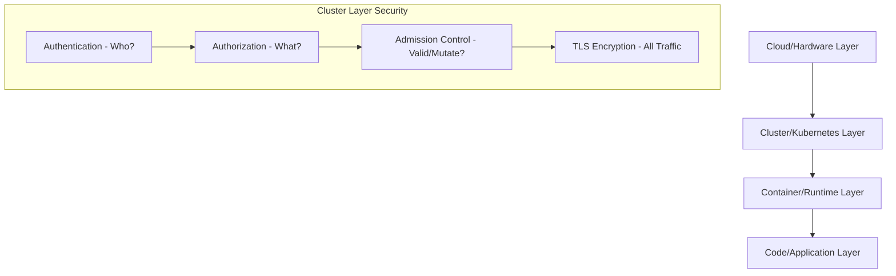
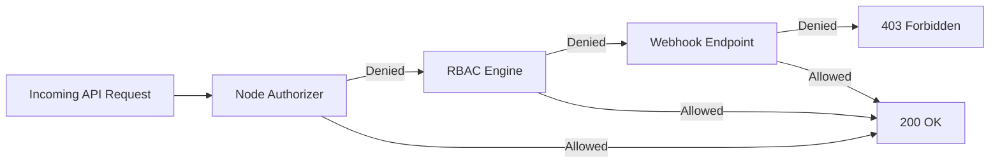

# Kubernetes Security and Network Policies

This reference note compiles core security configurations, certificate management protocols, RBAC structures, authentication systems, workload security contexts, and network policies within a Kubernetes cluster. It is structured to serve as both a CKA exam study guide and a production-grade operations manual.

---

## 1. Kubernetes Security Primitives and Authentication

Kubernetes security is structured around the **4Cs of Cloud Native Security**: Cloud, Cluster, Container, and Code. Security controls at each layer guard against specific threat vectors.



### 1.1 Cluster Access Control Flow
Every request to the `kube-apiserver` passes through three distinct phases:
1. **Authentication (AuthN):** Validates *who* is making the request (identity).
2. **Authorization (AuthZ):** Determines *what* the authenticated identity can do.
3. **Admission Control:** Inspects and optionally modifies or rejects the request payload based on cluster policies (e.g., resource quotas, security constraints).

### 1.2 User Categories
Kubernetes distinguishes between two main classes of users:
- **Human Users (Admins & Developers):** Managed externally. Kubernetes does not have database records representing human users. It relies on trusted certificate authorities, external OIDC providers, or webhooks.
- **ServiceAccounts (Robots/Applications):** Managed natively by Kubernetes. Used by processes running inside Pods (e.g., monitoring agents, CI/CD tools) to authenticate to the API.

### 1.3 Authentication Methods
Kubernetes supports multiple authentication mechanisms, configured via flags on the `kube-apiserver`:

| Method | Flag / Configuration | Description | Production Suitability |
| :--- | :--- | :--- | :--- |
| **X.509 Client Certificates** | `--client-ca-file=ca.crt` | Client presents a certificate signed by a trusted cluster CA. CN is user, O is group. | **High** (used for internal control plane components) |
| **OpenID Connect (OIDC)** | `--oidc-issuer-url`, `--oidc-client-id` | Delegates authentication to external OAuth2 providers (Azure AD, Okta, Keycloak). | **High** (recommended for human users) |
| **Webhook Token** | `--token-auth-file` (legacy webhook) | Delegates token verification to an external REST service. | **High** (used for cloud provider auth integration) |
| **Static Token File** | `--token-auth-file=tokens.csv` | Hardcoded tokens file: `token,user,uid,"group1,group2"`. | **Zero (Removed/Deprecated)**. Insecure, requires API restarts to change. |
| **Static Password File** | `--basic-auth-file=users.csv` | Basic auth: `password,user,uid,"group1,group2"`. | **Zero (Removed/Deprecated)**. Transmits raw credentials, completely insecure. |

> [!WARNING]
> Basic authentication (`--basic-auth-file`) and static token authentication (`--token-auth-file`) were deprecated and have been completely removed in modern Kubernetes versions (removed in v1.22+). Do not use them in production or when building new clusters.

---

## 2. TLS Basics & TLS in Kubernetes

Kubernetes requires TLS for all internal control plane communications. Symmetric encryption (same key for encrypting and decrypting) is used for data in transit after a secure exchange. Asymmetric encryption (public/private key pair) is used for the initial handshake and authentication.

### 2.1 Kubernetes PKI Architecture
Kubernetes uses separate Certificate Authorities (CAs) to isolate trust domains. A typical deployment has:
1. **Cluster CA:** Used for components (apiserver, kubelet, controller-manager, scheduler).
2. **ETCD CA:** Restricts ETCD membership and access to the API server.
3. **Front Proxy CA:** Used for API aggregation layers (extension API servers).

```
+-------------------------------------------------------------------------------------------------+
|                                          CLUSTER CA                                             |
|                                         (ca.crt/key)                                            |
+------------------------------------+----------------------------------+-------------------------+
                                     |                                  |
                                     v                                  v
                       +---------------------------+      +---------------------------+
                       |    Server Certificates    |      |    Client Certificates    |
                       +---------------------------+      +---------------------------+
                       | - kube-apiserver          |      | - kube-admin              |
                       | - kubelet serving         |      | - kube-controller-manager |
                       |                           |      | - kube-scheduler          |
                       |                           |      | - kube-proxy              |
                       |                           |      | - apiserver-to-kubelet    |
                       +---------------------------+      +---------------------------+
```

### 2.2 Manual Certificate Generation (OpenSSL & CFSSL)
Below are the step-by-step commands to generate keys and sign certificates for a cluster.

#### A. Generate Certificate Authority (CA)
The CA certificate and key act as the root of trust.
```bash
# Generate root private key
openssl genrsa -out ca.key 2048

# Generate Self-Signed Root CA Certificate
openssl req -x509 -new -nodes -key ca.key -subj "/CN=KUBERNETES-CA" -days 3650 -out ca.crt
```

#### B. Generate Admin Client Certificate
The admin certificate is a client certificate. Its Common Name (`CN`) acts as the username, and the Organization (`O`) represents the group. To obtain administrator privileges, the Organization must be `system:masters`.
```bash
# Generate private key
openssl genrsa -out admin.key 2048

# Create Certificate Signing Request (CSR)
openssl req -new -key admin.key -subj "/CN=kube-admin/O=system:masters" -out admin.csr

# Sign the certificate using Cluster CA
openssl x509 -req -in admin.csr -CA ca.crt -CAkey ca.key -CAcreateserial -out admin.crt -days 365
```

#### C. Generate Kube-APIServer Server Certificate
The API Server certificate must contain Subject Alternative Names (SANs) because it is accessed by nodes, pods, and users under multiple names (local host IP, cluster IP, DNS names).

1. Create an openssl configuration file `openssl.cnf`:
```ini
[req]
req_extensions = v3_req
distinguished_name = req_distinguished_name
[req_distinguished_name]
[ v3_req ]
basicConstraints = CA:FALSE
keyUsage = nonRepudiation, digitalSignature, keyEncipherment
subjectAltName = @alt_names
[alt_names]
DNS.1 = kubernetes
DNS.2 = kubernetes.default
DNS.3 = kubernetes.default.svc
DNS.4 = kubernetes.default.svc.cluster.local
DNS.5 = master-node.example.com
IP.1 = 10.96.0.1
IP.2 = 192.168.1.10
IP.3 = 127.0.0.1
```

2. Run the generation commands:
```bash
# Generate private key
openssl genrsa -out apiserver.key 2048

# Generate CSR using the configuration file
openssl req -new -key apiserver.key -subj "/CN=kube-apiserver" -config openssl.cnf -out apiserver.csr

# Sign using Cluster CA and the SAN configuration
openssl x509 -req -in apiserver.csr -CA ca.crt -CAkey ca.key -CAcreateserial -out apiserver.crt -extensions v3_req -extfile openssl.cnf -days 365
```

#### D. Generate Kubelet Client/Server Certificate
Kubelet certificates must have the CN format `system:node:<node-name>` and the Organization `system:nodes`. This matches the requirements of the Node Authorizer.
```bash
# Generate private key for worker node 'node01'
openssl genrsa -out node01.key 2048

# Generate CSR
openssl req -new -key node01.key -subj "/CN=system:node:node01/O=system:nodes" -out node01.csr

# Sign using Cluster CA
openssl x509 -req -in node01.csr -CA ca.crt -CAkey ca.key -CAcreateserial -out node01.crt -days 365
```

#### E. Alternative: Generating Certificates using CFSSL
CFSSL (Cloudflare's PKI toolkit) uses JSON configurations, which reduces syntax errors.

1. **CA Configuration (`ca-config.json`):**
```json
{
  "signing": {
    "default": {
      "expiry": "87600h"
    },
    "profiles": {
      "kubernetes": {
        "usages": ["signing", "key encipherment", "server auth", "client auth"],
        "expiry": "87600h"
      }
    }
  }
}
```

2. **CA CSR (`ca-csr.json`):**
```json
{
  "CN": "Kubernetes-CA",
  "key": {
    "algo": "rsa",
    "size": 2048
  }
}
```

3. **Generate CA:**
```bash
cfssl gencert -initca ca-csr.json | cfssljson -bare ca
# Outputs: ca.pem (ca.crt) and ca-key.pem (ca.key)
```

4. **API Server Certificate Configuration (`apiserver-csr.json`):**
```json
{
  "CN": "kube-apiserver",
  "hosts": [
    "127.0.0.1",
    "192.168.1.10",
    "10.96.0.1",
    "kubernetes",
    "kubernetes.default",
    "kubernetes.default.svc",
    "kubernetes.default.svc.cluster.local"
  ],
  "key": {
    "algo": "rsa",
    "size": 2048
  }
}
```

5. **Generate and Sign API Server Certificate:**
```bash
cfssl gencert \
  -ca=ca.pem \
  -ca-key=ca-key.pem \
  -config=ca-config.json \
  -profile=kubernetes \
  apiserver-csr.json | cfssljson -bare apiserver
```

### 2.3 Auditing Certificate Details
When troubleshooting TLS handshake errors, use the following commands to check certificate attributes:

```bash
# Audit certificate validity, issuer, and subject
openssl x509 -in /etc/kubernetes/pki/apiserver.crt -text -noout

# Verify specifically the expiration dates
openssl x509 -in /etc/kubernetes/pki/apiserver.crt -enddate -noout

# Audit SANs (Subject Alternative Names) specifically
openssl x509 -in /etc/kubernetes/pki/apiserver.crt -text -noout | grep -A 1 "Subject Alternative Name"

# Verify if a certificate matches a private key (modulus hashes must be identical)
openssl x509 -noout -modulus -in apiserver.crt | openssl md5
openssl rsa -noout -modulus -in apiserver.key | openssl md5
```

### 2.4 Control Plane TLS Flags
Kubeadm deploys control plane components as static pods. Audit certificates in `/etc/kubernetes/manifests/`:

#### Kube-APIServer Config Highlights (`/etc/kubernetes/manifests/kube-apiserver.yaml`):
```yaml
spec:
  containers:
  - command:
    - kube-apiserver
    - --tls-cert-file=/etc/kubernetes/pki/apiserver.crt
    - --tls-private-key-file=/etc/kubernetes/pki/apiserver.key
    - --client-ca-file=/etc/kubernetes/pki/ca.crt
    # API Server to Kubelet Client Credentials
    - --kubelet-client-certificate=/etc/kubernetes/pki/apiserver-kubelet-client.crt
    - --kubelet-client-key=/etc/kubernetes/pki/apiserver-kubelet-client.key
    # API Server to ETCD Client Credentials
    - --etcd-cafile=/etc/kubernetes/pki/etcd/ca.crt
    - --etcd-certfile=/etc/kubernetes/pki/apiserver-etcd-client.crt
    - --etcd-keyfile=/etc/kubernetes/pki/apiserver-etcd-client.key
```

#### ETCD Config Highlights (`/etc/kubernetes/manifests/etcd.yaml`):
```yaml
spec:
  containers:
  - command:
    - etcd
    - --cert-file=/etc/kubernetes/pki/etcd/server.crt
    - --key-file=/etc/kubernetes/pki/etcd/server.key
    - --trusted-ca-file=/etc/kubernetes/pki/etcd/ca.crt
    - --client-cert-auth=true
    - --peer-cert-file=/etc/kubernetes/pki/etcd/peer.crt
    - --peer-key-file=/etc/kubernetes/pki/etcd/peer.key
    - --peer-trusted-ca-file=/etc/kubernetes/pki/etcd/ca.crt
```

---

## 3. Certificates API

The Kubernetes Certificates API allows users to request certificates by submitting a `CertificateSigningRequest` (CSR) object to the API server. This removes the need to log into the master node to sign certificates.

### 3.1 CSR Flow
```
[Client] -(Generates Key & CSR file)-> [Admin] -(Creates YAML with Base64)-> [K8s API]
                                                                                |
[Client] <--(Downloads Certificate file)--- [Admin] <--(Approves CSR)-----------+
```

### 3.2 Submitting a Certificate Signing Request
1. User generates private key and CSR file:
```bash
openssl genrsa -out jane.key 2048
openssl req -new -key jane.key -subj "/CN=jane" -out jane.csr
```

2. Base64-encode the CSR file (without newlines):
```bash
cat jane.csr | base64 | tr -d '\n'
```

3. Create the `CertificateSigningRequest` manifest (`jane-csr.yaml`):
```yaml
apiVersion: certificates.k8s.io/v1
kind: CertificateSigningRequest
metadata:
  name: jane-csr
spec:
  # Base64 encoded contents of jane.csr
  request: MIICTAIBADAbMRkwFwYDVQQDDBBqYW5lMIIBIjANBgkqhkiG9w0BAQEFAAOC...
  signerName: kubernetes.io/kube-apiserver-client
  usages:
  - client auth
```

> [!NOTE]
> Since the promotion of the CSR API to `v1`, the `signerName` field is required. For client certificates accessing the API server, use `kubernetes.io/kube-apiserver-client`. For serving certificates (like Kubelets), use `kubernetes.io/kubelet-serving`.

### 3.3 CSR Management CLI
```bash
# Create the CSR resource
kubectl apply -f jane-csr.yaml

# List pending CSRs
kubectl get csr

# Approve the CSR
kubectl certificate approve jane-csr

# Deny the CSR
kubectl certificate deny jane-csr

# Export the signed certificate from the CSR object
kubectl get csr jane-csr -o jsonpath='{.status.certificate}' | base64 --decode > jane.crt

# Delete the CSR resource
kubectl delete csr jane-csr
```

### 3.4 Kubelet TLS Bootstrapping
Kubelet TLS bootstrapping allows new worker nodes to join the cluster and obtain valid TLS certificates automatically:
1. When a new node boots, it uses a temporary **Bootstrap Token** to authenticate to the API.
2. The Kubelet submits a CSR requesting a client certificate (`kubernetes.io/kube-apiserver-client-kubelet`).
3. The `kube-controller-manager` approves the CSR if the node's token matches.
4. Kubelet downloads its signed client certificate and uses it for subsequent communication.
5. Kubelet automatically requests a certificate renewal before expiration.

---

## 4. Kubeconfig

Kubeconfig files manage cluster access information, client credentials, and contexts. The default location is `~/.kube/config`.

### 4.1 Structure of Kubeconfig
A Kubeconfig is divided into three sections:
- **Clusters:** API endpoints and corresponding Certificate Authorities.
- **Users:** Credentials (token, client certificate/key, or password).
- **Contexts:** Binds a user to a cluster and sets a default namespace.

```yaml
apiVersion: v1
kind: Config
preferences: {}

clusters:
- name: prod-cluster
  cluster:
    server: https://192.168.1.10:6443
    certificate-authority: /etc/kubernetes/pki/ca.crt # Or certificate-authority-data (base64)

users:
- name: admin-user
  user:
    client-certificate: /etc/kubernetes/pki/users/admin.crt # Or client-certificate-data (base64)
    client-key: /etc/kubernetes/pki/users/admin.key # Or client-key-data (base64)

contexts:
- name: prod-admin-context
  context:
    cluster: prod-cluster
    user: admin-user
    namespace: default

current-context: prod-admin-context
```

### 4.2 Kubeconfig Management Commands
```bash
# View the merged active kubeconfig
kubectl config view

# View a custom kubeconfig file
kubectl config view --kubeconfig=/root/custom-config.yaml

# Switch the current-context
kubectl config use-context prod-admin-context

# Set the default namespace for the current context
kubectl config set-context --current --namespace=finance

# Create a new cluster entry
kubectl config set-cluster staging-cluster \
  --server=https://192.168.1.20:6443 \
  --certificate-authority=/etc/kubernetes/pki/ca.crt \
  --embed-certs=true

# Create a new user entry
kubectl config set-credentials dev-user \
  --client-certificate=/etc/kubernetes/pki/users/dev-user.crt \
  --client-key=/etc/kubernetes/pki/users/dev-user.key \
  --embed-certs=true

# Create a new context entry binding user and cluster
kubectl config set-context dev-context \
  --cluster=staging-cluster \
  --user=dev-user \
  --namespace=dev
```

### 4.3 Merging Kubeconfigs
If you have multiple separate Kubeconfig files and need to consolidate them:
```bash
# Concatenate files in the KUBECONFIG environment variable, then flatten and save
KUBECONFIG=~/.kube/config:/path/to/second-config:/path/to/third-config \
  kubectl config view --flatten > ~/.kube/config.merged

# Overwrite the original config with the merged version
mv ~/.kube/config.merged ~/.kube/config
```

---

## 5. Authorization Modes

Authorization occurs after successful authentication. If multiple modes are configured, Kubernetes processes them in the order specified. A request is allowed as soon as one mode approves it.

### 5.1 Mode Configuration
Configure authorization modes on the `kube-apiserver` command line:
```yaml
- --authorization-mode=Node,RBAC,Webhook
```

### 5.2 Key Authorization Modes



- **Node Authorization:** A specialized authorizer that grants permissions to Kubelets based on the pods assigned to their nodes. This ensures a compromised node cannot access secrets or modify resources outside its scope.
- **RBAC (Role-Based Access Control):** Uses the Kubernetes API to manage authorization dynamically. It groups permissions into Roles and binds them to users/groups.
- **Webhook Authorization:** Delegates authorization decisions to an external HTTP server. Commonly used for policy engines like OPA Gatekeeper or Kyverno.
- **ABAC (Attribute-Based Access Control):** Uses local JSON policies. Not recommended because changes require restarting the API server.
- **AlwaysAllow / AlwaysDeny:** Bypasses authorization checks (Allows all or Denies all). Used for local testing and debugging.

---

## 6. Role-Based Access Control (RBAC)

RBAC controls API access using Roles and RoleBindings. Resources in Kubernetes are either Namespaced or Cluster-scoped:
- **Namespaced:** Pods, Services, Deployments, ConfigMaps, Secrets, PVCs.
- **Cluster-scoped:** Nodes, Namespaces, PersistentVolumes, ClusterRoles, ClusterRoleBindings, CustomResourceDefinitions (CRDs).

```bash
# List namespaced resources
kubectl api-resources --namespaced=true

# List cluster-scoped resources
kubectl api-resources --namespaced=false
```

### 6.1 RBAC Primitives
- **Role:** Defines rules (apiGroups, resources, verbs) *within a single namespace*.
- **RoleBinding:** Assigns a Role to subjects (Users, Groups, ServiceAccounts) *within that namespace*.
- **ClusterRole:** Defines rules *cluster-wide* (applies to non-namespaced resources, or all namespaces).
- **ClusterRoleBinding:** Assigns a ClusterRole to subjects *cluster-wide*.

```
NAMESPACE SCOPE:
[Role: developer] <=====(RoleBinding)=====> [User: jane] (Applies only to 'dev' namespace)

CLUSTER SCOPE:
[ClusterRole: node-admin] <=====(ClusterRoleBinding)=====> [User: michelle] (Applies to all namespaces and cluster-wide resources)
```

### 6.2 Complete YAML Templates

#### Role (Namespaced)
```yaml
apiVersion: rbac.authorization.k8s.io/v1
kind: Role
metadata:
  name: developer-role
  namespace: dev
rules:
- apiGroups: [""] # Core api group (pods, configmaps, secrets, services)
  resources: ["pods", "pods/log", "services"]
  verbs: ["get", "list", "watch", "create", "update", "delete"]
- apiGroups: ["apps"] # Apps group (deployments, replicasets, daemonsets)
  resources: ["deployments"]
  verbs: ["get", "list", "update", "patch"]
```

#### RoleBinding (Namespaced)
```yaml
apiVersion: rbac.authorization.k8s.io/v1
kind: RoleBinding
metadata:
  name: dev-user-binding
  namespace: dev
subjects:
- kind: User
  name: dev-user
  apiGroup: rbac.authorization.k8s.io
- kind: ServiceAccount
  name: build-agent-sa
  namespace: dev
roleRef:
  kind: Role
  name: developer-role
  apiGroup: rbac.authorization.k8s.io
```

#### ClusterRole (Cluster-scoped)
```yaml
apiVersion: rbac.authorization.k8s.io/v1
kind: ClusterRole
metadata:
  name: cluster-storage-manager
rules:
- apiGroups: [""]
  resources: ["persistentvolumes"] # PVs are cluster-scoped
  verbs: ["get", "list", "watch", "create", "delete"]
- apiGroups: ["storage.k8s.io"]
  resources: ["storageclasses"] # StorageClasses are cluster-scoped
  verbs: ["get", "list", "watch"]
```

#### ClusterRoleBinding (Cluster-scoped)
```yaml
apiVersion: rbac.authorization.k8s.io/v1
kind: ClusterRoleBinding
metadata:
  name: storage-admin-binding
subjects:
- kind: User
  name: storage-admin
  apiGroup: rbac.authorization.k8s.io
roleRef:
  kind: ClusterRole
  name: cluster-storage-manager
  apiGroup: rbac.authorization.k8s.io
```

### 6.3 Restricting Access by Resource Names
You can limit access to specific resource instances using `resourceNames`:
```yaml
apiVersion: rbac.authorization.k8s.io/v1
kind: Role
metadata:
  name: configmap-manager
  namespace: dev
rules:
- apiGroups: [""]
  resources: ["configmaps"]
  resourceNames: ["app-config", "db-config"] # Can only interact with these two
  verbs: ["get", "update"]
```

### 6.4 ClusterRole bound with RoleBinding (Best Practice)
> [!TIP]
> You can bind a `ClusterRole` using a `RoleBinding` in a specific namespace. This grants the permissions of the ClusterRole *only within that namespace*. This allows you to define a single common policy (e.g., `view-only-clusterrole`) and reuse it across multiple namespaces without duplicating Role objects.

### 6.5 Testing Permissions with `kubectl auth can-i`
Verify RBAC configurations using the `can-i` command line utility:

```bash
# Check if you can perform an action
kubectl auth can-i create deployments

# Check if a specific user can perform an action in a namespace
kubectl auth can-i list secrets --as dev-user --namespace dev

# Check if a ServiceAccount can perform an action
kubectl auth can-i get pods --as system:serviceaccount:dev:build-agent-sa --namespace dev

# Check permissions for a group
kubectl auth can-i delete pv --as-group system:masters
```

---

## 7. ServiceAccounts

ServiceAccounts provide identities for processes running in Pods.

### 7.1 Automounting ServiceAccount Tokens
Every namespace has a `default` ServiceAccount. By default, Kubernetes mounts the default ServiceAccount token into all Pods at `/var/run/secrets/kubernetes.io/serviceaccount/token`.

To disable this behavior (highly recommended if the Pod does not need to talk to the API server):

#### Option A: Disable at the ServiceAccount level
```yaml
apiVersion: v1
kind: ServiceAccount
metadata:
  name: non-api-sa
automountServiceAccountToken: false
```

#### Option B: Disable at the Pod level
```yaml
apiVersion: v1
kind: Pod
metadata:
  name: web-app
spec:
  automountServiceAccountToken: false
  containers:
  - name: web
    image: nginx
```

### 7.2 ServiceAccount Tokens in v1.22+ and v1.24+
Modern Kubernetes versions include security enhancements for ServiceAccount tokens:

- **v1.22+ Projected Volumes:** Tokens are no longer static. They are mounted as projected volumes, bound to the Pod lifetime, audience-restricted, and auto-rotated (default lifetime is 1 hour).
- **v1.24+ Token Reduction (KEP-2799):** The API server no longer automatically creates secret objects for new ServiceAccounts. If a long-lived, static token is required, you must create a secret manually.

```bash
# Generate a temporary token via TokenRequest API (valid for 1 hour)
kubectl create token my-service-account
```

#### Manually creating a long-lived token secret:
```yaml
apiVersion: v1
kind: Secret
metadata:
  name: my-sa-token-secret
  annotations:
    kubernetes.io/service-account.name: my-service-account # Binds to the SA
type: kubernetes.io/service-account-token
```

---

## 8. Image Security

To pull images from private registries (like Docker Hub, Quay, or Azure Container Registry), the cluster requires credentials.

### 8.1 Creating a Docker Registry Secret
Create a secret containing your private registry credentials:
```bash
kubectl create secret docker-registry private-registry-cred \
  --docker-server=myprivateregistry.com:5000 \
  --docker-username=registry-user \
  --docker-password=registry-password \
  --docker-email=user@org.com
```

### 8.2 Using ImagePullSecrets in a Pod
Reference the secret in the Pod's `spec.imagePullSecrets` block:
```yaml
apiVersion: v1
kind: Pod
metadata:
  name: private-app
  namespace: default
spec:
  imagePullSecrets:
  - name: private-registry-cred
  containers:
  - name: app-container
    image: myprivateregistry.com:5000/apps/secure-api:v1.2
    imagePullPolicy: IfNotPresent
```

### 8.3 Image Pull Policies
- `Always`: Always query the registry to check if the image has changed, and pull it if so. Default for tags like `:latest`.
- `IfNotPresent`: Only pull the image if it does not exist on the node's local disk.
- `Never`: Never pull the image from a registry. Use only local images.

---

## 9. SecurityContexts

SecurityContexts define privilege and access control settings for Pods and Containers. Pod-level settings apply to all containers in the Pod, while container-level settings override Pod-level settings.

### 9.1 Parameter Scope
- **Pod-level only:** `fsGroup` (volume ownership), `sysctls`.
- **Container-level only:** `capabilities`, `privileged`, `allowPrivilegeEscalation`, `readOnlyRootFilesystem`.
- **Shared (Pod or Container level):** `runAsUser`, `runAsGroup`, `runAsNonRoot`, `seLinuxOptions`.

### 9.2 Comprehensive Workload Template
```yaml
apiVersion: v1
kind: Pod
metadata:
  name: secure-web-pod
spec:
  # Pod-level security context
  securityContext:
    runAsUser: 2000
    runAsGroup: 3000
    runAsNonRoot: true # Enforces that container must run with a non-root UID
    fsGroup: 4000 # Volumes mounted will belong to GID 4000
  containers:
  - name: web-app
    image: nginx:alpine
    ports:
    - containerPort: 8080
    # Container-level security context (overrides pod level where conflicting)
    securityContext:
      runAsUser: 2001
      allowPrivilegeEscalation: false # Process cannot gain more privileges than parent
      readOnlyRootFilesystem: true # Mounts the container rootfs as read-only
      capabilities:
        add: ["NET_BIND_SERVICE"] # Allows binding to privileged ports (<1024)
        drop: ["ALL"] # Drops all default Linux capabilities
```

---

## 10. NetworkPolicies

By default, Kubernetes network traffic is **non-isolated (default-allow)**: any Pod can communicate with any other Pod in the cluster, across all namespaces. NetworkPolicies restrict traffic flow (ingress and egress).

> [!IMPORTANT]
> NetworkPolicies are enforced by the cluster's CNI network plugin (e.g., Calico, Cilium, Weave, Kube-router). If you are using a CNI plugin that does not support network policies (like Flannel), NetworkPolicy manifests will be accepted by the API server but will not be enforced.

### 10.1 Selector Combinations: AND vs. OR
Understanding the syntax for combining namespace and pod selectors inside `from` and `to` blocks is critical:

#### OR Logic (Separate Array Elements)
Traffic is allowed if it matches the namespace selector **OR** the pod selector.
```yaml
  ingress:
  - from:
    - namespaceSelector:
        matchLabels:
          environment: production
    - podSelector:
        matchLabels:
          app: frontend
```
*Matches:* Any pod in a namespace labeled `environment: production` (regardless of pod labels), and any pod in the same namespace labeled `app: frontend`.

#### AND Logic (Single Array Element with Multiple Keys)
Traffic is allowed only if it matches both selectors.
```yaml
  ingress:
  - from:
    - namespaceSelector:
        matchLabels:
          environment: production
      podSelector:
        matchLabels:
          app: frontend
```
*Matches:* Only pods labeled `app: frontend` that reside inside namespaces labeled `environment: production`.

---

### 10.2 Production NetworkPolicy Templates

#### Template 1: Default Deny All Ingress & Egress (Namespace Lockdown)
Run this policy in a namespace to block all traffic by default. Services must then be explicitly allowed.
```yaml
apiVersion: networking.k8s.io/v1
kind: NetworkPolicy
metadata:
  name: default-deny-all
  namespace: secure-app
spec:
  podSelector: {} # Empty selector matches all pods in the namespace
  policyTypes:
  - Ingress
  - Egress
```

#### Template 2: Database Policy (Ingress Only)
Allows inbound database connections on port `5432` only from the API application pods, blocking all other ingress.
```yaml
apiVersion: networking.k8s.io/v1
kind: NetworkPolicy
metadata:
  name: db-policy
  namespace: secure-app
spec:
  podSelector:
    matchLabels:
      role: db
  policyTypes:
  - Ingress
  ingress:
  - from:
    - podSelector:
        matchLabels:
          role: api
    ports:
    - protocol: TCP
      port: 5432
```

#### Template 3: Strict Egress Isolation (Allow DNS and specific backend only)
Restricts app pods to only call DNS (UDP/TCP 53) in the `kube-system` namespace and a specific database in the same namespace.
```yaml
apiVersion: networking.k8s.io/v1
kind: NetworkPolicy
metadata:
  name: app-egress-policy
  namespace: secure-app
spec:
  podSelector:
    matchLabels:
      role: api
  policyTypes:
  - Egress
  egress:
  # Rule 1: Allow DNS resolution
  - to:
    - namespaceSelector:
        matchLabels:
          kubernetes.io/metadata.name: kube-system
      podSelector:
        matchLabels:
          k8s-app: kube-dns
    ports:
    - protocol: UDP
      port: 53
    - protocol: TCP
      port: 53
  # Rule 2: Allow database access
  - to:
    - podSelector:
        matchLabels:
          role: db
    ports:
    - protocol: TCP
      port: 5432
```

#### Template 4: Access to External IP Ranges (Egress with CIDR)
Allows pods to communicate with an external API server outside the cluster (e.g., IP `203.0.113.50`).
```yaml
apiVersion: networking.k8s.io/v1
kind: NetworkPolicy
metadata:
  name: external-egress-policy
  namespace: secure-app
spec:
  podSelector:
    matchLabels:
      role: api
  policyTypes:
  - Egress
  egress:
  - to:
    - ipBlock:
        cidr: 203.0.113.0/24
        except:
        - 203.0.113.10/32 # Block this specific host
    ports:
    - protocol: TCP
      port: 443

---

## 11. ConfigMap & Secret Security Management

Managing application configurations and secrets securely is a key operational requirement.

### 11.1 ConfigMaps vs. Secrets
* **ConfigMaps:** Store non-sensitive configuration data (e.g., environment variables, config files) in plaintext.
* **Secrets:** Store sensitive data (e.g., passwords, API keys, certificates) encoded in Base64.
  * **Important:** Base64 is NOT encryption. It is merely encoding. Anyone who can read the Secret object can decode it: `echo "base64-string" | base64 --decode`.

### 11.2 Secret Protection Mechanisms
* **tmpfs Mounting:** When a Secret is mounted as a volume inside a Pod, the Kubelet writes the secret files into a **`tmpfs`** (RAM-backed) filesystem. The secret data is never written to the physical storage disk of the worker node.
* **Encryption at Rest:** By default, Secrets are stored in `etcd` in plaintext. To encrypt them, you must configure an `EncryptionConfiguration` object on the `kube-apiserver` using providers like `aescbc` or KMS:
  ```yaml
  apiVersion: apiserver.config.k8s.io/v1
  kind: EncryptionConfiguration
  resources:
    - resources:
        - secrets
      providers:
        - aescbc:
            keys:
              - name: key1
                secret: d3JpdGUtby1maWxlLWRpc2stcGF0aC1zZWNyZXQ= # Example 32-byte key
        - identity: {}
  ```
  Enable this by adding the flag `--encryption-provider-config=/etc/kubernetes/enc/enc.yaml` to the api-server.

### 11.3 Injection Methods
ConfigMaps and Secrets can be injected into containers in two ways:
1. **Environment Variables:**
   * Values are loaded when the container starts.
   * **Pitfall:** If values are updated in the ConfigMap/Secret, env variables are NOT updated inside the running container until it restarts.
2. **Volume Mounts:**
   * ConfigMaps and Secrets are mounted as directories, with keys appearing as files.
   * **Advantage:** Kubelet periodically syncs updates. Modifications to the ConfigMap/Secret will automatically propagate as file updates inside the container within a few minutes (without restarting the container).

---

## 12. Pod Security Admission (PSA) and Standards

Pod Security Admission (PSA) is the built-in admission controller that replaces the deprecated PodSecurityPolicy (PSP) to enforce the **Pod Security Standards (PSS)** at the namespace level.

### 12.1 Pod Security Standards (PSS) Levels
1. **`privileged`:** Unrestricted policy. Allows container processes to run as root, execute host-level sysctls, map host hostpaths, and bypass isolation boundaries.
2. **`baseline`:** Default/standard profile. Prevents known privilege escalations. Restricts host network/PID access, block hostpath volume mounts, but permits standard root execution.
3. **`restricted`:** Hardened profile. Enforces strict hardening guidelines:
   * Requires `runAsNonRoot: true`.
   * Requires dropping all capabilities and adding only `NET_BIND_SERVICE` if needed.
   * Restricts volume types (blocks hostpath, permits configmaps/secrets/projected).
   * Restricts ports (<1024 blocked without explicit capability).

### 12.2 PSA Modes of Admission Control
* **`enforce`:** Blocks Pod creation if it violates the target PSS level.
* **`warn`:** Permits Pod creation but returns a user-facing warning header to the client (e.g., during `kubectl apply`).
* **`audit`:** Permits Pod creation but records an audit event in the API audit log.

### 12.3 Applying PSA Namespace Labels
Configure PSA behavior by applying labels to a namespace:
```yaml
apiVersion: v1
kind: Namespace
metadata:
  name: secure-namespace
  labels:
    pod-security.kubernetes.io/enforce: restricted
    pod-security.kubernetes.io/enforce-version: v1.30
    pod-security.kubernetes.io/warn: baseline
    pod-security.kubernetes.io/warn-version: latest
```

> [!CAUTION]
> **Namespace Label Escalation Risk:** Any user with permission to `patch` or `update` Namespace resources (e.g. via a namespaced RoleBinding) can modify these labels. This creates a severe privilege escalation risk, as a user could downgrade a namespace's PSA level from `restricted` to `privileged` to deploy an insecure root Pod. Restrict Namespace label permissions strictly.

---

## 13. Hardening Guide: Dynamic Resource Allocation (DRA) Security

Dynamic Resource Allocation (DRA) (Beta in v1.36) provides advanced scheduling and allocation mechanisms for hardware accelerators (GPUs, ASICs). Because DRA drivers write resource allocation metadata back to the API, secure authorization is required.

### 13.1 Synthetic Subresources
DRA status updates do not modify the main claim object directly; instead, they target synthetic subresources to enforce least-privilege:
1. **`resourceclaims/binding`:** Required to modify `status.allocation` and `status.reservedFor`. Usually granted strictly to the `kube-scheduler` and custom allocation controllers.
2. **`resourceclaims/driver`:** Required to modify `status.devices`. Restricts drivers from tampering with claims managed by other drivers.

### 13.2 Node-Aware Verbs
When configuring RBAC for DRA drivers, use node-aware verbs:
* **`associated-node:<verb>`:** Used for node-local drivers (e.g. GPU agent running on a worker node). The API server verifies node association before validating the request.
* **`arbitrary-node:<verb>`:** Granted only to control-plane or cluster-wide multi-node controllers.

---

## 14. Kubernetes Security Checklist

Ensure a basic security baseline for control planes, hosts, and applications:

### A. Authentication & Authorization
* [ ] Disable basic auth (`--basic-auth-file`) and static tokens (`--token-auth-file`).
* [ ] Enforce mTLS for all control plane communication (APIServer, ETCD).
* [ ] Restrict `system:masters` group assignment (acts as superuser, bypassing RBAC).
* [ ] Periodically audit cluster-level RoleBindings and ClusterRoleBindings.

### B. Host & Network Security
* [ ] Apply a default-deny-all Ingress and Egress `NetworkPolicy` to namespaces.
* [ ] Restrict direct host network access to `kube-apiserver` (port 6443) and `etcd` (ports 2379/2380).
* [ ] Configure worker hosts to use the `systemd` cgroup driver for resource tracking.

### C. Pod & Container hardening
* [ ] Apply `readOnlyRootFilesystem: true` to prevent containers from writing to host directories.
* [ ] Set `runAsNonRoot: true` and define non-root `runAsUser` values.
* [ ] Drop `ALL` Linux capabilities, explicitly adding only what's required.
* [ ] Scan container images for vulnerabilities, pin specific image digests, and pull only from verified registries.
* [ ] Run untrusted workloads inside isolated environments using sandboxed runtimes (e.g. gVisor, Kata Containers) via `RuntimeClass`.
```
