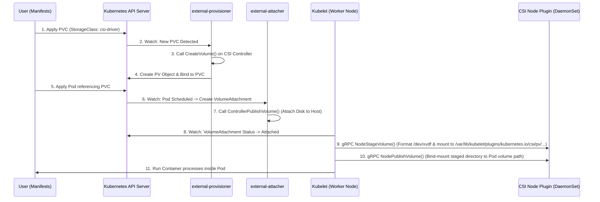

# Module 09: Storage Mechanics and Container Storage Interface (CSI)

This module covers the core concepts of storage management in Kubernetes. It details the transition from Docker's storage model to the Container Storage Interface (CSI), examines primitive volume types (`emptyDir` and `hostPath`), explains the Persistent Volume (PV) and Persistent Volume Claim (PVC) lifecycle, outlines Pod mount configurations, and documents dynamic provisioning via StorageClasses.

---

## 1. Container Storage Interface (CSI) Architecture

### A. The Evolution of Kubernetes Storage (In-Tree vs. Out-of-Tree)
In early versions of Kubernetes, all volume plugins (e.g., `kubernetes.io/aws-ebs`, `kubernetes.io/gce-pd`, `kubernetes.io/cinder`) were **in-tree**. This meant their driver code was compiled directly into the core Kubernetes binaries (`kube-apiserver`, `kube-controller-manager`, `kubelet`).

This architecture presented significant challenges:
1. **Release Coupling:** Storage vendors had to align bug fixes and features with the Kubernetes core release cycle.
2. **Security & Stability:** Bugs in a third-party storage driver could crash the control plane. In-tree drivers also required high-level privileges in the core components.
3. **Bloat:** Core Kubernetes binaries carried code for dozens of storage systems.

The **Container Storage Interface (CSI)** was introduced to move storage plugins **out-of-tree**. CSI is a standardized, gRPC-based specification that allows container orchestrators (like Kubernetes, Mesos, Nomad) to interact with arbitrary storage backends using standard interfaces.

---

### B. CSI Control Plane Components (Helper Sidecars)
To bridge the Kubernetes API and the out-of-tree CSI driver, Kubernetes uses a set of standardized helper containers called **sidecars**. These sidecars watch the Kubernetes API and translate API state changes into gRPC calls to the CSI driver.

```
       +-----------------------------------------------------------+
       |                  Kubernetes Control Plane                 |
       |                                                           |
       |  +--------------------+           +--------------------+  |
       |  |  external-         |           |  external-         |  |
       |  |  provisioner       |           |  attacher          |  |
       |  +---------+----------+           +---------+----------+  |
       +------------|--------------------------------|-------------+
                    | (gRPC: CreateVolume)           | (gRPC: ControllerPublish)
                    v                                v
       +-----------------------------------------------------------+
       |                     CSI Driver Pod                        |
       |                                                           |
       |                 CSI Controller Plugin                     |
       +-----------------------------------------------------------+
```

1. **`external-provisioner`:**
   - Watches `PersistentVolumeClaim` (PVC) objects.
   - When a new PVC is created referencing a StorageClass backed by the CSI driver, it invokes the CSI driver's `CreateVolume` gRPC method to provision the physical backend storage.
2. **`external-attacher`:**
   - Watches `VolumeAttachment` objects.
   - Translates them into gRPC calls (`ControllerPublishVolume`) to attach the provisioned physical volume to a specific worker node.
3. **`external-resizer`:**
   - Watches PVC resource modifications.
   - Triggers the `ControllerExpandVolume` gRPC method to expand the size of the volume on the storage backend.
4. **`external-snapshotter`:**
   - Watches `VolumeSnapshot` and `VolumeSnapshotContent` custom resources.
   - Invokes `CreateSnapshot` and `DeleteSnapshot` gRPC calls to manage storage snapshots.
5. **`node-driver-registrar`:**
   - Runs as a sidecar inside the CSI DaemonSet on each worker node.
   - Interacts with Kubelet's local plugin registration service to register the CSI driver's local socket.

---

### C. Controller Plugin vs. Node Plugin
A complete CSI driver deployment is split into two distinct execution topologies:

#### 1. CSI Controller Plugin (Deployment / StatefulSet)
- **Scope:** Cluster-wide control-plane operations.
- **Topology:** Run as a deployment with 1 or more replicas (typically with leader election).
- **Execution Node:** Can run on control plane or infra nodes.
- **Responsibilities:**
  - Creating and deleting physical disks on the storage infrastructure (`CreateVolume`/`DeleteVolume`).
  - Attaching and detaching physical disks to/from virtual instances (`ControllerPublishVolume`/`ControllerUnpublishVolume`).
  - Reporting capacities and creating snapshots.

#### 2. CSI Node Plugin (DaemonSet)
- **Scope:** Local node operations.
- **Topology:** Must run on every worker node in the cluster.
- **Execution Node:** Runs as a privileged DaemonSet.
- **Responsibilities:**
  - **Node Stage Volume (`NodeStageVolume`):** Formats the raw block device (e.g., with `ext4` or `xfs`) and mounts it to a global staging directory on the node.
  - **Node Publish Volume (`NodePublishVolume`):** Performs a bind mount from the global staging directory into the Pod's specific mount directory (enabling the container to access it).
  - **Node Unpublish / Unstage:** Cleans up mounts when Pods are terminated.

---

### D. Driver Discovery and Registration Flow
The Kubelet discovers local CSI drivers by scanning `/var/lib/kubelet/plugins_registry/` for active Unix domain sockets.

```
+--------------------------------------------------------------------------------+
| Worker Node Host                                                               |
|                                                                                |
|  +-------------------------------------+                                       |
|  | Kubelet Daemon                      |                                       |
|  |                                     |                                       |
|  |  [Unix Socket Client]               |                                       |
|  +----------^--------------------------+                                       |
|             | (Registration API Protocol)                                      |
|             v                                                                  |
|  +----------+--------------------------+  (gRPC Call)  +--------------------+  |
|  | node-driver-registrar (Sidecar)     | ------------> | CSI Node Plugin    |  |
|  |                                     |               |                    |  |
|  | - Opens socket in /plugins_registry/|               | - Opens gRPC socket|  |
|  | - Sends plugin registration to Kubelet|             |   in /plugins/     |  |
|  +-------------------------------------+               +--------------------+  |
+--------------------------------------------------------------------------------+
```

1. The `CSI Node Plugin` opens a gRPC socket at `/var/lib/kubelet/plugins/<driver-name>/csi.sock`.
2. The `node-driver-registrar` container opens a registration socket at `/var/lib/kubelet/plugins_registry/<driver-name>-reg.sock`.
3. Kubelet detects the registration socket, connects to it, and requests details about the driver via the Plugin Registration Protocol.
4. Kubelet then establishes direct communication with the CSI driver's main socket `/var/lib/kubelet/plugins/<driver-name>/csi.sock` to execute volume mounting commands.

---

### E. End-to-End Volume Mount Workflow
The following sequence details how Kubernetes provisions, attaches, and mounts a CSI volume:



---

## 2. Kubernetes Volume Primitives: `emptyDir` & `hostPath`

In Kubernetes, Pods are transient. If a container crashes, its local filesystem changes are preserved by the runtime container restart logic; however, if a Pod is rescheduled or deleted, all data inside it is lost. To persist or share data, you must configure a `volume`.

---

### A. Ephemeral Node Storage: `emptyDir`
An `emptyDir` volume is created when a Pod is assigned to a Node, and exists as long as that Pod is running on that node. It starts empty.

#### 1. Core Mechanics & Pathing
- All containers in the Pod can read and write the same files in the `emptyDir` volume, though that volume can be mounted at different paths in each container.
- When a Pod is removed from a node, the data in the `emptyDir` is erased permanently.
- **Physical Path on Host:** `/var/lib/kubelet/pods/<pod-uid>/volumes/kubernetes.io~empty-dir/<volume-name>/`

#### 2. Storage Mediums (Disk vs. RAM)
You can configure the backing medium for `emptyDir`:
- **Default (Disk):** Backed by the node's storage media (SSD/HDD).
- **Memory (RAM-backed tmpfs):** Sets `medium: Memory`. Files are written directly to RAM. 
  - *Warning:* tmpfs volumes count against your container's memory limit. If your app writes data exceeding the container's memory limits, the Pod will be evicted with an **OOMKilled** or **Evicted** status.

#### 3. Pod Manifest Example
```yaml
apiVersion: v1
kind: Pod
metadata:
  name: cache-pod
  namespace: default
spec:
  containers:
  - name: web-app
    image: nginx:alpine
    volumeMounts:
    - name: cache-volume
      mountPath: /usr/share/nginx/html
  volumes:
  - name: cache-volume
    emptyDir:
      medium: Memory
      sizeLimit: 100Mi
```

---

### B. Persistent Local Storage: `hostPath`
A `hostPath` volume mounts a file or directory from the host node's filesystem directly into your Pod.

#### 1. Type Options
| Type | Behavior / Requirements |
|:---|:---|
| `""` (Empty String) | Default. Backward-compatible fallback. No host checks are performed. |
| `DirectoryOrCreate` | If nothing exists at the path, an empty directory is created (mode `0755`, owned by Kubelet). |
| `Directory` | The directory at the specified path must exist on the host node. |
| `FileOrCreate` | If nothing exists at the path, an empty file is created (mode `0644`, owned by Kubelet). |
| `File` | The file at the specified path must exist on the host node. |
| `Socket` | A Unix domain socket at the specified path must exist on the host node. |
| `CharDevice` | A character device at the specified path must exist on the host node. |
| `BlockDevice` | A block device at the specified path must exist on the host node. |

#### 2. Host Directory Traversal & Security Risks
> [!CAUTION]
> **Host Escape Vulnerability:**
> Running a Pod with root privileges and a `hostPath` volume pointing to `/` allows the container processes to access, read, and write to the entire host OS filesystem. This bypasses container isolation boundaries. Use `ReadOnly: true` where possible, and restrict `hostPath` using Pod Security Standards (PSS) or Admission Controllers (e.g. Kyverno, OPA Gatekeeper).

#### 3. Host System Configuration (Permissions, SELinux, and Systemd)
- **Linux Execution Permissions (`x`):** The directory path on the host must grant execute permissions to the container runtime user ID (UID). If a container runs as a non-root user (e.g., UID `10001`), and the host path is restricted to root (`0700`), the Pod will fail to mount or run.
- **SELinux Policies:** On hosts with SELinux (like RHEL, Rocky, Fedora), container access to host directories is blocked by default. You must append `:z` (shared content) or `:Z` (private unshared content) to the volume mount labels, or configure the host's directory with the `container_file_t` context using `chcon` or `semanage`.
- **Systemd Mount Flags:** Host paths that are mounted with restrictive systemd flags (e.g. `ProtectSystem=strict` or `MountFlags=private`) can prevent Kubelet from mounting them cleanly.

#### 4. The Multi-Node Scheduling Disconnect
> [!WARNING]
> Because `hostPath` binds directly to the local node filesystem, if a Pod is rescheduled to a different worker node (due to node failure, drains, or deployments), it will mount the path on the *new* node. This new path will not contain any of the files written on the previous node. Thus, `hostPath` is **not** suitable for clustered persistent stateful workloads unless paired with node affinity or running as a DaemonSet.

#### 5. Pod Manifest Example
```yaml
apiVersion: v1
kind: Pod
metadata:
  name: hostpath-pod
spec:
  containers:
  - name: system-monitor
    image: alpine
    command: ["sh", "-c", "tail -f /host/syslogs"]
    volumeMounts:
    - name: host-log-dir
      mountPath: /host/syslogs
      readOnly: true
  volumes:
  - name: host-log-dir
    hostPath:
      path: /var/log
      type: Directory
```

---

## 3. Persistent Volumes (PV) & Persistent Volume Claims (PVC)

Kubernetes separates storage infrastructure management from application workload requests.

```
 +------------------------+
 |   Physical Storage     | (NFS, AWS EBS, GCE-PD, Local NVMe)
 +-----------+------------+
             |
             v
 +------------------------+
 |   PersistentVolume     | (Cluster-Scoped, Created by Admin or CSI)
 +-----------+------------+
             ^
             | (Binding Match)
             v
 +------------------------+
 | PersistentVolumeClaim  | (Namespace-Scoped, Created by App Developer)
 +-----------+------------+
             ^
             | (Referenced by Name)
             v
 +------------------------+
 |       Pod Spec         | (Workspace Container)
 +------------------------+
```

- **PersistentVolume (PV):** A cluster-scoped storage resource provisioned by an administrator or dynamically via a StorageClass. It represents the physical backing storage.
- **PersistentVolumeClaim (PVC):** A namespace-scoped request for storage by a user. It specifies capacity, access modes, and storage classes.

---

### A. PV-to-PVC Binding Matching Criteria
Kubernetes automatically matches and binds a PVC to a compatible PV based on these rules:
1. **StorageClass Match:** If the PVC requests a specific `storageClassName`, it will only bind to a PV with the exact same `storageClassName`. If the PVC requests `storageClassName: ""`, it will only bind to PVs that have no storage class specified.
2. **Access Mode Support:** The PV must support *all* access modes requested by the PVC.
3. **Capacity Requirements:** The PV's capacity must be greater than or equal to the capacity requested by the PVC. The control plane selects the smallest available PV that satisfies the size.
4. **Selector Match:** If the PVC specifies a label `selector`, the PV must have matching labels.

---

### B. Binding States Lifecycle
The status of a PV transitions through these states:
- **`Available`:** The PV is healthy, idle, and ready to be bound by a PVC.
- **`Bound`:** The PV has been successfully claimed by a PVC.
- **`Released`:** The bound PVC was deleted, but the PV reclaim policy is `Retain`. The PV retains its data and cannot be claimed by other PVCs.
- **`Failed`:** The automatic cleanup or deletion process failed.

> [!NOTE]
> **Why is my PVC stuck in a `Pending` state?**
> A PVC stays `Pending` if:
> - No PV matches the capacity or access mode requested.
> - The requested `storageClassName` does not exist or has no matching PVs.
> - The StorageClass has its `volumeBindingMode` set to `WaitForFirstConsumer`, meaning the binding is intentionally delayed until a Pod using the PVC is scheduled.

---

### C. Access Modes Reference
Kubernetes supports the following access modes:
* **`ReadWriteOnce` (RWO):** The volume can be mounted as read-write by a single node. (Multiple Pods on the same node can mount the volume).
* **`ReadOnlyMany` (ROX):** The volume can be mounted as read-only by many nodes.
* **`ReadWriteMany` (RWX):** The volume can be mounted as read-write by many nodes (requires network storage like NFS or Ceph).
* **`ReadWriteOncePod` (RWOP):** The volume can be mounted as read-write by a single Pod in the entire cluster. This ensures absolute exclusivity.

---

### D. Reclaim Policies
The `persistentVolumeReclaimPolicy` field determines what happens to the PV and underlying storage when the PVC is deleted.

#### 1. Retain (Manual Cleanup Flow)
The PV remains in the cluster after PVC deletion, but its status changes to `Released`. The physical storage is NOT deleted.
To manually reclaim a `Released` PV:
1. **Delete the PV object:**
   ```bash
   kubectl delete pv <pv-name>
   ```
2. **Clean up the Physical Storage:** Log into the host or cloud provider console and format or erase the directory/disk contents.
3. **Re-create or Re-release:** Re-apply the PV manifest to make the resource `Available` again.

#### 2. Delete (Automatic Deletion)
The PV is automatically deleted, and the CSI driver invokes the backend storage API to destroy the physical volume (e.g. AWS EBS block storage or GCP persistent disk).

#### 3. Recycle (Deprecated)
Performs a basic file system scrub (`rm -rf /mount/*`) and returns the PV to `Available`. This policy is deprecated and unsupported by modern CSI plugins.

---

### E. PVC Protection and Finalizers
To prevent data loss and filesystem corruption, Kubernetes prevents active volumes from being deleted while in use.
- When you delete a PVC that is mounted by an active Pod, the PVC is marked for deletion and its status changes to `Terminating`.
- The PVC is protected by the finalizer: `kubernetes.io/pvc-protection`.
- The controller will block the physical removal of the PVC resource from the API server until the Pod using it is fully terminated.

---

### F. Complete PV and PVC Manifest Templates
#### PV Manifest (`pv-definition.yaml`)
```yaml
apiVersion: v1
kind: PersistentVolume
metadata:
  name: static-pv-demo
  labels:
    tier: fast
spec:
  capacity:
    storage: 5Gi
  volumeMode: Filesystem
  accessModes:
    - ReadWriteOnce
  persistentVolumeReclaimPolicy: Retain
  storageClassName: local-storage
  hostPath:
    path: /tmp/static-data-dir
    type: DirectoryOrCreate
```

#### PVC Manifest (`pvc-definition.yaml`)
```yaml
apiVersion: v1
kind: PersistentVolumeClaim
metadata:
  name: static-pvc-demo
  namespace: default
spec:
  accessModes:
    - ReadWriteOnce
  storageClassName: local-storage
  resources:
    requests:
      storage: 2Gi
  selector:
    matchLabels:
      tier: fast
```

---

## 4. Using PVCs in Pods

Once a PVC is bound, a Pod can consume it by referencing it in its `spec.volumes` block.

---

### A. Complete Pod Configuration Template
```yaml
apiVersion: v1
kind: Pod
metadata:
  name: app-database
  namespace: default
spec:
  containers:
  - name: mysql
    image: mysql:8.0
    env:
    - name: MYSQL_ALLOW_EMPTY_PASSWORD
      value: "yes"
    volumeMounts:
    - name: db-storage
      mountPath: /var/lib/mysql
      subPath: data
  volumes:
  - name: db-storage
    persistentVolumeClaim:
      claimName: static-pvc-demo
```

---

### B. Advanced Container Volume Features

#### 1. `subPath` Mounting
Allows mounting a specific subdirectory inside the volume rather than mounting the root directory. This is useful when running multiple containers in the same Pod that share the same underlying volume but require separated file trees.
- **Example configuration:** `subPath: data` will mount `/var/lib/mysql/data` instead of mapping the volume root to `/var/lib/mysql`.

#### 2. Mount Propagation
Controls whether mounts created by a container are visible to other containers in the same Pod or to other processes on the host node. Configured via `mountPropagation` in `volumeMounts`:
- `None` (Default): Inside the container, you see only the mounts present at container creation. Mount changes are not propagated.
- `HostToContainer`: The container receives new mounts made on the host or inside other containers, but does not propagate its own mounts.
- `Bidirectional`: Mounts created inside this container are propagated back to the host and all other containers sharing the volume. *Note: Requires privileged security contexts.*

---

## 5. StorageClasses & Dynamic Provisioning

StorageClasses allow clusters to dynamically provision physical disks and PVs when PVC requests are made, eliminating the need for cluster administrators to manually pre-provision disks.

---

### A. volumeBindingMode (Immediate vs. WaitForFirstConsumer)
The `volumeBindingMode` controls when volume provisioning and binding occurs:

#### 1. `Immediate` (Default)
- **Behavior:** The volume is provisioned and bound immediately when the PVC is created.
- **The Cross-AZ Failure Scenario:**
  1. A PVC is created in a multi-AZ cluster (e.g., AWS zones `us-east-1a`, `us-east-1b`).
  2. The CSI driver provisions a disk in `us-east-1a`.
  3. The Pod referencing the PVC is created. The scheduler determines that the Pod has node selectors or resource limits that force it to run in `us-east-1b`.
  4. The Pod stays stuck in a `Pending` state with a scheduling error: "1 node(s) had volume node affinity conflict".

#### 2. `WaitForFirstConsumer`
- **Behavior:** Delays volume provisioning and binding until a Pod using the PVC is created and scheduled.
- **The Solution:** The scheduler first evaluates the Pod's node selectors, resource limits, and affinity rules to choose a valid node. It then instructs the CSI provisioner to create the physical volume in the same Availability Zone (or local node) where that chosen node resides.
- **Usage:** Mandatory for local volumes and highly recommended for cloud persistent storage.

---

### B. Volume Expansion Support
If a StorageClass has `allowVolumeExpansion: true`, you can resize a volume without recreations:
1. Edit the PVC manifest or live resource to request more storage (e.g., change `storage: 10Gi` to `20Gi`).
2. The `external-resizer` sidecar detects the change and expands the physical block device in the cloud.
3. Kubelet detects the change and performs an online filesystem expansion (`resize2fs`/`xfs_growfs`) inside the running Pod's filesystem.

---

### C. Complete StorageClass Manifest Templates
#### SC Template with WaitForFirstConsumer & Expansion (`sc-definition.yaml`)
```yaml
apiVersion: storage.k8s.io/v1
kind: StorageClass
metadata:
  name: standard-gp3
provisioner: ebs.csi.aws.com
volumeBindingMode: WaitForFirstConsumer
allowVolumeExpansion: true
parameters:
  type: gp3
  iops: "3000"
  throughput: "125"
```

#### SC Template for Local Volumes (No Dynamic Provisioner)
```yaml
apiVersion: storage.k8s.io/v1
kind: StorageClass
metadata:
  name: local-storage-sc
provisioner: kubernetes.io/no-provisioner
volumeBindingMode: WaitForFirstConsumer
```

---

## 6. CLI Command and Troubleshooting Cheat Sheet

### A. General Volume Operations
- **List storage classes, PVs, and PVCs:**
  ```bash
  kubectl get sc,pv,pvc
  ```
- **Inspect volume details and matching logs:**
  ```bash
  kubectl describe pvc <pvc-name>
  kubectl describe pv <pv-name>
  ```
- **Locate Pod mount paths:**
  ```bash
  kubectl get pod <pod-name> -o jsonpath='{.spec.volumes}'
  ```

### B. Patching Finalizers (Force Deletion)
If a PV or PVC is stuck in a `Terminating` state due to missing finalizers or orphaned state, you can clear the finalizers manually:
```bash
# Clear PVC Protection finalizer
kubectl patch pvc <pvc-name> -p '{"metadata":{"finalizers":null}}'

# Clear PV Protection finalizer
kubectl patch pv <pv-name> -p '{"metadata":{"finalizers":null}}'
```
> [!WARNING]
> Clearing finalizers manually bypasses Kubernetes protection checks and can lead to orphaned resources in your cloud/storage infrastructure. Use with caution.

---

## 🛠️ Practical Proof of Concept (PoC)

To validate the mechanics of `WaitForFirstConsumer` binding, dynamic matching, and file persistence, you can run the automated verification script located in the repository at:
`Reference Notes/scripts/verify_storage_poc.sh`

### Manual Run Sheet

#### Step 1: Create the StorageClass
Apply a StorageClass configured to delay binding:
```yaml
# storageclass.yaml
apiVersion: storage.k8s.io/v1
kind: StorageClass
metadata:
  name: delayed-sc
provisioner: kubernetes.io/no-provisioner
volumeBindingMode: WaitForFirstConsumer
```
```bash
kubectl apply -f storageclass.yaml
```

#### Step 2: Create the hostPath PV
Provide a backing PersistentVolume pointing to local host storage:
```yaml
# pv.yaml
apiVersion: v1
kind: PersistentVolume
metadata:
  name: delayed-pv
spec:
  capacity:
    storage: 100Mi
  accessModes:
    - ReadWriteOnce
  persistentVolumeReclaimPolicy: Retain
  storageClassName: delayed-sc
  hostPath:
    path: /tmp/delayed-data
    type: DirectoryOrCreate
```
```bash
kubectl apply -f pv.yaml
```

#### Step 3: Request Storage via PVC
Submit the claim:
```yaml
# pvc.yaml
apiVersion: v1
kind: PersistentVolumeClaim
metadata:
  name: delayed-pvc
spec:
  accessModes:
    - ReadWriteOnce
  storageClassName: delayed-sc
  resources:
    requests:
      storage: 100Mi
```
```bash
kubectl apply -f pvc.yaml
```

#### Step 4: Verify Delayed Binding State
Run a query to inspect the status:
```bash
kubectl get pvc delayed-pvc
```
*Expected Output:*
```
NAME          STATUS    VOLUME   CAPACITY   ACCESS MODES   STORAGECLASS   AGE
delayed-pvc   Pending                                      delayed-sc     5s
```
> The claim stays `Pending` because `volumeBindingMode` is `WaitForFirstConsumer` and no Pod has claimed it yet.

#### Step 5: Start a Pod to Trigger Binding
```yaml
# pod.yaml
apiVersion: v1
kind: Pod
metadata:
  name: consumer-pod
spec:
  containers:
  - name: writer
    image: alpine
    command: ["sh", "-c", "echo 'Storage Bound Successfully' > /data/status.txt && sleep 3600"]
    volumeMounts:
    - name: storage-mount
      mountPath: /data
  volumes:
  - name: storage-mount
    persistentVolumeClaim:
      claimName: delayed-pvc
```
```bash
kubectl apply -f pod.yaml
```

#### Step 6: Verify Bound Status
Wait for the Pod to schedule, then verify:
```bash
kubectl get pvc delayed-pvc
```
*Expected Output:*
```
NAME          STATUS   VOLUME       CAPACITY   ACCESS MODES   STORAGECLASS   AGE
delayed-pvc   Bound    delayed-pv   100Mi      RWO            delayed-sc     1m
```
The PVC is now `Bound` to the PV `delayed-pv`.

#### Step 7: Clean Up
```bash
kubectl delete pod consumer-pod
kubectl delete pvc delayed-pvc
kubectl delete pv delayed-pv
kubectl delete -f storageclass.yaml
```

---

## 6. Advanced Storage Concepts & Volume Control

Kubernetes modern storage APIs introduce granular controls for ephemeral files, volume backups, dynamic capacity scheduling, and on-the-fly performance tuning.

### 6.1 Projected Volumes
A **Projected Volume** maps multiple existing volume sources into the same directory within a Pod. 

*   **Supported Sources:**
    *   `secret`
    *   `configMap`
    *   `downwardAPI`
    *   `serviceAccountToken` (for projecting audience-bound, short-lived OIDC tokens)
*   **Key Behavior:** All sources are projected as read-only. Symbolic links are used under the hood to ensure files are updated atomically when the source changes in the control plane.

#### Example Projected Volume Manifest:
```yaml
apiVersion: v1
kind: Pod
metadata:
  name: projected-volume-pod
spec:
  containers:
  - name: app
    image: alpine
    command: ["sleep", "3600"]
    volumeMounts:
    - name: unified-config
      mountPath: /var/run/config
      readOnly: true
  volumes:
  - name: unified-config
    projected:
      sources:
      - secret:
          name: db-credentials
          items:
          - key: username
            path: db-user
      - configMap:
          name: app-settings
          items:
          - key: theme
            path: ui-theme
      - downwardAPI:
          items:
          - path: pod-info.txt
            fieldRef:
              fieldPath: metadata.name
```

---

### 6.2 Ephemeral Volumes (CSI & Generic)
While persistent volumes persist beyond the lifecycle of a Pod, **Ephemeral Volumes** are temporary directories tied strictly to the lifetime of the Pod. They are created when the Pod is scheduled and deleted when it terminates.

#### 1. CSI Inline Ephemeral Volumes:
These allow you to define CSI volumes inline inside the Pod specification. They are suitable for simple, local drivers that do not require full PersistentVolume lifecycle management (e.g., injecting secret keys or local certificates).
```yaml
spec:
  containers:
  - name: web
    image: nginx
    volumeMounts:
    - name: local-certs
      mountPath: /certs
  volumes:
  - name: local-certs
    csi:
      driver: inline.certs.csi.k8s.io
      volumeAttributes:
        secretName: site-cert
```

#### 2. Generic Ephemeral Volumes:
Generic ephemeral volumes allow any storage driver that supports dynamic provisioning to provide ephemeral storage for a Pod. It utilizes the PVC lifecycle internally:
*   When a Pod is created, the cluster automatically creates a matching PVC on behalf of the Pod.
*   The volume is dynamically provisioned and mounted.
*   When the Pod is deleted, the PVC is automatically deleted, triggering the deletion of the underlying PV.
*   *Advantages:* Supports volume limits, snapshots, and resizing via regular StorageClasses.
```yaml
apiVersion: v1
kind: Pod
metadata:
  name: generic-ephemeral-pod
spec:
  containers:
  - name: cache-server
    image: redis
    volumeMounts:
    - name: scratch-space
      mountPath: /data
  volumes:
  - name: scratch-space
    ephemeral:
      volumeClaimTemplate:
        spec:
          accessModes: [ "ReadWriteOnce" ]
          storageClassName: "fast-local"
          resources:
            requests:
              storage: 2Gi
```

---

### 6.3 Volume Snapshots & VolumeSnapshotClasses
**Volume Snapshots** capture a point-in-time copy of a PersistentVolume's data. This feature relies on three Custom Resource Definitions (CRDs) managed by the CSI driver.

*   **`VolumeSnapshotClass`**: Defines the driver, the deletion policy (`Delete` vs `Retain`), and specific parameters for the snapshot backend (similar to a `StorageClass`).
*   **`VolumeSnapshot`**: The user's request to capture a snapshot. References a source PVC.
*   **`VolumeSnapshotContent`**: The actual physical copy on the storage backend. References a `VolumeSnapshot` and is cluster-scoped (similar to a `PersistentVolume`).

```yaml
apiVersion: snapshot.storage.k8s.io/v1
kind: VolumeSnapshotClass
metadata:
  name: prod-snapshot-class
driver: hostpath.csi.k8s.io
deletionPolicy: Delete
---
apiVersion: snapshot.storage.k8s.io/v1
kind: VolumeSnapshot
metadata:
  name: db-backup-snapshot
  namespace: db-ns
spec:
  volumeSnapshotClassName: prod-snapshot-class
  source:
    persistentVolumeClaimName: postgres-pvc
```
*To restore a snapshot:* Create a new PVC and specify the `VolumeSnapshot` as the `dataSource`:
```yaml
spec:
  dataSource:
    name: db-backup-snapshot
    kind: VolumeSnapshot
    apiGroup: snapshot.storage.k8s.io
  resources:
    requests:
      storage: 10Gi # Must be >= size of snapshot
```

---

### 6.4 Storage Capacity Tracking & Scheduling
In large clusters, placing a Pod on a node before verifying available storage can result in the Pod being stuck in `ContainerCreating` or `VolumeBinding` states.
*   **`CSIStorageCapacity` API:** CSI drivers publish remaining capacity information to the API server.
*   **`kube-scheduler` Integration:** When scheduling a Pod that requests dynamic provisioning, the scheduler checks these capacity reports. It filters out nodes that lack sufficient local/regional storage, preventing volume provisioning bottlenecks.

---

### 6.5 Volume Attributes Classes (v1.34+ GA)
**Volume Attributes Classes** permit developers to dynamically modify volume configurations (e.g., IOPS, throughput, latency tiers) on the fly without deleting the PVC or causing database downtime.
*   **Usage:** A cluster-scoped `VolumeAttributesClass` defines storage profiles. A PVC references this class via `spec.volumeAttributesClassName`.
*   **Dynamic Update:** Modifying the reference in the PVC triggers the CSI driver to resize or alter storage performance parameters online.

```yaml
apiVersion: storage.k8s.io/v1alpha1
kind: VolumeAttributesClass
metadata:
  name: high-iops-class
driver: pd.csi.storage.gke.io
parameters:
  iops: "10000"
  throughput: "500"
---
apiVersion: v1
kind: PersistentVolumeClaim
metadata:
  name: db-pvc
spec:
  accessModes: [ "ReadWriteOnce" ]
  resources:
    requests:
      storage: 100Gi
  volumeAttributesClassName: high-iops-class
```

---

### 6.6 Local Ephemeral Storage Limits & Volume Health Monitoring

#### 1. Local Ephemeral Storage resource control:
Local ephemeral storage (writable container layers, logs, and `emptyDir` volumes) is shared across the node's root filesystem. To prevent a rogue Pod from exhausting node disk space:
*   **Requests & Limits:** Define `resources.requests.ephemeral-storage` and `resources.limits.ephemeral-storage` in the container spec.
*   **Eviction:** The Kubelet monitors disk usage. If a Pod's local ephemeral storage usage exceeds its specified limit, the Kubelet evicts the Pod, terminating its processes to protect the node's disk integrity.
*   **ResourceQuotas:** Namespace-level storage quotas can limit the total ephemeral storage requests or limits allowed across all Pods in the namespace.

```yaml
spec:
  containers:
  - name: app
    image: busybox
    resources:
      requests:
        ephemeral-storage: "500Mi"
      limits:
        ephemeral-storage: "2Gi"
```

#### 2. Volume Health Monitoring:
Allows the CSI driver and Kubelet to detect disk health events (e.g., device errors, partition corruption, read-only mounts) from the underlying storage controller.
*   If a disk fails, the monitor logs an event on the PVC (e.g., `VolumeUnhealthy`) or Pod.
*   Cluster operators can capture these events to trigger auto-recreation of the Pod on a healthy node.

