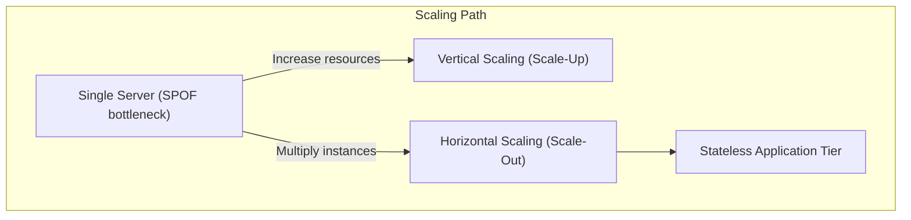
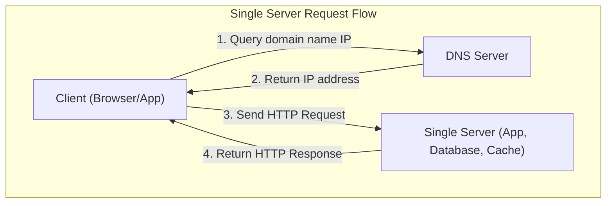
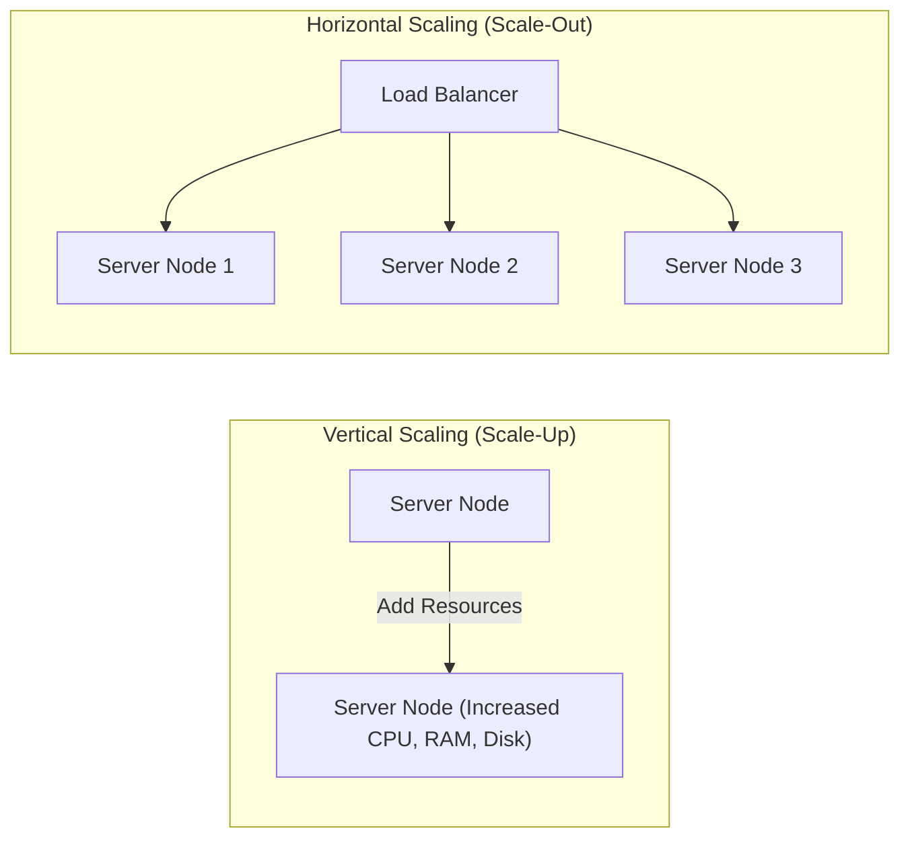

---
domains:
  - "infra"
---

# Module 1-1: Scaling & Single Server Setup

This module covers the foundations of systems design, progressing from a single-server paradigm to scaled backend architectures. It details the request lifecycle, DNS resolution, and the core differences, limits, and trade-offs of vertical vs. horizontal scaling.

---

## 🗺️ Cognitive Map: How to Think About Scaling

---

## 1. The Single Server Paradigm

In a foundational system setup, all software components execute on a single physical or virtual machine. This includes:
* **Presentation & Web Layer:** Serves static assets (HTML, CSS, JS) to client browsers.
* **Application Layer:** Executes the business logic (e.g., Node.js, Python, FastAPI, Java).
* **Data Layer:** Hosts the database system (e.g., PostgreSQL, MySQL) and cache tier (e.g., Redis).

### Request Lifecycle on a Single Server:
1. The user inputs a domain name (e.g., `app.demo.com`) in the client application.
2. The client queries the **Domain Name System (DNS)** to map the host domain to the server's public IP address.
3. The DNS resolver returns the IP address.
4. The client initiates an HTTP request directly to the server's IP address.
5. The server processes the request, queries the local database, and returns the response (HTML page or JSON payload).

---

## 2. Vertical vs. Horizontal Scaling

As traffic grows, a single server eventually hits hardware bottlenecks (CPU cores, RAM capacity, disk IOPS, or network bandwidth). We scale the system using two primary strategies:

### A. Vertical Scaling (Scale-Up)
Adding more hardware resources (more CPU cores, more RAM, faster SSDs) to the existing server instance.
* **Advantages:** 
  - Simplicity: Requires zero architectural changes or code refactoring.
  - Low Initial Overhead: No need for network load balancing or distributed state coordination.
* **Limitations:** 
  - Hardware Ceiling: Physical limits exist on how much resources a single motherboard can host.
  - No Redundancy: If the server crashes, the entire system experiences a complete outage (Single Point of Failure).

### B. Horizontal Scaling (Scale-Out)
Adding more server instances to distribute the processing load.
* **Advantages:**
  - Virtually Limitless Scale: Instances can be added dynamically as demand increases.
  - High Availability: If one node crashes, other nodes continue to process incoming client requests.
  - Elasticity: Instances can be provisioned or terminated dynamically to match traffic fluctuations.
* **Limitations:**
  - State Management: Requires application tiers to be completely **stateless** (sessions must be outsourced to caches or database stores).
  - Complexity: Introduces routing components (Load Balancers) and network latency.

---

## 3. Foundational Metrics: Availability & Latency

### A. Availability (Uptime & Fault Tolerance)
Availability is the percentage of time a system remains operational and accessible. It is commonly expressed in "nines" (e.g., 99.99% is "four nines", allowing ~52.6 minutes of downtime per year).

#### Deep-Intuition (AARF) Breakdown:
1. **The Answer (Core Pattern):** Design for high availability using horizontal scaling, active-active or active-passive redundancy, health-checked load balancers, and multi-region replication.
2. **The Assumptions (Context):** Requires stateless application tiers, network connectivity between regions/nodes, and database engines that support replication (e.g., read replicas or multi-primary).
3. **The Rationale (Why):** Eliminating Single Points of Failure (SPOF) prevents a single hardware or software crash from taking down the entire service. Load balancers dynamically route traffic away from unhealthy nodes, and replicas preserve data.
4. **The Failure Loop (What if not):** If a single node is used without redundancy (SPOF), any hardware crash, network partition, or application deadlock leads to a complete service outage (triggering `502 Bad Gateway`, `Connection Refused`, or connection timeouts). A failure of the primary database without failover leaves the app read-only or entirely offline.
5. **Alternative Case (When to use 'if not'):** For non-critical internal tools, dev/staging environments, or batch processing jobs where brief downtime is acceptable, running a single server avoids the massive cost and synchronization complexity (e.g., CAP theorem tradeoffs) of distributed redundancy.

### B. Latency (Response Time & Snappiness)
Latency is the time taken to complete a single request or operation, measured in milliseconds (ms) or microseconds (μs).

#### Deep-Intuition (AARF) Breakdown:
1. **The Answer (Core Pattern):** Minimize latency by introducing edge CDNs for static assets, local in-memory caching (e.g., Redis), connection pooling, optimized database indexes, and database query tuning.
2. **The Assumptions (Context):** Assumes the application read path can tolerate eventual consistency if cached data is slightly stale, and requires RAM capacity on caching servers.
3. **The Rationale (Why):** High latency degrades user experience. Users perceive delays above 100ms as non-instantaneous, which directly impacts conversion rates. Total latency is cumulative across network hops, DNS resolution, TLS handshakes, application processing, and database execution.
4. **The Failure Loop (What if not):** Without latency optimization (e.g., uncached heavy queries, lack of database indexes), application threads block waiting on I/O. Under load, this exhausts the server thread pool, causing request queues to grow, leading to latency cascades, socket timeouts (`Gateway Timeout - 504`), and system collapse.
5. **Alternative Case (When to use 'if not'):** For heavy analytical workloads (OLAP), reports generation, and asynchronous ETL batch processing, latency is secondary. Prioritizing throughput (processing millions of rows in batches) is more cost-efficient and computationally sensible than optimizing for immediate sub-second responses.
