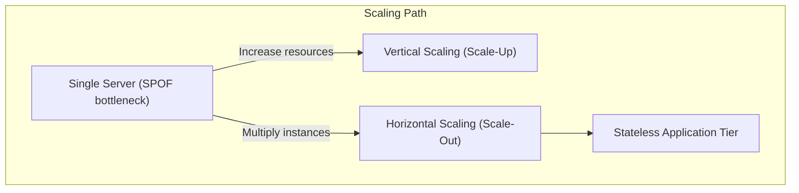
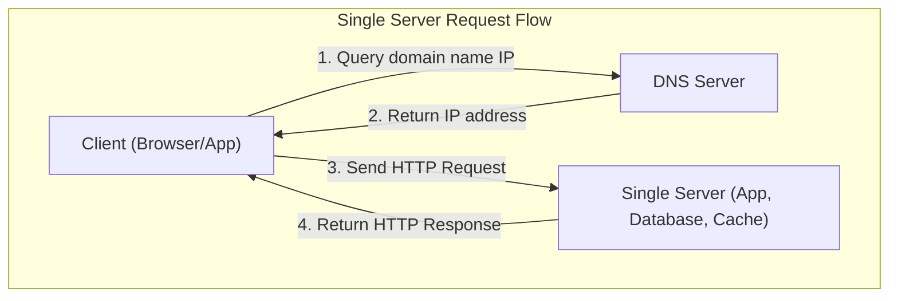
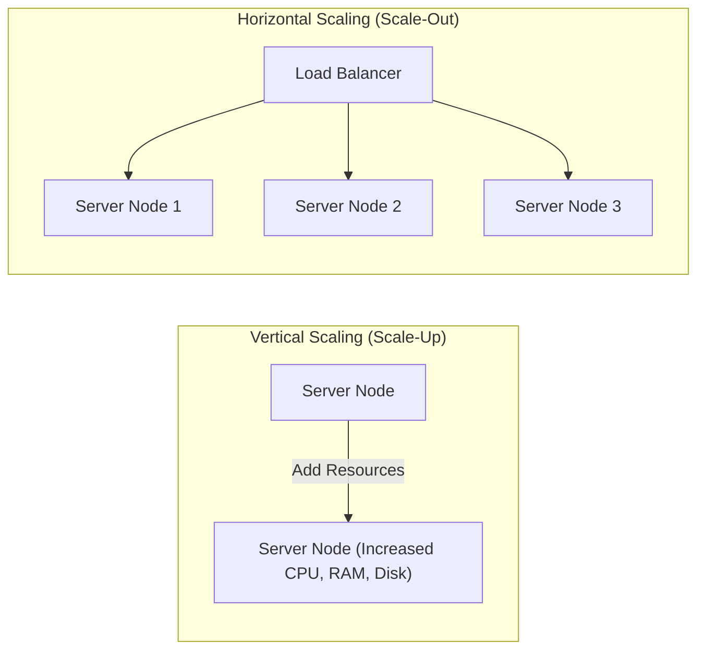

---
domains:
  - "infra"
---

# Module 1-1: Scaling & Single Server Setup

This module covers the foundations of systems design, progressing from a single-server paradigm to scaled backend architectures. It details the request lifecycle, DNS resolution, and the core differences, limits, and trade-offs of vertical vs. horizontal scaling.

---

## 🗺️ Cognitive Map: How to Think About Scaling

---

## 1. The Single Server Paradigm

In a foundational system setup, all software components execute on a single physical or virtual machine. This includes:
* **Presentation & Web Layer:** Serves static assets (HTML, CSS, JS) to client browsers.
* **Application Layer:** Executes the business logic (e.g., Node.js, Python, FastAPI, Java).
* **Data Layer:** Hosts the database system (e.g., PostgreSQL, MySQL) and cache tier (e.g., Redis).

### Request Lifecycle on a Single Server:
1. The user inputs a domain name (e.g., `app.demo.com`) in the client application.
2. The client queries the **Domain Name System (DNS)** to map the host domain to the server's public IP address.
3. The DNS resolver returns the IP address.
4. The client initiates an HTTP request directly to the server's IP address.
5. The server processes the request, queries the local database, and returns the response (HTML page or JSON payload).

---

## 2. Vertical vs. Horizontal Scaling

As traffic grows, a single server eventually hits hardware bottlenecks (CPU cores, RAM capacity, disk IOPS, or network bandwidth). We scale the system using two primary strategies:

### A. Vertical Scaling (Scale-Up)
Adding more hardware resources (more CPU cores, more RAM, faster SSDs) to the existing server instance.
* **Advantages:** 
  - Simplicity: Requires zero architectural changes or code refactoring.
  - Low Initial Overhead: No need for network load balancing or distributed state coordination.
* **Limitations:** 
  - Hardware Ceiling: Physical limits exist on how much resources a single motherboard can host.
  - No Redundancy: If the server crashes, the entire system experiences a complete outage (Single Point of Failure).

### B. Horizontal Scaling (Scale-Out)
Adding more server instances to distribute the processing load.
* **Advantages:**
  - Virtually Limitless Scale: Instances can be added dynamically as demand increases.
  - High Availability: If one node crashes, other nodes continue to process incoming client requests.
  - Elasticity: Instances can be provisioned or terminated dynamically to match traffic fluctuations.
* **Limitations:**
  - State Management: Requires application tiers to be completely **stateless** (sessions must be outsourced to caches or database stores).
  - Complexity: Introduces routing components (Load Balancers) and network latency.

