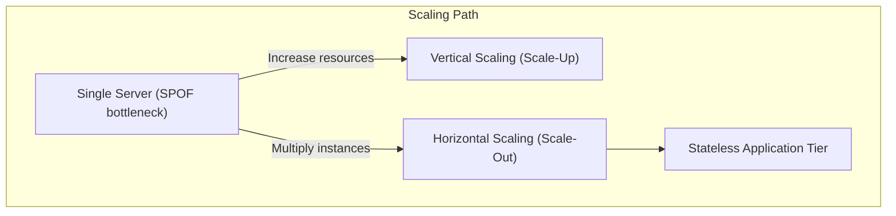
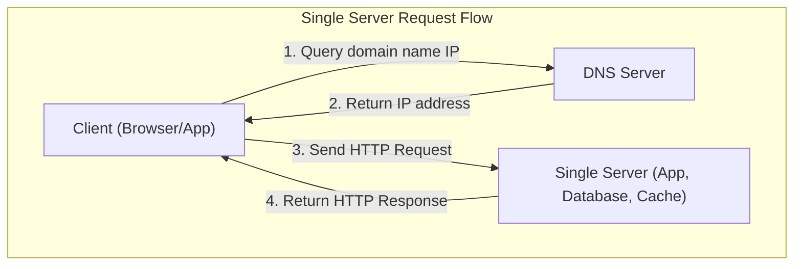
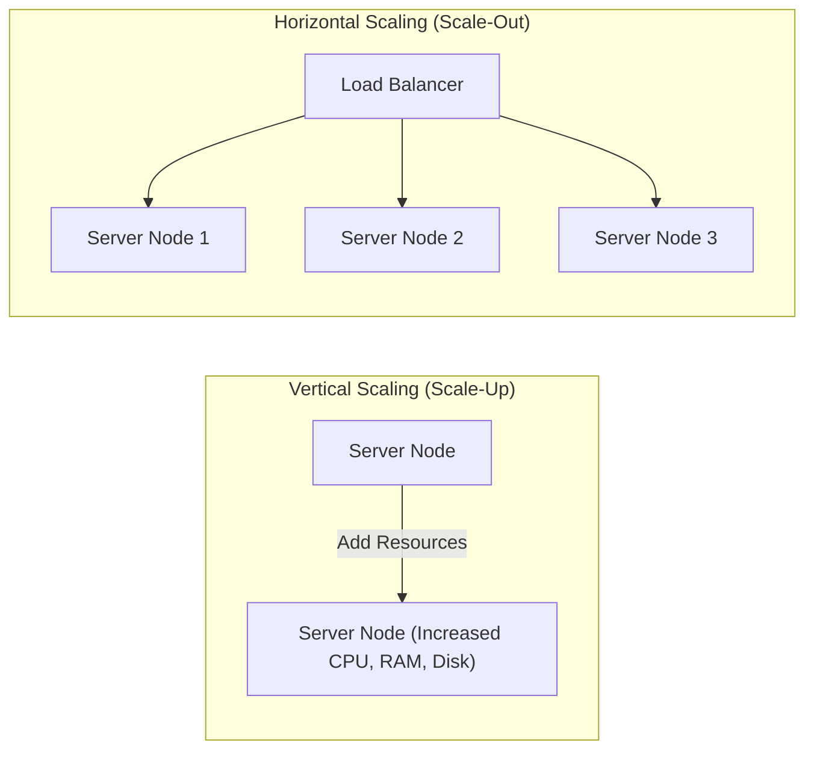

---
domains:
  - "infra"
---

# Module 1-1: Scaling & Single Server Setup

This module covers the foundations of systems design, progressing from a single-server paradigm to scaled backend architectures. It details the request lifecycle, DNS resolution, and the core differences, limits, and trade-offs of vertical vs. horizontal scaling.

---

## 🗺️ Cognitive Map: How to Think About Scaling

---

## 1. The Single Server Paradigm

In a foundational system setup, all software components execute on a single physical or virtual machine. This includes:
* **Presentation & Web Layer:** Serves static assets (HTML, CSS, JS) to client browsers.
* **Application Layer:** Executes the business logic (e.g., Node.js, Python, FastAPI, Java).
* **Data Layer:** Hosts the database system (e.g., PostgreSQL, MySQL) and cache tier (e.g., Redis).

### Request Lifecycle on a Single Server:
1. The user inputs a domain name (e.g., `app.demo.com`) in the client application.
2. The client queries the **Domain Name System (DNS)** to map the host domain to the server's public IP address.
3. The DNS resolver returns the IP address.
4. The client initiates an HTTP request directly to the server's IP address.
5. The server processes the request, queries the local database, and returns the response (HTML page or JSON payload).

---

## 2. Vertical vs. Horizontal Scaling

As traffic grows, a single server eventually hits hardware bottlenecks (CPU cores, RAM capacity, disk IOPS, or network bandwidth). We scale the system using two primary strategies:

### A. Vertical Scaling (Scale-Up)
Adding more hardware resources (more CPU cores, more RAM, faster SSDs) to the existing server instance.
* **Advantages:** 
  - Simplicity: Requires zero architectural changes or code refactoring.
  - Low Initial Overhead: No need for network load balancing or distributed state coordination.
* **Limitations:** 
  - Hardware Ceiling: Physical limits exist on how much resources a single motherboard can host.
  - No Redundancy: If the server crashes, the entire system experiences a complete outage (Single Point of Failure).

### B. Horizontal Scaling (Scale-Out)
Adding more server instances to distribute the processing load.
* **Advantages:**
  - Virtually Limitless Scale: Instances can be added dynamically as demand increases.
  - High Availability: If one node crashes, other nodes continue to process incoming client requests.
  - Elasticity: Instances can be provisioned or terminated dynamically to match traffic fluctuations.
* **Limitations:**
  - State Management: Requires application tiers to be completely **stateless** (sessions must be outsourced to caches or database stores).
  - Complexity: Introduces routing components (Load Balancers) and network latency.

---

## 3. Foundational Metrics & Trade-offs: Availability, Reliability, Latency, & Throughput

### A. Availability (Uptime & Fault Tolerance)
Availability is the percentage of time a system remains operational and accessible. It is commonly expressed in "nines" (e.g., 99.99% is "four nines", allowing ~52.6 minutes of downtime per year).

#### Deep-Intuition (AARF) Breakdown:
1. **The Answer (Core Pattern):** Design for high availability using horizontal scaling, active-active or active-passive redundancy, health-checked load balancers, and multi-region replication.
2. **The Assumptions (Context):** Requires stateless application tiers, network connectivity between regions/nodes, and database engines that support replication (e.g., read replicas or multi-primary).
3. **The Rationale (Why):** Eliminating Single Points of Failure (SPOF) prevents a single hardware or software crash from taking down the entire service. Load balancers dynamically route traffic away from unhealthy nodes, and replicas preserve data.
4. **The Failure Loop (What if not):** If a single node is used without redundancy (SPOF), any hardware crash, network partition, or application deadlock leads to a complete service outage (triggering `502 Bad Gateway`, `Connection Refused`, or connection timeouts). A failure of the primary database without failover leaves the app read-only or entirely offline.
5. **Alternative Case (When to use 'if not'):** For non-critical internal tools, dev/staging environments, or batch processing jobs where brief downtime is acceptable, running a single server avoids the massive cost and synchronization complexity (e.g., CAP theorem tradeoffs) of distributed redundancy.

### B. Latency (Response Time & Snappiness)
Latency is the time taken to complete a single request or operation, measured in milliseconds (ms) or microseconds (μs).

#### Deep-Intuition (AARF) Breakdown:
1. **The Answer (Core Pattern):** Minimize latency by introducing edge CDNs for static assets, local in-memory caching (e.g., Redis), connection pooling, optimized database indexes, and database query tuning.
2. **The Assumptions (Context):** Assumes the application read path can tolerate eventual consistency if cached data is slightly stale, and requires RAM capacity on caching servers.
3. **The Rationale (Why):** High latency degrades user experience. Users perceive delays above 100ms as non-instantaneous, which directly impacts conversion rates. Total latency is cumulative across network hops, DNS resolution, TLS handshakes, application processing, and database execution.
4. **The Failure Loop (What if not):** Without latency optimization (e.g., uncached heavy queries, lack of database indexes), application threads block waiting on I/O. Under load, this exhausts the server thread pool, causing request queues to grow, leading to latency cascades, socket timeouts (`Gateway Timeout - 504`), and system collapse.
5. **Alternative Case (When to use 'if not'):** For heavy analytical workloads (OLAP), reports generation, and asynchronous ETL batch processing, latency is secondary. Prioritizing throughput (processing millions of rows in batches) is more cost-efficient and computationally sensible than optimizing for immediate sub-second responses.

### C. Reliability (Fault Tolerance & Correctness)
Reliability measures a system's ability to perform its intended function correctly and consistently over time under various operating conditions.

#### Deep-Intuition (AARF) Breakdown:
1. **The Answer (Core Pattern):** Build reliability through active fault isolation (circuit breakers, rate limiting), error handling (exponential backoff with jitter, retry policies), inputs validation, and data idempotency keys.
2. **The Assumptions (Context):** Assumes that downstream systems are capable of handling retried operations, and requires stateless execution contexts that can safely repeat failed queries.
3. **The Rationale (Why):** Preventing a single service error from escalating keeps the wider system functional. For instance, circuit breakers instantly reject requests to an overloaded service rather than queueing them and crashing upstream workers. Idempotency guarantees that a retried request (e.g., a payment) executes exactly once.
4. **The Failure Loop (What if not):** Without reliability controls, transient network drops or database deadlocks lead to unhandled errors that propagate up the stack. A lack of idempotency keys causes duplicate writes, resulting in corrupted ledgers, double billing, or inconsistent system states. In extreme cases, rapid unjittered client retries create a "thundering herd" effect that crushes recovering services.
5. **Alternative Case (When to use 'if not'):** In non-critical pipelines (like raw clickstream collection or telemetry logging), dropping a small percentage of data is acceptable. Here, optimizing for low code complexity and maximum ingestion performance overrides strict reliability.

### D. Throughput (Data & Processing Capacity)
Throughput measures the total volume of work or transactions a system completes in a given time frame (e.g., Requests Per Second (RPS), Transactions Per Second (TPS), or megabytes per second (MB/s)).

#### Deep-Intuition (AARF) Breakdown:
1. **The Answer (Core Pattern):** Maximize throughput by introducing asynchronous processing queues, database connection pools, non-blocking asynchronous I/O loops (e.g., event loop models), and request batching.
2. **The Assumptions (Context):** Assumes clients can tolerate minor queueing delays (buffers) before requests are processed, and requires memory allocation to buffer requests in transit.
3. **The Rationale (Why):** Grouping operations into batches (e.g., batch SQL inserts) reduces the aggregate overhead of network handshakes, disk head seeks, and thread context switching, which maximizes hardware processing capacity.
4. **The Failure Loop (What if not):** Attempting to process high-concurrency traffic with a thread-per-request blocking model causes the CPU to spend more time context-switching threads than executing business logic. Under peak load, this exhausts thread pools, causing request timeouts, memory exhaustion, and Out-Of-Memory (OOM) crashes.
5. **Alternative Case (When to use 'if not'):** In highly transactional, low-latency applications (like financial order matching or real-time gaming), batching and queueing are unacceptable as they increase response time. The architecture must prioritize sub-millisecond execution (latency) over processing volume (throughput).

---

## 4. Distributed Systems Guardrails

### A. CAP Theorem (Consistency vs. Availability vs. Partition Tolerance)
The CAP Theorem states that a distributed system operating over an unreliable network (subject to partitions) can guarantee at most two of the three properties: Consistency, Availability, and Partition Tolerance. In practice, because network partitions (P) are inevitable, distributed systems must choose between Consistency (CP) and Availability (AP).

#### Deep-Intuition (AARF) Breakdown:
1. **The Answer (Core Pattern):** Architect distributed data stores to explicitly choose either Consistency (CP - reject stale reads/writes during a partition) or Availability (AP - serve stale or conflicting data locally and resolve it later).
2. **The Assumptions (Context):** Assumes a network partition can and will occur.
3. **The Rationale (Why):** In a CP system (e.g., etcd, ZooKeeper), data correctness is absolute; the system blocks write and read access on partitioned nodes to prevent split-brain states. In an AP system (e.g., Cassandra, DynamoDB), uptime is prioritized; nodes accept writes locally and reconcile data asynchronously.
4. **The Failure Loop (What if not):** Failing to choose a CAP behavior during partitions leads to split-brain states if write access is permitted to both sides of the partitioned network. Conflicting modifications will overwrite each other, leading to permanent data corruption, loss of transactional integrity, or broken business rules.
5. **Alternative Case (When to use 'if not'):** If the database is hosted entirely on a single physical server, network partitions cannot occur within the database. The CAP theorem does not apply, allowing both consistency and availability at the cost of running a single point of failure.

### B. Observability (Logs, Metrics, & Traces)
Observability is the capacity to infer the internal state and execution paths of a system based on its external outputs.

#### Deep-Intuition (AARF) Breakdown:
1. **The Answer (Core Pattern):** Instrument the codebase with structured logging (JSON formatting), metric collectors (e.g., Prometheus counters, histograms), and distributed tracing context propagation (e.g., OpenTelemetry span tracking).
2. **The Assumptions (Context):** Requires downstream storage infrastructure (Elasticsearch, Jaeger, Prometheus) and network bandwidth to ingest telemetry without degrading core API performance.
3. **The Rationale (Why):** Distributed architectures make single-node log analysis useless. Distributed tracing embeds correlation IDs into headers to follow a request across multiple microservice boundaries, enabling instant localization of slow database queries, microservice failures, or network bottlenecks.
4. **The Failure Loop (What if not):** Without observability, debug cycles depend on manual log searches, guesswork, or attempts to replicate errors locally. The Mean Time to Resolution (MTTR) increases exponentially, and silent resource leaks (like DB connection pool leaks) degrade application performance unchecked until a crash occurs.
5. **Alternative Case (When to use 'if not'):** In simple, low-traffic monoliths or early prototypes, basic server console output and simple machine resource monitoring (CPU/RAM metrics) are sufficient, saving the substantial licensing, storage, and CPU overhead of distributed tracing.

### C. Maintainability (Extensibility, Testability, & Operability)
Maintainability is the ease with which a software system can be updated, debugged, corrected, or extended to support new requirements without introducing regression issues.

#### Deep-Intuition (AARF) Breakdown:
1. **The Answer (Core Pattern):** Structure code with clean domain boundaries (e.g., Ports and Adapters, Modular Monoliths), write robust unit and integration test suites, and enforce automated formatting/linting within CI/CD pipelines.
2. **The Assumptions (Context):** Requires developer discipline, continuous code reviews, and investment in automated verification pipelines.
3. **The Rationale (Why):** Encapsulated components ensure that modifications to one business domain (e.g., billing) do not ripple into and break unrelated domains (e.g., catalog). Automated tests guarantee that legacy code paths continue to operate as expected during updates.
4. **The Failure Loop (What if not):** Neglecting maintainability leads to high technical debt. Code becomes a tightly coupled "ball of mud". Every new feature or bug fix triggers cascading failures in random areas of the system. Iteration speed slows to a crawl, and the codebase eventually becomes too fragile to change, requiring a complete rewrite.
5. **Alternative Case (When to use 'if not'):** For throwaway prototypes, hackathons, or exploratory proof-of-concepts, maintainability guidelines are intentionally ignored to achieve maximum development speed.

