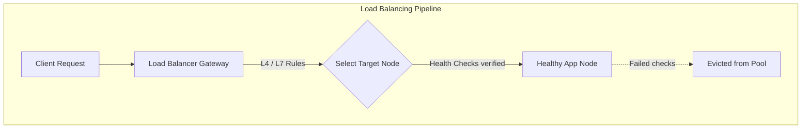
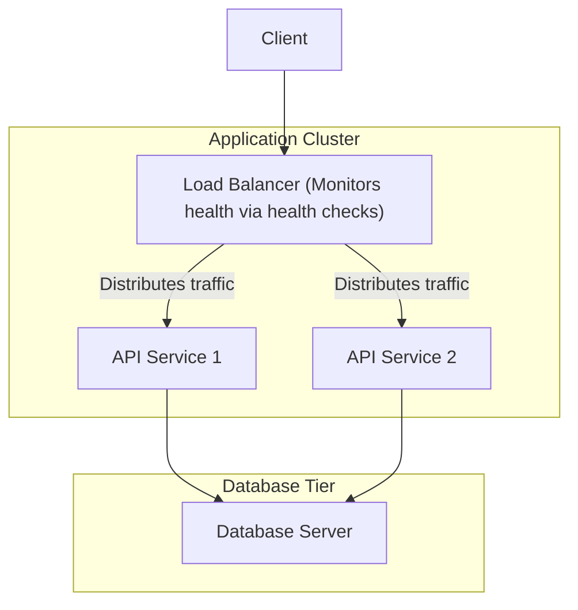
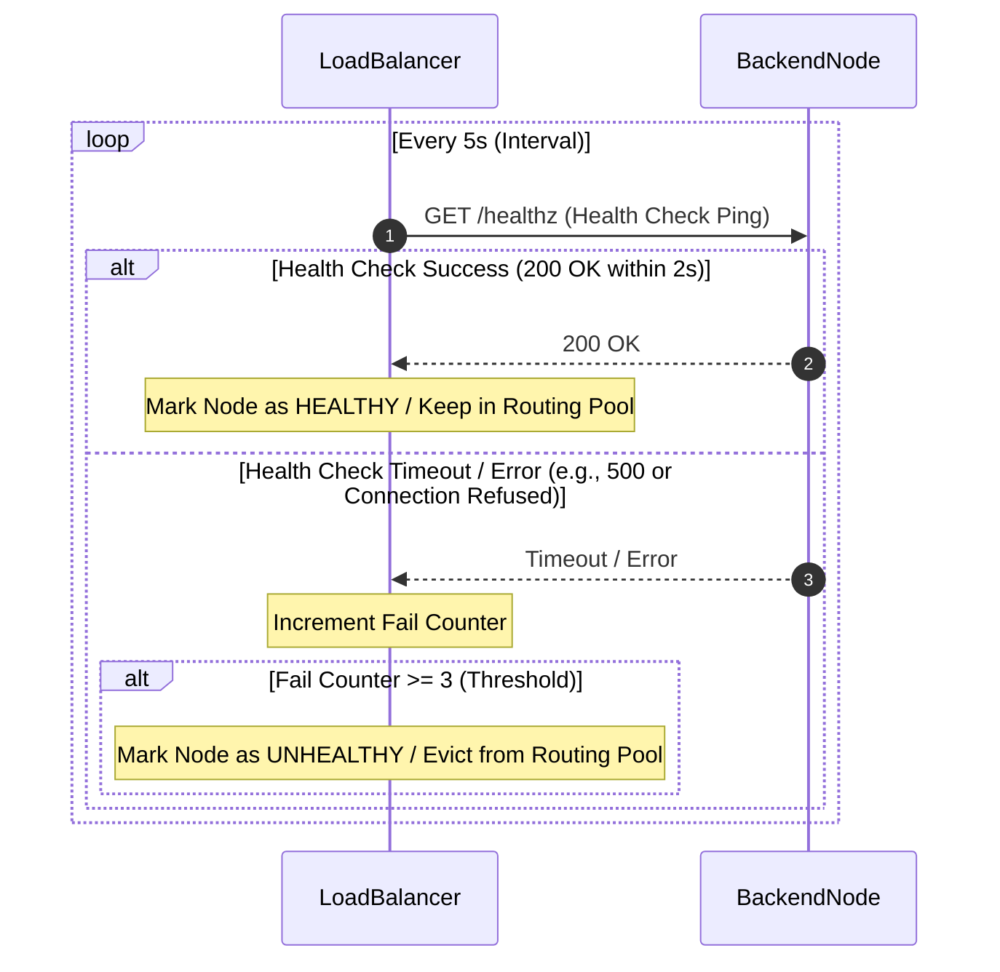
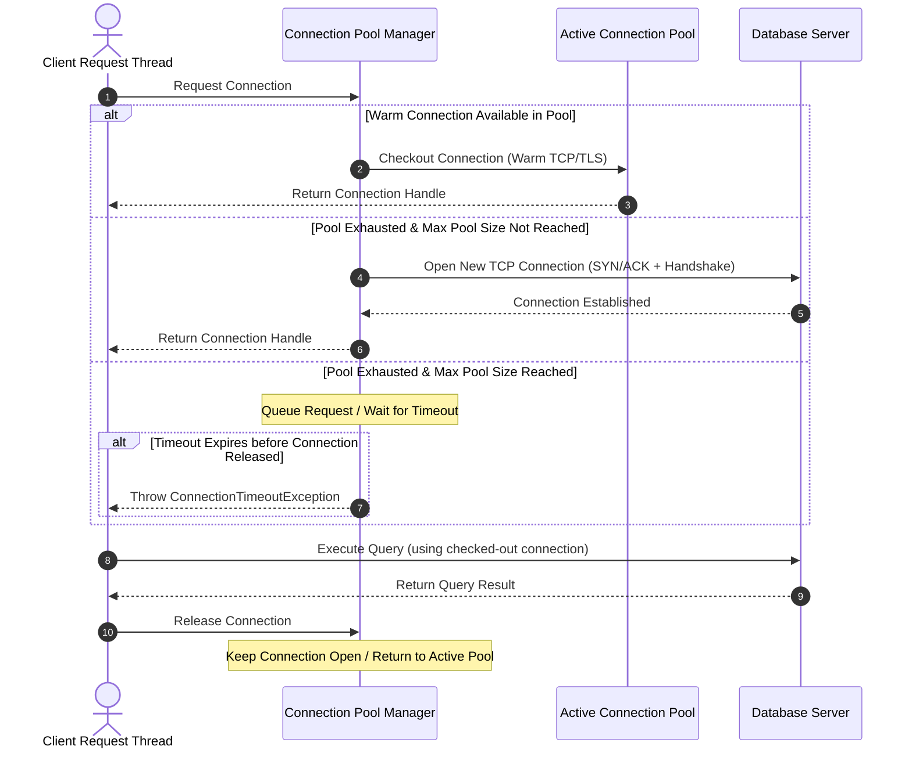

---
domains:
  - "networking"
  - "infra"
---

# Module 1-2: Load Balancing Topologies & Algorithms

This module covers traffic distribution mechanics using Load Balancers (LBs). It details Layer 4 vs. Layer 7 proxy routing, load balancing algorithms, active health checks, and strategies for achieving high availability (SPOF mitigation).

---

## 🗺️ Cognitive Map: How to Think About Load Balancing

---

## 1. Traffic Distribution Mechanics

To implement horizontal scaling, we insert a **Load Balancer (LB)** between the client and backend application servers. The load balancer acts as a reverse proxy, accepting incoming traffic and distributing it across a pool of backend servers.

### Routing Layers: Layer 4 vs. Layer 7
* **Layer 4 (L4) Transport-Level Routing:** Routes traffic based on packet headers at the transport layer (TCP/UDP), examining only IPs and port numbers. It does not decrypt or inspect request payloads (like HTTP headers or URLs).
  - *Pros:* Extremely fast, low CPU utilization, high throughput.
  - *Cons:* No path-based routing (e.g. cannot separate `/api` from `/static`), cannot modify HTTP headers.
* **Layer 7 (L7) Application-Level Routing:** Parses the application-layer payload (HTTP/HTTPS), routing traffic based on URL paths, query strings, headers, cookies, or request methods.
  - *Pros:* Intelligent path-based routing, header injections (e.g. `X-Forwarded-For`), SSL/TLS termination.
  - *Cons:* CPU-intensive due to TLS decryption and deep packet inspection.

---

## 2. Load Balancing Algorithms

Load balancers rely on specific mathematical algorithms to assign clients to backend targets:

* **Round Robin:** Routes incoming requests sequentially through the list of servers. Best when servers are identical in capacity and request processing times are uniform.
* **Weighted Round Robin:** Assigns a capacity weight to each server. Nodes with higher weights receive a proportionally larger share of traffic.
* **Least Connections:** Routes traffic to the server with the fewest active TCP connections. Ideal for long-running sessions (e.g. file transfers).
* **Least Response Time:** Evaluates server latency and routes to the fastest-responding node with the fewest active connections.
* **IP Hashing:** Hashes the client's source IP address to compute a static target server. Ensures session persistence (sticky sessions) so a client consistently hits the same backend node.
* **Consistent Hashing:** Maps servers and keys to a circular ring. Primarily used in distributed caching to minimize cache invalidation when nodes are added or removed.

---

## 3. Health Monitoring & High Availability

To ensure traffic is only routed to healthy nodes, load balancers perform active **Health Checks**:
1. The LB periodically sends HTTP requests (e.g. `/healthz`) or TCP pings to each backend server.
2. If a server responds with `200 OK` within a timeout window, it remains in the active pool.
3. If it fails or times out, the LB removes it from the routing pool.
4. Once the server recovers and passes checks again, it is re-integrated.

### Single Point of Failure (SPOF) Mitigation:
An individual load balancer is a SPOF. If it fails, the entire cluster becomes unreachable. To prevent this, systems implement **LB Redundancy**:
* **Active-Passive Pair:** An active LB handles traffic while a passive (standby) LB monitors it. They share a virtual IP (VIP) using protocols like VRRP. If the active LB fails, the standby takes over the IP immediately.
* **Active-Active Pair:** Both LBs handle traffic concurrently, coordinated by DNS-based routing (e.g. Round Robin DNS).

---

## 4. Proxies: Forward vs. Reverse Proxy

Proxies act as intermediaries between clients and servers. They are categorized based on their orientation:

### A. Forward Proxy (Client-Facing Gateway)
A forward proxy sits between internal clients and the external internet, making requests on behalf of the clients.

#### Deep-Intuition (AARF) Breakdown:
1. **The Answer (Core Pattern):** Deploy a forward proxy (e.g., Squid) at the egress boundary of a private network. Force all client machines to route their outbound web traffic through the proxy.
2. **The Assumptions (Context):** Requires clients to be configured manually, via DHCP/group policies, or transparently at the router level.
3. **The Rationale (Why):** Masks client IPs to hide the internal network topology from external services. It centralizes control over outbound traffic, enabling organizations to filter malicious domains, audit network traffic, and save bandwidth by caching external assets.
4. **The Failure Loop (What if not):** Without a forward proxy, client devices connect directly to external IPs, allowing compromised machines to communicate with malicious command-and-control (C2) servers without monitoring. If the proxy is misconfigured or fails, all egress traffic collapses, returning connection timeouts.
5. **Alternative Case (When to use 'if not'):** For decentralized edge computations, simple home networks, or serverless functions with low egress security requirements, a forward proxy introduces unnecessary hops and network overhead.

### B. Reverse Proxy (Server-Facing Gateway)
A reverse proxy sits in front of a pool of backend application servers, accepting incoming client requests and forwarding them internally.

#### Deep-Intuition (AARF) Breakdown:
1. **The Answer (Core Pattern):** Deploy a reverse proxy (e.g., Nginx, HAProxy) at the ingress boundary of the application tier. Configure public DNS to point to the proxy, keeping backend app servers in a private subnet.
2. **The Assumptions (Context):** Backend servers must be configured to trust headers injected by the proxy (e.g., `X-Forwarded-For`) and must block direct traffic from the public internet.
3. **The Rationale (Why):** Hides the backend infrastructure's IP addresses and port topology to prevent direct attacks. It centralizes SSL/TLS decryption (SSL termination), applies response compression, caches static resources, and performs intelligent path routing (Layer 7).
4. **The Failure Loop (What if not):** If omitted, backend servers must be exposed publicly, exposing application ports to active exploits. Certificate renewal must be configured on every individual host. If a server goes down, the client receives direct connection drops rather than a clean, proxy-handled failover.
5. **Alternative Case (When to use 'if not'):** For extremely small, static websites or highly managed cloud platforms (like AWS Lambda + API Gateway) that handle TLS termination and routing automatically, a self-managed reverse proxy adds deployment overhead.

---

## 5. Network Optimization: Connection Pooling

Establishing TCP and TLS connections repeatedly is computationally expensive. Connection pooling mitigates this by maintaining a set of reusable, active connections.

### Connection Pool Lifecycle Flow:

#### Deep-Intuition (AARF) Breakdown:
1. **The Answer (Core Pattern):** Configure a connection pool (e.g., HikariCP for Java, database driver pools, Nginx HTTP keepalive blocks) with fixed minimum/maximum sizes, idle timeouts, and connection validation queries (e.g., `SELECT 1`).
2. **The Assumptions (Context):** Assumes the backend service (database, API) supports persistent connections and has its own connection limits configured to accommodate the pool's maximum size.
3. **The Rationale (Why):** By keeping connections open (warm), applications bypass the 3-way TCP handshake and TLS key exchange on every request, reducing latency and avoiding thread starvation.
4. **The Failure Loop (What if not):** Without connection pooling, a traffic spike causes a "connection storm", crashing downstream databases by exceeding file descriptor limits or database limits (e.g., `Too many connections` in MySQL). If connections are leaked (not returned to the pool), application threads block indefinitely waiting for a connection, leading to a complete service freeze.
5. **Alternative Case (When to use 'if not'):** In serverless architectures (e.g., AWS Lambda) where execution contexts are created and destroyed rapidly, standard in-memory connection pooling cannot persist. Centralized external connection proxies (e.g., RDS Proxy) must be used instead.

---

## 🛠️ Hands-on Verification Project

To verify and inspect the complete, production-grade hands-on configuration files for Nginx load balancing (upstream algorithms, reverse-proxy headers, passive health check timeouts), refer to:
- [[Projects/Systems Design/Project - Secure Load-Balanced Web API.md#1-nginx-load-balancer-and-gateway-configuration-nginxconf|Nginx Load Balancer Config Playbook]]
