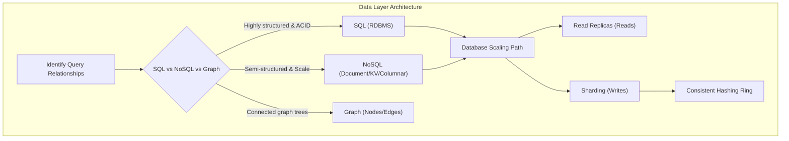
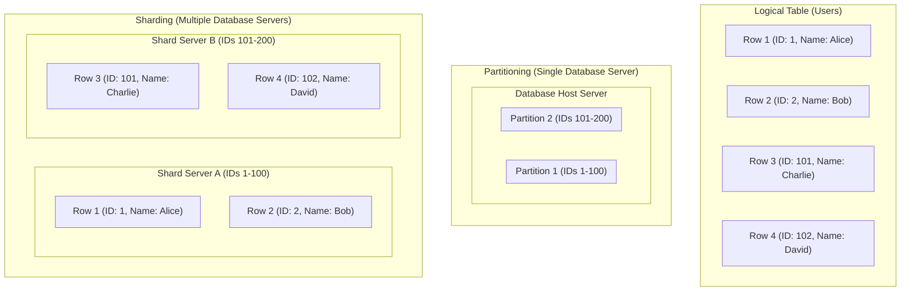
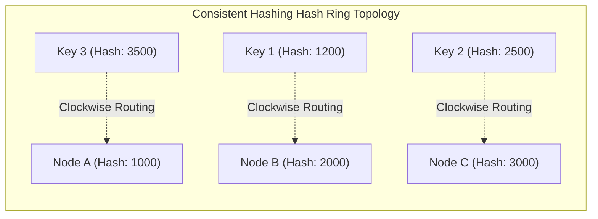

---
domains:
  - "database"
  - "infra"
---

# Module 1-3: Database Architectures & Sharding

This module covers the core database paradigms (SQL vs. NoSQL vs. Graph), horizontal data scaling, table sharding key selection, and the mathematical mechanics of Consistent Hashing.

---

## 🗺️ Cognitive Map: How to Think About Data Architecture

---

## 1. Database Paradigms

Selecting the correct database model depends on data relationship complexity, write/read volumes, latency SLAs, and transaction consistency requirements.

### A. Relational Databases (SQL / RDBMS)
* **Examples:** PostgreSQL, MySQL, SQLite, Oracle, MariaDB.
* **Data Model:** Highly structured tables with rows, columns, and foreign key relations.
* **Core Guarantees:** Strict **ACID** (Atomicity, Consistency, Isolation, Durability) transactions.
* **Key Benefits:**
  - Strong data integrity enforced via schemas, constraints, and relational checks.
  - Standardized declarative query language (SQL) supporting complex multi-table `JOIN` operations.
  - Mature ecosystem with extensive tooling and deployment patterns.
* **Key Trade-offs:**
  - Difficult to scale out horizontally; scaling generally requires read replicas (introducing eventual consistency) or complex sharding.
  - High lock contention and latency under heavy concurrent write loads.
  - Schema migrations are expensive and require coordination, which can lock tables during deployments.

### B. Non-Relational Databases (NoSQL)
NoSQL engines sacrifice complex joins and absolute consistency to achieve horizontal scaling, schema flexibility, and low-latency performance.

1. **Document Stores:**
   - *Examples:* MongoDB, CouchDB.
   - *Data Model:* Semi-structured, nested JSON-like documents.
   - *Best For:* User profiles, catalogs, or domains with rapidly evolving schemas.
   - *Pros/Cons:* Flexible schema and fast aggregate reads; but lacks database-enforced relations and joins.
2. **Key-Value Stores:**
   - *Examples:* Redis, Memcached.
   - *Data Model:* High-speed distributed hash map storing arbitrary values mapped to unique keys.
   - *Best For:* Session tokens, rate limiting counters, database query caching.
   - *Pros/Cons:* Sub-millisecond reads/writes and simple partitioning; but query capability is limited strictly to key lookups.
3. **Wide-Column / Columnar Family Stores:**
   - *Examples:* Apache Cassandra, ScyllaDB, HBase.
   - *Data Model:* Multi-dimensional tables indexing rows by partition and clustering keys. Columns can vary per row.
   - *Best For:* Telemetry log ingestion, large sparse datasets, write-heavy event logging at scale.
   - *Pros/Cons:* Petabyte-scale write throughput and linear scaling; but query patterns must be pre-planned and ad-hoc searches are slow.
4. **Graph Databases:**
   - *Examples:* Neo4j, Amazon Neptune.
   - *Data Model:* Nodes (entities), Edges (relationships), and Properties.
   - *Best For:* Relationship-centric applications, social networks, recommendation engines, fraud detection. Traverses links directly (index-free adjacency) without SQL joins.
   - *Pros/Cons:* Constant-time relation traversal regardless of data size; but poor tabular scan performance and hard to shard horizontally.
5. **Time-Series Databases (TSDB):**
   - *Examples:* InfluxDB, Prometheus, TimescaleDB.
   - *Data Model:* Continuously appended time-stamped data points, optimizing time-axis writes and range queries.
   - *Best For:* Server metrics, IoT sensor telemetry, application logs. Employs delta encoding and compression to minimize disk usage.
   - *Pros/Cons:* High write ingestion rates and automatic downsampling; but updates or deletions of historical records are slow.
6. **Vector Databases:**
   - *Examples:* Pinecone, Milvus, Qdrant, Chroma.
   - *Data Model:* High-dimensional mathematical vectors (embeddings) representing semantic content.
   - *Best For:* Semantic search, AI-native workflows, LLM retrieval (RAG). Queries use similarity algorithms (Approximate Nearest Neighbors - ANN) instead of exact key matching.
   - *Pros/Cons:* High semantic relevance search; but approximate results (not 100% precise) and high CPU/RAM overhead.

### C. Selection Matrix
* **Choose SQL when:** Transactional safety (ACID) is critical, relationships are highly structured, and multi-row consistency is required (e.g., financial ledger).
* **Choose NoSQL when:** Scale out is the main driver, schema flexibility is required, or access patterns match specialized models (e.g., graph relationships, timeseries logs, similarity vector search).

---

### D. Consistency Models: ACID vs. BASE

Distributed data architectures must choose between strong transactional safety (ACID) and scale-oriented availability (BASE). This trade-off is governed by the **CAP Theorem** (you cannot achieve Consistency, Availability, and Partition Tolerance simultaneously).

#### 1. ACID (Atomicity, Consistency, Isolation, Durability)
* **Atomicity:** All operations in a transaction succeed or all fail.
* **Consistency:** A transaction brings the database from one valid state to another, maintaining invariants.
* **Isolation:** Concurrent transactions execute without interfering with one another.
* **Durability:** Committed transactions persist even during power loss or system crashes.
* **Real-World Example (Bank Transfer):**
  If User A transfers $100 to User B, two writes must occur: debit $100 from User A, and credit $100 to User B. Under ACID, these two updates are executed as a single atomic unit. If the server crashes after debits but before credits, the database rolls back the transaction. Money is never created or destroyed; it is always consistent.
* **AARF Breakdown:**
  1. **The Answer (Core Config):** Rely on strict relational SQL engines (e.g. PostgreSQL, MySQL) employing lock-based concurrency control or multi-version concurrency control (MVCC).
  2. **The Assumptions (Context):** Transactions must be local, schema structures must be stable, and the business dictates zero tolerance for anomalies (e.g. double spending, duplicate billing).
  3. **The Rationale (Why):** Greatly simplifies application logic by delegating data safety and consistency validation directly to the database engine.
  4. **The Failure Loop (What if not):** Under high concurrent write volumes, lock contention limits throughput. Across distributed networks, executing multi-node ACID transactions (like 2-Phase Commit) introduces massive network latency hops and can block writes entirely if any node becomes unreachable.
  5. **Alternative Case (When to use 'if not'):** Adopt a BASE consistency model when high availability, global scale, and millisecond write-ingestion latencies are critical.

#### 2. BASE (Basically Available, Soft State, Eventual Consistency)
* **Basically Available:** The system prioritizes responding to requests, even if some replicas return stale data. (It's better to show an outdated profile or post than a blank error page).
* **Soft State:** Data states can change over time without direct user interaction due to replica synchronization lag. (Node A's counter might differ from Node B's for a brief window).
* **Eventual Consistency:** Replicas will synchronize and converge to the same state if no new updates are made. (Lag is usually milliseconds but can stretch to minutes during network partitions).
* **Real-World Example (Social Media Like):**
  A user updates their profile picture or likes a post. Under a BASE system, they see the new state instantly because their local server updates. However, their friends across the globe might see the old picture or count for a few minutes while the data replicates asynchronously. The system stays fast and available, and the data settles eventually.
* **AARF Breakdown:**
  1. **The Answer (Core Config):** Deploy distributed NoSQL engines (e.g. Cassandra, DynamoDB, MongoDB Atlas) using asynchronous replication and quorum write/read parameters.
  2. **The Assumptions (Context):** The system operates at a global scale with write-heavy workloads, and business requirements permit brief periods of stale reads (e.g. social feeds, search indexes, counter accumulations).
  3. **The Rationale (Why):** Decouples write operations from network latency, allowing nodes to accept writes locally and sync asynchronously, achieving high throughput and partition resilience.
  4. **The Failure Loop (What if not):** Developers must implement custom application-level conflict resolution (e.g. Last-Write-Wins, CRDTs) and handle out-of-order execution, leading to significant complexity and potential data drift if logic contains bugs.
  5. **Alternative Case (When to use 'if not'):** Revert to ACID transactions when operations are legally or financially audited, requiring a single, immediate source of absolute truth.

#### 3. Hybrid Consistency Design Pattern (SQL Core + NoSQL Edge)
In production architectures, teams rarely use just one model. A common pattern is to keep a small **ACID core** (RDBMS) for transactions that must always be correct (e.g., billing, ledger, authentication), and sync that data asynchronously to **BASE layers** (NoSQL caches and indexes) at the edge for global scale and fast reads. The core keeps the truth safe; the edge keeps the system fast and available.

---

## 2. Database Scaling: Partitioning & Sharding

As data sizes and throughput requirements grow, we must scale the storage tier horizontally.

### A. Read Replicas
Writes go to a primary database node, which replicates data asynchronously to one or more read-only replicas. This scales read volume but introduces **eventual consistency** delays and does not increase write capacity.

### B. Partitioning vs. Sharding
* **Partitioning (Vertical/Horizontal):** Splitting a single table into smaller subsets (partitions) *within the same physical database instance*.
* **Sharding:** Distributing horizontal subsets of a table across *multiple independent database host servers*.

#### Deep-Intuition (AARF) Breakdown for Database Sharding:
1. **The Answer (Core Pattern):** Shard a database by choosing a high-cardinality Sharding Key (e.g., hashed `user_id`) and routing queries via consistent hashing or a configuration lookup service.
2. **The Assumptions (Context):** Requires application-level query routing or database proxy middleware (e.g., Vitess, Citus) and database clients that support distributed routing.
3. **The Rationale (Why):** Single database instances hit hardware ceilings on disk I/O, memory, and CPU. Sharding partitions both data and physical hardware resources, providing linear scalability for write operations.
4. **The Failure Loop (What if not):** Selecting a low-cardinality or poorly distributed shard key (e.g., `country` or `created_date`) results in "Hot Spots" where a single shard receives the majority of writes, leading to CPU exhaustion and write latency spikes. If queries omit the shard key, the database must perform a "scatter-gather" query across all shards, adding significant latency.
5. **Alternative Case (When to use 'if not'):** For read-heavy applications with low write volumes, scaling reads with read replicas is vastly simpler and avoids the immense engineering, transactional, and cross-shard join complexities of sharding.

---

## 3. Consistent Hashing Mechanics

Consistent Hashing is an algorithmic routing strategy that resolves the massive data invalidation problem of standard hashing (`hash(key) % N`) when node count `N` changes.
- **The Hash Ring:** Both the keys and the database/cache nodes are hashed (e.g., using MD5 or SHA-1) and mapped onto a virtual circular hash ring ($0$ to $2^{32}-1$).
- **Key Assignment:** To map a key to a node, we hash the key and locate its position on the ring. We then traverse the ring clockwise until we encounter the first physical node. That node handles the key.
- **Node Additions/Evictions:** If a node is added or fails, only a fraction of keys ($\approx 1/N$) need to be moved to adjacent nodes, keeping the rest of the cluster stable.
- **Virtual Nodes (vnodes):** Physical nodes are mapped to multiple virtual locations across the ring. This ensures an even distribution of keys, prevents imbalances (hot spots), and balances load proportionally to physical server capacities.

---

## 🛠️ Hands-on Verification Project

To verify and inspect the complete, production-grade hands-on configuration files for database query parameterization and table migrations, refer to:
- [[Project - Secure Load-Balanced Web API#2-secure-api-web-server-python---fastapi|FastAPI database client parameterization config]]
- [[Project - Secure Load-Balanced Web API#3-database-migration-script-sql|PostgreSQL Schema Migration script]]
