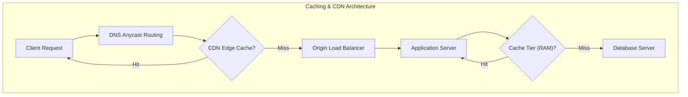
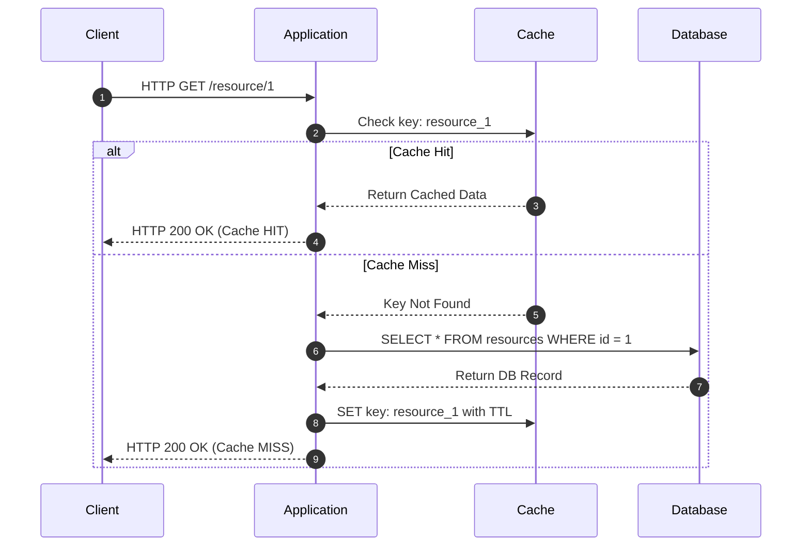

---
domains:
  - "database"
  - "networking"
  - "infra"
---

# Module 1-4: Caching & Content Delivery Networks (CDNs)

This module covers the core concepts of caching, write patterns (Cache-Aside, Write-Through, Write-Behind), eviction policies, cache stampede mitigations, and Content Delivery Network (CDN) edge routing.

---

## 🗺️ Cognitive Map: How to Think About Caching & CDNs

---

## 1. Caching Topologies & Write Strategies

Caching stores hot, transient data in high-speed memory (RAM) to avoid expensive database read operations and reduce latency.

### A. Caching Read-Write Patterns
1. **Cache-Aside (Lazy Loading):**
   - *Flow:* The application queries the cache first. On a *Cache Hit*, data is returned immediately. On a *Cache Miss*, the application fetches the data from the database, writes it to the cache, and returns it to the client.
   - *Trade-off:* Cache only contains requested data, but misses incur a double-hop latency penalty, and data can become stale if updated directly in the DB.
2. **Write-Through:**
   - *Flow:* The application writes data to the cache, and the cache immediately writes it synchronously to the database in the same transaction.
   - *Trade-off:* Data is never stale, but write latency is high due to synchronous double-writing.
3. **Write-Behind (Write-Back):**
   - *Flow:* The application writes to the cache, which acknowledges immediately. An asynchronous background process batches and writes updates to the database.
   - *Trade-off:* Extremely fast write speeds and high write throughput, but data loss is possible if the cache server crashes before database synchronization completes.

### B. Cache Eviction Policies
When the cache reaches memory capacity, items are evicted based on policies:
- **Least Recently Used (LRU):** Discards items that haven't been accessed for the longest time.
- **Least Frequently Used (LFU):** Discards items with the lowest access count.
- **First In First Out (FIFO):** Discards items in the order they were inserted.

---

## 2. Caching Failure Patterns

* **Cache Avalanche:** Occurs when many keys expire at once, or the cache tier crashes, causing a massive surge of concurrent queries to hit the database, leading to outages. *Mitigations:* Add random time variables (Jitter) to TTLs, and use high-availability cache clusters.
* **Cache Stampede (Thundering Herd):** Occurs when multiple application threads concurrently execute database queries on a cache miss for the exact same key. *Mitigations:* Use mutex locks so only one request queries the database for a cache miss while others wait for the cache to update.
* **Cache Penetration:** Occurs when clients query keys that do not exist in either cache or database (e.g. scanner attacks). *Mitigations:* Cache empty/null results with a short TTL, or intercept queries with a **Bloom Filter** at the gateway level.

---

## 3. Content Delivery Networks (CDNs)

A CDN is a distributed network of edge proxy servers that cache and serve static content (images, JS/CSS, HTML) geographically close to users.
- **Pull CDNs:** The edge server pulls static files from the origin server on the first cache miss, caches it for subsequent users, and returns it.
- **Push CDNs:** The origin server pushes new assets to the CDN edge nodes manually when files are uploaded or updated.
- **Anycast Routing:** CDNs share a single IP address across all edge locations. BGP routing automatically forwards client packets to the nearest physical edge server, minimizing network hops.

---

## 4. Caching & CDN AARF Breakdowns

### A. Database Caching
#### Deep-Intuition (AARF) Breakdown:
1. **The Answer (Core Pattern):** Deploy Cache-Aside caching (using Redis or Memcached) for database reads, and use Write-Through or Write-Behind for database writes depending on latency vs. data safety priorities.
2. **The Assumptions (Context):** Data is read-heavy, has a stable structure, and can tolerate eventual consistency. Caching servers must have sufficient RAM allocated.
3. **The Rationale (Why):** Caching avoids expensive disk I/O and SQL compilation overheads by serving hot, frequently accessed data directly from memory (RAM) in sub-milliseconds.
4. **The Failure Loop (What if not):** Without caching, high traffic overloads the relational database with redundant read queries, leading to thread pool exhaustion, latency spikes, and eventual database crash. If caching is poorly configured, a Cache Stampede (multiple threads querying the DB simultaneously on a cache miss) or Cache Avalanche (many keys expiring at the same time) can trigger database outages.
5. **Alternative Case (When to use 'if not'):** For highly dynamic data with low read-to-write ratios (where every read is unique or write-heavy telemetry data), caching adds memory cost, synchronization overhead, and cache invalidation complexity without improving latency.

### B. Content Delivery Networks (CDNs)
#### Deep-Intuition (AARF) Breakdown:
1. **The Answer (Core Pattern):** Route static and media asset requests through a Content Delivery Network (CDN) with geographic caching nodes (Edge servers) using Anycast IP routing.
2. **The Assumptions (Context):** Assets are static (images, CSS, JS, HTML) or dynamic but cacheable with appropriate HTTP headers (e.g., `Cache-Control: public, max-age=31536000`).
3. **The Rationale (Why):** Anycast DNS routes client requests to the physically closest edge proxy. Serving assets from the edge minimizes network hops and latency, offloading significant bandwidth from the origin servers.
4. **The Failure Loop (What if not):** Without a CDN, every client request globally must travel to the origin server, resulting in high load and bandwidth costs at the origin, and poor latencies for distant users (e.g., high latency due to physical distance/network hops).
5. **Alternative Case (When to use 'if not'):** For purely private, local-network applications (e.g., internal enterprise intranets) or APIs serving only highly confidential, non-cacheable personalized dynamic payloads, CDNs offer no benefit and increase operational costs.

---

## 🛠️ Hands-on Verification Project

To verify and inspect the cache control headers and CDN revalidation triggers, refer to the client verification commands:
- [[Projects/Systems Design/Project - Secure Load-Balanced Web API.md#1-verification-of-caching-and-cdn-headers|Caching and CDN header checks]]
