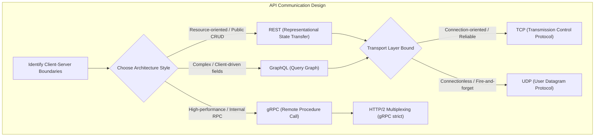
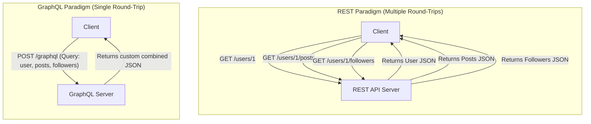
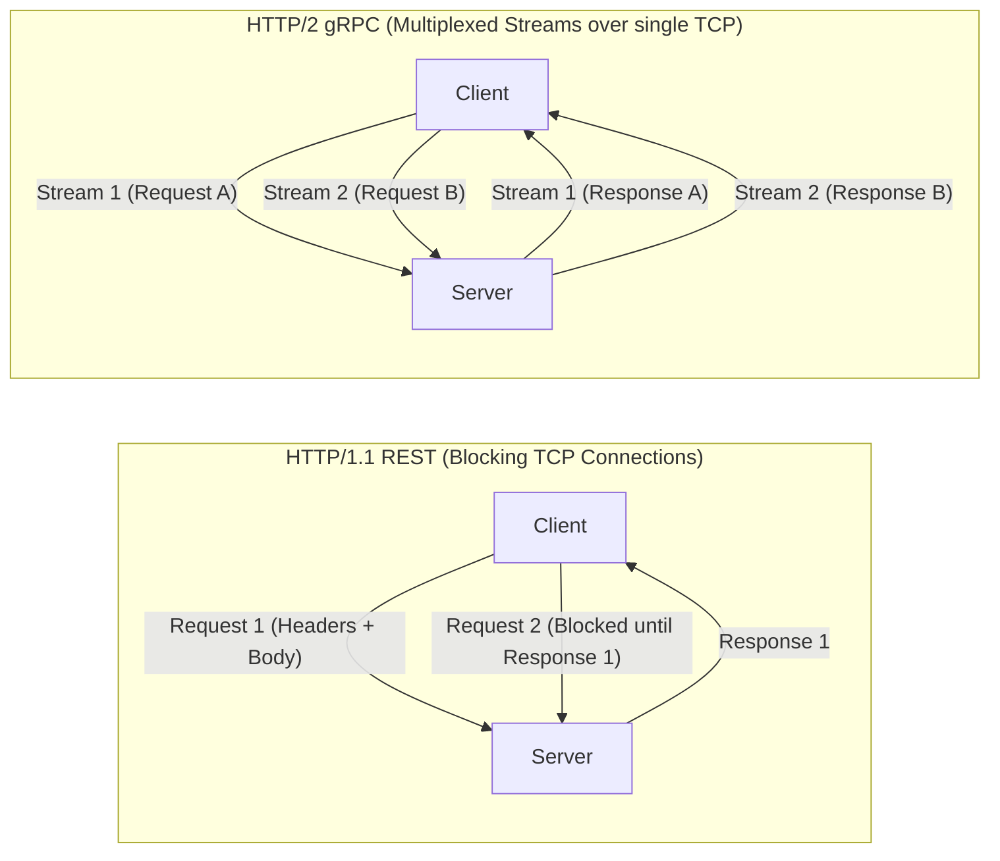

---
domains:
  - "networking"
---

# Module 1-5: API Protocols & gRPC

This module covers the core API communication paradigms (REST, GraphQL, gRPC), transport layer protocols (TCP vs. UDP), and the performance optimization mechanisms of gRPC over HTTP/2.

---

## 🗺️ Cognitive Map: How to Think About API Protocols

---

## 1. Core API Paradigms

An API defines the communication contract between clients and servers. The three dominant styles are REST, GraphQL, and gRPC:

| Attribute | REST | GraphQL | gRPC |
| :--- | :--- | :--- | :--- |
| **Concept** | Resource-oriented (Nouns) | Client-defined query graphs | Remote function invocation |
| **Protocol** | HTTP (1.1 / 2) | HTTP (1.1 / 2) | HTTP/2 (Strict) |
| **Serialization** | JSON, XML | JSON | Protocol Buffers (Binary) |
| **Payload Size** | Larger (Over-fetching risk) | Minimal (Client requests fields) | Smallest (Compressed binary) |
| **Caching** | HTTP/Gateway level (GET) | Client-side/App level | Custom application logic |
| **Use Case** | Public web services, CRUD | Complex dashboards, mobile clients | Internal microservices, streaming |

### A. REST (Representational State Transfer)
- Resource-centric design based on standard HTTP methods (`GET`, `POST`, `PUT`, `PATCH`, `DELETE`).
- Stateless server design where each request contains all necessary metadata/context.
- Relies on caching at HTTP proxies, CDNs, or browser gateways.

### B. GraphQL
- Offers client-side data definition, avoiding **over-fetching** (receiving too much data) and **under-fetching** (calling multiple endpoints).
- Single endpoint (`POST /graphql`) serving dynamic queries.
- Shift of processing complexity to the backend resolver trees.

---

## 2. Transport Layer Protocols: TCP vs. UDP

At the network layer, APIs and communication channels run on top of Transport protocols:

### A. TCP (Transmission Control Protocol)
- **Characteristics:** Connection-oriented (established via a **Three-Way Handshake**), guarantees message delivery, packet reordering, flow control, and checksum confirmation.
- **Handshake Flow:** `SYN` -> `SYN-ACK` -> `ACK`.
- **Trade-off:** High packet overhead and latency due to acknowledgement loops and retransmission.
- **Ideal For:** Web APIs (REST/GraphQL), file transfers, databases, payment gateways.

### B. UDP (User Datagram Protocol)
- **Characteristics:** Connectionless, packet-delivery is not guaranteed (fire-and-forget), no packet ordering, minimal overhead.
- **Trade-off:** Fast and lightweight, but susceptible to packet loss and out-of-order packets.
- **Ideal For:** VoIP, video conferencing, live streaming, online multiplayer games.

---

## 3. gRPC & Protocol Buffers (HTTP/2 Multiplexing)

gRPC is a high-performance, open-source Remote Procedure Call (RPC) framework developed by Google.

### A. HTTP/2 Transport Foundation
gRPC requires **HTTP/2**, which supports:
- **Multiplexing:** Allows sending multiple bidirectional streams concurrently over a single TCP connection, eliminating the head-of-line blocking problem of HTTP/1.1.
- **Header Compression (HPACK):** Compresses headers to reduce byte overhead.
- **Bidirectional Streaming:** Enables client-side, server-side, or fully bidirectional streaming connections.

### B. Protocol Buffers (Protobuf)
gRPC serializes payloads into a compressed binary format (Protobuf) rather than plain-text JSON. It uses tag indexes instead of string keys, dramatically shrinking network packet size.

### C. Code Generation
Protobuf schemas (`.proto` files) generate client stubs and server skeletons in multiple languages, enforcing type safety and architectural consistency.

---

## 🛠️ Hands-on Verification Project

To verify and inspect the complete, production-grade hands-on configuration files for API method requests and client invocation playbooks, refer to:
- [[Projects/Systems Design/Project - Secure Load-Balanced Web API.md#2-secure-api-web-server-python---fastapi|FastAPI route handlers and parameters]]
- [[Projects/Systems Design/Project - Secure Load-Balanced Web API.md#1-end-to-end-api-and-load-balancer-verification|Curl CLI testing recipes for REST and GraphQL payload query endpoints]]
