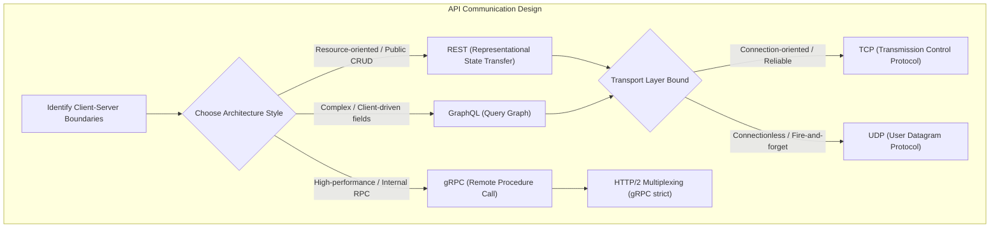
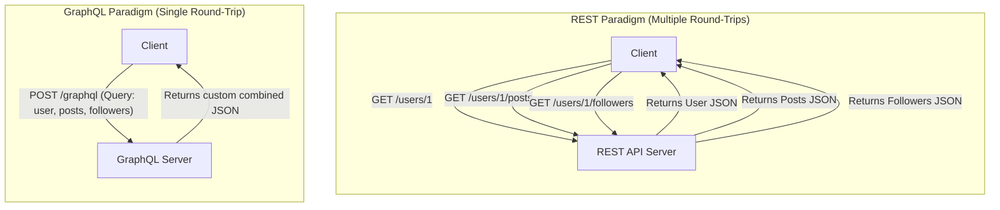
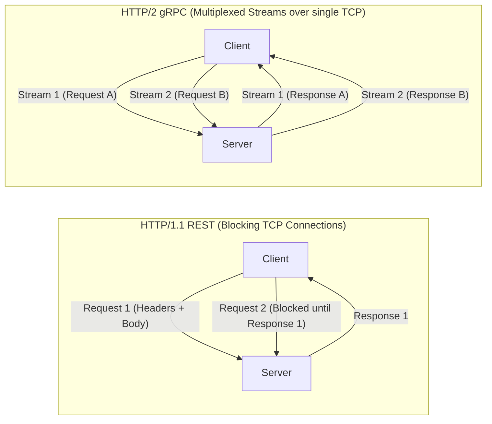

---
domains:
  - "networking"
---

# Module 1-5: API Protocols & gRPC

This module covers the core API communication paradigms (REST, GraphQL, gRPC), transport layer protocols (TCP vs. UDP), and the performance optimization mechanisms of gRPC over HTTP/2.

---

## 🗺️ Cognitive Map: How to Think About API Protocols

---

## 1. Core API Paradigms

An API defines the communication contract between clients and servers. The three dominant styles are REST, GraphQL, and gRPC:

| Attribute | REST | GraphQL | gRPC |
| :--- | :--- | :--- | :--- |
| **Concept** | Resource-oriented (Nouns) | Client-defined query graphs | Remote function invocation |
| **Protocol** | HTTP (1.1 / 2) | HTTP (1.1 / 2) | HTTP/2 (Strict) |
| **Serialization** | JSON, XML | JSON | Protocol Buffers (Binary) |
| **Payload Size** | Larger (Over-fetching risk) | Minimal (Client requests fields) | Smallest (Compressed binary) |
| **Caching** | HTTP/Gateway level (GET) | Client-side/App level | Custom application logic |
| **Use Case** | Public web services, CRUD | Complex dashboards, mobile clients | Internal microservices, streaming |

### A. REST (Representational State Transfer)
- Resource-centric design based on standard HTTP methods (`GET`, `POST`, `PUT`, `PATCH`, `DELETE`).
- Stateless server design where each request contains all necessary metadata/context.
- Relies on caching at HTTP proxies, CDNs, or browser gateways.

### B. GraphQL
- Offers client-side data definition, avoiding **over-fetching** (receiving too much data) and **under-fetching** (calling multiple endpoints).
- Single endpoint (`POST /graphql`) serving dynamic queries.
- Shift of processing complexity to the backend resolver trees.

---

## 2. Transport Layer Protocols: TCP vs. UDP

At the network layer, APIs and communication channels run on top of Transport protocols:

### A. TCP (Transmission Control Protocol)
- **Characteristics:** Connection-oriented (established via a **Three-Way Handshake**), guarantees message delivery, packet reordering, flow control, and checksum confirmation.
- **Handshake Flow:** `SYN` -> `SYN-ACK` -> `ACK`.
- **Trade-off:** High packet overhead and latency due to acknowledgement loops and retransmission.
- **Ideal For:** Web APIs (REST/GraphQL), file transfers, databases, payment gateways.

### B. UDP (User Datagram Protocol)
- **Characteristics:** Connectionless, packet-delivery is not guaranteed (fire-and-forget), no packet ordering, minimal overhead.
- **Trade-off:** Fast and lightweight, but susceptible to packet loss and out-of-order packets.
- **Ideal For:** VoIP, video conferencing, live streaming, online multiplayer games.

---

## 3. gRPC & Protocol Buffers (HTTP/2 Multiplexing & Streaming)

gRPC is a high-performance, open-source Remote Procedure Call (RPC) framework developed by Google. Instead of mapping requests to HTTP verbs and URL resource nouns, gRPC allows services to invoke remote functions on other services directly as if they were local calls.

### A. HTTP/2 Transport & Binary Framing Foundation
gRPC runs exclusively over **HTTP/2**, which introduces fundamental improvements over HTTP/1.1:
- **Multiplexing:** Requests and responses run concurrently over a single shared TCP connection. This eliminates **Head-of-Line (HoL) blocking** at the application layer, preventing a slow request from delaying other requests on the same connection.
- **Binary Framing Layer:** Unlike HTTP/1.1 which parses messages as plain text, HTTP/2 breaks communication into smaller, self-contained binary frames (such as `HEADERS` and `DATA`). This allows servers to parse frames in hardware/memory much faster without CPU-intensive text parsing.
- **Header Compression (HPACK):** Compresses redundant headers (like user-agent or host) to reduce network byte overhead on subsequent calls.

### B. Protocol Buffers (Protobuf) Serialization
gRPC serializes payloads into a compressed binary format called **Protocol Buffers** instead of plain-text JSON:
- **Tag Indexes vs. Field Keys:** JSON repeats text keys (e.g., `"user_id": 12345`) in every message. Protobuf replaces keys with numeric tags (e.g., field index `1`), shrinking payload sizes by up to 60–80%.
- **Type Safety & Contracts:** API structures are declared in static `.proto` files. Both client and server must conform to this schema, eliminating dynamic type mismatch errors in production.
- **Backward & Forward Compatibility:** Field changes are managed by adding new fields with unique tag numbers. Old services ignore unknown tags, and new services handle default values for missing tags.

### C. The Four gRPC Call Patterns
gRPC provides first-class support for streaming and bidirectional patterns:
1. **Unary RPC (Simple Request-Response):** The client sends a single request and receives a single response, behaving like a traditional REST endpoint.
2. **Server-Streaming RPC:** The client sends one request, and the server returns a stream of responses (e.g., a stock ticker feed or server metrics log).
3. **Client-Streaming RPC:** The client sends a stream of requests (e.g., uploading a large backup file in chunks) and receives a single response once the stream is complete.
4. **Bidirectional-Streaming RPC:** Both client and server send a stream of messages concurrently over the same persistent connection, allowing real-time chat, multiplayer state syncing, or active peer communication.

### D. Architectural Boundaries: REST vs. gRPC
Most modern architectures do not choose between REST and gRPC; they split responsibility:
- **gRPC Inside the Network:** Used for service-to-service communication behind an API gateway or service mesh, where low latency, high throughput, and polyglot code consistency (Go, Java, Python sharing the same `.proto` stub) are required.
- **REST/JSON at the Edge:** Used for public-facing client APIs, web browsers, and third-party integrations where ease of debugging (e.g. via `curl` or browser inspector) and universal compatibility are more important than microsecond performance.

---

## 4. API Paradigm AARF Breakdowns

### A. REST (Representational State Transfer)
#### Deep-Intuition (AARF) Breakdown:
1. **The Answer (Core Pattern):** Design APIs using resource-based URIs, standard HTTP methods (nouns/verbs), and stateless request-response headers.
2. **The Assumptions (Context):** Requires clients that can invoke HTTP, and is best suited for CRUD operations where HTTP caching can be utilized.
3. **The Rationale (Why):** Simple, uniform interface makes it universally compatible. Stateless design allows server-side replication and horizontal scaling without session replication overhead.
4. **The Failure Loop (What if not):** Without REST standards (e.g., using GET for state changes, or returning generic 200 OK for errors), caches can incorrectly store state-changing requests, and clients cannot parse errors predictably. Over-fetching/under-fetching data forces multiple round-trips or huge payload transfers, causing high network latency.
5. **Alternative Case (When to use 'if not'):** For highly complex dashboard APIs that query cross-entity fields dynamically, or internal microservices requiring extreme throughput and low latency, GraphQL or gRPC are preferred.

### B. GraphQL
#### Deep-Intuition (AARF) Breakdown:
1. **The Answer (Core Pattern):** Deploy a single GraphQL gateway endpoint (typically `POST /graphql`) with schema definitions (types/queries/mutations) and resolver logic.
2. **The Assumptions (Context):** Backend servers must implement resolver trees, and client libraries must support GraphQL query construction.
3. **The Rationale (Why):** Prevents network inefficiency by allowing the client to define the exact fields it needs in a single request, eliminating over-fetching and under-fetching.
4. **The Failure Loop (What if not):** If query depth and complexity are not limited, a client can execute nested recursive queries (e.g., user -> friends -> user -> friends) that generate massive SQL query cascades (the N+1 database query problem), exhausting database connections and crashing the server.
5. **Alternative Case (When to use 'if not'):** For simple CRUD applications, public APIs where clients need simple resource endpoints, or internal microservices, GraphQL adds unnecessary gateway layer complexity.

### C. gRPC
#### Deep-Intuition (AARF) Breakdown:
1. **The Answer (Core Pattern):** Define APIs using Protocol Buffers (`.proto` files), generate client/server stubs, and establish persistent multiplexed gRPC connections over HTTP/2.
2. **The Assumptions (Context):** Network proxies and load balancers in the traffic path must support HTTP/2 and gRPC frames (gRPC headers, HTTP trailers).
3. **The Rationale (Why):** Protobuf serializes data into tiny binary payloads, and HTTP/2 multiplexing enables multiple concurrent streams over a single TCP connection, drastically reducing network resource consumption and latency.
4. **The Failure Loop (What if not):** If network intermediaries (firewalls, old proxies) do not support HTTP/2, gRPC connections fail to negotiate, falling back or dropping traffic. Lack of API gateway routing for gRPC results in load balancing hot spots, as standard L4 load balancers cannot distribute multiplexed HTTP/2 streams across backend pods without gRPC-aware L7 load balancing.
5. **Alternative Case (When to use 'if not'):** For public-facing client-to-server web browser APIs, where gRPC client support is weak and standard HTTP REST/GraphQL is expected, standard REST/JSON is cleaner.

---

## 🛠️ Hands-on Verification Project

To verify and inspect the complete, production-grade hands-on configuration files for API method requests and client invocation playbooks, refer to:
- [[Project - Secure Load-Balanced Web API#2-secure-api-web-server-python---fastapi|FastAPI route handlers and parameters]]
- [[Project - Secure Load-Balanced Web API#1-end-to-end-api-and-load-balancer-verification|Curl CLI testing recipes for REST and GraphQL payload query endpoints]]
