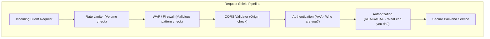
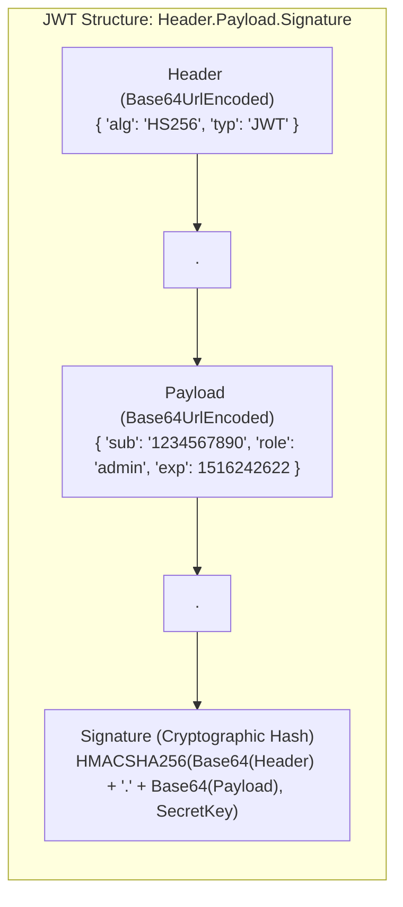
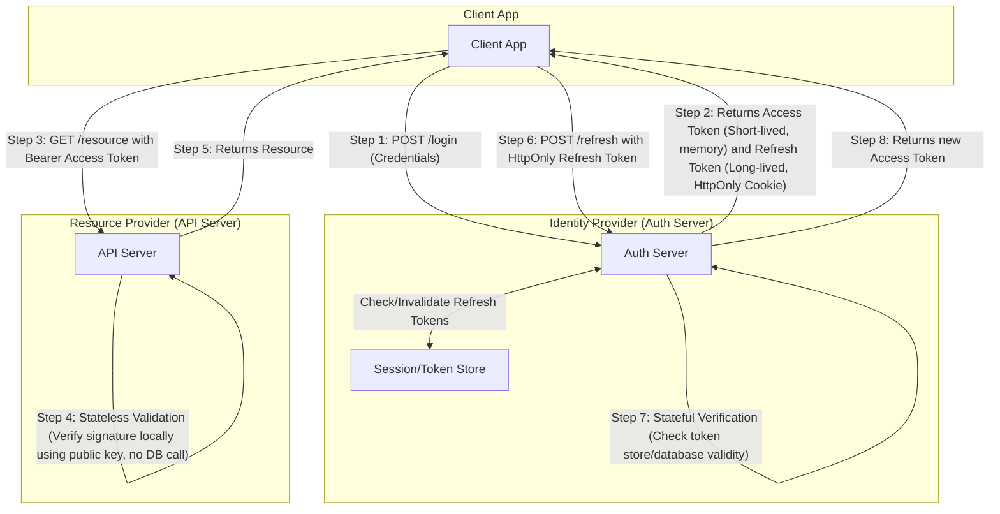
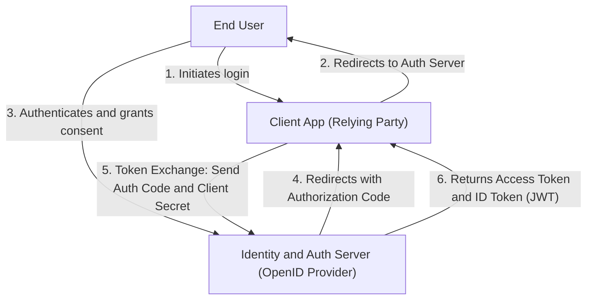

---
domains:
  - "security"
---

# Module 1-6: Access Control & API Security

This module covers identity verification and security hardening at the application and network layers, detailing authentication models, authorization frameworks, and common defense-in-depth mitigation strategies.

---

## 🗺️ Cognitive Map: How to Think About Security Guards

---

## 1. Access Management: AAA Foundation

Security systems rely on the AAA framework:
* **Authentication (AuthN):** Verification of identity (proves *who* the entity is).
- **Authorization (AuthR):** Verification of permissions (proves *what* the entity can do).
- **Accounting (Auditing):** Tracking and logging actions performed by authenticated users.

### A. Authentication Paradigms
- **Basic Authentication:** Credentials sent as Base64-encoded strings (`username:password`) in the `Authorization` header. Insecure without TLS encryption.
- **Digest Authentication:** Uses challenge-response hashing (MD5) to avoid transmitting credentials in plain text.
- **API Keys:** Unique identifier strings issued to consumers. Lightweight but requires database/caching lookups to invalidate selectively.
- **Session-Based Authentication:** Stateful. The server verifies credentials, generates a session record in a memory store (e.g. Redis), and returns a session ID in a browser cookie. The server must check the session database on every request.
- **Token-Based Authentication (JWT):** Stateless. The server returns a signed JSON Web Token (JWT). The client includes it in the `Authorization: Bearer <token>` header. The server verifies the token signature cryptographically using a public/private key or shared secret, eliminating database lookups.
  - *Access vs. Refresh Tokens:* Short-lived access tokens (e.g. 15 minutes) reduce leak window. Long-lived refresh tokens (stored in secure `HttpOnly` cookies) are checked against a stateful store to renew access tokens.

#### JWT Token Structure:
A JWT is composed of three parts separated by dots (`.`): Header, Payload, and Signature.

#### JWT Authentication AARF Breakdown:
1. **The Answer (Core Config):** Implement stateless authentication by issuing JSON Web Tokens (JWT) structured as `header.payload.signature` signed with a symmetric secret (HMAC HS256) or asymmetric private key (RSA RS256/ECDSA ES256).
2. **The Assumptions (Context):** The backend services must have access to the signing keys (or public verification keys), and the client is capable of storing the token securely (e.g. in memory or secure HttpOnly cookies) and transmitting it via the `Authorization: Bearer <token>` header.
3. **The Rationale (Why):** Eliminates database or session store lookups for every request. Any service can verify the token signature locally, enabling horizontal scaling of APIs with zero coordination overhead.
4. **The Failure Loop (What if not):** Since JWTs are stateless, they cannot be revoked on-demand if compromised. An attacker who steals a token can impersonate the user until the expiration (`exp`) claim expires. Storing secrets in the payload is a vulnerability because the payload is Base64Url-encoded and fully readable by anyone.
5. **Alternative Case (When to use 'if not'):** Use traditional stateful session-based cookies when immediate logout/revocation is business-critical, or when payload size constraints prevent sending large token headers with every request.

##### Key JWT Trade-offs & Security Concerns:
- **Revocation Complexity:** Because JWTs are self-contained and verified locally, there is no central session database to check. If a user logs out or their account is compromised, the token remains valid until it naturally expires. Revoking a token early requires implementing stateful workarounds (like a Redis-based token blacklist or rotating signing keys), which partially compromises the stateless design.
- **Outdated Permissions (Stale Claims):** A JWT’s claims are fixed at the moment of issuance. If a user’s role is updated (e.g., promoted from `user` to `admin` or stripped of access), those changes are not reflected in the active JWT. The user retains their old permissions until the token expires and they obtain a new one.
- **Payload Visibility:** JWT payloads are base64url-encoded, **not encrypted**. Anyone who intercepts the token can read all claims (including user ID, email, and roles). Never store sensitive or confidential data (like passwords, keys, or personal health info) in a JWT unless you apply an encryption layer (JSON Web Encryption - JWE).

### B. Authorization Models
- **Role-Based Access Control (RBAC):** Permissions are bound to logical roles (e.g. `admin`, `editor`, `reader`), and users are assigned to roles. Highly audit-friendly.
- **Attribute-Based Access Control (ABAC):** Evaluates attributes of the subject, resource, and context (e.g. "Department = Finance", "Resource = Secret", "Time = Working Hours"). Extremely flexible but complex to implement.
- **Access Control Lists (ACL):** Associates individual permissions directly with specific resources (e.g. file read/write permissions mapped per user ID).

### C. OAuth 2.0 & OpenID Connect (OIDC)
- **OAuth 2.0:** A delegated authorization framework that allows third-party client applications to access API scopes on a user's behalf without credentials sharing.
  - **The 4 Roles:**
    - *Resource Owner:* The user who owns the data and decides what to share.
    - *Client:* The application requesting access (e.g., a web app, mobile app, or backend service).
    - *Authorization Server:* Authenticates the user and issues tokens after obtaining consent.
    - *Resource Server:* The API that holds the protected data and validates access tokens.
  - **The 3 Tokens:**
    - *Access Token:* Short-lived credential sent with every API call. The Resource Server validates it on each request.
    - *Refresh Token:* Long-lived credential used only at the Token Endpoint to get a new access token without re-authenticating the user. Never send this to the Resource Server.
    - *ID Token:* A signed JWT carrying *authentication claims* (user identity information) issued by the OpenID Provider.
- **OpenID Connect (OIDC):** An identity verification layer built on top of OAuth 2.0. Adds the `id_token` to verify user authentication. **An ID token is not an OAuth token.** OAuth is for authorization, OIDC is for authentication.

##### Client Types & Token Security Guidelines:
OAuth classifies clients based on their ability to protect credentials:
1. **Confidential Clients (Secure Backends):** Applications running on servers where the client secret can be kept hidden (e.g., traditional MVC web apps, backend microservices).
   - *Best Practice:* Store refresh and access tokens entirely on the backend. Communicate with the browser using a secure, encrypted `HttpOnly` session cookie. The frontend browser never touches raw tokens, preventing Cross-Site Scripting (XSS) token theft.
2. **Public Clients (Unsecure Clients):** Applications running on devices where secrets cannot be protected (e.g., mobile apps, desktop apps, Single-Page Apps in browsers).
   - *Mobile/Desktop Best Practice:* Implement **Authorization Code Flow + PKCE** (Proof Key for Code Exchange). PKCE prevents authorization code hijacking by requiring the client to verify its identity dynamically using a code verifier. Open the user's login in the default system browser (not an embedded webview) and store refresh tokens in secure platform storage (Keychain/Keystore).
   - *Single-Page App (SPA) Best Practice:* Deploy the **Backend-for-Frontend (BFF) Pattern**. The browser communicates with a lightweight backend proxy using secure cookies; this backend handles the OAuth exchange and holds the raw tokens.
   - *SPA Fallback (if BFF is not possible):* Use Authorization Code + PKCE, validate the `state` parameter to block CSRF, keep tokens strictly in-memory (never in `localStorage` or `sessionStorage` where they are vulnerable to XSS), and lock down CORS rules tightly.

#### OAuth 2.0 Delegated Authorization AARF Breakdown:
1. **The Answer (Core Config):** Implement delegated authorization using OAuth 2.0 flows, separating authorization logic (Authorization Server) from data logic (Resource Server), and using short-lived Access Tokens for resource requests.
2. **The Assumptions (Context):** The system involves third-party client integrations, or you are running single sign-on (SSO) across multiple microservices.
3. **The Rationale (Why):** Allows external applications to access specific user resources (scopes) securely without ever seeing or storing the user's password.
4. **The Failure Loop (What if not):** Treating access tokens as proof of identity (login) is a major design flaw; access tokens only grant permission. Bearer access tokens lack cryptographic binding to the client, meaning any packet sniff or log leak results in total credential theft. If redirect URIs are not strictly validated, authorization codes can be hijacked by malicious clients.
5. **Alternative Case (When to use 'if not'):** Use OpenID Connect (OIDC) when your primary goal is to authenticate the user and retrieve their identity claims, or use simple API keys for service-to-service internal communication where delegated consent is not required.

---

## 2. Infrastructure & API Hardening

1. **Rate Limiting:** Protects systems from brute-force and Denial of Service (DDoS) requests by capping request count per client IP or session (e.g. using Token Bucket or Leaky Bucket algorithms).
2. **CORS (Cross-Origin Resource Sharing):** A browser-enforced security mechanism restricting which external origins can query your API. Enforced via HTTP handshake headers (`Access-Control-Allow-Origin`).
3. **Injection Defenses:** Prevents SQL/NoSQL Injection by separating database queries from parameter data using Parameterized Queries or ORM mapping.
4. **Firewalls & WAFs:** Web Application Firewalls inspect HTTP headers, payloads, and cookies to block known attack vectors (e.g. SQLi strings, XSS payloads).
5. **VPNs & Network Segregation:** Isolates internal admin APIs behind virtual private networks, blocking public-internet routing.
6. **CSRF (Cross-Site Request Forgery):** Prevents session hijack commands by verifying custom CSRF tokens sent in headers alongside cookies.
7. **XSS (Cross-Site Scripting):** Sanitizes user-generated inputs to prevent malicious scripts from executing in client browsers, and protects sensitive cookies via `HttpOnly` flags.

---

## 3. Data Protection & Enterprise SSO

Hardening corporate infrastructure requires safeguarding data at rest/in transit and centralizing employee access management.

### A. Data Encryption (Transit & At-Rest)
Encryption ensures that data remains confidential and tamper-proof even if physically or electronically intercepted.

#### Deep-Intuition (AARF) Breakdown:
1. **The Answer (Core Pattern):** Protect data at rest using AES-256 symmetric encryption with KMS-managed keys (Envelope Encryption). Protect data in transit using TLS 1.3 with strong cipher suites (e.g., ECDHE-RSA-AES128-GCM-SHA256).
2. **The Assumptions (Context):** Requires access to a Key Management Service (KMS), hardware security modules (HSM) or secret vaults, and modern cipher library support in applications.
3. **The Rationale (Why):** Plaintext data exposed on disk or intercepted on the wire is vulnerable to unauthorized read/leakage. Transit encryption prevents eavesdropping and man-in-the-middle attacks, while at-rest encryption protects database storage from physical theft or cloud-provider snapshots leakage.
4. **The Failure Loop (What if not):** Without in-transit encryption, sensitive credentials (JWTs, session cookies, database passwords) travel in plaintext, allowing attackers to sniff packets and execute session hijacks. Without at-rest encryption, an attacker getting access to raw database files (e.g., SQL dump, disk backups) can read all data. If encryption keys are compromised, the entire encrypted dataset is instantly exposed.
5. **Alternative Case (When to use 'if not'):** For public, non-sensitive static assets (like publicly accessible CSS/JS files cached on edge servers), at-rest encryption is not strictly required, though TLS in transit is still recommended for integrity (preventing packet modification).

### B. Single Sign-On (SSO) & SAML
SSO allows users to authenticate once and access multiple independent applications, commonly managed via enterprise SAML handshakes.

#### Deep-Intuition (AARF) Breakdown:
1. **The Answer (Core Pattern):** Integrate Enterprise Identity Providers (IdP) using SAML 2.0 or OIDC. Rely on the XML-based SAML assertion handshake (containing signed attributes and authorizations) to authenticate corporate users.
2. **The Assumptions (Context):** Requires a trusted Identity Provider (e.g., Okta, Active Directory) and Service Providers (applications) configured with metadata exchange (public keys, SSO URLs).
3. **The Rationale (Why):** Single Sign-On (SSO) centralizes user lifecycle management, preventing users from maintaining separate credentials across multiple tools. SAML uses XML signatures to exchange authentication states securely without passing passwords between identity and service providers.
4. **The Failure Loop (What if not):** Without SSO, offboarded employees retain access to scattered corporate tools until manually removed, creating a massive security gap. If SAML signatures are not strictly validated on the Service Provider side, attackers can forge XML assertions (SAML XML Signature Wrapping - XSW attacks) and log in as any user.
5. **Alternative Case (When to use 'if not'):** For public consumer-facing applications where users are external customers, SAML is too heavy. OIDC (OAuth 2.0 with JWTs) is preferred for client ease and modern mobile application support.

---

## 🛠️ Hands-on Verification Project

To verify and inspect the complete, production-grade hands-on configuration files for security hardening (Nginx rate limits, CORS response headers, parameterized backend SQL queries, JWT parsing), refer to:
- [[Project - Secure Load-Balanced Web API#1-nginx-load-balancer-and-gateway-configuration-nginxconf|Nginx rate limiting and CORS configuration]]
- [[Project - Secure Load-Balanced Web API#2-secure-api-web-server-python---fastapi|SQL Parameterization and JWT verify token verification logic]]
