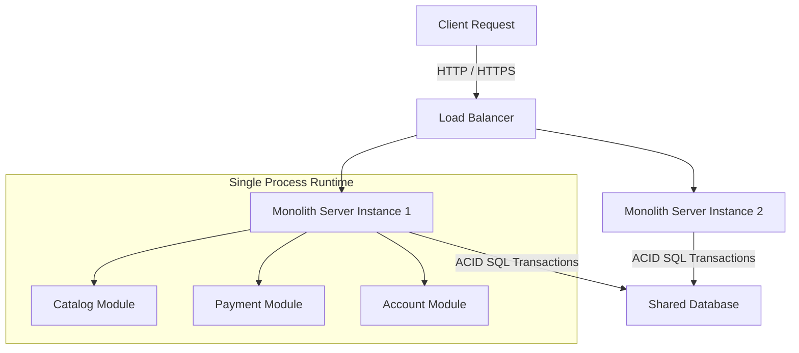
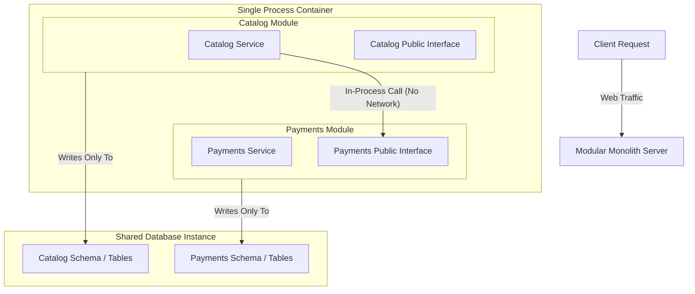
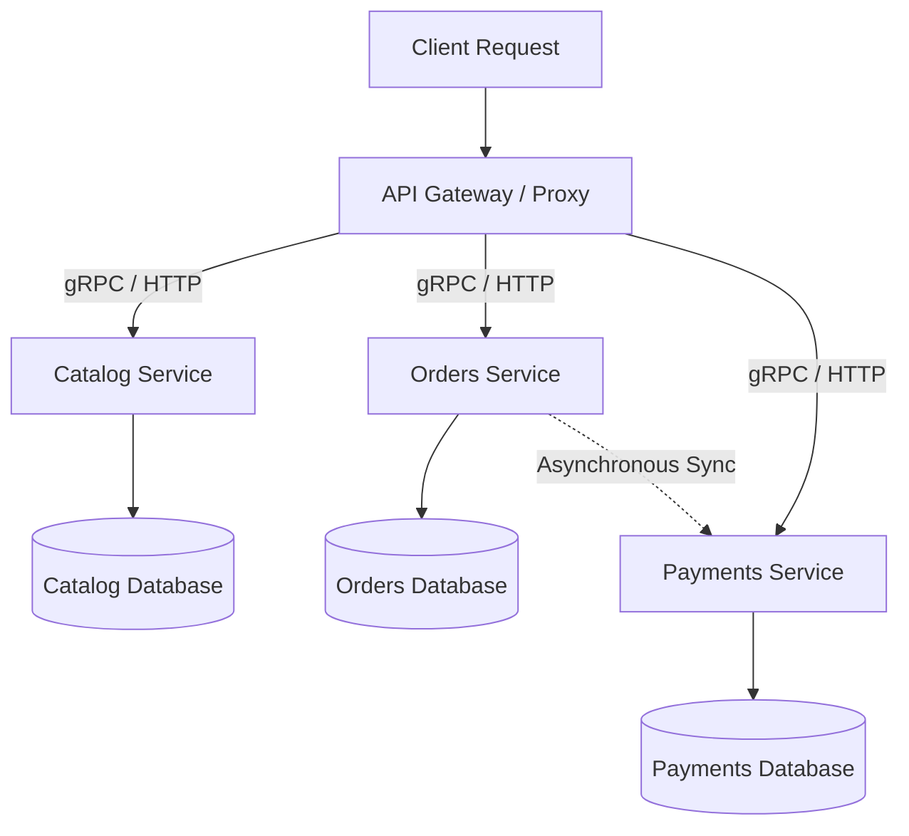
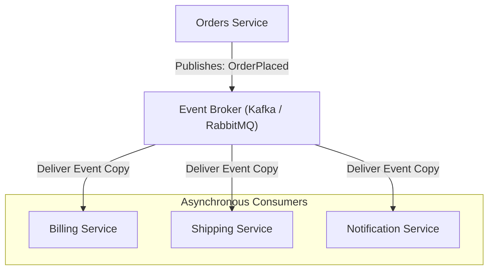
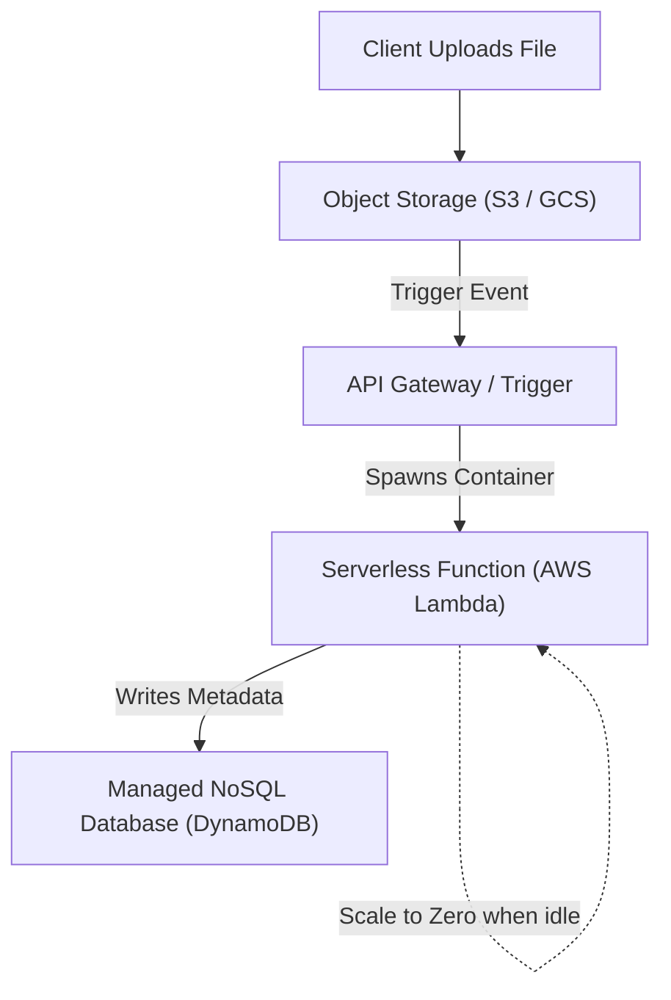
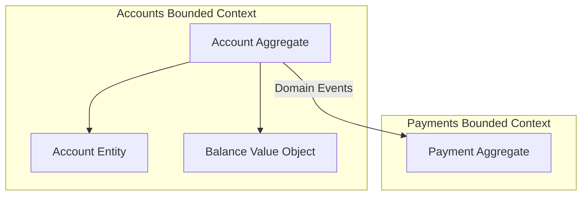
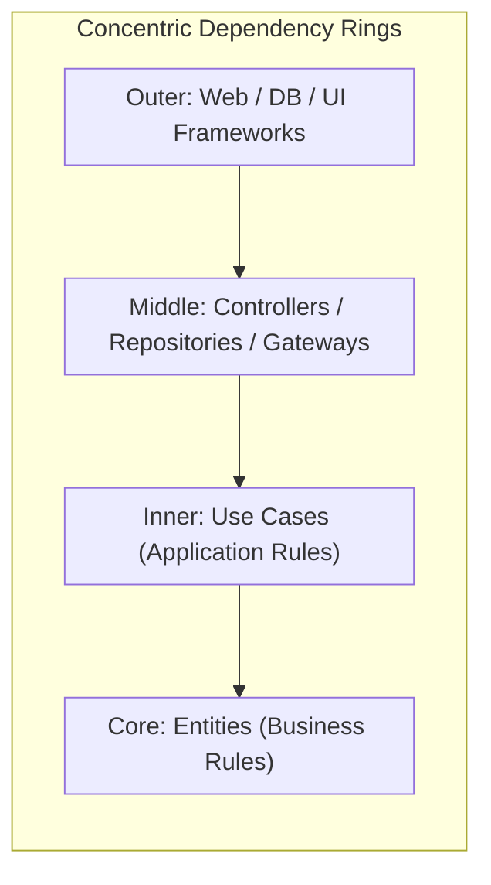
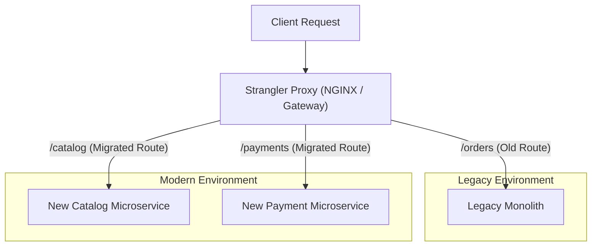
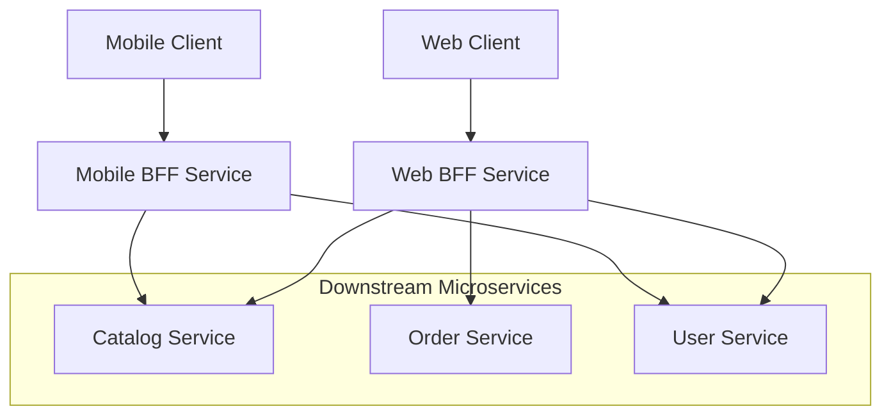
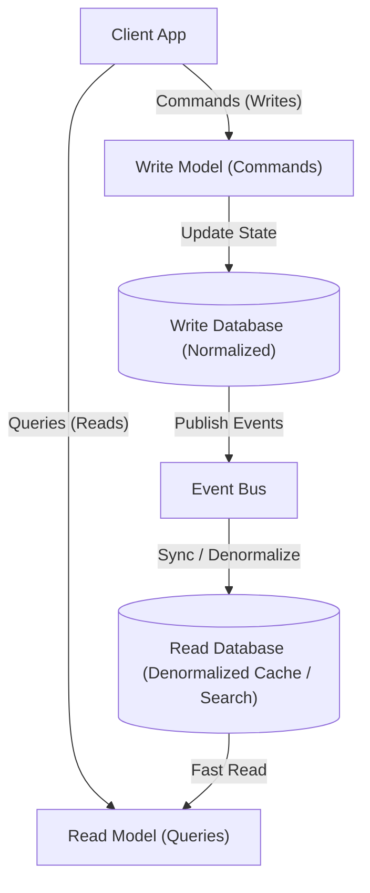

---
domains:
  - "infra"
  - "database"
---

# Module 1-7: Software Architecture Patterns

This module covers the 10 core software architecture patterns. It details their structural definitions, application contexts, design rationales, failure loops, and alternative patterns using the Deep-Intuition (AARF) Style (Answers, Assumptions, Rationale, Failure Loops, and Alternatives), accompanied by illustrative, standard-compliant Mermaid diagrams.

---

## 1. Monolithic Architecture

A monolithic architecture builds the entire application as a single cohesive unit. All components (e.g., Catalog, Payments, Accounts) reside in a single codebase, run in a single process, and share a single database.

### Cognitive Topology:

### Deep-Intuition (AARF) Breakdown:
1. **The Answer (Core Config):** Package all application code and domain boundaries into a single deployable binary or execution process running on a shared runtime environment, pointing to a single relational database.
2. **The Assumptions (Context):** Small development team (e.g., under 10 developers), early-stage product development, unclear or evolving domain boundaries, modest traffic requirements, and minimal DevOps infrastructure capacity.
3. **The Rationale (Why):** Minimizes network overhead and latency (in-process function calls replace network calls), simplifies local debugging/tracing, and allows easy transactional integrity across tables via local database ACID transactions.
4. **The Failure Loop (What if not):** As the team and codebase scale, developers step on each other's toes during deployments, creating a release bottleneck. A memory leak or crash in one module (like a heavy reporting task) takes down the entire application. Scaling specific compute-heavy components requires scaling the entire application horizontally, which increases costs and database connection counts.
5. **Alternative Case (When to use 'if not'):** Move to a Modular Monolith when domain boundaries clarify but network overhead must be avoided, or to Microservices when separate teams need autonomous release cycles and independent scaling.

---

## 2. Modular Monolith Architecture

Unlike a traditional monolith, a modular monolith organizes the codebase into well-defined internal modules aligned to business domains. Modules expose clean, public interfaces and own their specific database tables or schemas, but still run inside a single process and deployment.

### Cognitive Topology:

### Deep-Intuition (AARF) Breakdown:
1. **The Answer (Core Config):** Enforce strict modular separation inside a single codebase (e.g., Java packages, Go sub-modules) where modules only communicate via public interfaces. Ensure database schemas are logically decoupled so modules do not join tables belonging to other modules.
2. **The Assumptions (Context):** The team wants the architectural boundary separation of microservices to prevent spaghetti code, but lacks the resources or scale to run a distributed Kubernetes cluster.
3. **The Rationale (Why):** Delivers clean domain decoupling and an easy path to future microservice extraction without the overhead of network serialization, service discovery, and distributed consistency.
4. **The Failure Loop (What if not):** If developer discipline fails or linting guards are absent, developers will write direct imports bypassing public interfaces, and query tables across schemas. Over time, the clean boundaries erode, reverting the system into a tightly-coupled traditional monolith.
5. **Alternative Case (When to use 'if not'):** Extract modules into Microservices when a specific domain (e.g., search indexing) requires isolated compute resources (like GPUs) or different language stacks (like Python for ML).

---

## 3. Microservices Architecture

A distributed architecture style that decomposes an application into small, independently deployable services, each owning its specific database and communication boundaries.

### Cognitive Topology:

### Deep-Intuition (AARF) Breakdown:
1. **The Answer (Core Config):** Decompose the system into isolated services, each with its own repository, CI/CD pipeline, and database. Services interact strictly via defined APIs (REST, gRPC) or asynchronous event buses.
2. **The Assumptions (Context):** Large engineering organization (dozens of developers split into autonomous squads), complex business domains, high traffic requiring selective scaling, and robust DevOps/SRE support.
3. **The Rationale (Why):** Empowers individual teams to own their lifecycle end-to-end. Enhances reliability, as a crash in the recommendation service does not block checkout. Enables polyglot development (matching technologies to tasks).
4. **The Failure Loop (What if not):** Network calls replace in-process calls, which increases latency, introduces network failure modes, and requires patterns like circuit breakers and retries. Data integrity is hard to maintain; transactions across databases require saga orchestrators or eventual consistency, leading to data synchronization bugs if not designed carefully.
5. **Alternative Case (When to use 'if not'):** Use a Monolith when team size is small and the overhead of service discovery, container orchestration, and distributed tracing outweighs the benefit of decoupled releases.

---

## 4. Event-Driven Architecture (EDA)

An asynchronous architectural style where services interact by publishing and consuming messages (events) over an intermediary event broker.

### Cognitive Topology:

### Deep-Intuition (AARF) Breakdown:
1. **The Answer (Core Config):** Decouple service interactions by routing all state-change events through a message broker (e.g., Apache Kafka, RabbitMQ) using publish-subscribe patterns.
2. **The Assumptions (Context):** High-throughput workloads, asynchronous background processes, complex multi-step workflows, and where eventual consistency is acceptable.
3. **The Rationale (Why):** Extreme decoupling in time and space. If a downstream consumer goes offline, the event broker buffers the messages; once the consumer recovers, it processes them without impacting upstream services.
4. **The Failure Loop (What if not):** Designing and debugging asynchronous event flows is complex. Event formats/schemas can drift, breaking downstream parsers unless schema registries are used. Handling out-of-order execution and ensuring message processing is idempotent are difficult challenges that can lead to duplicate database records.
5. **Alternative Case (When to use 'if not'):** Use synchronous gRPC or HTTP requests when transactional, real-time feedback is required (e.g., authenticating a password or verifying stock before marking an item as purchased).

---

## 5. Serverless Architecture

An execution model where developers write code (functions) triggered by events, and the underlying cloud provider dynamically manages the servers, resources, and scale.

### Cognitive Topology:

### Deep-Intuition (AARF) Breakdown:
1. **The Answer (Core Config):** Implement application logic as single-purpose, event-driven functions (FaaS) that run in ephemeral containers managed entirely by the cloud provider.
2. **The Assumptions (Context):** Bursty, unpredictable traffic patterns, quick prototype timelines, or background processing tasks (like image resizing, batch reports) where you want to minimize infrastructure management.
3. **The Rationale (Why):** Aggressive automatic scaling up to handle traffic spikes, and automatic scaling to zero when idle, meaning zero payment for unused CPU resources.
4. **The Failure Loop (What if not):** Ephemeral containers introduce "cold start" latency (delay during the initial container spin-up). Long-running, high-compute workloads (e.g., continuous streaming or WebSocket connections) quickly become more expensive than traditional virtual machines or Kubernetes nodes.
5. **Alternative Case (When to use 'if not'):** Run on persistent container runtimes (like ECS or Kubernetes) if you have predictable, steady-state workloads that require sub-millisecond execution start times.

---

## 6. Domain-Driven Design (DDD)

A software development philosophy that structures code around the business domain, organizing logic into distinct bounded contexts that mirror the business's structural boundaries.

### Cognitive Topology:

### Deep-Intuition (AARF) Breakdown:
1. **The Answer (Core Config):** Model the codebase into distinct Bounded Contexts. Inside each context, isolate business logic into Aggregates, Entities, and Value Objects, communicating with other contexts strictly via public contracts and domain events.
2. **The Assumptions (Context):** Highly complex business logic, long-lived projects with multiple business domains (e.g., banking, logistics), and direct access to domain experts.
3. **The Rationale (Why):** Establishes a "Ubiquitous Language" shared between developers and domain experts, preventing translation errors. The code architecture mirrors the business structure, making changes easy to model.
4. **The Failure Loop (What if not):** Without clear domain boundaries and aggregate roots, applications develop an "Anemic Domain Model" (where classes are simple bags of getters/setters and business logic leaks into service classes). This creates brittle, hard-to-maintain code where a change in one model breaks unrelated services.
5. **Alternative Case (When to use 'if not'):** For simple CRUD applications (e.g., a simple blog or admin directory), skip DDD and use simple Active Record or Transaction Script patterns to avoid unnecessary boilerplate.

---

## 7. Clean Architecture (Ports and Adapters)

Clean Architecture organizes the system in concentric rings, placing the business logic (entities and use cases) in the core, surrounded by adapter layers (repositories, controllers), and external frameworks on the outer layer.

### Cognitive Topology:

### Deep-Intuition (AARF) Breakdown:
1. **The Answer (Core Config):** Restrict code dependencies to point inward only. Core entities and use cases must not import any external framework (e.g., Spring, Express) or database driver (e.g., Postgres, MongoDB). Use Interfaces (Ports) at boundary layers.
2. **The Assumptions (Context):** The system must remain independent of external frameworks or databases, core logic needs to be fully unit-testable without database connections, and the system is expected to live for years.
3. **The Rationale (Why):** Protects the core business logic from framework upgrades, deprecated library changes, or database migrations, and enables easy mock testing of use cases.
4. **The Failure Loop (What if not):** If database queries and framework annotations leak into core logic classes, the system becomes locked to that specific framework or library. Replacing a database or upgrading a library requires refactoring the core business rules, introducing massive regression risks.
5. **Alternative Case (When to use 'if not'):** For small applications with a short lifespan, use a simpler layered framework architecture to speed up development by skipping interface boilerplates.

---

## 8. Strangler Fig Pattern

A migration pattern used to transition from a legacy monolithic application to a modern microservices architecture gradually, by redirecting traffic slice by slice.

### Cognitive Topology:

### Deep-Intuition (AARF) Breakdown:
1. **The Answer (Core Config):** Place an API Gateway or routing proxy in front of the legacy monolith. Build new microservices alongside the monolith and configure the proxy to redirect specific URI paths to the new services, gradually choking out legacy traffic.
2. **The Assumptions (Context):** A large, legacy monolithic application exists that is too risky to replace in a single "big bang" rewrite, and the business demands continuous operation without downtime.
3. **The Rationale (Why):** Breaks a high-risk migration into small, manageable stages. Teams deliver value early and test microservices with live production traffic incrementally.
4. **The Failure Loop (What if not):** Running a "big bang" rewrite takes years, blocks new feature delivery, and often fails because the legacy system's undocumented behaviors are hard to replicate all at once. Without a strangler proxy, developers are forced to run complex dual-write database synchronization code that is prone to data drift.
5. **Alternative Case (When to use 'if not'):** If the legacy monolith codebase is small, well-documented, or has low complexity, perform a direct replacement (Big Bang) to save the overhead of maintaining two parallel production environments.

---

## 9. Backend-For-Frontend (BFF)

An API pattern where separate backend services are built specifically to handle the requests and aggregation requirements of distinct client interfaces (e.g., mobile web, iOS app, desktop app, third-party APIs).

### Cognitive Topology:

### Deep-Intuition (AARF) Breakdown:
1. **The Answer (Core Config):** Implement dedicated edge API services (BFFs) customized for each client. Each BFF aggregates downstream microservice calls, formats response payloads to minimize client-side processing, and manages client-specific authorization/throttling.
2. **The Assumptions (Context):** The system has diverse client platforms (e.g., mobile apps operating on high-latency networks vs. web apps on high-bandwidth desktop connections) that require different data layouts and API endpoints.
3. **The Rationale (Why):** Tailor payloads and timeouts specifically for the client channel. Mobile BFF can strip unused fields to save bandwidth, while Web BFF can return full structures, preventing client-side over-fetching and multiple network round-trips.
4. **The Failure Loop (What if not):** If you use a single generic API gateway, adding a new feature for one client forces all client apps to update or receive bloat in their payloads. Mobile performance suffers due to excessive network requests to resolve relationships, leading to slow page loads.
5. **Alternative Case (When to use 'if not'):** For simple applications where all client platforms share identical UI layouts, network capabilities, and security models, deploy a single API Gateway to simplify backend maintenance.

---

## 10. Command Query Responsibility Segregation (CQRS)

An architectural pattern that separates the models and databases used for reading data from the models and databases used for writing data.

### Cognitive Topology:

### Deep-Intuition (AARF) Breakdown:
1. **The Answer (Core Config):** Decouple read and write execution paths. Use a write model to process business state updates (often normalized SQL or event log) and a separate denormalized read model (e.g., Elasticsearch, Redis) optimized for high-performance retrieval, synchronized via asynchronous events.
2. **The Assumptions (Context):** Read-to-write ratios are extremely high (e.g., 1000:1), read queries require complex database joins or aggregations, and the application can tolerate short synchronization delays (eventual consistency).
3. **The Rationale (Why):** Maximizes performance by optimizing the database schema for the specific path: normalized tables ensure write consistency, while denormalized flat tables in Elastic/Redis allow reads with zero database joins.
4. **The Failure Loop (What if not):** Forcing a single database model to handle both complex analytical search queries and high-concurrency transactional writes causes read queries to lock tables, slowing down the write path and leading to timeouts and thread pool exhaustion.
5. **Alternative Case (When to use 'if not'):** For simple CRUD applications where database workloads are balanced and simple SQL indexes are sufficient to keep search latency low, use a single shared database model to avoid eventual consistency lag.
