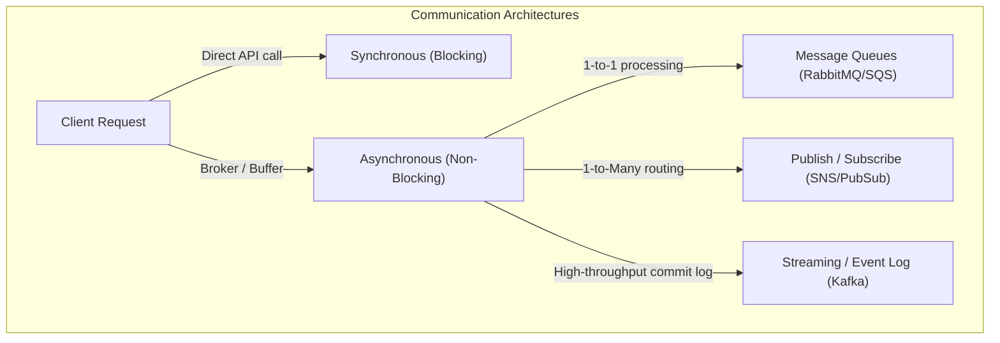
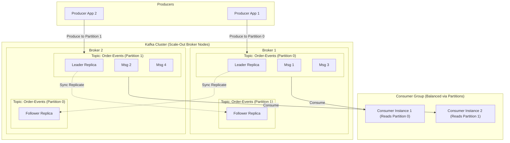

---
domains:
  - "networking"
  - "infra"
---

# Module 1-8: Distributed Communication & Queues

This module covers the core concepts of distributed, asynchronous system integration. It details synchronous vs. asynchronous interaction models, Publish/Subscribe (Pub/Sub) event distribution, message queues, and distributed streaming using partitioned commit logs (Apache Kafka).

---

## 🗺️ Cognitive Map: How to Think About Message Brokering

---

## 1. Synchronous vs. Asynchronous Communication

Systems design requires choosing between blocking (synchronous) and non-blocking (asynchronous) boundaries.

### A. Synchronous Communication
In a synchronous flow, the caller sends a request and blocks execution, waiting for a direct response from the receiver before continuing.
* **Examples:** REST APIs over HTTP/1.1, gRPC calls, direct database queries.

#### Deep-Intuition (AARF) Breakdown:
1. **The Answer (Core Pattern):** Standardize on synchronous HTTP/gRPC API calls only when immediate execution confirmation or transactional consistency is required.
2. **The Assumptions (Context):** Downstream dependencies must be highly available and exhibit low latencies to prevent blocking caller threads.
3. **The Rationale (Why):** Simple, linear programming model makes it easy to reason about, test, and write error handling for.
4. **The Failure Loop (What if not):** In a microservice chain (Service A calls B, which calls C), a delay or failure in C cascades upstream. Threads pile up on B and A, quickly exhausting server thread pools and connection slots, leading to cascading system-wide outages (`504 Gateway Timeout` or socket timeouts).
5. **Alternative Case (When to use 'if not'):** For long-running operations, background processing, or multi-step workflows, asynchronous communication must be used to decouple dependencies and keep client layers responsive.

### B. Asynchronous Communication
In an asynchronous flow, the sender writes a message to an intermediary broker and resumes execution immediately without waiting for the consumer to process it.
* **Examples:** Event triggers, message queue submissions, background job workers.

#### Deep-Intuition (AARF) Breakdown:
1. **The Answer (Core Pattern):** Place a broker (e.g., RabbitMQ, Kafka) at service boundaries, allowing producers to write events to a queue/topic asynchronously.
2. **The Assumptions (Context):** The system must tolerate **eventual consistency** and be designed to handle out-of-order execution and retries.
3. **The Rationale (Why):** Decouples services in both time and space. If a consumer goes offline, the producer continues functioning normally, buffering events on the broker until the consumer recovers.
4. **The Failure Loop (What if not):** Without asynchronous buffers, traffic spikes directly overload application instances, leading to packet drops, thread starvation, and service crashes.
5. **Alternative Case (When to use 'if not'):** Real-time interactive actions (e.g., processing a credit card payment or logging in a user) require synchronous confirmation. Using async flow here degrades user experience (forcing complex polling or WebSockets to verify success).

---

## 2. Pub/Sub vs. Message Queues

Two main asynchronous patterns exist for message routing:

### A. Publish/Subscribe (Pub/Sub) - 1-to-Many
Publishers push events to a logical **Topic**. The broker automatically replicates and routes a copy of the message to all active subscribers.
* **Common Technologies:** AWS SNS, GCP Pub/Sub, Redis Pub/Sub.

#### Deep-Intuition (AARF) Breakdown:
1. **The Answer (Core Pattern):** Configure a Pub/Sub topic where producers publish business events (e.g., `OrderCreated`). Independent microservices subscribe to the topic to run their respective logic (e.g., Billing, Shipping, Notification).
2. **The Assumptions (Context):** The broker must manage subscriber registrations, and there must be no strong ordering requirements between different subscriber services.
3. **The Rationale (Why):** Promotes loose coupling. New consumer services can be added to the system and start listening to events without modifying the publishing service's code.
4. **The Failure Loop (What if not):** If a single point-to-point queue is used instead, only one worker gets the message, preventing other services from reacting to the event. If the broker lacks persistence (e.g., Redis Pub/Sub), messages sent while a subscriber is offline are lost forever.
5. **Alternative Case (When to use 'if not'):** When a message requires heavy computational work that should only be executed once by a pool of workers, point-to-point message queues should be used instead.

### B. Message Queues - 1-to-1 (Competing Consumers)
Producers send messages to a **Queue**. Multiple worker instances listen to the queue, but each message is processed by exactly one worker.
* **Common Technologies:** RabbitMQ, AWS SQS, ActiveMQ.

#### Deep-Intuition (AARF) Breakdown:
1. **The Answer (Core Pattern):** Deploy a persistent message queue (e.g., RabbitMQ) with competing consumers. Implement message acknowledgements (ACKs) so messages are only removed from the queue after successful processing.
2. **The Assumptions (Context):** Tasks must be independent, and workers must be idempotent (able to handle occasional duplicate deliveries safely).
3. **The Rationale (Why):** Balances heavy compute tasks (e.g., PDF generation, email blasts) across a pool of horizontal workers, preventing overload on any single instance.
4. **The Failure Loop (What if not):** If workers fail to acknowledge messages, crashed worker tasks are lost. Conversely, if messages are not re-queued upon worker crash, tasks vanish. If the broker runs out of disk/memory buffer space, it applies backpressure, blocking producers.
5. **Alternative Case (When to use 'if not'):** If multiple independent downstream departments need to trigger separate business workflows from the same event, a queue is insufficient; topic-based Pub/Sub is required.

---

## 3. Distributed Streaming & Log Scaling (Kafka)

Distributed stream platforms treat messages as an append-only sequence of records written to a physical disk log.

### Kafka Partition and Broker Scaling Topology:

#### Deep-Intuition (AARF) Breakdown:
1. **The Answer (Core Pattern):** Deploy a partitioned, replicated commit log (e.g., Apache Kafka) with multiple brokers. Write messages to specific partitions using a key (e.g., hashing `user_id` to ensure all events for a user maintain strict order in a single partition).
2. **The Assumptions (Context):** Requires cluster coordination (ZooKeeper or KRaft) and careful planning of partition counts, as changing partition counts later is extremely complex and breaks key hashing.
3. **The Rationale (Why):** Writing messages sequentially to disk is extremely fast, bypassing database random-seek bottlenecks. Partitions distribute data and traffic across multiple brokers, providing unlimited scale. Consumer offsets allow consumers to read at their own pace and rewind/replay historical events.
4. **The Failure Loop (What if not):** If the number of partitions is set too low (e.g., 1 partition), only one consumer in a Consumer Group can active-read, leaving other instances idle and causing processing lag. If consumer offsets are committed before processing finishes, a consumer crash leads to message loss. If committed after processing, duplicate processing occurs upon crash.
5. **Alternative Case (When to use 'if not'):** For simple message routing with low volumes and where message replayability is not needed, standard queues (like SQS or RabbitMQ) are much easier to deploy and maintain than a heavy Kafka cluster.

---

## 🛠️ Verification & Testing Playbooks

To verify queue setups and stream message delivery in a development environment:
- For RabbitMQ queue testing: run `rabbitmqadmin publish exchange=amq.default routing_key=test_queue payload="message content"`
- For Kafka consumer/producer validation: use `kafka-console-producer.sh --bootstrap-server localhost:9092 --topic test_topic` and `kafka-console-consumer.sh --bootstrap-server localhost:9092 --topic test_topic --from-beginning`
