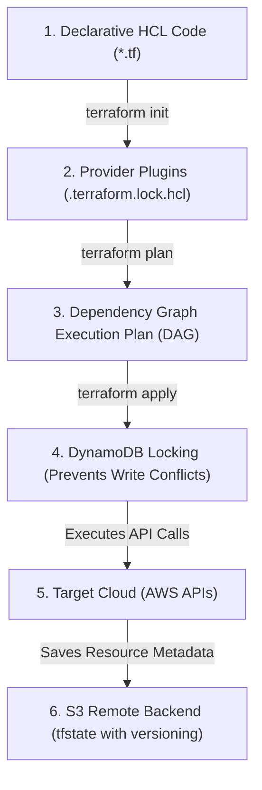

# Module 10-1: Terraform Foundations & State Management

This module details the core architectural engine of Terraform, declarative Infrastructure as Code (IaC) principles, the provider plugin framework, multi-user remote state locking using AWS S3 and DynamoDB, project structure best practices, provisioner dynamics, and import strategies.

---

## 🗺️ Cognitive Map: How to Think About the Flow of Knowledge

To manage cloud resources safely, transition your workflow from local executions to centralized, locked backend operations:



1. **Step 1: Declarative Definitions (Section 1):** Write HCL files describing the desired cloud state.
2. **Step 2: Provider Plugin Initialization (Section 2):** Initialize the workspace to download target provider binaries.
3. **Step 3: State Locking and Execution (Section 3):** Acquire a DynamoDB write lock, run plans, apply changes, and stream metadata updates to versioned S3 buckets.

---

## 1. Declarative Infrastructure as Code (IaC) Foundations & Core Engine

### A. Declarative vs. Imperative Paradigms
*   **Imperative (e.g. AWS CLI, Ansible, Shell Scripts):** Requires writing explicit step-by-step instructions to achieve the desired state (e.g., "Create VPC, wait 10 seconds, create subnet, create gateway"). If the script fails halfway, it must be rewritten or handled manually to avoid duplicate resource creation.
*   **Declarative (e.g. Terraform, Kubernetes YAML, CloudFormation):** You define the *desired end-state* of the infrastructure (e.g., "I want a VPC and a subnet"). Terraform evaluates the current state, computes the difference (delta), and plans the exact APIs to execute to reach the target, making it inherently idempotent.

### B. Mutable vs. Immutable Infrastructure
*   **Mutable Infrastructure:** Servers are updated in place (e.g. SSH into a server, run `apt-get upgrade`). This leads to configuration drift, where servers that started identical become different over time, making debugging difficult.
*   **Immutable Infrastructure:** Servers are never modified. To update software, you compile a new machine image (AMI), deploy a new server, and terminate the old one. Terraform encourages this pattern.

### C. Terraform Architecture & Under-the-Hood Engine
Terraform's architecture is divided into two distinct components:
1.  **Terraform Core:** A statically compiled binary written in Go. Core reads the HCL (HashiCorp Configuration Language) files, handles the state file mapping, constructs the **Directed Acyclic Graph (DAG)** to determine resource dependency order, and generates the execution plan.
2.  **Terraform Plugins (Providers):** Separate binaries written in Go that act as API wrappers. Core communicates with plugins over RPC (Remote Procedure Call). Providers translate Terraform Core's generic commands (like "create resource") into service-specific AWS API calls (e.g., calling the `CreateVpc` API).

---

## 2. Deep-Intuition (AARF) Breakdowns: Providers & Init

### A. AWS Provider Declarations & Credential Precedence
#### Deep-Intuition (AARF) Breakdown:
1. **The Answer (Core Pattern):** Declare provider requirements inside a `terraform` block to lock provider versions, and configure provider instances with AWS regions and authentication parameters.
    ```hcl
    terraform {
      required_version = ">= 1.5.0"
      required_providers {
        aws = {
          source  = "hashicorp/aws"
          version = "~> 5.0" # Lock major version to prevent breaking changes
        }
      }
    }

    provider "aws" {
      region  = var.aws_region
      profile = "my-developer-profile" # Points to ~/.aws/credentials
      default_tags {
        tags = {
          Environment = var.environment
          ManagedBy   = "Terraform"
        }
      }
    }
    ```
2. **The Assumptions (Context):** Version constraints use pessimistic operators (`~> 5.0` allows `5.1` but denies `6.0`). Credentials should *never* be hardcoded. Instead, follow the standard **AWS Authentication Precedence**:
    *   **Static credentials** inside the `provider` block (Access Key ID and Secret Access Key) — **Severe Security Risk**.
    *   **Environment Variables**: `AWS_ACCESS_KEY_ID`, `AWS_SECRET_ACCESS_KEY`, and `AWS_SESSION_TOKEN`.
    *   **Shared Credentials File**: `~/.aws/credentials` using named `profile` arguments.
    *   **IAM Roles / Instance Profiles**: Assumed automatically when running inside AWS compute (EC2, ECS, EKS) or via GitHub Actions OIDC federation.
3. **The Rationale (Why):** Decoupling provider versions prevents automatic upgrades from introducing breaking resource changes or deprecated arguments during automated CI runs. Global default tags ensure 100% of created resources are tracked for cost audits.
4. **The Failure Loop (What if not):** If version constraints are omitted, running `terraform init` in a new workspace downloads the absolute latest version. If the provider has released a major version upgrade, previously valid arguments will throw schema validation errors, crashing the build. Hardcoding API keys inside `provider` blocks leads to credentials being leaked to public Git hosting sites.
5. **Alternative Case (When to use 'if not'):** In multi-region deployments, declare provider aliases to route specific resources to separate geographical zones:
    ```hcl
    provider "aws" {
      alias  = "us_west"
      region = "us-west-2"
    }

    resource "aws_s3_bucket" "dr" {
      provider = aws.us_west
      bucket   = "my-dr-bucket"
    }
    ```

---

## 3. Remote State Management & DynamoDB Concurrency Locking

The state file (`terraform.tfstate`) acts as a mapping database between logical HCL resources and physical cloud objects.

### A. S3 Remote State vs. Local State
*   **Local State:** Stored locally in a plaintext file. Exposed to accidental deletion, exposes sensitive secrets (such as database passwords) in git history, and prevents collaboration since team members cannot synchronize modifications.
*   **Remote State (S3 + DynamoDB):** Stores state files in a secure, central S3 bucket. Protects secrets using S3 server-side encryption, guarantees historical backups using S3 versioning, and prevents concurrent apply operations using a DynamoDB locking table.

### B. Remote Backend Configuration
#### Deep-Intuition (AARF) Breakdown:
1. **The Answer (Core Pattern):** Configure a remote `s3` backend combined with a `dynamodb_table` locking registry:
    ```hcl
    terraform {
      backend "s3" {
        bucket         = "my-company-terraform-state-prod"
        key            = "global/s3/terraform.tfstate"
        region         = "us-east-1"
        encrypt        = true
        dynamodb_table = "terraform-locks-prod"
      }
    }
    ```
2. **The Assumptions (Context):** The S3 bucket must have versioning enabled, and the DynamoDB table must have a primary partition key named exactly `LockID` (string type).
3. **The Rationale (Why):** S3 provides infinite durability and native versioning (allowing recovery from state file corruptions). Setting `encrypt = true` ensures that plaintext secrets are encrypted at rest using KMS. When a developer runs a plan or apply, Terraform writes a locking document to DynamoDB. Concurrent runs read this lock, see it is active, and immediately exit to prevent collisions.
4. **The Failure Loop (What if not):** If remote backends are not configured, team collaboration leads to configuration drift (as each developer runs against their own local state) or immediate state corruption when concurrent applies overwrite each other. Without DynamoDB locking, running an automated deployment pipeline while a developer is debugging locally can cause race conditions, resulting in duplicate resources, ghost resources, or partial applies that leave infrastructure in a broken state.
5. **Alternative Case (When to use 'if not'):** For minor, non-production test scripts or learning playgrounds, local state is sufficient and avoids the overhead of provisioning backend locking tables.

---

## 4. Repository Structure & CLI Workflow Best Practices

To maintain code readability and prevent large, monolithic state boundaries, structure Terraform projects modularly:

### A. Recommended Project Directory Layout
```
prod-infra/
├── providers.tf       # Declares provider requirements and credentials profiles
├── variables.tf       # Defines input parameters and type constraints
├── outputs.tf         # Declares parameters to export to other states or CLI
├── main.tf            # Declares primary infrastructure resources
├── terraform.tfvars   # Actual key-value assignments for inputs (ignored in Git)
├── .gitignore         # File exclusions list
└── .terraform.lock.hcl # Lockfile committing downloaded plugin hashes
```

**`.gitignore` configuration:**
```
.terraform/
*.tfstate
*.tfstate.backup
.terraform.tfstate.lock.info
terraform.tfvars
```

### B. Standard CLI Command Suite
*   `terraform init`: Downloads and installs provider plugins, configures backends, and initializes work directories. Run `terraform init -migrate-state` to change backend configurations safely.
*   `terraform plan`: Compares desired configuration with active cloud resources and reads the current state to output an execution plan (dry run).
*   `terraform apply`: Executes the API modifications outlined in the plan. Use `terraform apply -auto-approve` to bypass interactive confirmation in automation pipelines.
*   `terraform destroy`: Identifies all resources tracked in the state file and terminates them in the correct dependency order.

---

## 5. Provisioners: local-exec, remote-exec, and file

Provisioners are used to execute scripts on your local machine or on remote servers (e.g. bootstrapping software). They are a **last resort** because they do not conform to Terraform's declarative model and state tracking.

### A. Provisioner Typology
*   **`local-exec`**: Runs a script on the local machine running the Terraform CLI.
    ```hcl
    resource "aws_instance" "web" {
      ami           = var.ami_id
      instance_type = "t3.micro"
      provisioner "local-exec" {
        command = "echo 'Instance IP is ${self.private_ip}' >> ip_logs.txt"
      }
    }
    ```
*   **`file`**: Transfers files or directories from the local machine to the newly created remote resource.
*   **`remote-exec`**: Connects to the remote resource via SSH or WinRM to execute scripts inline.
    ```hcl
    resource "aws_instance" "web" {
      ami           = var.ami_id
      instance_type = "t3.micro"
      
      provisioner "remote-exec" {
        inline = [
          "sudo apt-get update",
          "sudo apt-get install -y nginx"
        ]
      }

      connection {
        type        = "ssh"
        user        = "ubuntu"
        private_key = file("~/.ssh/id_rsa")
        host        = self.public_ip
      }
    }
    ```

### B. Failure Behavior and Best Practice Alternatives
*   **Tainting:** If a provisioner fails, Terraform marks the resource as **tainted** inside the state file. On the next plan/apply run, Terraform will completely destroy and recreate the tainted resource to guarantee a clean bootstrap.
*   **Error Handling:** Add `on_failure = continue` (defaults to `fail`) to let deployments succeed even if script executions fail.
*   **Why they are an anti-pattern:** Provisioners run imperatively and Terraform cannot track or clean up the changes they execute.
*   **Alternatives:** Use native cloud-init (`user_data` for EC2), container images, Packer-baked AMIs, or configuration management tools (Ansible, Chef) instead of provisioners to maintain declarative safety.

---

## 6. State Management CLI & Import Workflows

### A. State Manipulation commands
To fix name shifts or refactor directory configurations without destroying actual infrastructure, utilize the `state` command suite:
*   `terraform state list`: Lists all resources currently tracked in the state file.
*   `terraform state show <resource_address>`: Outputs the full properties and attributes of a tracked resource.
*   `terraform state mv <source> <destination>`: Renames a resource in the state file (e.g. moving a resource into a module boundary without causing recreation).
*   `terraform state rm <resource_address>`: Removes a resource from the state file. The physical resource remains active in the cloud but is no longer managed by Terraform.

### B. Declarative Import Blocks (Terraform v1.5+)
#### Deep-Intuition (AARF) Breakdown:
1. **The Answer (Core Pattern):** Declare `import` blocks in code to ingest running resources, and use `-generate-config-out` during plan execution to auto-write the HCL declarations.
    ```hcl
    # import.tf
    import {
      to = aws_s3_bucket.imported_bucket
      id = "my-pre-existing-s3-bucket-name"
    }
    ```
    Execution command:
    ```bash
    terraform plan -generate-config-out=generated_resources.tf
    ```
2. **The Assumptions (Context):** The target ID matches the cloud resource key identifier (e.g. S3 bucket name, VPC ID, or instance ID).
3. **The Rationale (Why):** Legacy imports (`terraform import` CLI command) were imperative and required developers to manually write matching HCL resource blocks first, then execute a CLI command that modified the state file directly. If the written HCL did not match the cloud configuration, subsequent plans would show massive updates. Declarative `import` blocks compile import instructions directly into the code. The `-generate-config-out` flag tells Terraform to inspect the cloud resource, generate correct HCL code, and write it to a file, preventing human mapping errors and ensuring the import is reviewable in pull requests.
4. **The Failure Loop (What if not):** If legacy command-line imports are used, developers bypass code reviews. If multiple imports are executed, the state file is mutated directly without trackable commits, increasing the risk of state corruption.
5. **Alternative Case (When to use 'if not'):** For massive scale-out import automation pipelines where configuration is generated programmatically from CMDB systems, CLI-based imports inside scripts remain a viable pattern.
