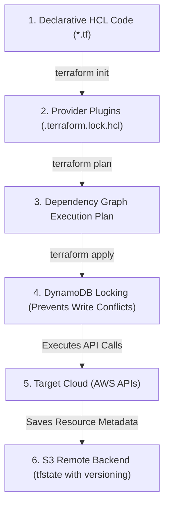

# Module 10-1: Terraform Foundations & State Management

This module details the core architectural engine of Terraform, declarative Infrastructure as Code (IaC) principles, the provider plugin framework, and multi-user remote state locking using AWS S3 and DynamoDB.

---

## 🗺️ Cognitive Map: How to Think About the Flow of Knowledge

To manage cloud resources safely, transition your workflow from local executions to centralized, locked backend operations:



1. **Step 1: Declarative Definitions (Section 1):** Write HCL files describing the desired cloud state.
2. **Step 2: Provider Plugin Initialization (Section 2):** Initialize the workspace to download target provider binaries.
3. **Step 3: State Locking and Execution (Section 3):** Acquire a DynamoDB write lock, run plans, apply changes, and stream metadata updates to versioned S3 buckets.

---

## 1. Declarative Infrastructure as Code (IaC) Foundations

### A. Declarative vs. Imperative Paradigms
*   **Imperative (e.g. AWS CLI, Ansible, Shell Scripts):** Requires writing explicit step-by-step instructions to achieve the desired state (e.g., "Create VPC, wait 10 seconds, create subnet, create gateway"). If the script fails halfway, it must be rewritten or handled manually to avoid duplicate resource creation.
*   **Declarative (e.g. Terraform, Kubernetes YAML, CloudFormation):** You define the *desired end-state* of the infrastructure (e.g., "I want a VPC and a subnet"). Terraform evaluates the current state, computes the difference (delta), and plans the exact APIs to execute to reach the target, making it inherently idempotent.

### B. Mutable vs. Immutable Infrastructure
*   **Mutable Infrastructure:** Servers are updated in place (e.g. SSH into a server, run `apt-get upgrade`). This leads to configuration drift, where servers that started identical become different over time, making debugging difficult.
*   **Immutable Infrastructure:** Servers are never modified. To update software, you compile a new machine image (AMI), deploy a new server, and terminate the old one. Terraform encourages this pattern.

---

## 2. Deep-Intuition (AARF) Breakdowns: Providers & Init

### A. AWS Provider Declarations
#### Deep-Intuition (AARF) Breakdown:
1. **The Answer (Core Pattern):** Declare provider requirements inside a `terraform` block to lock provider versions, and configure provider instances with AWS regions and authentication parameters.
    ```hcl
    terraform {
      required_version = ">= 1.5.0"
      required_providers {
        aws = {
          source  = "hashicorp/aws"
          version = "~> 5.0" # Lock major version to prevent breaking changes
        }
      }
    }

    provider "aws" {
      region = var.aws_region
      default_tags {
        tags = {
          Environment = var.environment
          ManagedBy   = "Terraform"
        }
      }
    }
    ```
2. **The Assumptions (Context):** Version constraints use pessimistic operators (`~> 5.0` allows `5.1` but denies `6.0`). Credentials should be fed via environment variables (`AWS_ACCESS_KEY_ID`, `AWS_SECRET_ACCESS_KEY`, or local profile configuration) rather than hardcoded.
3. **The Rationale (Why):** Decoupling provider versions prevents automatic upgrades from introducing breaking resource changes or deprecated arguments during automated CI runs. Global default tags ensure 100% of created resources are tracked for cost audits.
4. **The Failure Loop (What if not):** If version constraints are omitted, running `terraform init` in a new workspace downloads the absolute latest version. If the provider has released a major version upgrade, previously valid arguments will throw schema validation errors, crashing the build. Hardcoding API keys inside `provider` blocks leads to credentials being leaked to public Git hosting sites.
5. **Alternative Case (When to use 'if not'):** In multi-region deployments, declare provider aliases to route specific resources to separate geographical zones:
    ```hcl
    provider "aws" {
      alias  = "us_west"
      region = "us-west-2"
    }

    resource "aws_s3_bucket" "dr" {
      provider = aws.us_west
      bucket   = "my-dr-bucket"
    }
    ```

---

## 3. Remote State Management & DynamoDB Concurrency Locking

The state file (`terraform.tfstate`) acts as a mapping database between HCL resources and real-world cloud objects. 

### Core State Problems (Local File Anti-Pattern)
1.  **Race Conditions:** If two developers execute `terraform apply` concurrently, they write to `terraform.tfstate` at the same time, causing state corruption and resource duplications.
2.  **Secret Exposure:** The state file stores database passwords, private keys, and environment variables in plaintext, which should never be committed to source repositories.

### A. Remote Backend Configuration
#### Deep-Intuition (AARF) Breakdown:
1. **The Answer (Core Pattern):** Configure a remote `s3` backend combined with a `dynamodb_table` locking registry:
    ```hcl
    terraform {
      backend "s3" {
        bucket         = "my-company-terraform-state-prod"
        key            = "global/s3/terraform.tfstate"
        region         = "us-east-1"
        encrypt        = true
        dynamodb_table = "terraform-locks-prod"
      }
    }
    ```
2. **The Assumptions (Context):** The S3 bucket must have versioning enabled, and the DynamoDB table must have a primary key named exactly `LockID` (string type).
3. **The Rationale (Why):** S3 provides infinite durability and native versioning (allowing recovery from state file corruptions). Setting `encrypt = true` ensures that plaintext secrets are encrypted at rest using KMS. When a developer runs a plan or apply, Terraform writes a locking document to DynamoDB. Concurrent runs read this lock, see it is active, and immediately exit to prevent collisions.
4. **The Failure Loop (What if not):** If remote backends are not configured, team collaboration leads to configuration drift (as each developer runs against their own local state) or immediate state corruption when concurrent applies overwrite each other. Without DynamoDB locking, running an automated deployment pipeline while a developer is debugging locally can cause race conditions, resulting in duplicate resources, ghost resources, or partial applies that leave infrastructure in a broken state.
5. **Alternative Case (When to use 'if not'):** For minor, non-production test scripts or learning playgrounds, local state is sufficient and avoids the overhead of provisioning backend locking tables.

---

## 4. Repository Structure Best Practices

To maintain code readability and prevent large, monolithic state boundaries, structure Terraform projects modularly:

### File Breakdown
*   `providers.tf`: Declares provider requirements and credentials profiles.
*   `variables.tf`: Defines input parameters and type constraints.
*   `outputs.tf`: Declares parameters to export to other states or print to the CLI.
*   `main.tf`: Declares the primary infrastructure resource declarations.
*   `terraform.tfvars`: File containing actual key-value assignments for inputs (ignored in Git).

### Recommended Project Directory Layout
```
prod-infra/
├── providers.tf
├── variables.tf
├── outputs.tf
├── main.tf
├── terraform.tfvars
├── .gitignore
└── .terraform.lock.hcl # Lockfile committing downloaded plugin hashes
```
**`.gitignore` setup:**
```
.terraform/
*.tfstate
*.tfstate.backup
.terraform.tfstate.lock.info
terraform.tfvars
```
*Read more in [[Reference Notes/430 - Terraform State file management with AWS S3  Remote Backend.txt]]*
