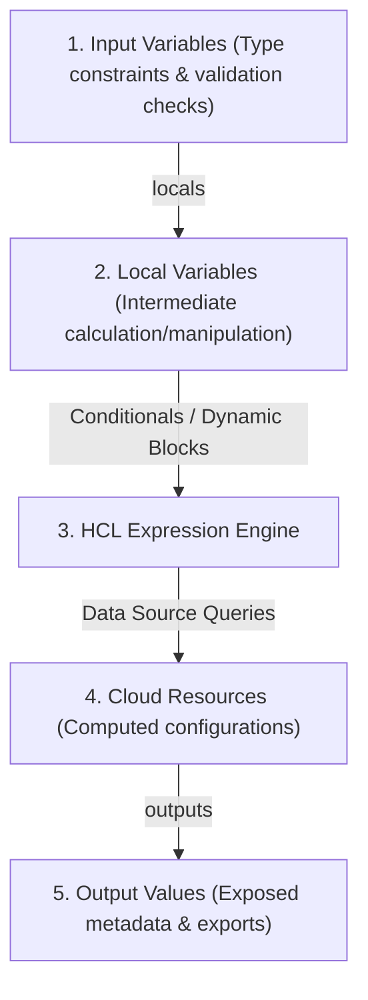
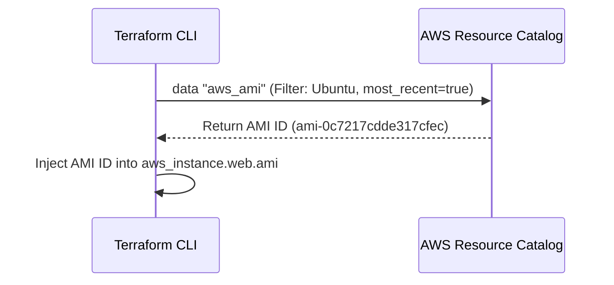

# Module 10-2: Variables, Types & Expression Syntax

This module covers Terraform variables (inputs, outputs, and local structures), type constraints (primitives, collections, and structural types), complex HCL expressions (ternary conditionals, splat operations, and dynamic block generation), built-in function categories, and dynamic data source queries.

---

## 🗺️ Cognitive Map: How to Think About the Flow of Knowledge

To write reusable and dynamic configuration files, think of inputs flowing through validations and expressions to produce structured configurations:



1. **Step 1: Input Validation (Section 1):** Constraints ensure users only input correct, structured variables.
2. **Step 2: Dynamic Expressions (Section 2):** Expressions handle branching logic and loop list variables into inline blocks.
3. **Step 3: Runtime Injections (Section 3):** Query active cloud resources dynamically, merging external state into resource declarations.

---

## 1. Input, Output, and Local Variable Structures

Terraform manages configuration parameters using three types of variables:

### A. Input Variables
Configurable parameters provided by the user (similar to CLI arguments or function inputs).
*   **Declaring Inputs:**
    ```hcl
    variable "instance_type" {
      type        = string
      description = "EC2 instance sizing"
      default     = "t3.micro"
    }
    ```
*   **Variable Precedence (Passing Inputs):** When running plans or applies, inputs are evaluated from lowest to highest priority:
    1.  **Environment Variables:** Env vars prefixed with `TF_VAR_` (e.g. `export TF_VAR_instance_type="t3.small"`).
    2.  **Default Value:** Configured directly in the variable block.
    3.  **VCS / CLI variables:** Passed dynamically via `-var` or `-var-file` flags (e.g. `terraform apply -var="instance_type=t3.medium"`).
    4.  **Files (`terraform.tfvars`):** A standard key-value configuration file.
    5.  **Files (`*.auto.tfvars`):** Automatically loaded var files, taking precedence over standard `terraform.tfvars`.

### B. Output Values
Exposed variables that print to the CLI after run completion, or allow other workspaces to read metadata (like database connection endpoints).
*   **Declaring Outputs:**
    ```hcl
    output "instance_ip" {
      value       = aws_instance.web.public_ip
      description = "Public IP of the web server"
      sensitive   = false # Set to true to redact value from console printing
    }
    ```
*   **Sensitive Outputs:** If a resource attribute contains credentials (like a database password), you must set `sensitive = true`. This hides the value from console printing but **still writes it in plaintext to the state file**.

### C. Local Values (`locals`)
Private variables computed inside HCL code, used to clean up complex expressions and prevent copy-pasting:
```hcl
locals {
  common_tags = {
    Environment = var.environment
    Project     = "Infra-Core"
  }
  subnet_id = length(var.subnet_ids) > 0 ? var.subnet_ids[0] : aws_subnet.default.id
}
```

---

## 2. Type Constraints & Complex Type Schemas

Terraform enforces strict data safety using two categories of types:

### A. Primitive Types
*   `string`: Sequence of Unicode characters.
*   `number`: Integer or fractional numeric value.
*   `bool`: Boolean true or false value.

### B. Collection Types (Homogeneous Elements)
*   `list(...)`: An ordered, 0-indexed sequence of values of the same type.
*   `set(...)`: An unordered collection of unique values of the same type. Indexing is not supported.
*   `map(...)`: A collection of key-value pairs where keys are strings and values are of the same type.

### C. Structural Types (Heterogeneous Elements)
*   `tuple(...)`: A fixed-length, ordered sequence of values where each index can have a different type.
*   `object(...)`: A schema-defined key-value mapping where keys are strings and values can have different types.
    ```hcl
    variable "vpc_config" {
      type = object({
        vpc_name           = string
        enable_dns_support = bool
        subnets            = list(string)
      })
    }
    ```

### D. Trade-offs: List vs. Set & Map vs. Object
*   **List vs. Set:** Use `list` when order is critical and duplicate entries are expected. Use `set` (e.g. `toset(["admin", "operator"])`) when element uniqueness is mandatory and order is irrelevant (common when looping over resources using `for_each`).
*   **Map vs. Object:** Use `map` when storing simple key-value relationships of the same type (like mapping AMIs to regions: `map(string)`). Use `object` when defining a schema containing complex, multi-type structures.

---

## 3. Deep-Intuition (AARF) Breakdowns: Validations & Dynamic Blocks

### A. Input Variable Validation Rules
#### Deep-Intuition (AARF) Breakdown:
1. **The Answer (Core Pattern):** Utilize strict type constraints and explicit custom `validation` blocks with descriptive error messages:
    ```hcl
    variable "instance_type" {
      type        = string
      description = "EC2 instance sizing"
      default     = "t3.micro"

      validation {
        condition     = contains(["t3.micro", "t3.small", "m5.large"], var.instance_type)
        error_message = "Invalid instance type. Allowed types are: t3.micro, t3.small, m5.large."
      }
    }
    ```
2. **The Assumptions (Context):** Custom validation blocks only evaluate Boolean outputs. You cannot refer to other variables or resources within the validation condition block (conditions are self-contained).
3. **The Rationale (Why):** Enforcing validations early prevents Terraform from starting API calls that will fail later at the cloud side (e.g. attempting to provision an invalid instance type). It protects infrastructure schemas from human input errors.
4. **The Failure Loop (What if not):** If validation is omitted, the user can pass an invalid string (e.g., `t3.microoo` or a massive instance size `x1.32xlarge`). Terraform will initialize, run plans, lock the state, and begin API provisioning. The cloud provider will reject the API request, resulting in a failed apply, partial state updates, and wasted execution time.
5. **Alternative Case (When to use 'if not'):** For parameters controlled strictly by automation or VCS-bound git config arrays, simpler type checking without custom validation blocks is sufficient.

### B. Ternary Conditionals and Splat Expressions
*   **Ternary Conditionals:** Branch configurations using `<CONDITION> ? <TRUE_VALUE> : <FALSE_VALUE>`.
    ```hcl
    resource "aws_instance" "web" {
      ami           = var.ami_id
      instance_type = var.environment == "prod" ? "m5.large" : "t3.micro"
    }
    ```
*   **Splat Expressions:** Extract an attribute from a list of resources into a single array using the `*` splat operator:
    ```hcl
    output "subnet_ids" {
      value = aws_subnet.public[*].id # Yields a list of IDs ["subnet-1", "subnet-2"]
    }
    ```

### C. Dynamic Blocks (Iterating Inline Arguments)
#### Deep-Intuition (AARF) Breakdown:
1. **The Answer (Core Pattern):** Use `dynamic` blocks combined with `for_each` and a collection variable (list of objects) to dynamically compile repeating nested blocks (like Security Group ingress rules):
    ```hcl
    variable "ingress_rules" {
      type = list(object({
        port        = number
        protocol    = string
        cidr_blocks = list(string)
      }))
      default = [
        { port = 80, protocol = "tcp", cidr_blocks = ["0.0.0.0/0"] },
        { port = 443, protocol = "tcp", cidr_blocks = ["0.0.0.0/0"] }
      ]
    }

    resource "aws_security_group" "web_sg" {
      name        = "web-security-group"
      vpc_id      = var.vpc_id

      dynamic "ingress" {
        for_each = var.ingress_rules
        content {
          from_port   = ingress.value.port
          to_port     = ingress.value.port
          protocol    = ingress.value.protocol
          cidr_blocks = ingress.value.cidr_blocks
        }
      }
    }
    ```
2. **The Assumptions (Context):** Inside the `content` block, values are accessed using `<block_name>.value.<property>`. The block name matches the string passed to the `dynamic` block declaration.
3. **The Rationale (Why):** Standard HCL resources require nested config blocks (like `ingress { ... }`) declared explicitly. If you have 10 ports, declaring 10 hardcoded blocks is noisy and impossible to configure dynamically. Dynamic blocks iterate a list variable at compile time, translating the list elements into standard inline block arguments.
4. **The Failure Loop (What if not):** If dynamic blocks are not used, developers must copy-paste blocks for each rule, or create separate resources (e.g., `aws_security_group_rule`), which leads to massive code drift and makes Security Groups rigid and hard to modify programmatically.
5. **Alternative Case (When to use 'if not' / Dynamic Blocks vs. `count`/`for_each`):** Use `count` or `for_each` on the *resource* level to scale out whole resources (e.g. creating 3 separate Security Groups). Use `dynamic` blocks on the *inline parameter* level to dynamically generate nested blocks within a single resource (e.g. creating 1 Security Group with 10 ingress rules).

---

## 4. Built-in Function Categorization

Terraform does not support user-defined functions; only built-in functions are available:

### A. String & Numeric Functions
*   `join(separator, list)`: Merges a list of strings into a single string (e.g., `join(",", ["a", "b"])` outputs `"a,b"`).
*   `split(separator, string)`: Splits a string into a list of strings (e.g., `split("/", "a/b/c")` outputs `["a", "b", "c"]`).
*   `upper(string)` / `lower(string)`: Converts character case.
*   `trimspace(string)`: Removes leading and trailing whitespaces.
*   `replace(string, substring, replacement)`: Swaps a substring with a target string.
*   `max(...)` / `min(...)`: Finds highest or lowest numeric arguments.

### B. Collection & Logic Functions
*   `length(collection)`: Returns the number of items in a list, map, set, or string.
*   `lookup(map, key, default)`: Retreives a key's value from a map. If the key doesn't exist, returns the default value:
    ```hcl
    # If var.ami_map = { "us-east-1" = "ami-123" }
    ami = lookup(var.ami_map, "us-west-2", "ami-fallback")
    ```
*   `element(list, index)`: Retrieves a list element. If the index exceeds bounds, it wraps around using modulo math, protecting against out-of-bounds errors.
*   `keys(map)` / `values(map)`: Extracts lists of keys or values.
*   `concat(list1, list2)`: Combines multiple lists.
*   `merge(map1, map2)`: Merges multiple maps into one (e.g. combining common tags with resource-specific tags).
*   `compact(list)`: Removes empty strings from a list of strings.
*   `flatten(list)`: Flattens multi-dimensional nested lists into a single flat list.

### C. Filesystem Functions
*   `file(path)`: Reads a file from local disk and returns its contents as a plaintext string.
*   `fileexists(path)`: Checks if a file exists on local disk (returns Boolean).
*   `templatefile(path, vars)`: Reads a local file template, evaluates inline HCL expressions, and interpolates variables:
    ```hcl
    # user_data.sh.tpl contains: echo "App name: ${app_name}"
    user_data = templatefile("${path.module}/user_data.sh.tpl", {
      app_name = "CoreApi"
    })
    ```

---

## 5. Dynamic Data Sources

Data sources allow Terraform to query external APIs and fetch information about existing resources outside the workspace state.



### AARF Breakdown: Querying the Latest AMI ID
1.  **The Answer (Core Pattern):** Declare a `data` block with filters to resolve parameters at runtime:
    ```hcl
    data "aws_ami" "ubuntu" {
      most_recent = true
      owners      = ["099720109477"] # Canonical owner ID

      filter {
        name   = "name"
        values = ["ubuntu/images/hvm-ssd/ubuntu-jammy-22.04-amd64-server-*"]
      }

      filter {
        name   = "virtualization-type"
        values = ["hvm"]
      }
    }

    resource "aws_instance" "web" {
      ami           = data.aws_ami.ubuntu.id
      instance_type = "t3.micro"
    }
    ```
2.  **The Assumptions (Context):** The filters must resolve to exactly one resource (or the most recent match if `most_recent = true`). Data sources are read-only and query actual AWS endpoints during the plan/apply compile phase.
3.  **The Rationale (Why):** Cloud AMIs are regional and change their unique IDs whenever patches are released. Hardcoding AMI IDs (e.g. `ami-0c7217cdde317...`) makes configurations regional-bound and breaks builds when AMIs are retired. Data sources dynamically fetch the correct ID for the execution region at runtime.
4.  **The Failure Loop (What if not):** If data sources are omitted, code containing hardcoded AMI IDs will fail to compile if run in a different AWS region (e.g., us-east-1 vs. eu-central-1), or will crash when AWS deletes old AMIs from their catalog.
5.  **Alternative Case (When to use 'if not'):** If the organization requires strict compliance auditing where AMIs are pinned to manually verified golden images, specify explicit static AMI IDs mapped via lookup variables.
