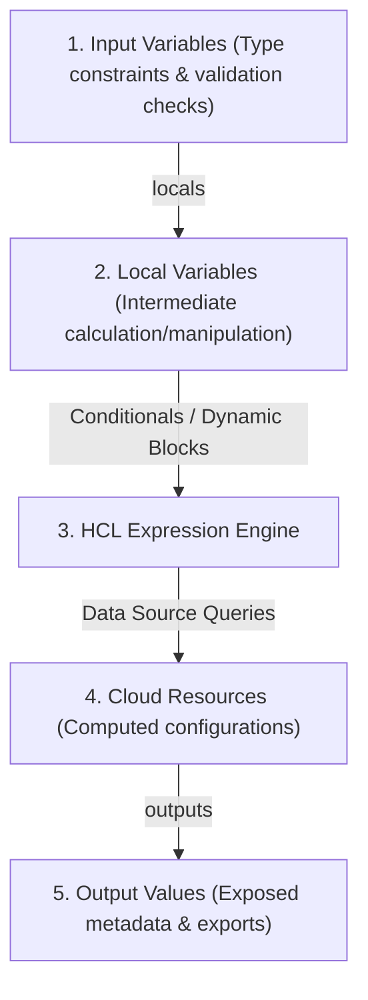
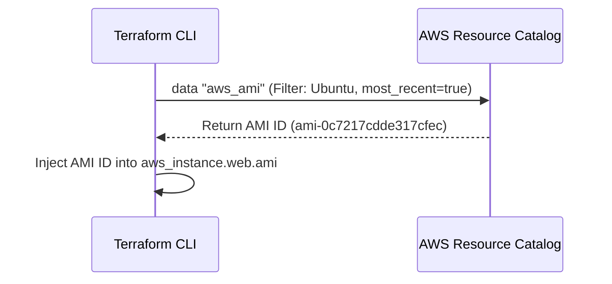

# Module 10-2: Variables, Types & Expression Syntax

This module covers Terraform variables (inputs, outputs, and local structures), type constraints, complex HCL expressions (ternary conditionals, splat operations, and dynamic block generation), and dynamic data source queries.

---

## 🗺️ Cognitive Map: How to Think About the Flow of Knowledge

To write reusable and dynamic configuration files, think of inputs flowing through validations and expressions to produce structured configurations:



1. **Step 1: Input Validation (Section 1):** Constraints ensure users only input correct, structured variables.
2. **Step 2: Dynamic Expressions (Section 2):** Expressions handle branching logic and loop list variables into inline blocks.
3. **Step 3: Runtime Injections (Section 3):** Query active cloud resources dynamically, merging external state into resource declarations.

---

## 1. Input, Output, and Local Variable Structures

Terraform manages configuration parameters using three types of variables:

*   **Input Variables:** Configurable parameters provided by the user (similar to CLI arguments or function inputs).
*   **Output Values:** Exposed variables that print to the CLI after run completion, or allow other workspaces to read metadata (like database connection endpoints).
*   **Local Values (`locals`):** Private variables computed inside HCL code, used to clean up complex expressions and prevent copy-pasting:
    ```hcl
    locals {
      common_tags = {
        Environment = var.environment
        Project     = "Infra-Core"
      }
      subnet_id = length(var.subnet_ids) > 0 ? var.subnet_ids[0] : aws_subnet.default.id
    }
    ```

---

## 2. Deep-Intuition (AARF) Breakdowns: Types & Dynamic Blocks

### A. Input Variable Validation Rules
#### Deep-Intuition (AARF) Breakdown:
1. **The Answer (Core Pattern):** Utilize strict type constraints and explicit custom `validation` blocks with descriptive error messages:
    ```hcl
    variable "instance_type" {
      type        = string
      description = "EC2 instance sizing"
      default     = "t3.micro"

      validation {
        condition     = contains(["t3.micro", "t3.small", "m5.large"], var.instance_type)
        error_message = "Invalid instance type. Allowed types are: t3.micro, t3.small, m5.large."
      }
    }
    ```
2. **The Assumptions (Context):** Custom validation blocks only evaluate Boolean outputs. You cannot refer to other variables or resources within the validation condition block (conditions are self-contained).
3. **The Rationale (Why):** Enforcing validations early prevents Terraform from starting API calls that will fail later at the cloud side (e.g. attempting to provision an invalid instance type). It protects infrastructure schemas from human input errors.
4. **The Failure Loop (What if not):** If validation is omitted, the user can pass an invalid string (e.g., `t3.microoo` or a massive instance size `x1.32xlarge`). Terraform will initialize, run plans, lock the state, and begin API provisioning. The cloud provider will reject the API request, resulting in a failed apply, partial state updates, and wasted execution time.
5. **Alternative Case (When to use 'if not'):** For parameters controlled strictly by automation or VCS-bound git config arrays, simpler type checking without custom validation blocks is sufficient.

### B. Dynamic Blocks (Iterating Inline Arguments)
#### Deep-Intuition (AARF) Breakdown:
1. **The Answer (Core Pattern):** Use `dynamic` blocks combined with `for_each` and a collection variable (list of objects) to dynamically compile repeating nested blocks (like Security Group ingress rules):
    ```hcl
    variable "ingress_rules" {
      type = list(object({
        port        = number
        protocol    = string
        cidr_blocks = list(string)
      }))
      default = [
        { port = 80, protocol = "tcp", cidr_blocks = ["0.0.0.0/0"] },
        { port = 443, protocol = "tcp", cidr_blocks = ["0.0.0.0/0"] }
      ]
    }

    resource "aws_security_group" "web_sg" {
      name        = "web-security-group"
      vpc_id      = var.vpc_id

      dynamic "ingress" {
        for_each = var.ingress_rules
        content {
          from_port   = ingress.value.port
          to_port     = ingress.value.port
          protocol    = ingress.value.protocol
          cidr_blocks = ingress.value.cidr_blocks
        }
      }
    }
    ```
2. **The Assumptions (Context):** Inside the `content` block, values are accessed using `<block_name>.value.<property>`. The block name matches the string passed to the `dynamic` block declaration.
3. **The Rationale (Why):** Standard HCL resources require nested config blocks (like `ingress { ... }`) declared explicitly. If you have 10 ports, declaring 10 hardcoded blocks is noisy and impossible to configure dynamically. Dynamic blocks iterate a list variable at compile time, translating the list elements into standard inline block arguments.
4. **The Failure Loop (What if not):** If dynamic blocks are not used, developers must copy-paste blocks for each rule, or create separate resources (e.g., `aws_security_group_rule`), which leads to massive code drift and makes Security Groups rigid and hard to modify programmatically.
5. **Alternative Case (When to use 'if not'):** If the resource requires only a single, static block that never changes (like a single database subnet group configuration), use standard static block declarations to maintain simplicity.

---

## 3. Dynamic Data Sources

Data sources allow Terraform to query external APIs and fetch information about existing resources outside the workspace state.



### AARF Breakdown: Querying the Latest AMI ID
1.  **The Answer (Core Pattern):** Declare a `data` block with filters to resolve parameters at runtime:
    ```hcl
    data "aws_ami" "ubuntu" {
      most_recent = true
      owners      = ["099720109477"] # Canonical owner ID

      filter {
        name   = "name"
        values = ["ubuntu/images/hvm-ssd/ubuntu-jammy-22.04-amd64-server-*"]
      }

      filter {
        name   = "virtualization-type"
        values = ["hvm"]
      }
    }

    resource "aws_instance" "web" {
      ami           = data.aws_ami.ubuntu.id
      instance_type = "t3.micro"
    }
    ```
2.  **The Assumptions (Context):** The filters must resolve to exactly one resource (or the most recent match if `most_recent = true`).
3.  **The Rationale (Why):** Cloud AMIs are regional and change their unique IDs whenever patches are released. Hardcoding AMI IDs (e.g. `ami-0c7217cdde317...`) makes configurations regional-bound and breaks builds when AMIs are retired. Data sources dynamically fetch the correct ID for the execution region at runtime.
4.  **The Failure Loop (What if not):** If data sources are omitted, code containing hardcoded AMI IDs will fail to compile if run in a different AWS region (e.g., us-east-1 vs. eu-central-1), or will crash when AWS deletes old AMIs from their catalog.
5.  **Alternative Case (When to use 'if not'):** If the organization requires strict compliance auditing where AMIs are pinned to manually verified golden images, specify explicit static AMI IDs mapped via lookup variables.
