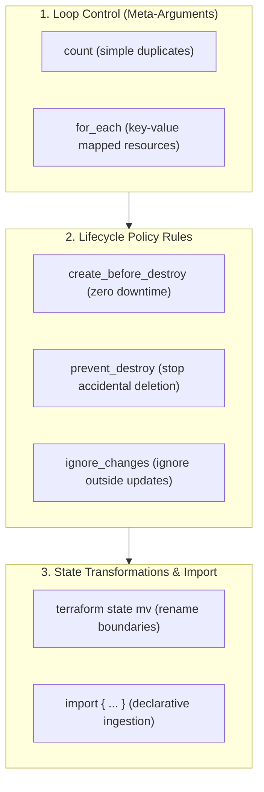

# Module 10-3: Meta-Arguments, Lifecycle Control & State Ops

This module details Terraform meta-arguments (`count`, `for_each`, `depends_on`), lifecycle rules (`create_before_destroy`, `prevent_destroy`, `ignore_changes`), provisioner behaviors, state manipulation commands, and declarative import workflows.

---

## 🗺️ Cognitive Map: How to Think About the Flow of Knowledge

To manage resource scaling and safe state transformations, structure your orchestration logic around explicit resource constraints:



1. **Step 1: Loop Control (Section 1):** Iterate collections safely to avoid index shifts.
2. **Step 2: Resource Lifecycle Rules (Section 2):** Safeguard production databases and enable zero-downtime upgrades.
3. **Step 3: State Ingestion (Section 3):** Import running external assets into HCL declarations cleanly.

---

## 1. Loop Control: `count` vs. `for_each`

### A. The Index Shifting Problem with `count`
*   **`count`:** Uses list indexes (0, 1, 2) to provision resources.
    ```hcl
    # If users = ["alice", "bob", "charlie"]
    resource "aws_iam_user" "users" {
      count = length(var.users)
      name  = var.users[count.index]
    }
    ```
    If you remove `"bob"` from the middle of the list, bob is at index 1. Alice remains at 0, but Charlie shifts from index 2 to index 1. Terraform sees this as a rename/replacement of index 1 (updating Bob to Charlie) and a deletion of index 2, causing unnecessary resource recreation.
*   **`for_each`:** Uses map keys or sets, binding resource identities to unique string keys rather than integer indexes:
    ```hcl
    resource "aws_iam_user" "users" {
      for_each = toset(var.users)
      name     = each.value
    }
    ```
    Removing `"bob"` only deletes the resource identified by the key `aws_iam_user.users["bob"]`. Charlie's key `aws_iam_user.users["charlie"]` remains completely untouched, preventing index shifts.

---

## 2. Deep-Intuition (AARF) Breakdowns: Lifecycle Rules & Imports

### A. Zero-Downtime Swaps via `create_before_destroy`
#### Deep-Intuition (AARF) Breakdown:
1. **The Answer (Core Pattern):** Declare a `lifecycle` block setting `create_before_destroy = true` within resources that must be swapped without traffic loss (like Auto Scaling Groups or Launch Templates):
    ```hcl
    resource "aws_launch_template" "asg_template" {
      name_prefix   = "web-template-"
      image_id      = var.ami_id
      instance_type = "t3.micro"

      lifecycle {
        create_before_destroy = true
      }
    }
    ```
2. **The Assumptions (Context):** The resource name must use `name_prefix` instead of a static `name`. If the name is static, creating the new instance before destroying the old one will trigger a name collision error at the cloud API side.
3. **The Rationale (Why):** By default, Terraform's replacement pattern is **destroy-then-create**. If you modify a resource that requires replacement (like an AMI change), Terraform deletes the existing resource, causing downtime while the new instance is provisioned and bootstrapped. `create_before_destroy` forces Terraform to provision the new resource first, verify it is healthy, and only then terminate the old instance.
4. **The Failure Loop (What if not):** If lifecycle swaps are left to default, updating Launch Templates or AMIs terminates running servers immediately. The application is completely offline until the new instances spin up, download dependencies, and pass health probes, causing production outages.
5. **Alternative Case (When to use 'if not'):** For stateful resources that cannot co-exist concurrently (like mounting a specific single-attachment EBS volume to an EC2 instance), destroy-then-create is mandatory.

### B. Declarative Import Blocks (Terraform v1.5+)
#### Deep-Intuition (AARF) Breakdown:
1. **The Answer (Core Pattern):** Declare `import` blocks in code to ingest running resources, and use `-generate-config-out` during plan execution to auto-write the HCL declarations.
    ```hcl
    # import.tf
    import {
      to = aws_s3_bucket.imported_bucket
      id = "my-pre-existing-s3-bucket-name"
    }
    ```
    Execution command:
    ```bash
    terraform plan -generate-config-out=generated_resources.tf
    ```
2. **The Assumptions (Context):** The target ID matches the cloud resource key identifier (e.g. S3 bucket name, VPC ID, or instance ID).
3. **The Rationale (Why):** Legacy imports (`terraform import` CLI command) were imperative and required developers to manually write matching HCL resource blocks first, then execute a CLI command that modified the state file directly. If the written HCL did not match the cloud configuration, subsequent plans would show massive updates. Declarative `import` blocks compile import instructions directly into the code. The `-generate-config-out` flag tells Terraform to inspect the cloud resource, generate correct HCL code, and write it to a file, preventing human mapping errors and ensuring the import is reviewable in pull requests.
4. **The Failure Loop (What if not):** If legacy command-line imports are used, developers bypass code reviews. If multiple imports are executed, the state file is mutated directly without trackable commits, increasing the risk of state corruption.
5. **Alternative Case (When to use 'if not'):** For massive scale-out import automation pipelines where configuration is generated programmatically from CMDB systems, CLI-based imports inside scripts remain a viable pattern.

---

## 3. Provisioners: local-exec, remote-exec, and file

Provisioners are used to execute scripts on your local machine or on remote servers (e.g. bootstrapping software). They are a **last resort** because they do not conform to Terraform's declarative model and state tracking.

```yaml
resource "aws_instance" "web" {
  ami           = var.ami_id
  instance_type = "t3.micro"

  # Executed locally on the developer's machine running Terraform
  provisioner "local-exec" {
    command = "echo 'Instance ${self.private_ip} provisioned' >> private_ips.txt"
  }
}
```

*   **Failure Behavior:** By default, if a provisioner fails, `terraform apply` fails, and the resource is marked as **tainted** (meaning it will be destroyed and recreated on the next run). You can override this setting by adding `on_failure = continue`.
*   **Better Alternatives:** Use native cloud-init (`user_data` for EC2), container images, or configuration management tools (Ansible, Chef) instead of provisioners to maintain declarative safety.

---

## 4. State Manipulation CLI

To fix name shifts or refactor directory configurations without destroying actual infrastructure, utilize the `state` command suite:

*   `terraform state list`: Lists all resources currently tracked in the state file.
*   `terraform state show <resource_address>`: Outputs the full properties and attributes of a tracked resource.
*   `terraform state mv <source> <destination>`: Renames a resource in the state file (e.g. moving a resource into a module boundary without causing recreation).
*   `terraform state rm <resource_address>`: Removes a resource from the state file. The physical resource remains active in the cloud but is no longer managed by Terraform.
