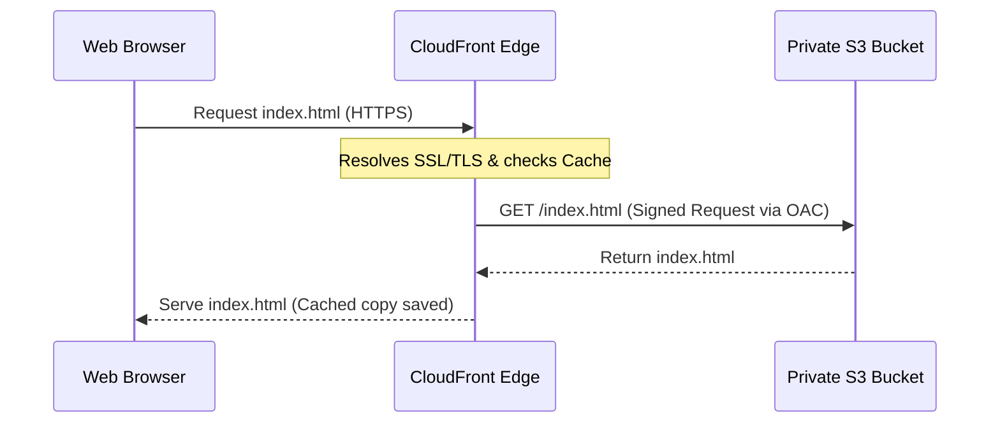
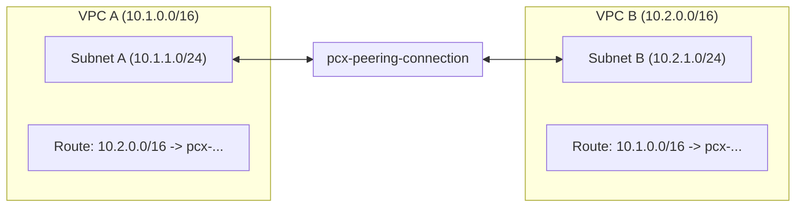

# Module 10-4: Networking, Static Website Hosting & Security Architecture

This module details Terraform configurations for AWS networking, secure static website hosting, IAM user and role delegation, 2-Tier architectures, Auto Scaling highly available clusters, and enterprise-grade 3-Tier topologies.

---

## 🗺️ Cognitive Map: How to Think About the Flow of Knowledge

To host web services and manage security namespaces, establish network pathing and restrict access paths from public edges to internal resources:

```mermaid
graph TD
    subgraph Edge["1. Edge & Entry Ingress"]
        CF["CloudFront CDN (SSL Edge)"] -->|Origin Access Control (OAC)| S3["Private S3 Bucket"]
        DNS["Route 53 DNS Routing"] --> ALB["Application Load Balancer"]
    end

    subgraph Compute["2. Multi-Tier Scaling Cluster"]
        ALB -->|Forward Target HTTP| WebASG["Web Tier ASG (Public Subnets)"]
        WebASG -->|Private API Calls| AppALB["App Tier ALB (Private Subnets)"]
        AppALB -->|Forward Target App| AppASG["App Tier ASG (Private Subnets)"]
    end

    subgraph DataIsolation["3. Private Data Tier"]
        AppASG -->|DB Queries (Port 5432)| RDS["Multi-AZ RDS postgres"]
    end

    subgraph SecurityTransit["4. Security & Private Transit"]
        Bastion["Bastion Host (SSM Session Manager)"] -.->|Admin Tunnel| AppASG
        VPCA["VPC Requester"] <-->|VPC Peering Connection| VPCB["VPC Accepter"]
    end
```

1. **Step 1: Edge Web Routing (Section 1):** Deploy edge caches with Origin Access Control (OAC) to protect backend S3 buckets.
2. **Step 2: Private Network Interconnection (Section 2):** Peer VPCs and configure bidirectional route table updates.
3. **Step 3: Identity & Access Management (Section 3):** Manage user groups, policy boundaries, and roles programmatically.
4. **Step 4: Multi-Tier Architectures (Section 4):** Orchestrate highly available, scalable 2-Tier and 3-Tier architectures using Auto Scaling Groups, ALBs, and isolated database subnets.

---

## 1. Secure Static Website Hosting (S3 + CloudFront CDN)

Hosting static assets (SPAs, web pages) directly out of public S3 buckets is a security risk. Best practice is to keep the S3 bucket private and route all traffic through a CloudFront Content Delivery Network (CDN) using Origin Access Control (OAC).



### A. S3 Bucket Policy with CloudFront OAC Configuration
```hcl
# 1. Private S3 Bucket
resource "aws_s3_bucket" "website" {
  bucket = "my-secure-static-website-assets-12345"
}

resource "aws_s3_bucket_public_access_block" "block_public" {
  bucket                  = aws_s3_bucket.website.id
  block_public_acls       = true
  block_public_policy     = true
  ignore_public_acls      = true
  restrict_public_buckets = true
}

# 2. CloudFront OAC Registration
resource "aws_cloudfront_origin_access_control" "oac" {
  name                              = "s3-oac-config"
  origin_access_control_origin_type = "s3"
  signing_behavior                  = "always"
  signing_protocol                  = "sigv4"
}

# 3. CloudFront Distribution
resource "aws_cloudfront_distribution" "cdn" {
  enabled             = true
  default_root_object = "index.html"

  origin {
    domain_name              = aws_s3_bucket.website.bucket_regional_domain_name
    origin_id                = "S3Origin"
    origin_access_control_id = aws_cloudfront_origin_access_control.oac.id
  }

  default_cache_behavior {
    allowed_methods        = ["GET", "HEAD"]
    cached_methods         = ["GET", "HEAD"]
    target_origin_id       = "S3Origin"
    viewer_protocol_policy = "redirect-to-https"

    forwarded_values {
      query_string = false
      cookies { forward = "none" }
    }
    min_ttl     = 0
    default_ttl = 3600
    max_ttl     = 86400
  }

  restrictions {
    geo_restriction { restriction_type = "none" }
  }

  viewer_certificate {
    cloudfront_default_certificate = true
  }
}

# 4. S3 Bucket Policy restricting access ONLY to CloudFront OAC
resource "aws_s3_bucket_policy" "allow_oac" {
  bucket = aws_s3_bucket.website.id
  policy = jsonencode({
    Version = "2012-10-17"
    Statement = [
      {
        Sid       = "AllowCloudFrontServicePrincipalReadOnly"
        Effect    = "Allow"
        Principal = { Service = "cloudfront.amazonaws.com" }
        Action    = "s3:GetObject"
        Resource  = "${aws_s3_bucket.website.arn}/*"
        Condition = {
          StringEquals = {
            "AWS:SourceArn" = aws_cloudfront_distribution.cdn.arn
          }
        }
      }
    ]
  })
}
```

### B. Core Architectural Trade-offs
*   **Why OAC over public S3 endpoints:** Making the S3 bucket public directly exposing web endpoints bypasses CDN edge cache rules, forcing the origin S3 bucket to handle all direct HTTP hits. This results in significantly higher bandwidth costs and exposes the origin S3 resources to scraping, data exfiltration, or DDoS downtime. CloudFront termination provides global low-latency edge caching, DDoS protection, and SSL termination.

---

## 2. AWS VPC Peering (Private Inter-Network Routing)

VPC Peering connects two Virtual Private Clouds, enabling private IPv4/IPv6 routing between them without going over the public internet.



### A. Peering Connection & Route Management
```hcl
# 1. VPC Peering Connection (VPC A to VPC B)
resource "aws_vpc_peering_connection" "peer" {
  peer_vpc_id   = aws_vpc.vpc_b.id
  vpc_id        = aws_vpc.vpc_a.id
  auto_accept   = true # Only valid if both VPCs are in the same AWS Account & Region

  tags = { Name = "vpc-a-to-vpc-b" }
}

# 2. Route Table configuration for VPC A
resource "aws_route" "a_to_b" {
  route_table_id            = aws_vpc.vpc_a.main_route_table_id
  destination_cidr_block    = aws_vpc.vpc_b.cidr_block
  vpc_peering_connection_id = aws_vpc_peering_connection.peer.id
}

# 3. Route Table configuration for VPC B
resource "aws_route" "b_to_a" {
  route_table_id            = aws_vpc.vpc_b.main_route_table_id
  destination_cidr_block    = aws_vpc.vpc_a.cidr_block
  vpc_peering_connection_id = aws_vpc_peering_connection.peer.id
}
```

### B. Core Routing Mechanics
Creating the peering connection only opens the logical network tunnel. Packets will still drop at the host subnets unless explicit route table entries direct traffic targeting the remote CIDR through the peering interface (`pcx-...`).
*   **Overlapping IPs:** The CIDR blocks of VPC A and VPC B must **NOT** overlap (e.g. attempting to peer two VPCs that both use `10.1.0.0/16` fails).
*   **Security Groups:** Security groups must be updated to permit traffic from the peer's CIDR or by referencing the peer's security group ID (if peering is intra-region).

---

## 3. AWS IAM User Management & Access Governance

IAM configurations dictate human and machine system authorization boundaries.

### A. Creating Users, Groups, and Group Memberships
```hcl
# 1. Create IAM Users
resource "aws_iam_user" "developers" {
  for_each = toset(["alice", "bob"])
  name     = each.value
}

# 2. Create IAM Group
resource "aws_iam_group" "dev_group" {
  name = "development-team-group"
}

# 3. Add Users to Group
resource "aws_iam_group_membership" "dev_team" {
  name = "dev-team-membership"
  users = [
    for u in aws_iam_user.developers : u.name
  ]
  group = aws_iam_group.dev_group.name
}

# 4. Create Policy
resource "aws_iam_policy" "read_only" {
  name        = "S3ReadOnlyPermissions"
  description = "Allows read access to S3 buckets"

  policy = jsonencode({
    Version = "2012-10-17"
    Statement = [
      {
        Effect   = "Allow"
        Action   = ["s3:GetObject", "s3:ListBucket"]
        Resource = "*"
      }
    ]
  })
}

# 5. Attach Policy to Group
resource "aws_iam_group_policy_attachment" "attach_read_only" {
  group      = aws_iam_group.dev_group.name
  policy_arn = aws_iam_policy.read_only.arn
}
```

### B. IAM Role Trust Policies
A Role is assumed by trusted services (e.g. EC2 instances, Lambda, GitHub OIDC). It uses two distinct policy attachments:
1.  **Assume Role Trust Policy:** Defines the external identity principal allowed to assume the role.
2.  **IAM Policy:** Defines the API resource actions granted once assumed.
```hcl
# The Role with its Trust Policy
resource "aws_iam_role" "ec2_role" {
  name = "web-ec2-role"

  assume_role_policy = jsonencode({
    Version = "2012-10-17"
    Statement = [
      {
        Action    = "sts:AssumeRole"
        Effect    = "Allow"
        Principal = { Service = "ec2.amazonaws.com" }
      }
    ]
  })
}
```

---

## 4. Multi-Tier Architectures (2-Tier & Highly Available 3-Tier)

Multi-tier architectures separate presentation (web), application (logic), and data (database) layers into distinct security zones.

### A. 2-Tier Architecture Setup
A 2-tier setup combines the presentation/application layers onto EC2 web servers located in public subnets, communicating directly with an RDS database isolated in private subnets.
*   **VPC & Subnets:** 2 Public subnets for EC2 instances, 2 Private subnets for RDS Instance (RDS Subnet Group requires subnets in at least 2 Availability Zones).
*   **Security Groups:** Public SG allows HTTP (Port 80) and HTTPS (Port 443) from `0.0.0.0/0`. DB SG allows PostgreSQL (Port 5432) or MySQL (Port 3306) only from the Public SG source.
```hcl
# RDS DB Subnet Group
resource "aws_db_subnet_group" "rds" {
  name       = "main-db-subnet-group"
  subnet_ids = [aws_subnet.private_1.id, aws_subnet.private_2.id]
}

# RDS Postgres Instance
resource "aws_db_instance" "postgres" {
  allocated_storage      = 20
  db_name                = "appdb"
  engine                 = "postgres"
  engine_version         = "15.4"
  instance_class         = "db.t3.micro"
  username               = "dbadmin"
  password               = var.db_password
  db_subnet_group_name   = aws_db_subnet_group.rds.name
  vpc_security_group_ids = [aws_security_group.db_sg.id]
  skip_final_snapshot    = true
}
```

### B. Highly Available and Scalable 3-Tier Architecture
A production 3-tier architecture decouples web servers, application servers, and databases. It leverages Application Load Balancers (ALBs) and Auto Scaling Groups (ASGs) to scale compute horizontally while maintaining high availability (HA).

```
[Internet] -> [Public ALB] 
                  |
         [Public Subnets (ASG Web Servers)] 
                  |
             [Internal ALB]
                  |
         [Private Subnets (ASG App Servers)]
                  |
         [Private Subnets (Multi-AZ RDS)]
```

#### 1. Compute & Scaling Configurations
*   **Launch Templates:** Define the blueprint for ASG compute instances (AMI ID, Instance Type, Security Groups, SSH Key, IAM Instance Profile, and `user_data` bootstrap scripts).
*   **Auto Scaling Groups:** Automate instance creation across multiple AZs. Define `min_size`, `max_size`, and `desired_capacity`, and link them to target groups for health checks.
```hcl
resource "aws_launch_template" "app_lt" {
  name_prefix   = "app-server-"
  image_id      = data.aws_ami.latest_linux.id
  instance_type = "t3.micro"
  
  network_interfaces {
    associate_public_ip_address = false
    security_groups             = [aws_security_group.app_sg.id]
  }

  user_data = base64encode(<<-EOF
              #!/bin/bash
              echo "Starting Application Server..."
              EOF
  )

  lifecycle {
    create_before_destroy = true
  }
}

resource "aws_autoscaling_group" "app_asg" {
  vpc_zone_identifier = [aws_subnet.private_1.id, aws_subnet.private_2.id]
  desired_capacity    = 2
  max_size            = 4
  min_size            = 1
  target_group_arns   = [aws_lb_target_group.app_tg.arn]

  launch_template {
    id      = aws_launch_template.app_lt.id
    version = "$Latest"
  }

  health_check_type         = "ELB"
  health_check_grace_period = 300
}
```

#### 2. Application Load Balancers (ALBs)
*   **Target Groups:** Route requests to registered targets (like EC2 instances). Configure health checks (`path`, `port`, `healthy_threshold`, `unhealthy_threshold`, `timeout`, and `interval`).
*   **Listeners:** Check for connection requests on specific ports (80/443) and define actions (forward to target group or redirect HTTP to HTTPS).
```hcl
resource "aws_lb" "external_alb" {
  name               = "public-alb"
  internal           = false
  load_balancer_type = "application"
  security_groups    = [aws_security_group.alb_sg.id]
  subnets            = [aws_subnet.public_1.id, aws_subnet.public_2.id]
}

resource "aws_lb_target_group" "web_tg" {
  name     = "web-target-group"
  port     = 80
  protocol = "HTTP"
  vpc_id   = aws_vpc.main.id

  health_check {
    path                = "/health"
    interval            = 30
    timeout             = 5
    healthy_threshold   = 3
    unhealthy_threshold = 3
  }
}

resource "aws_lb_listener" "http" {
  load_balancer_arn = aws_lb.external_alb.arn
  port              = 80
  protocol          = "HTTP"

  default_action {
    type             = "forward"
    target_group_arn = aws_lb_target_group.web_tg.arn
  }
}
```

#### 3. Bastion Host & Private Outbound Transit
*   **Bastion Host:** Placed in a public subnet to act as a secure gateway for administrative access. Use **AWS SSM Session Manager** to connect to private instances without exposing SSH (Port 22) to the internet, eliminating SSH keys management and public access.
*   **NAT Gateways:** Deployed in public subnets with an Elastic IP (EIP). Private subnets route outbound internet traffic (e.g. database updates or packages downloads) through the NAT Gateway.
