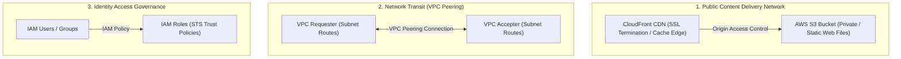
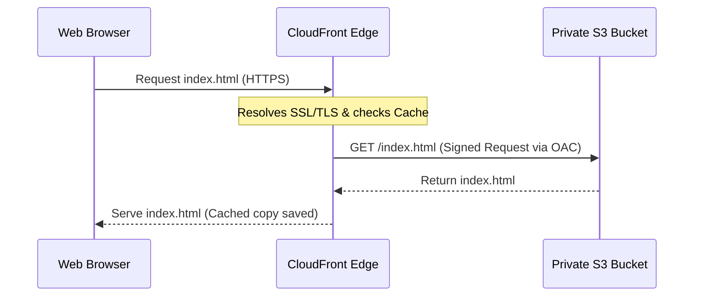
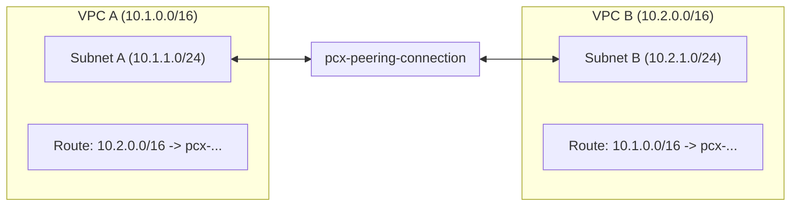

# Module 10-4: Networking, Static Website Hosting & Security Mini-Projects

This module covers Terraform implementations for core AWS networking, secure public website hosting using S3 and CloudFront, and IAM governance configurations.

---

## 🗺️ Cognitive Map: How to Think About the Flow of Knowledge

To host web services and manage security namespaces, establish network pathing and restrict access paths from public edges to internal resources:



1. **Step 1: Edge Web Routing (Section 1):** Deploy edge caches with Origin Access Control (OAC) to protect backend storage.
2. **Step 2: Private Network Interconnection (Section 2):** Peer VPCs and configure bidirectional route table updates.
3. **Step 3: Identity Authorization (Section 3):** Structure user namespaces, enforce group policies, and federate roles.

---

## 1. Secure Static Website Hosting (S3 + CloudFront CDN)

Hosting static assets (SPAs, web pages) directly out of public S3 buckets is a security risk. Best practice is to keep the S3 bucket private and route all traffic through a CloudFront Content Delivery Network (CDN) using Origin Access Control (OAC).



### AARF Breakdown: S3 Bucket Policy with CloudFront OAC
1.  **The Answer (Core Pattern):** Configure the S3 bucket to block public access, establish a CloudFront OAC registry, and attach an S3 bucket policy allowing access *only* to the CloudFront distribution service principal:
    ```hcl
    # 1. Private S3 Bucket
    resource "aws_s3_bucket" "website" {
      bucket = "my-secure-static-website-assets"
    }

    resource "aws_s3_bucket_public_access_block" "block_public" {
      bucket                  = aws_s3_bucket.website.id
      block_public_acls       = true
      block_public_policy     = true
      ignore_public_acls      = true
      restrict_public_buckets = true
    }

    # 2. CloudFront OAC
    resource "aws_cloudfront_origin_access_control" "oac" {
      name                              = "s3-oac"
      origin_access_control_origin_type = "s3"
      signing_behavior                  = "always"
      signing_protocol                  = "sigv4"
    }

    # 3. CloudFront Distribution
    resource "aws_cloudfront_distribution" "cdn" {
      enabled             = true
      default_root_object = "index.html"

      origin {
        domain_name              = aws_s3_bucket.website.bucket_regional_domain_name
        origin_id                = "S3Origin"
        origin_access_control_id = aws_cloudfront_origin_access_control.oac.id
      }

      default_cache_behavior {
        allowed_methods        = ["GET", "HEAD"]
        cached_methods         = ["GET", "HEAD"]
        target_origin_id       = "S3Origin"
        viewer_protocol_policy = "redirect-to-https"

        forwarded_values {
          query_string = false
          cookies { forward = "none" }
        }
      }

      restrictions {
        geo_restriction { restriction_type = "none" }
      }

      viewer_certificate {
        cloudfront_default_certificate = true
      }
    }

    # 4. S3 Bucket Policy allowing OAC
    resource "aws_s3_bucket_policy" "allow_oac" {
      bucket = aws_s3_bucket.website.id
      policy = jsonencode({
        Version = "2012-10-17"
        Statement = [
          {
            Sid       = "AllowCloudFrontServicePrincipalReadOnly"
            Effect    = "Allow"
            Principal = { Service = "cloudfront.amazonaws.com" }
            Action    = "s3:GetObject"
            Resource  = "${aws_s3_bucket.website.arn}/*"
            Condition = {
              StringEquals = {
                "AWS:SourceArn" = aws_cloudfront_distribution.cdn.arn
              }
            }
          }
        ]
      })
    }
    ```
2.  **The Assumptions (Context):** S3 bucket policies require JSON format (use `jsonencode` to generate it safely, preventing string formatting errors).
3.  **The Rationale (Why):** CloudFront terminations provide global low-latency edge caching, DDoS protection, and SSL termination. Bypassing public S3 configs ensures that users cannot bypass edge caches, protecting backend assets.
4.  **The Failure Loop (What if not):** Making the S3 bucket public directly exposing web endpoints bypasses CDN edge cache rules, forcing the origin S3 bucket to handle all direct HTTP hits. This results in significantly higher bandwidth costs and exposes the origin S3 resources to scraping, data exfiltration, or DDoS downtime.
5.  **Alternative Case (When to use 'if not'):** For internal development environments locked behind corporate VPC subnets, simple S3 hosting utilizing local endpoint routing without CloudFront is acceptable.

---

## 2. AWS VPC Peering (Private Inter-Network Routing)

VPC Peering connects two Virtual Private Clouds, enabling private IPv4/IPv6 routing between them without going over the public internet.



### AARF Breakdown: Peering and Route Management
1.  **The Answer (Core Pattern):** Create the peering connection, auto-accept it (if in the same account/region), and configure route table additions in both VPCs to target the peering connection ID:
    ```hcl
    # 1. VPC Peering Connection
    resource "aws_vpc_peering_connection" "peer" {
      peer_vpc_id = aws_vpc.vpc_b.id
      vpc_id      = aws_vpc.vpc_a.id
      auto_accept = true # Only valid if same account and region

      tags = { Name = "vpc-a-to-vpc-b" }
    }

    # 2. Route in VPC A pointing to VPC B's CIDR via Peering ID
    resource "aws_route" "a_to_b" {
      route_table_id            = aws_vpc.vpc_a.main_route_table_id
      destination_cidr_block    = aws_vpc.vpc_b.cidr_block
      vpc_peering_connection_id = aws_vpc_peering_connection.peer.id
    }

    # 3. Route in VPC B pointing to VPC A's CIDR via Peering ID
    resource "aws_route" "b_to_a" {
      route_table_id            = aws_vpc.vpc_b.main_route_table_id
      destination_cidr_block    = aws_vpc.vpc_a.cidr_block
      vpc_peering_connection_id = aws_vpc_peering_connection.peer.id
    }
    ```
2.  **The Assumptions (Context):** The CIDR blocks of VPC A and VPC B must **NOT** overlap (e.g. attempting to peer two VPCs that both use `10.1.0.0/16` fails).
3.  **The Rationale (Why):** Creating the peering connection only opens the logical network tunnel. Packets will still drop at the host subnets unless explicit route table entries direct traffic targeting the remote CIDR through the peering interface (`pcx-...`).
4.  **The Failure Loop (What if not):** If route table modifications are omitted, network requests between the VPCs will time out immediately. Diagnostic commands (`traceroute`, `ping`) will fail at the first hop, as the subnet route table is unaware of the peering interface.
5.  **Alternative Case (When to use 'if not'):** If connecting more than three VPCs, peering becomes complex (requiring $N(N-1)/2$ connections). Use a central **AWS Transit Gateway** instead to establish hub-and-spoke topologies.

---

## 3. Identity & Access Management (IAM) Governance

IAM configuration dictates human and machine system authorization boundaries.

### IAM Role Trust Policies
A Role is assumed by trusted services (e.g. EC2 instances, Lambda, GitHub OIDC). It uses two distinct policy attachments:
1.  **Assume Role Trust Policy (Who can assume this role):** Defines the external identity principal allowed to assume the role.
2.  **IAM Policy (What the role is allowed to do):** Defines the API resource actions granted once assumed.

```hcl
# The Trust Policy
resource "aws_iam_role" "lambda_s3_role" {
  name = "lambda-s3-access-role"
  
  assume_role_policy = jsonencode({
    Version = "2012-10-17"
    Statement = [
      {
        Action    = "sts:AssumeRole"
        Effect    = "Allow"
        Principal = { Service = "lambda.amazonaws.com" }
      }
    ]
  })
}

# The Permission Policy
resource "aws_iam_role_policy" "s3_read_perms" {
  name = "s3-read-permissions"
  role = aws_iam_role.lambda_s3_role.id

  policy = jsonencode({
    Version = "2012-10-17"
    Statement = [
      {
        Effect   = "Allow"
        Action   = ["s3:GetObject", "s3:ListBucket"]
        Resource = ["arn:aws:s3:::my-bucket", "arn:aws:s3:::my-bucket/*"]
      }
    ]
  })
}
```
*Read more in [[Reference Notes/1530 -  AWS VPC Peering Using Terraform - Mini project.txt]]*
