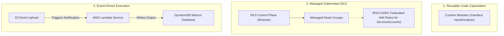
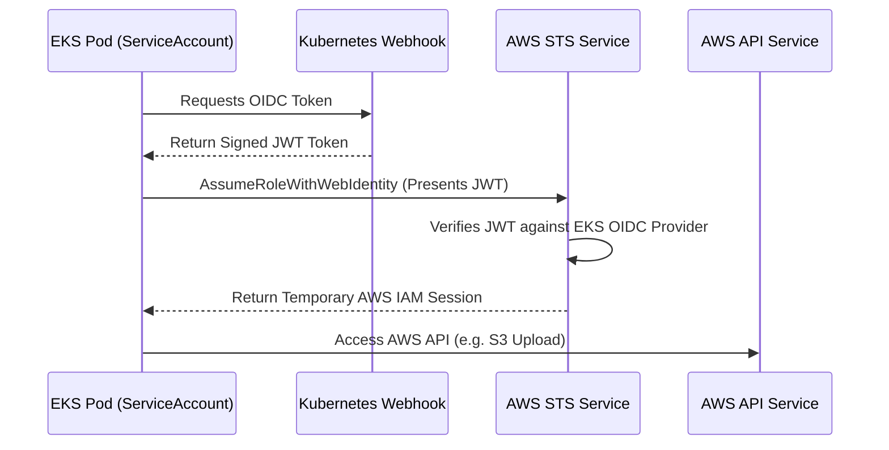

# Module 10-5: Production Architecture: Modules, EKS & Serverless

This module details custom Terraform module development, orchestrating managed EKS (Elastic Kubernetes Service) clusters with Federated IAM roles, and deploying serverless event-driven processing pipelines.

---

## 🗺️ Cognitive Map: How to Think About the Flow of Knowledge

To manage complex containerized and serverless environments, encapsulate configurations in reusable blocks and secure execution runtimes:



1. **Step 1: Code Encapsulation (Section 1):** Wrap raw cloud resources in clean interfaces using variables and outputs.
2. **Step 2: Container Platform Provisioning (Section 2):** Deploy EKS clusters and establish secure IAM boundaries for pods.
3. **Step 3: Event Pipelines (Section 3):** Wire cloud triggers to serverless code handlers using least-privilege roles.

---

## 1. Reusable Custom Module Design

Modules are the primary tool to package and reuse infrastructure configurations. Every directory containing `.tf` files is a module.

### A. Module Principles
*   **Encapsulation:** Sub-modules should manage their own resources. Avoid referencing parent resource configurations directly inside the sub-module.
*   **API Interface Contracts:** Input variables define the module's arguments (the input contract), and outputs define the properties exported back to the calling root configuration.
*   **Registry Sources:** Modules can be sourced locally or from remote registries (GitHub, HCP Terraform Registry).
    ```hcl
    module "vpc" {
      source  = "terraform-aws-modules/vpc/aws"
      version = "5.1.0"

      name = "my-prod-vpc"
      cidr = "10.0.0.0/16"
      # ... inputs
    }
    ```

---

## 2. EKS (Elastic Kubernetes Service) & Federated IAM (IRSA)

Deploying EKS requires configuring the Kubernetes Control Plane, Managed Node Groups, and setting up IAM Roles for Service Accounts (IRSA) to assign IAM permissions to specific pods.



### AARF Breakdown: EKS Cluster and IRSA Configuration
1.  **The Answer (Core Pattern):** Provision the EKS cluster, initialize the IAM OIDC provider, write the trust policy for the target service account, and create the role mapping:
    ```hcl
    # 1. EKS Control Plane
    resource "aws_eks_cluster" "main" {
      name     = "prod-eks"
      role_arn = aws_iam_role.eks_master.arn

      vpc_config {
        subnet_ids = var.private_subnet_ids
      }
    }

    # 2. Extract EKS OIDC Issuer URL and Fingerprint
    data "tls_certificate" "eks" {
      url = aws_eks_cluster.main.identity[0].oidc[0].issuer
    }

    resource "aws_iam_openid_connect_provider" "eks" {
      client_id_list  = ["sts.amazonaws.com"]
      thumbprint_list = [data.tls_certificate.eks.certificates[0].sha1_fingerprint]
      url             = aws_eks_cluster.main.identity[0].oidc[0].issuer
    }

    # 3. IAM Role with Trust relationship bound to K8s ServiceAccount
    resource "aws_iam_role" "pod_s3_role" {
      name = "eks-pod-s3-access"

      assume_role_policy = jsonencode({
        Version = "2012-10-17"
        Statement = [
          {
            Effect = "Allow"
            Principal = {
              Federated = aws_iam_openid_connect_provider.eks.arn
            }
            Action = "sts:AssumeRoleWithWebIdentity"
            Condition = {
              StringEquals = {
                "${replace(aws_iam_openid_connect_provider.eks.url, "https://", "")}:sub" = "system:serviceaccount:default:s3-reader-sa"
              }
            }
          }
        ]
      })
    }
    ```
2.  **The Assumptions (Context):** The namespace (`default`) and service account name (`s3-reader-sa`) declared in the IAM trust condition must match the Kubernetes YAML definitions.
3.  **The Rationale (Why):** Without IRSA, pods running on EKS worker nodes inherit the IAM permissions of the EC2 Node Instance profile. This violates the principle of least privilege, as *every* pod running on that worker node gains access to those credentials. IRSA isolates permissions to the pod level, using temporary STS trust sessions.
4.  **The Failure Loop (What if not):** If IRSA is not configured, developers often save hardcoded IAM user keys as Kubernetes Secrets and inject them into containers as environment variables. If a pod is compromised, the attacker extracts these keys from memory or filesystems, granting them permanent administrative access to the AWS account.
5.  **Alternative Case (When to use 'if not'):** For simple applications that do not interact with AWS APIs (e.g. static web frontend pods), IAM roles are not needed at all.

---

## 3. Serverless Pipelines (S3 Event-Driven Lambda)

Serverless pipelines execute custom code in response to system event notifications without requiring running server hosts.

### AARF Breakdown: S3 Notification Triggering Lambda
1.  **The Answer (Core Pattern):** Create the Lambda function, grant the S3 service principal permissions to invoke the function, and configure the S3 bucket notification trigger:
    ```hcl
    # 1. IAM Execution Role for Lambda
    resource "aws_iam_role" "lambda_exec" {
      name = "lambda-event-exec-role"
      assume_role_policy = jsonencode({
        Version = "2012-10-17"
        Statement = [{
          Action    = "sts:AssumeRole"
          Effect    = "Allow"
          Principal = { Service = "lambda.amazonaws.com" }
        }]
      })
    }

    # 2. Lambda Function definition
    resource "aws_lambda_function" "processor" {
      filename      = "lambda_function_payload.zip"
      function_name = "s3-image-processor"
      role          = aws_iam_role.lambda_exec.arn
      handler       = "index.handler"
      runtime       = "nodejs18.x"
    }

    # 3. Grant permission to S3 service principal to invoke Lambda
    resource "aws_lambda_permission" "allow_s3" {
      statement_id  = "AllowExecutionFromS3"
      action        = "lambda:InvokeFunction"
      function_name = aws_lambda_function.processor.function_name
      principal     = "s3.amazonaws.com"
      source_arn    = aws_s3_bucket.source_bucket.arn
    }

    # 4. S3 Bucket Event Notification
    resource "aws_s3_bucket_notification" "bucket_notification" {
      bucket = aws_s3_bucket.source_bucket.id

      lambda_function {
        lambda_function_arn = aws_lambda_function.processor.arn
        events              = ["s3:ObjectCreated:*"]
        filter_suffix       = ".jpg"
      }

      depends_on = [aws_lambda_permission.allow_s3]
    }
    ```
2.  **The Assumptions (Context):** The zip package `lambda_function_payload.zip` containing your handler code must exist in the workspace, or be pre-loaded to an S3 bucket before applying configurations.
3.  **The Rationale (Why):** Wiring execution permissions using `aws_lambda_permission` is required before setting up the S3 notification block. Without this permission, S3 will fail to trigger the execution API of the Lambda engine.
4.  **The Failure Loop (What if not):** If permissions are not configured, uploading images to the bucket will fail to trigger the Lambda function. S3 will drop the event payload silently, leaving your processing queue empty.
5.  **Alternative Case (When to use 'if not'):** If processing loads require strict processing order and queue retention, route S3 events to an **SQS queue** first, and configure the Lambda function to poll from SQS.
