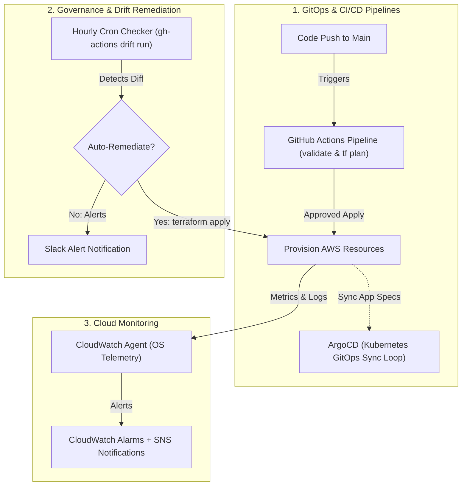

# Module 10-6: Enterprise CI/CD, Observability, GitOps & Drift Remediation

This module details enterprise production deployments: establishing observability using AWS CloudWatch, HCP Terraform workspace governance, automated CI/CD pipelines via GitHub Actions using OIDC authentication, GitOps EKS application synchronization with ArgoCD, and scheduled drift detection.

---

## 🗺️ Cognitive Map: How to Think About the Flow of Knowledge

To manage enterprise production environments, establish continuous delivery and monitoring loops to detect and resolve configuration drift:



1. **Step 1: Delivery & Sync (Section 1):** Deploy configurations via automated CI validation steps and sync cluster states with GitOps operators.
2. **Step 2: Workspace Governance (Section 2):** Secure state files, variables, and execution plans using cloud workspace models.
3. **Step 3: Observability & Telemetry (Section 3):** Capture server and network logs to alarm on metric thresholds.
4. **Step 4: Drift Remediation (Section 4):** Schedule automated runs to query actual cloud state against stored state records to verify compliance.

---

## 1. Automated IaC Pipelines & GitOps (GitHub Actions + ArgoCD)

Automating infrastructure delivery guarantees consistency and ensures all modifications are logged in source control.

### A. GitHub Actions Automated Pipeline with OIDC Trust
Instead of storing permanent, highly privileged AWS Access Keys inside GitHub Secrets, best practice is to configure an OIDC (OpenID Connect) trust. This allows GitHub Actions to assume a temporary IAM role dynamically using Web Identities (`sts:AssumeRoleWithWebIdentity`).
```yaml
name: Terraform Automation

on:
  pull_request:
    branches: [ main ]
  push:
    branches: [ main ]

permissions:
  id-token: write # Required for OIDC AWS token exchange
  contents: read
  pull-requests: write # Required to post plan output on PRs

jobs:
  terraform-pipeline:
    runs-on: ubuntu-latest
    steps:
      - name: Checkout Code
        uses: actions/checkout@v4

      - name: Configure AWS Credentials via OIDC
        uses: aws-actions/configure-aws-credentials@v4
        with:
          role-to-assume: arn:aws:iam::123456789012:role/github-actions-terraform-role
          aws-region: us-east-1

      - name: Setup Terraform
        uses: hashicorp/setup-terraform@v3
        with:
          terraform_version: "1.5.7"

      - name: Terraform Format Check
        run: terraform fmt -check

      - name: Terraform Init
        run: terraform init

      - name: Terraform Validate
        run: terraform validate

      - name: Terraform Plan
        if: github.event_name == 'pull_request'
        run: terraform plan -no-color

      - name: Terraform Apply
        if: github.ref == 'refs/heads/main' && github.event_name == 'push'
        run: terraform apply -auto-approve
```

### B. GitOps Integration (ArgoCD for EKS)
While Terraform manages foundational infrastructure (VPCs, RDS databases, EKS clusters), application configurations (Kubernetes Deployments, Services, Helm releases) are best managed via GitOps tools like ArgoCD.
*   **Multi-Repo Design Pattern:** 
    1.  **Infrastructure Repo:** Houses Terraform code to provision EKS, VPC, and ALBs.
    2.  **Application Repo:** Houses Helm charts, Kubernetes YAML manifests, and ArgoCD application definitions.
*   **Continuous Reconciliation:** ArgoCD runs as an operator inside the EKS cluster, polling the application Git repository. If the Git manifest defines 3 replicas, but the cluster only has 2, ArgoCD immediately updates the EKS API server to match, preventing manual pod modifications from drifting.

---

## 2. HCP Terraform Workspace Governance

HCP Terraform (formerly Terraform Cloud) provides a central platform to execute plans and manage remote state.

### A. Workspaces vs. Local Directory Environments
*   **Local Directory Environments:** Developers organize environments using separate subdirectories (e.g. `environments/dev/` and `environments/prod/`), copying files back and forth. This is prone to copy-paste drift, configuration mismatches, and lacks a centralized history of execution runs.
*   **HCP Terraform Workspaces:** Separate logical workspaces bind to the same VCS source code but maintain distinct state files, variables, credentials, policy gates (Sentinel/OPA), and run histories.
*   **Workspace Execution Modes:**
    1.  **Remote Execution:** Plans and applies run in HCP Terraform's secure runners, preventing local developer setups from introducing variations.
    2.  **Local Execution:** Developers run commands locally, but state updates and locks are managed centrally in the cloud.

---

## 3. End-to-End Cloud Observability (CloudWatch Agent & Logging)

AWS Observability ensures that administrators are alerted to infrastructure resource bottlenecks and security threats.

### A. Hypervisor Metrics vs. Unified CloudWatch Agent
*   **Default Hypervisor Metrics:** AWS monitors EC2 from the outside (hypervisor level). It tracks CPU utilization, Network IO, and Disk Read/Write rates out-of-the-box. It **cannot** see memory (RAM) usage or disk space utilization since these reside inside the guest OS.
*   **Unified CloudWatch Agent:** An agent installed inside the EC2 guest OS. It pushes internal metrics (RAM utilization, swap usage, disk space) and local log files (e.g. `/var/log/nginx/error.log`) directly to CloudWatch Logs.
*   **Trade-off Comparison:**
    *   *Default Metrics:* Instant setup, zero cost, no agent configuration.
    *   *CloudWatch Agent:* Requires installing the agent binary, whitelisting IAM EC2 instances to communicate with CloudWatch (`AmazonSSMManagedInstanceCore` and `CloudWatchAgentServerPolicy`), and configuring local `/opt/aws/amazon-cloudwatch-agent/etc/amazon-cloudwatch-agent.json` files.

### B. VPC Flow Logs & Alarms Setup
*   **VPC Flow Logs:** Capture IP traffic data flowing to and from network interfaces (ENIs) inside the VPC, saving logs to S3 or CloudWatch Logs for security analytics.
*   **Alarms & Notifications:** Configure alarms to trigger when resource metrics breach thresholds, routing notifications to teams via Amazon SNS:
    ```hcl
    resource "aws_cloudwatch_metric_alarm" "cpu_alarm" {
      alarm_name          = "ec2-high-cpu-alarm"
      comparison_operator = "GreaterThanOrEqualToThreshold"
      evaluation_periods  = 2
      metric_name         = "CPUUtilization"
      namespace           = "AWS/EC2"
      period              = 120
      statistic           = "Average"
      threshold           = 80
      alarm_actions       = [aws_sns_topic.alerts.arn]
    }
    ```

---

## 4. Automated Drift Detection & Remediation

#### Deep-Intuition (AARF) Breakdown:
1. **The Answer (Core Pattern):** Configure a scheduled GitHub Actions workflow that executes a plan with the `-detailed-exitcode` flag. If drift is detected (exit code 2), trigger an automated apply or alert notifications:
    ```yaml
    name: Drift Detection Scheduler

    on:
      schedule:
        - cron: '0 * * * *' # Run hourly

    jobs:
      drift-audit:
        runs-on: ubuntu-latest
        steps:
          - name: Checkout Code
            uses: actions/checkout@v4

          - name: Configure AWS Credentials
            uses: aws-actions/configure-aws-credentials@v4
            with:
              role-to-assume: arn:aws:iam::123456789012:role/github-actions-drift-role
              aws-region: us-east-1

          - name: Setup Terraform
            uses: hashicorp/setup-terraform@v3

          - name: Initialize Workspace
            run: terraform init

          # Exit codes: 0 = No changes, 2 = Drift detected, 1 = Error
          - name: Detect Changes
            id: plan
            run: |
              terraform plan -detailed-exitcode -no-color -out=drift.tfplan || exit_code=$?
              echo "exit_code=$exit_code" >> "$GITHUB_OUTPUT"
            continue-on-error: true

          - name: Auto-Remediate Drift
            if: steps.plan.outputs.exit_code == '2'
            run: terraform apply -auto-approve drift.tfplan
    ```
2. **The Assumptions (Context):** The pipeline execution must run under an IAM role containing write permissions. The exit code check `terraform plan -detailed-exitcode` returns `2` when changes exist.
3. **The Rationale (Why):** Configuration drift occurs when manual changes are made directly to cloud resources via the AWS Console (bypassing Terraform). Running scheduled checks identifies discrepancies immediately, and auto-applying the stored plan restores the actual state to the git-declared source of truth.
4. **The Failure Loop (What if not):** If drift detection is omitted, manual console overrides go unnoticed. Subsequent scheduled updates or changes run by other team members will see these changes, leading to plans that show resource replacements, database deletions, or security group resets that disrupt operations.
5. **Alternative Case (When to use 'if not'):** In highly dynamic test environments where developers require manual console access for quick experiments, automatic remediation should be disabled. Reconfigure the step to send Slack alerts instead of executing `terraform apply` directly.
