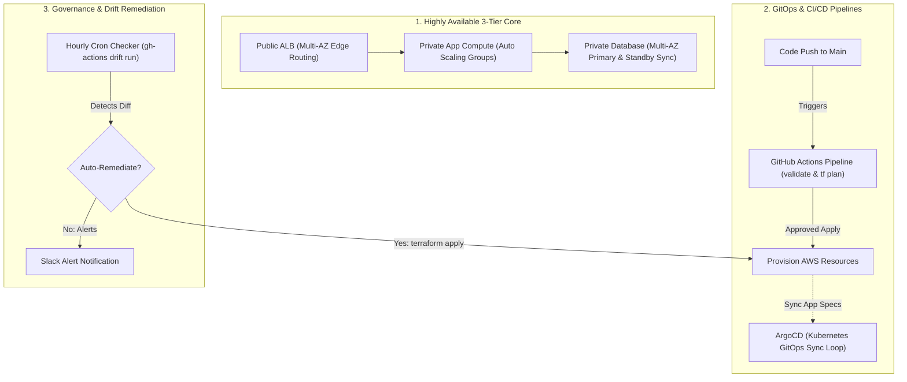
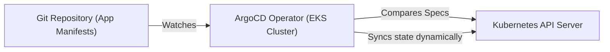

# Module 10-6: Enterprise CI/CD, Observability, GitOps & Drift Remediation

This module details enterprise production deployments: establishing highly available 3-tier AWS layouts, automating IaC pipelines using GitHub Actions, GitOps reconciliation, and drift detection.

---

## 🗺️ Cognitive Map: How to Think About the Flow of Knowledge

To manage enterprise production environments, establish continuous delivery and monitoring loops to detect and resolve configuration drift:



1. **Step 2: Delivery & Sync (Section 2):** Deploy configurations via automated CI validation steps and sync cluster states with GitOps operators.
2. **Step 3: Observability & Remediation (Section 3):** Schedule automated runs to query actual cloud state against stored state records to verify compliance.

---

## 1. Highly Available 3-Tier Architecture Core

A production-grade 3-tier architecture splits network boundaries into three distinct subnet layers across multiple Availability Zones (AZs):

1.  **Public Tier:** Hosts Application Load Balancers (ALB) and NAT Gateways. Direct public access from the internet is permitted.
2.  **Private Application Tier:** Hosts Auto Scaling Groups (ASG) running EC2 compute instances. Traffic is restricted to ingress originating from the ALB security group.
3.  **Private Database Tier:** Hosts database systems (e.g. Amazon RDS Multi-AZ instances). Direct internet routing is entirely blocked; ingress is allowed only from the Application Tier.

*Read more in the complete playbook: [[Projects/terraform/Project - HA 3-Tier Architecture on AWS.md]]*

---

## 2. Deep-Intuition (AARF) Breakdowns: CI/CD & Drift

### A. GitHub Actions Automated IaC Pipeline
#### Deep-Intuition (AARF) Breakdown:
1. **The Answer (Core Pattern):** Write a workflow file under `.github/workflows/terraform.yml` that executes syntax validation, security scanning (`tfsec`), and plans on pull requests, while limiting applies to main merges:
    ```yaml
    name: Terraform Automation

    on:
      pull_request:
        branches: [ main ]
      push:
        branches: [ main ]

    permissions:
      id-token: write # Required for OIDC AWS assumption
      contents: read
      pull-requests: write # Required to comment plan output on PRs

    jobs:
      terraform-pipeline:
        runs-on: ubuntu-latest
        steps:
          - name: Checkout Code
            uses: actions/checkout@v4

          - name: Setup Terraform
            uses: hashicorp/setup-terraform@v3
            with:
              terraform_version: "1.5.7"

          - name: Terraform Format Check
            run: terraform fmt -check

          - name: Terraform Init
            run: terraform init

          - name: Terraform Validate
            run: terraform validate

          - name: Security Scan (tfsec)
            uses: aquasecurity/tfsec-pr-commenter-action@v1.2.0
            with:
              github_token: ${{ secrets.GITHUB_TOKEN }}

          - name: Terraform Plan
            if: github.event_name == 'pull_request'
            run: terraform plan -no-color

          - name: Terraform Apply
            if: github.ref == 'refs/heads/main' && github.event_name == 'push'
            run: terraform apply -auto-approve
    ```
2. **The Assumptions (Context):** Requires configuring AWS provider credentials or OIDC trust.
3. **The Rationale (Why):** Automated validation prevents malformed code or syntax errors from breaking the state file. Commenting plan outputs directly on pull requests allows peer reviewers to audit changes before merging. Limiting applies to pushes on main enforces the git branch-protection gate model.
4. **The Failure Loop (What if not):** If manual CLI applies are used, developers bypass code reviews. If team members apply changes from different local environments, they can accidentally apply partial configs or mismatch provider versions, mutating the remote state and leading to configuration drift.
5. **Alternative Case (When to use 'if not'):** For organizations utilizing enterprise governance suites (HCP Terraform, Spacelift, or Env0), replace GitHub Actions runners with native platform workspaces.

### B. Automated Drift Detection & Remediation
#### Deep-Intuition (AARF) Breakdown:
1. **The Answer (Core Pattern):** Configure a scheduled GitHub Actions workflow that executes a plan with the `-detailed-exitcode` flag. If drift is detected (exit code 2), trigger an automated apply or alert notifications:
    ```yaml
    name: Drift Detection Scheduler

    on:
      schedule:
        - cron: '0 * * * *' # Run hourly

    jobs:
      drift-audit:
        runs-on: ubuntu-latest
        steps:
          - name: Checkout Code
            uses: actions/checkout@v4

          - name: Setup Terraform
            uses: hashicorp/setup-terraform@v3

          - name: Initialize Workspace
            run: terraform init

          # Exit codes: 0 = No changes, 2 = Drift detected, 1 = Error
          - name: Detect Changes
            id: plan
            run: |
              terraform plan -detailed-exitcode -no-color -out=drift.tfplan || exit_code=$?
              echo "exit_code=$exit_code" >> "$GITHUB_OUTPUT"
            continue-on-error: true

          - name: Auto-Remediate Drift
            if: steps.plan.outputs.exit_code == '2'
            run: terraform apply -auto-approve drift.tfplan
    ```
2. **The Assumptions (Context):** The pipeline execution must run under an IAM role containing write permissions.
3. **The Rationale (Why):** Configuration drift occurs when manual changes are made directly to cloud resources via the AWS Console (bypassing Terraform). Running scheduled checks identifies discrepancies immediately, and auto-applying the stored plan restores the actual state to the git-declared source of truth.
4. **The Failure Loop (What if not):** If drift detection is omitted, manual console overrides go unnoticed. Subsequent scheduled updates or changes run by other team members will see these changes, leading to plans that show resource replacements, database deletions, or security group resets that disrupt operations.
5. **Alternative Case (When to use 'if not'):** In highly dynamic test environments where developers require manual console access for quick experiments, automatic remediation should be disabled. Reconfigure the step to send Slack alerts instead of executing `terraform apply` directly.

---

## 3. GitOps Integration (ArgoCD for EKS)

While Terraform manages foundational infrastructure (VPCs, RDS databases, EKS clusters), application configurations (Kubernetes Deployments, Services, Helm releases) are best managed via GitOps tools like ArgoCD.



*   **Continuous Reconciliation:** ArgoCD runs as an operator inside the EKS cluster, polling the application Git repository. If the Git manifest defines 3 replicas, but the cluster only has 2, ArgoCD immediately updates the API server to match, preventing manual pod modifications from drifting.
