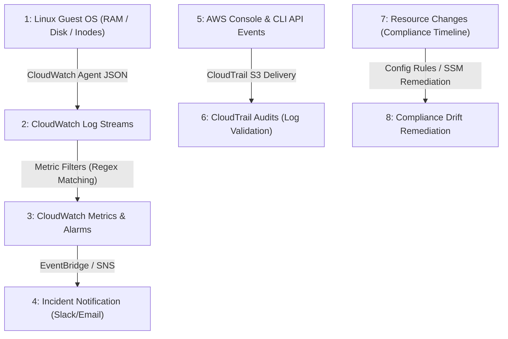
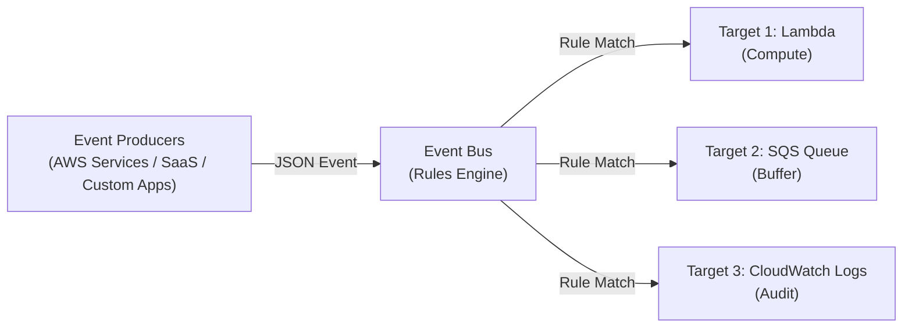
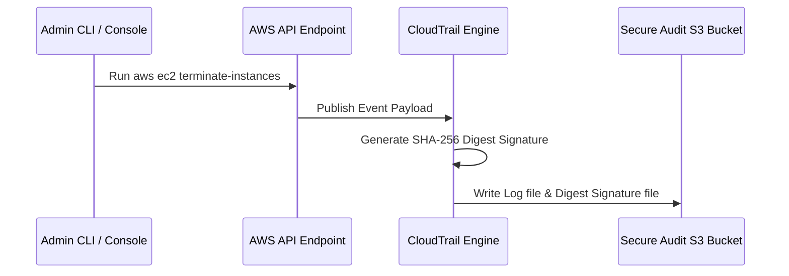

# Module 11-1: CloudOps Monitoring, Logging & Dashboards

This module details system metrics aggregation, configuring the unified CloudWatch Agent on Linux hosts, parsing logs via Custom Metric Filters, administrative auditing with CloudTrail, resource compliance with AWS Config, and operational event routing via EventBridge.

---

## 🗺️ Cognitive Map: How to Think About the Flow of Knowledge

To implement robust observability, route telemetry from guest operating systems up to centralized auditing trails:



1. **Step 1: Host-Level Instrumentation (Section 1):** Deploy the Unified CloudWatch agent to fetch metrics hidden from the hypervisor.
2. **Step 2: Alarms, Network Synthetic & Logs (Section 2 & 3):** Set thresholds, create composite alarms, establish synthetic monitors for direct connectivity, and aggregate logs.
3. **Step 3: Event Routing & Schema Registry (Section 4):** Route API and partner events through EventBridge and replay archived transactions.
4. **Step 4: Administrative Auditing & Log Integrity (Section 5):** Collect audit logs with CloudTrail and validate integrity against tampering.
5. **Step 5: Resource Governance & Drifts (Section 6):** Set configuration compliance baselines using Config and automate auto-remediation runbooks.

---

## 1. Unified CloudWatch Agent (Host-Level Instrumentation)

By default, Amazon EC2 hypervisor metrics only capture resources visible from the physical host virtualization layer: CPU utilization, network I/O, and disk I/O metadata. They **cannot** read OS-level metrics like RAM utilization, active swap usage, or internal filesystem disk space.

### A. Hypervisor vs. Agent Metrics
*   **Hypervisor Metrics (Default EC2):** Collected from the virtualization layer without host login. Includes physical disk read/write bandwidth, network interfaces throughput, and virtual CPU utilization. The hypervisor has no visibility inside the virtual machine's RAM tables or filesystem structure.
*   **OS/Agent Metrics (Unified CloudWatch Agent):** Requires host authentication and agent execution. By reading `/proc` virtual files (such as `/proc/meminfo` and `/proc/diskstats`), the agent collects memory usage (active, available, cached), swap file activity, active network connections, and directory-level storage block allocation.

### B. Logs Agent (Deprecated) vs. Unified Agent (Modern)
*   **CloudWatch Logs Agent:** The older, deprecated agent that could only send log files to CloudWatch logs.
*   **CloudWatch Unified Agent:** The modern replacement that aggregates both logs and system-level performance metrics, with built-in integration to SSM Parameter Store for centralized configuration management.

### AARF Breakdown: Unified CloudWatch Agent Deployment
1.  **The Answer (Core Pattern):** Install the CloudWatch Agent package on the Linux EC2 instance, attach an IAM Instance Profile containing the `CloudWatchAgentServerPolicy`, and write the configuration file under `/opt/aws/amazon-cloudwatch-agent/etc/amazon-cloudwatch-agent.json`:
    ```json
    {
      "agent": {
        "metrics_collection_interval": 60,
        "run_as_user": "cwagent"
      },
      "metrics": {
        "metrics_collected": {
          "mem": {
            "measurement": ["mem_used_percent", "mem_active", "mem_available"],
            "metrics_collection_interval": 60
          },
          "disk": {
            "measurement": ["used_percent", "inodes_free"],
            "resources": ["/"],
            "metrics_collection_interval": 60
          },
          "swap": {
            "measurement": ["swap_used_percent"],
            "metrics_collection_interval": 60
          }
        }
      },
      "logs": {
        "logs_collected": {
          "files": {
            "collect_list": [
              {
                "file_path": "/var/log/secure",
                "log_group_name": "system-auth-logs",
                "log_stream_name": "{instance_id}-auth",
                "retention_in_days": 14
              }
            ]
          }
        }
      }
    }
    ```
    Start the agent daemon via systemd:
    ```bash
    sudo /opt/aws/amazon-cloudwatch-agent/bin/amazon-cloudwatch-agent-ctl -a fetch-config -m ec2 -c file:/opt/aws/amazon-cloudwatch-agent/etc/amazon-cloudwatch-agent.json -s
    ```
2.  **The Assumptions (Context):** The EC2 instance must contain outbound HTTPS network access to write logs to the regional CloudWatch endpoint, and the IAM role must permit `cloudwatch:PutMetricData` and `logs:CreateLogStream`.
3.  **The Rationale (Why):** Operating system memory allocation and storage directory block allocation are managed directly by the Linux kernel scheduler. The hypervisor cannot read these metrics without an agent daemon inside the kernel space. The agent reads `/proc/meminfo` and `/proc/mounts` and streams them via JSON API calls to CloudWatch.
4.  **The Failure Loop (What if not):** Without the unified agent installed, if an EC2 instance experiences memory exhaustion (RAM leaks), the instance will trigger the Linux OOM-Killer, crashing critical processes (like database engines) or causing the kernel to panic. Because CPU and disk I/O metrics remain normal, hypervisor alarms will not trigger, leaving administrators unaware of the outage.
5.  **Alternative Case (When to use 'if not'):** For serverless environments (AWS Lambda, Fargate containers), CPU and memory metrics are collected natively by the service execution layers without manual agent installations.

---

## 2. CloudWatch Alarms, Synthetic Monitor, and Metrics Streaming

CloudWatch provides metrics across all services, organizes them in namespaces, and filters them using dimensions (attributes of a metric, up to 30 dimensions per metric).

### A. Alarms & Composite Alarms
*   **States:** `OK`, `ALARM`, `INSUFFICIENT_DATA`.
*   **Evaluation Period:** Time window used to evaluate the metric (e.g. 10s, 30s for high-resolution custom metrics, or multiples of 60s).
*   **Targets:** EC2 Actions (Stop, Terminate, Reboot, Recover), Auto Scaling rules (Scale out/in), SNS notifications (which can trigger Lambda).
*   **Composite Alarms:** Combines multiple alarms using boolean logic (`AND`, `OR`) to reduce alerting noise (e.g., only trigger an alert if CPU is high AND network bandwidth is low, indicating a hung process rather than typical query load).
*   **Testing Alarms:** Administrators can test alerting pipelines using the CLI call:
    ```bash
    aws cloudwatch set-alarm-state --alarm-name "HighCPUAlarm" --state-value ALARM --state-reason "Manual trigger for testing"
    ```

### B. EC2 Auto-Recovery
CloudWatch monitors instance status checks (guest VM level issues) and system status checks (underlying host physical hardware issues). A dedicated EC2 Auto-Recovery action can be attached to the system status check alarm to automatically move the instance to a new physical host without changes to public/private/elastic IPs, placement groups, or metadata.

### C. CloudWatch Network Synthetic Monitor
Designed to detect network performance issues (packet loss, latency, jitter) between AWS resources and on-premises data centers connected via Direct Connect or Site-to-Site VPN. It executes synthetic ICMP/TCP checks across IPv4 traffic without requiring local agent installation.

### D. Near Real-Time Metrics Streaming
For logging environments requiring centralized metrics collection, CloudWatch Metrics can be streamed directly via Kinesis Data Firehose to:
1.  **S3 + Athena:** For long-term ad-hoc SQL querying.
2.  **Amazon Redshift:** For data warehousing and business intelligence.
3.  **Amazon OpenSearch:** For real-time visualizations and search indexing.
4.  **Third-Party Providers:** Direct HTTP streaming to platforms like Datadog, Splunk, Dynatrace, New Relic, or Sumo Logic.

---

## 3. CloudWatch Logs & Custom Metric Filters

CloudWatch Logs act as a target repository for application logs, configured with log groups (applications) and log streams (individual containers, files, or instances).

### A. Logging Destination Architectures
*   **Batch S3 Export:** Log groups can be exported to S3 using the `CreateExportTask` API call. This is non-real-time and can take up to 12 hours to complete.
*   **Real-Time Streaming (Subscription Filters):** Streams logs immediately to Kinesis Data Streams, Kinesis Data Firehose, or Lambda for real-time analysis.
*   **Cross-Account Log Aggregation:** Real-time subscription filters in a sender account can stream logs into a central Kinesis stream in a receiver account. This is configured using a **Log Destination** in the recipient account, backed by a **destination access policy** and an IAM role with write permissions to the destination Kinesis stream.

### B. Live Tail
A real-time logging terminal interface in the CloudWatch console for debugging events as they occur.
> [!WARNING]
> Live Tail pricing allows only 1 free usage hour per day. Always close the Live Tail session once debugging is finished to avoid ongoing costs.

### AARF Breakdown: Custom Metric Filters
1.  **The Answer (Core Pattern):** Create a metric filter resource bound to the target log group using a specific filter pattern:
    ```hcl
    resource "aws_cloudwatch_log_metric_filter" "nginx_errors" {
      name           = "Nginx4xxErrorCount"
      pattern        = "[ip, id, user, timestamp, request, status_code = 4*, size]"
      log_group_name = "nginx-access-logs"

      metric_transformation {
        name      = "HTTP4xxCount"
        namespace = "WebServerCustom"
        value     = "1" # Increment metric by 1 for each match
      }
    }
    ```
2.  **The Assumptions (Context):** The filter pattern format matches the structure of your log syntax (the example parses standard Nginx combined log layouts where the 6th field is the status code).
3.  **The Rationale (Why):** Instead of running expensive analytics engines to scan logs retroactively, CloudWatch processes incoming log lines on-the-fly, producing metrics within seconds of event occurrence.
4.  **The Failure Loop (What if not):** If log metrics are not filtered, security alerts (e.g. brute-force login attempts or injection attacks) are only detected after post-incident log audits. You cannot configure real-time threshold alarms (e.g., "Trigger alarm if 4xx count exceeds 50 in 1 minute"), delaying remediation.
5.  **Alternative Case (When to use 'if not'):** If logs require complex correlation analysis (e.g. matching request IDs across multiple distinct services), route logs to an **Elasticsearch/OpenSearch** cluster or run **CloudWatch Logs Insights** queries.

---

## 4. Amazon EventBridge (Operational Event Hub)

Amazon EventBridge (formerly CloudWatch Events) is a serverless event bus that acts as a central router for JSON events. It decouples event producers from consumers, matching incoming JSON schemas against **Rules** and directing them to one or more **Targets** (such as AWS Lambda, SQS, SNS, ECS, or API Gateways).



### A. The Three Types of Event Buses
1.  **Default Event Bus:**
    *   Automatically provisioned in every AWS account.
    *   Exclusively receives events emitted by AWS services (e.g. `EC2 Instance State-change Notification`, `Auto Scaling Group Launch Successful`, `S3 API Calls` via CloudTrail).
2.  **Custom Event Bus:**
    *   Created manually by developers for custom enterprise workloads.
    *   Used to route custom JSON events between microservices.
    *   *Example Payload:*
        ```json
        {
          "Source": "com.mycompany.orders",
          "Detail-Type": "OrderPlaced",
          "Detail": {
            "orderId": "ord_998877",
            "amount": 149.99,
            "currency": "USD"
          }
        }
        ```
3.  **SaaS (Partner) Event Bus:**
    *   Used to ingest external events directly from third-party SaaS providers (such as Auth0, Shopify, Datadog, Zendesk, PagerDuty) into your AWS infrastructure.
    *   *How it works:* The partner connects to a special AWS partner resource. EventBridge generates a SaaS event bus in your account. You accept the connection, and partner events flow natively into your architecture without you having to build or manage webhook endpoints.

### B. Event Archiving & Replaying (Disaster Recovery & Bug Mitigation)
*   **Archiving:** You can configure an Event Bus to archive events. You define which events to store (based on filters) and the retention period (from 1 day to infinite).
*   **Replay:** If a downstream target fails (e.g. your database crashes, or a Lambda function throws code exceptions), you can "replay" the archived events. EventBridge sends the historical events back through the bus with their original timestamps, allowing your corrected downstream system to catch up on lost transactions without losing data.

### C. Schema Registry & Code Bindings
*   EventBridge features a **Schema Registry** that automatically analyzes events on your bus, detects changes, and generates schema definitions (e.g. OpenAPI specs).
*   Developers can download code bindings for major languages (Java, Python, TypeScript) directly from the registry. This generates typed objects in the application codebase, providing auto-complete and compiler validation for incoming JSON event payloads.

### D. Enterprise Pattern: Cross-Account Event Routing
To establish an enterprise-wide "Event Mesh", you can route events from spoke accounts to a central hub account:
1.  In the **Hub Account**, configure a Custom Event Bus and update its **Resource Policy** to accept events from specific spoke accounts:
    ```json
    {
      "Version": "2012-10-17",
      "Statement": [
        {
          "Sid": "AllowSpokeAccountsToPutEvents",
          "Effect": "Allow",
          "Principal": {
            "AWS": ["arn:aws:iam::111111111111:root", "arn:aws:iam::222222222222:root"]
          },
          "Action": "events:PutEvents",
          "Resource": "arn:aws:events:us-east-1:333333333333:event-bus/central-hub-bus"
        }
      ]
    }
    ```
2.  In the **Spoke Account**, create a rule on the default or custom bus matching target events (e.g., all high-severity GuardDuty alerts).
3.  Set the target of the rule in the spoke account to the central hub event bus ARN: `arn:aws:events:us-east-1:333333333333:event-bus/central-hub-bus`. SQS/EventBridge handles the transit encryption and routing cross-account.

---


## 5. Administrative Auditing (AWS CloudTrail)

CloudTrail records AWS API activity (console logins, CLI commands, IaC execution) as audit events.



### A. Event Classifications
*   **Management Events:** Log operations performed on resource configurations (e.g., `IAM:AttachRolePolicy`, `EC2:CreateSubnet`). Read events (read-only list/describe APIs) can be logged separately from Write events (mutate/delete APIs). Enabled by default with 90-day retention.
*   **Data Events:** High-volume resource operations (e.g., `S3:GetObject`, `Lambda:Invoke`). Disabled by default due to high transaction volume.
*   **Insights Events:** Anomaly detection engines that analyze Management Events to establish a standard API volume baseline and generate alerts if activity spikes (e.g., provisioning storms or rapid user deletions).
*   **Long-Term Audit Querying:** Audit events beyond the default 90-day retention are archived to S3 and queried serverlessly using **Amazon Athena**.

### B. Real-Time API Interception
CloudTrail API events are published directly to EventBridge. This allows developers to catch destructive operations immediately:
*   `DeleteTable` in DynamoDB -> EventBridge Rule -> SNS alert to security admins.
*   `AssumeRole` in IAM -> EventBridge Rule -> Lambda validation script.
*   `AuthorizeSecurityGroupIngress` in EC2 -> EventBridge Rule -> Trigger Auto-Remediation script.

### AARF Breakdown: Log File Integrity Validation
1.  **The Answer (Core Pattern):** Enable **Log File Validation** on CloudTrail configurations:
    ```hcl
    resource "aws_cloudtrail" "audit_trail" {
      name                          = "organization-audit-trail"
      s3_bucket_name                = aws_s3_bucket.audit_logs.id
      enable_log_file_validation    = true
      is_multi_region_trail         = true
      include_global_service_events = true
    }
    ```
    Verify log file integrity using the CLI:
    ```bash
    aws cloudtrail validate-logs --trail-arn arn:aws:cloudtrail:us-east-1:123456789012:trail/organization-audit-trail --start-time 2026-06-20T00:00:00Z
    ```
2.  **The Assumptions (Context):** S3 bucket policies must restrict delete permissions (`s3:DeleteObject`) using MFA-delete locks or Object Lock policies to prevent log tampering.
3.  **The Rationale (Why):** When validation is enabled, CloudTrail delivers a signed digest file containing the SHA-256 hash of each log file delivered to S3. Running the `validate-logs` CLI command recalculates these hashes and verifies the signatures. If an attacker modifies or deletes a log file to hide their actions, the validation signature check fails.
4.  **The Failure Loop (What if not):** If log validation is disabled, an intruder who compromises administrative credentials can delete or modify trail log files inside the S3 bucket. Incident responders will find missing or corrupted log files, making it impossible to reconstruct the attack timeline or determine the breach scope.
5.  **Alternative Case (When to use 'if not'):** None. For production environments, log file validation should be enabled universally.

---

## 6. AWS Config (Compliance Recording & Auto-Remediation)

AWS Config records configuration history and evaluates resource configurations against organizational rules (e.g., checking if encryption is enabled, or ports are left open).

### A. Compliance Rules & Remediations
*   **Rules:** Per-region rules (AWS Managed Rules like `restricted-ssh` vs Custom Rules written using AWS Lambda). They evaluate resource compliance either on configuration change or periodically. Config rules are audit tools; they do not block API calls (unlike Service Control Policies).
*   **Auto-Remediation:** If a resource is marked non-compliant, Config can trigger an SSM Automation Runbook (e.g. `RevokeUnusedIAMUserCredentials` or disabling insecure ports). Remediation rules support automatic retries (up to 5 times) if the resource fails compliance checks after remediation.
*   **Config Timeline:** Config captures a resource timeline, mapping configuration history directly alongside CloudTrail API calls to trace exactly *who* modified a resource and *when* it became non-compliant.

### B. ⚖️ AWS Config vs. AWS Security Hub
A common point of confusion is distinguishing AWS Config from AWS Security Hub. While they sound similar, they perform distinct roles in security governance:

| Feature | AWS Config (The Resource Tracker) | AWS Security Hub (The Compliance Dashboard) |
| :--- | :--- | :--- |
| **Primary Goal** | Audits **raw resource attribute configuration changes** over time (Configuration drift). | Assesses **overall security posture** and compliance against standardized industry benchmarks (CIS, PCI-DSS). |
| **Data Aggregator** | Monitors local resource attributes and dependencies. | Aggregates security alerts (Findings) from GuardDuty, Inspector, Macie, IAM Access Analyzer, and AWS Config. |
| **Under the Hood** | Evaluates independent rules (Config Rules) triggered on change or periodic schedules. | **Relies on AWS Config!** Security Hub uses Config rules behind the scenes to check resource states. |
| **Remediation** | Native **SSM Automation Runbooks** can immediately execute on drift detection. | Triggers custom workflows via EventBridge (e.g., AWS Security Hub Automated Response & Remediation). |

> [!IMPORTANT]
> **The Dependency:** Because Security Hub uses AWS Config rules to run its security benchmark checks (like AWS Foundational Security Best Practices), **you must enable AWS Config in all regions where you run Security Hub**. If AWS Config is disabled, Security Hub checks will fail to report status.


---

## 7. Operational Visibility (CloudWatch Insights)

CloudWatch provides specialized engines for tracing systems, containers, and applications:

### A. Container Insights
Aggregates container performance metrics and logs from Amazon ECS, Amazon EKS, Fargate, and self-managed Kubernetes clusters on EC2.
*   **Kubernetes Discovery:** Container Insights uses a containerized version of the Unified CloudWatch Agent running as a daemonset to collect performance metrics.

### B. Lambda Insights
Aggregates detailed system metrics (CPU time, memory usage, disk, network), cold start frequencies, and execution lifetimes. It is injected into serverless environments using a **Lambda Layer**.

### C. Contributor Insights
Scans raw log data (like VPC Flow Logs or DNS logs) to count unique occurrences and map top-N contributors (e.g. finding the top 10 IP addresses causing network traffic, or top URLs throwing errors).

### D. Application Insights
Analyzes application environments (Java, .NET, IIS, SQL Server) and their supporting resources (EBS, RDS, ELB, ASG, Lambda, DynamoDB, S3) using machine learning algorithms (backed by SageMaker) to generate troubleshooting dashboards. It routes findings to EventBridge and SSM OpsCenter.

---

## 8. Observability & Security Comparison Matrix

The table below contrasts the scopes and roles of CloudWatch, CloudTrail, AWS Config, and AWS Security Hub:

| Feature / Service | Amazon CloudWatch | AWS CloudTrail | AWS Config | AWS Security Hub |
| :--- | :--- | :--- | :--- | :--- |
| **Primary Focus** | Resource performance and health. | API call auditing and security trail. | Configuration drift and compliance history. | Overall security score and alert aggregation. |
| **Data Types** | Metrics, logs, alarms, trace data. | JSON API activity logs. | Resource attributes, compliance states. | Consolidated security findings. |
| **Evaluation Scope** | CPU, RAM, Disk, log text matching. | Console, CLI, SDK API execution. | AWS Resource compliance rules. | Security standards checks (CIS, PCI-DSS). |
| **Remediation Trigger** | Alarms -> Auto Scaling, EC2 Recover. | EventBridge -> Auto-remediation. | SSM Automation runbooks. | EventBridge -> AWS Lambda / Step Functions. |
| **Temporal View** | Real-time performance streams. | API event ledger (90-day default). | Compliance history timeline. | Real-time posture scoring. |


### Architectural Example: Observability of an Elastic Load Balancer (ELB)
To monitor an ELB:
*   **CloudWatch:** Tracks performance metrics such as active connections, target response times, and 5xx HTTP error code counts to scale resources or alert engineers.
*   **AWS Config:** Verifies configuration settings, ensuring the ELB has an SSL certificate attached, matches approved cipher suites, and does not allow unencrypted HTTP traffic.
*   **CloudTrail:** Tracks API audits to see which IAM entity modified the certificate, deleted the listener rules, or changed security group configurations.
