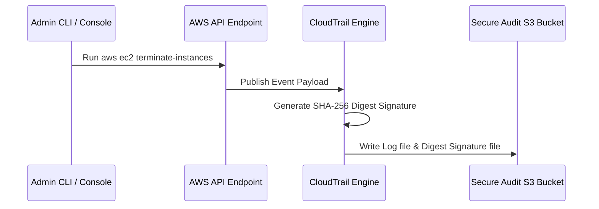

# Module 11-1: CloudOps Monitoring, Logging & Dashboards

This module details system metrics aggregation, configuring the unified CloudWatch Agent on Linux hosts, parsing application logs via Custom Metric Filters, and auditing API events with CloudTrail.

---

## 🗺️ Cognitive Map: How to Think About the Flow of Knowledge

To implement robust observability, route data from host processes up to centralized security trails:

```mermaid
graph TD
    Host["1. Linux Host Processes (Kernel Memory/Disk usage)"] -->|CloudWatch Agent JSON| CWLogs["2. CloudWatch Log Streams"]
    CWLogs -->|Metric Filters (Regex Matching)| CWMetrics["3. CloudWatch Metrics & Alarms"]
    CWMetrics -->|EventBridge / SNS| OpsNotification["4. Incident Notification (Slack/Email)"]
    AWSAPICalls["5. AWS Console & CLI API Events"] -->|CloudTrail S3 Delivery| AuditTrail["6. CloudTrail Audits (Log Validation)"]
```

1. **Step 1: Host-Level Instrumentation (Section 1):** Deploy the CloudWatch agent to fetch metrics hidden from the hypervisor.
2. **Step 2: Log Filtering & Alarming (Section 2):** Scan incoming log streams for error patterns and trigger notifications.
3. **Step 3: Administrative Auditing (Section 3):** Validate API audit trails to verify compliance and track configuration changes.

---

## 1. Unified CloudWatch Agent Configurations

By default, Amazon EC2 hypervisor metrics only capture resources visible from the physical host virtualization layer: CPU utilization, network I/O, and disk I/O metadata. They **cannot** read OS-level metrics like RAM utilization, active swap usage, or internal filesystem disk space.

### AARF Breakdown: Unified CloudWatch Agent Deployment
1.  **The Answer (Core Pattern):** Install the CloudWatch Agent package on the Linux EC2 instance, attach an IAM Instance Profile containing the `CloudWatchAgentServerPolicy`, and write the configuration file under `/opt/aws/amazon-cloudwatch-agent/etc/amazon-cloudwatch-agent.json`:
    ```json
    {
      "agent": {
        "metrics_collection_interval": 60,
        "run_as_user": "cwagent"
      },
      "metrics": {
        "metrics_collected": {
          "mem": {
            "measurement": ["mem_used_percent", "mem_active", "mem_available"],
            "metrics_collection_interval": 60
          },
          "disk": {
            "measurement": ["used_percent", "inodes_free"],
            "resources": ["/"],
            "metrics_collection_interval": 60
          }
        }
      },
      "logs": {
        "logs_collected": {
          "files": {
            "collect_list": [
              {
                "file_path": "/var/log/secure",
                "log_group_name": "system-auth-logs",
                "log_stream_name": "{instance_id}-auth",
                "retention_in_days": 14
              }
            ]
          }
        }
      }
    }
    ```
    Start the agent daemon via systemd:
    ```bash
    sudo /opt/aws/amazon-cloudwatch-agent/bin/amazon-cloudwatch-agent-ctl -a fetch-config -m ec2 -c file:/opt/aws/amazon-cloudwatch-agent/etc/amazon-cloudwatch-agent.json -s
    ```
2.  **The Assumptions (Context):** The EC2 instance must contain outbound HTTPS network access to write logs to the regional CloudWatch endpoint, and the IAM role must permit `cloudwatch:PutMetricData` and `logs:CreateLogStream`.
3.  **The Rationale (Why):** Operating system memory allocation and storage directory block allocation are managed directly by the Linux kernel scheduler. The hypervisor cannot read these metrics without an agent daemon inside the kernel space. The agent reads `/proc/meminfo` and `/proc/mounts` and streams them via JSON API calls to CloudWatch.
4.  **The Failure Loop (What if not):** Without the unified agent installed, if an EC2 instance experiences memory exhaustion (RAM leaks), the instance will trigger the Linux OOM-Killer, crashing critical processes (like database engines) or causing the kernel to panic. Because CPU and disk I/O metrics remain normal, hypervisor alarms will not trigger, leaving administrators unaware of the outage.
5.  **Alternative Case (When to use 'if not'):** For serverless environments (AWS Lambda, Fargate containers), CPU and memory metrics are collected natively by the service execution layers without manual agent installations.

---

## 2. CloudWatch Log Custom Metric Filters

Log groups aggregate text logs. Custom Metric Filters scan incoming text lines in real-time, matching specific strings or regex patterns and converting them into numeric CloudWatch metrics that can be used for alarms.

### AARF Breakdown: Regex Metric Filtering
1.  **The Answer (Core Pattern):** Create a metric filter resource bound to the target log group using a specific filter pattern:
    ```hcl
    resource "aws_cloudwatch_log_metric_filter" "nginx_errors" {
      name           = "Nginx4xxErrorCount"
      pattern        = "[ip, id, user, timestamp, request, status_code = 4*, size]"
      log_group_name = "nginx-access-logs"

      metric_transformation {
        name      = "HTTP4xxCount"
        namespace = "WebServerCustom"
        value     = "1" # Increment metric by 1 for each match
      }
    }
    ```
2.  **The Assumptions (Context):** The filter pattern format matches the structure of your log syntax (the example parses standard Nginx combined log layouts where the 6th field is the status code).
3.  **The Rationale (Why):** Instead of running expensive analytics engines to scan logs retroactively, CloudWatch processes incoming log lines on-the-fly, producing metrics within seconds of event occurrence.
4.  **The Failure Loop (What if not):** If log metrics are not filtered, security alerts (e.g. brute-force login attempts or injection attacks) are only detected after post-incident log audits. You cannot configure real-time threshold alarms (e.g., "Trigger alarm if 4xx count exceeds 50 in 1 minute"), delaying remediation.
5.  **Alternative Case (When to use 'if not'):** If logs require complex correlation analysis (e.g. matching request IDs across multiple distinct services), route logs to an **Elasticsearch/OpenSearch** cluster or run **CloudWatch Logs Insights** queries.

---

## 3. Administrative Auditing (AWS CloudTrail)

CloudTrail records AWS API activity (console logins, CLI commands, IaC execution) as audit events.



### AARF Breakdown: Log File Integrity Validation
1.  **The Answer (Core Pattern):** Enable **Log File Validation** on CloudTrail configurations:
    ```hcl
    resource "aws_cloudtrail" "audit_trail" {
      name                          = "organization-audit-trail"
      s3_bucket_name                = aws_s3_bucket.audit_logs.id
      enable_log_file_validation    = true
      is_multi_region_trail         = true
      include_global_service_events = true
    }
    ```
    Verify log file integrity using the CLI:
    ```bash
    aws cloudtrail validate-logs --trail-arn arn:aws:cloudtrail:us-east-1:123456789012:trail/organization-audit-trail --start-time 2026-06-20T00:00:00Z
    ```
2.  **The Assumptions (Context):** S3 bucket policies must restrict delete permissions (`s3:DeleteObject`) using MFA-delete locks or Object Lock policies to prevent log tampering.
3.  **The Rationale (Why):** When validation is enabled, CloudTrail delivers a signed digest file containing the SHA-256 hash of each log file delivered to S3. Running the `validate-logs` CLI command recalculates these hashes and verifies the signatures. If an attacker modifies or deletes a log file to hide their actions, the validation signature check fails.
4.  **The Failure Loop (What if not):** If log validation is disabled, an intruder who compromises administrative credentials can delete or modify trail log files inside the S3 bucket. Incident responders will find missing or corrupted log files, making it impossible to reconstruct the attack timeline or determine the breach scope.
5.  **Alternative Case (When to use 'if not'):** None. For production environments, log file validation should be enabled universally.
