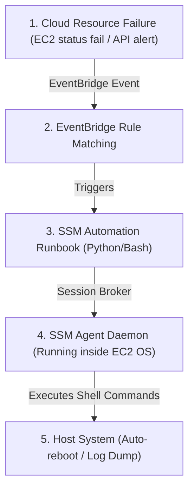
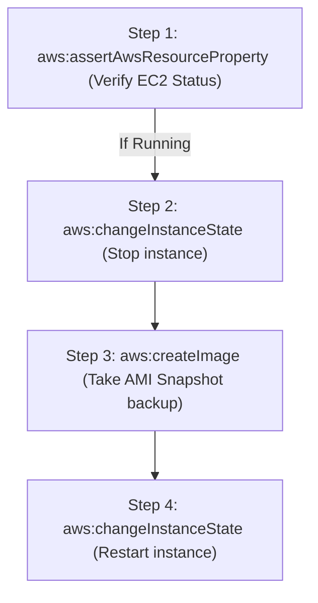

# Module 11-2: Incident Response, Event Chaining & Remediation Automation

This module details incident response topologies, EventBridge event routing, and using the AWS Systems Manager (SSM) suite to execute secure, passwordless host operations and custom automation runbooks.

---

## 🗺️ Cognitive Map: How to Think About the Flow of Knowledge

To automate operational tasks and respond to incidents, configure event triggers and secure execution channels:



1. **Step 1: Secure Access Brokering (Section 1):** Use SSM Session Manager to execute commands without SSH ports.
2. **Step 2: Operational Orchestration (Section 2):** Use systems manager runbooks to define multi-step infrastructure tasks.
3. **Step 3: Event-Driven Remediations (Section 3):** Bind EventBridge rules to automation targets to trigger self-healing actions.

---

## 1. AWS Systems Manager (SSM) Suite

The AWS Systems Manager (SSM) agent runs inside the operating system of EC2 instances, allowing AWS APIs to interact directly with the guest OS.

### A. Run Command vs. Session Manager
*   **Run Command:** Executes scripts or shell commands across multiple instances in parallel. It is audit-logged and requires no local credential configuration.
*   **Session Manager:** Provides a secure, interactive shell session inside the instance OS.
    *   **Port Hardening:** SSH port `22` is blocked at the security group level. Session Manager routes terminal traffic over outbound HTTPS calls (port `443`) back to the SSM service endpoint.
    *   **Audit Logging:** Every keystroke and command run in the terminal session is recorded and streamed to a secure S3 bucket or CloudWatch Log group.

### BARF Breakdown: SSM Session Manager Configuration
1.  **The Answer (Core Pattern):** Install the SSM Agent, associate the `AmazonSSMManagedInstanceCore` policy with the EC2 IAM role, and configure the CloudWatch log destination:
    ```hcl
    # 1. EC2 Instance Profile with SSM Core Policy
    resource "aws_iam_role" "ssm_node" {
      name = "ssm-managed-node-role"
      assume_role_policy = jsonencode({
        Version = "2012-10-17"
        Statement = [{
          Action    = "sts:AssumeRole"
          Effect    = "Allow"
          Principal = { Service = "ec2.amazonaws.com" }
        }]
      })
    }

    resource "aws_iam_role_policy_attachment" "ssm_attach" {
      role       = aws_iam_role.ssm_node.name
      policy_arn = "arn:aws:iam::aws:policy/AmazonSSMManagedInstanceCore"
    }

    resource "aws_iam_instance_profile" "ssm_profile" {
      name = "ssm-node-profile"
      role = aws_iam_role.ssm_node.name
    }
    ```
2.  **The Assumptions (Context):** The EC2 subnet route table must have routing to the internet (via a NAT/Internet Gateway), or have VPC Endpoints configured for `ssm`, `ssmmessages`, and `ec2messages` to route traffic privately.
3.  **The Rationale (Why):** By routing shell traffic through AWS APIs, authentication is delegated to IAM. Administrators can restrict session access using IAM policies without needing to manage SSH keys.
4.  **The Failure Loop (What if not):** If SSH keys are used, developers share `.pem` files, leave port `22` open to `0.0.0.0/0` in security groups, or forget to revoke keys when team members leave. This exposes instances to automated SSH brute-force attacks and key compromises.
5.  **Alternative Case (When to use 'if not'):** None. For cloud operations, SSM Session Manager is the standard for host access.

---

## 2. Custom Systems Manager Automation Runbooks

Automation Runbooks allow defining multi-step infrastructure tasks (e.g. stopping instances, taking snapshots, running scripts, and restarting) using YAML or JSON documents.



### AARF Breakdown: Custom Patch/Snapshot Runbook
1.  **The Answer (Core Pattern):** Declare an `aws_ssm_document` specifying the automation schema and execution steps:
    ```hcl
    resource "aws_ssm_document" "reboot_and_snap" {
      name          = "Custom-BackupAndReboot"
      document_type = "Automation"

      content = jsonencode({
        schemaVersion = "0.3"
        description   = "Stops EC2 instance, takes an AMI backup, and starts it."
        parameters = {
          InstanceId = {
            type        = "String"
            description = "Target EC2 Instance ID"
          }
        }
        mainSteps = [
          {
            name   = "stopInstance"
            action = "aws:changeInstanceState"
            inputs = {
              InstanceIds  = ["{{InstanceId}}"]
              DesiredState = "stopped"
            }
          },
          {
            name   = "createBackup"
            action = "aws:createImage"
            inputs = {
              InstanceId = "{{InstanceId}}"
              ImageName  = "Backup-{{InstanceId}}-{{global:DATE_TIME}}"
              NoReboot   = true
            }
          },
          {
            name   = "startInstance"
            action = "aws:changeInstanceState"
            inputs = {
              InstanceIds  = ["{{InstanceId}}"]
              DesiredState = "running"
            }
          }
        ]
      })
    }
    ```
2.  **The Assumptions (Context):** The Automation service principal (`ssm.amazonaws.com`) must have an IAM service role (AssumeRole) granting permissions to execute `ec2:StopInstances`, `ec2:StartInstances`, and `ec2:CreateImage`.
3.  **The Rationale (Why):** Runbooks enforce consistency. Declaring steps in code ensures that backups are verified and state transitions complete successfully before moving to the next task.
4.  **The Failure Loop (What if not):** If automation steps are run manually or via basic bash scripts on cron, there is no error validation. If the `ec2:Stop` command fails, the script might run `ec2:CreateImage` against a running, busy database, resulting in a corrupted backup image.
5.  **Alternative Case (When to use 'if not'):** For simple, containerized tasks, run **AWS Batch** or execute serverless workflows using **AWS Step Functions**.

---

## 3. Event-Driven Remediation (EventBridge $\rightarrow$ SSM)

EventBridge matches system events and routes them to target APIs.

### AARF Breakdown: Auto-Remediation Workflow
1.  **The Answer (Core Pattern):** Configure an EventBridge Rule to match EC2 status check failures and route the target execution to your SSM Automation Document:
    ```hcl
    # 1. EventBridge Rule matching failures
    resource "aws_cloudwatch_event_rule" "ec2_fail" {
      name        = "ec2-status-check-fail"
      description = "Triggers when an EC2 instance fails status checks"

      event_pattern = jsonencode({
        source      = ["aws.ec2"]
        detail-type = ["EC2 Instance State-change Notification"]
        detail = {
          state = ["stopped"]
        }
      })
    }

    # 2. Route target to SSM Automation Runbook
    resource "aws_cloudwatch_event_target" "remediation" {
      rule      = aws_cloudwatch_event_rule.ec2_fail.name
      target_id = "TriggerSSMReboot"
      arn       = "arn:aws:automation:${var.aws_region}:${var.account_id}:document/AWS-RestartEC2Instance"
      role_arn  = aws_iam_role.eventbridge_ssm_role.arn

      input_transformer {
        input_paths = {
          instance = "$.detail.instance-id"
        }
        input_template = "{\"InstanceId\": [<instance>]}"
      }
    }
    ```
2.  **The Assumptions (Context):** EventBridge requires an IAM service role that permits the `ssm:StartAutomationExecution` API action.
3.  **The Rationale (Why):** Automatic recovery reduces mean time to resolution (MTTR). The system detects status check failures and executes remediation steps immediately without waiting for an administrator.
4.  **The Failure Loop (What if not):** Without event-driven loops, resolving host status failures requires manual intervention. The server remains offline until page notifications alert an engineer, who must then log in and trigger a manual reboot.
5.  **Alternative Case (When to use 'if not'):** If the application requires checking database state or running pre-reboot scripts first, route the EventBridge alert to an **AWS Lambda function** to perform custom validation checks.
