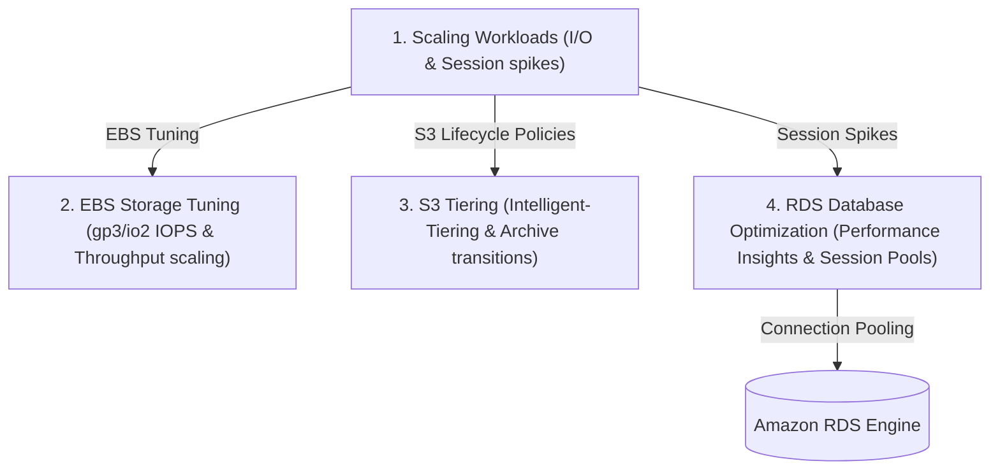
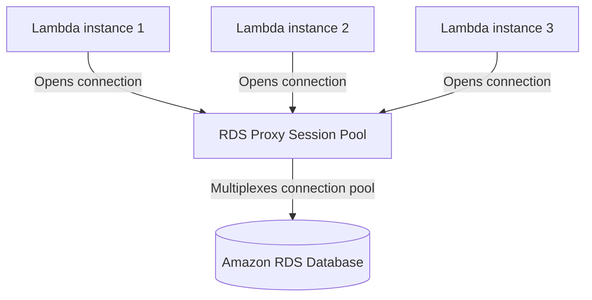

# Module 11-3: Compute, Storage & Database Performance Optimization

This module details cloud performance tuning, adjusting EBS volume metrics (IOPS and throughput), optimizing S3 lifecycle transition flows, and resolving database session constraints using RDS Proxy.

---

## 🗺️ Cognitive Map: How to Think About the Flow of Knowledge

To optimize resource efficiency and cost performance, scale compute capabilities and storage layers dynamically based on workloads:



1. **Step 1: Storage Layer Optimization (Section 1):** Scale EBS volume IOPS and throughput independently from block storage sizes.
2. **Step 2: Lifecycle Tiering (Section 2):** Use lifecycle rules and Intelligent-Tiering to transition cold S3 files to archive tiers.
3. **Step 3: Database Session Management (Section 3):** Deploy connection proxies to prevent database connection exhaustion.

---

## 1. EBS Volume Tuning (gp3 vs. io2)

Amazon Elastic Block Store (EBS) provides block storage volumes. Selecting the correct volume type and tuning its parameters is critical for disk-bound database applications.

*   **gp3 (General Purpose):** Allows scaling volume size, input/output operations per second (IOPS), and throughput independently. Volumes include a baseline of 3,000 IOPS and 125 MB/s throughput.
*   **io2 (Provisioned IOPS):** Designed for high-performance databases requiring sub-millisecond latency. Supports up to 64,000 IOPS per volume.

### AARF Breakdown: gp3 Performance Scaling
1.  **The Answer (Core Pattern):** Configure the EBS resource to explicitly provision higher IOPS and throughput parameters independently of the storage size:
    ```hcl
    resource "aws_ebs_volume" "db_data" {
      availability_zone = "us-east-1a"
      size              = 100 # 100 GB
      type              = "gp3"
      iops              = 5000 # Scaled up from baseline 3,000
      throughput        = 250  # Scaled up from baseline 125 MB/s
    }
    ```
2.  **The Assumptions (Context):** EC2 instances must be **EBS-optimized** to support the provisioned throughput limits.
3.  **The Rationale (Why):** In legacy `gp2` volumes, IOPS scaled linearly with volume size (3 IOPS per GB). To get 3,000 IOPS, developers had to provision a 1,000 GB volume, wasting money on unused disk space. `gp3` decouples IOPS and throughput from volume size, allowing you to optimize I/O performance at a lower cost.
4.  **The Failure Loop (What if not):** If volumes are left at default parameters under high-performance databases, disk queue lengths will spike. Under heavy read/write operations, the database will throttle, leading to application timeouts and query delays.
5.  **Alternative Case (When to use 'if not'):** For development environments with low disk I/O, baseline `gp3` settings (3,000 IOPS, 125 MB/s) are sufficient.

---

## 2. S3 Storage Optimization & Lifecycle Tiering

Amazon S3 features multiple storage classes optimized for different access frequencies:
1.  **S3 Standard:** Frequent access, low latency.
2.  **S3 Standard-IA (Infrequent Access):** Lower storage cost, but incurs retrieval fees. Ideal for backups.
3.  **S3 Intelligent-Tiering:** Automatically moves objects between frequent, infrequent, and archive access tiers based on access patterns, with no retrieval fees.
4.  **S3 Glacier Instant/Flexible Retrieval & Deep Archive:** For long-term archiving, with retrieval times ranging from minutes to 12 hours.

### AARF Breakdown: S3 Intelligent-Tiering and Lifecycle Configurations
1.  **The Answer (Core Pattern):** Configure S3 Intelligent-Tiering configuration blocks and define lifecycle rules to transition objects to deep archive after set retention windows:
    ```hcl
    # 1. Enable Intelligent-Tiering Configuration
    resource "aws_s3_bucket_intelligent_tiering_configuration" "tiering" {
      bucket = aws_s3_bucket.data.id
      name   = "EntireBucket"
      
      tiering {
        access_tier = "ARCHIVE_ACCESS"
        days        = 90
      }
    }

    # 2. Lifecycle Rule to transition objects
    resource "aws_s3_bucket_lifecycle_configuration" "cleanup" {
      bucket = aws_s3_bucket.data.id

      rule {
        id     = "archive-old-backups"
        status = "Enabled"

        transition {
          days          = 30
          storage_class = "STANDARD_IA"
        }

        transition {
          days          = 180
          storage_class = "GLACIER_DEEP_ARCHIVE"
        }

        expiration {
          days = 365 # Delete files after 1 year
        }
      }
    }
    ```
2.  **The Assumptions (Context):** Object transitions require the target files to have a minimum size (e.g. S3 Infrequent Access requires objects to be $\ge 128$ KB; smaller files will not transition).
3.  **The Rationale (Why):** Automating file transitions reduces storage costs by up to **90%**. Active files remain in high-performance tiers, while older backups are archived automatically.
4.  **The Failure Loop (What if not):** If lifecycle rules are omitted, stale log files, old database backups, and deleted user assets accumulate indefinitely in high-cost `S3 Standard` storage, resulting in ballooning AWS bills.
5.  **Alternative Case (When to use 'if not'):** For buckets containing static assets that are read constantly (like web frontend files), do not use lifecycle transitions or IA classes, as the high retrieval fees will negate any storage savings.

---

## 3. Database Performance Tuning (RDS Proxy)

Amazon RDS Performance Insights monitors database engine load, helping you analyze query performance and session constraints.

A common scaling constraint occurs when serverless applications (like AWS Lambda) scale out, opening separate connection pools to the RDS database engine.



### AARF Breakdown: RDS Proxy Session Pool Configuration
1.  **The Answer (Core Pattern):** Deploy RDS Proxy between your serverless application and the RDS instance:
    ```hcl
    # 1. Provision RDS Proxy
    resource "aws_db_proxy" "db_proxy" {
      name                   = "app-db-proxy"
      debug_logging          = false
      engine_family          = "POSTGRESQL"
      idle_client_timeout    = 1800
      require_tls            = true
      role_arn               = aws_iam_role.proxy_role.arn
      vpc_security_group_ids = [aws_security_group.proxy_sg.id]
      vpc_subnet_ids         = var.private_subnet_ids

      auth {
        auth_scheme = "SECRETS_STORE"
        description = "Database credentials from Secrets Manager"
        iam_auth    = "DISABLED"
        secret_arn  = aws_secretsmanager_secret.db_secret.arn
      }
    }

    # 2. Bind Target DB Instance to Proxy
    resource "aws_db_proxy_target" "db_target" {
      db_proxy_name          = aws_db_proxy.db_proxy.name
      target_group_name      = "default"
      db_instance_identifier = aws_db_instance.postgres.identifier
    }
    ```
2.  **The Assumptions (Context):** The proxy must have access to the database credentials stored inside **AWS Secrets Manager** to establish target connection pools.
3.  **The Rationale (Why):** Relational databases (PostgreSQL, MySQL) consume memory for each open socket. Lambdas scale out rapidly, opening thousands of connections that exhaust database memory. RDS Proxy pools and multiplexes these connections, routing them over a small, fixed pool of database sockets.
4.  **The Failure Loop (What if not):** If serverless functions query the database directly, rapid traffic spikes scale Lambdas, throwing the classic `Too Many Connections` database error. The database CPU spikes to 100% trying to manage connections, leading to query failures and application downtime.
5.  **Alternative Case (When to use 'if not'):** For application architectures running a fixed number of servers (e.g. EC2 instances running Node.js or Java backend containers), connection pooling is managed internally by the application framework, making RDS Proxy redundant.
