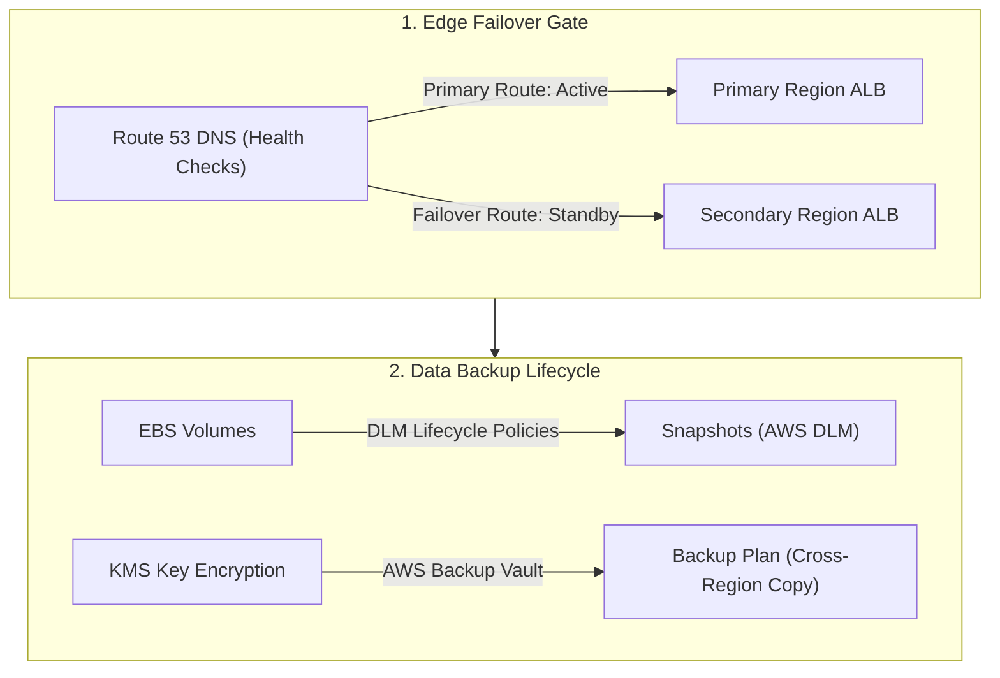
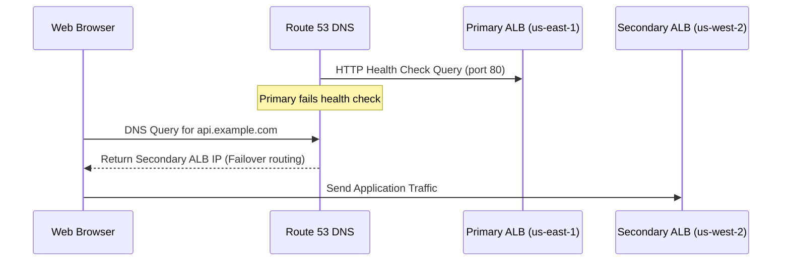

# Module 11-4: High Availability, Backup Lifecycle & Disaster Recovery

This module details high availability configurations, Route 53 health-check DNS failovers, automating EBS snapshots using Data Lifecycle Manager (DLM), and defining centralized backup policies using AWS Backup.

---

## 🗺️ Cognitive Map: How to Think About the Flow of Knowledge

To implement high availability and disaster recovery, prioritize data redundancy and automated failover paths:



1. **Step 1: Automated Edge Failover (Section 1):** Configure Route 53 health checks to automatically reroute traffic during region outages.
2. **Step 2: Snapshot Scheduling (Section 2):** Use Data Lifecycle Manager to automate local EBS snapshot generation.
3. **Step 3: Centralized Backup Governance (Section 3):** Use AWS Backup to enforce cross-region copies and data retention rules.

---

## 1. Route 53 DNS Failover Configurations

Route 53 DNS Failover routes traffic to a primary resource (e.g. an ALB in `us-east-1`) under normal conditions, and automatically diverts traffic to a secondary standby resource (e.g. an ALB in `us-west-2`) if the primary fails its health checks.



### AARF Breakdown: DNS Health Check Failover Routing
1.  **The Answer (Core Pattern):** Create a Route 53 health check matching the primary target endpoint, configure the primary DNS record as `Primary` with the health check attached, and configure the secondary DNS record as `Secondary`:
    ```hcl
    # 1. Health Check for Primary ALB
    resource "aws_route53_health_check" "primary_check" {
      fqdn              = var.primary_alb_dns
      port              = 80
      type              = "HTTP"
      resource_path     = "/healthz"
      failure_threshold = 3
      request_interval  = 30
    }

    # 2. Primary DNS Record (Failover Routing)
    resource "aws_route53_record" "primary" {
      zone_id = var.hosted_zone_id
      name    = "api.example.com"
      type    = "A"

      failover_routing_policy {
        type = "PRIMARY"
      }

      set_identifier = "primary-endpoint"
      health_check_id = aws_route53_health_check.primary_check.id

      alias {
        name                   = var.primary_alb_dns
        zone_id                = var.primary_alb_zone_id
        evaluate_target_health = true
      }
    }

    # 3. Secondary DNS Record (Failover Routing)
    resource "aws_route53_record" "secondary" {
      zone_id = var.hosted_zone_id
      name    = "api.example.com"
      type    = "A"

      failover_routing_policy {
        type = "SECONDARY"
      }

      set_identifier = "secondary-endpoint"

      alias {
        name                   = var.secondary_alb_dns
        zone_id                = var.secondary_alb_zone_id
        evaluate_target_health = true
      }
    }
    ```
2.  **The Assumptions (Context):** The health check path `/healthz` must return an HTTP status code between `200` and `399`. If the path is not configured on the web application side, the health check will fail and trigger a false failover.
3.  **The Rationale (Why):** Automated DNS failovers decouple application routing from manual configuration updates. During regional outages, DNS records update dynamically to direct clients to the healthy region.
4.  **The Failure Loop (What if not):** Without automated DNS failovers, during a regional outage, clients will hit dead endpoints. Administrators must manually log in to the AWS Console, modify DNS records to point to the disaster recovery region, and wait for DNS TTL caches to expire globally, causing hours of downtime.
5.  **Alternative Case (When to use 'if not'):** For latency-sensitive applications that must route traffic to the geographically nearest server, use **Route 53 Latency Routing** or **Geolocation Routing** instead of a simple Active-Passive failover.

---

## 2. EBS Snapshot Lifecycles (Amazon Data Lifecycle Manager - DLM)

Amazon DLM automates the creation, retention, and deletion of EBS snapshots, eliminating manual snapshot scheduling.

### AARF Breakdown: DLM Snapshot Policy
1.  **The Answer (Core Pattern):** Configure an IAM Role for DLM and define a lifecycle policy targeting resources based on tags:
    ```hcl
    # 1. DLM Lifecycle Policy
    resource "aws_dlm_lifecycle_policy" "daily_snapshot" {
      description        = "Daily EBS snapshot lifecycle policy"
      execution_role_arn = aws_iam_role.dlm_role.arn
      state              = "ENABLED"

      policy_details {
        resource_types = ["VOLUME"]

        target_tags = {
          BackupPolicy = "daily-production"
        }

        schedule {
          name = "daily-backup"

          create_rule {
            interval      = 24
            interval_unit = "HOURS"
            times         = ["02:00"] # 02:00 UTC
          }

          retain_rule {
            count = 14 # Keep daily snapshots for 14 days
          }

          copy_tags = true
        }
      }
    }
    ```
2.  **The Assumptions (Context):** The EBS volume resource must contain the target tag (`BackupPolicy = "daily-production"`) to be evaluated by the DLM policy engine.
3.  **The Rationale (Why):** DLM runs as a fully managed AWS service, requiring no host cron scripts. It handles retention and deletes expired snapshots, keeping costs predictable.
4.  **The Failure Loop (What if not):** If snapshots are configured via custom cron scripts, if the script fails to run or the cleanup block fails, old snapshots accumulate indefinitely, leading to unexpected storage costs.
5.  **Alternative Case (When to use 'if not'):** For enterprise backups spanning multiple AWS services (EBS, RDS, EFS, DynamoDB, S3) under unified policies, use **AWS Backup** instead of standalone DLM policies.

---

## 3. Centralized Backup Governance (AWS Backup)

AWS Backup provides a centralized service to automate and manage backups across multiple AWS resources.

### AARF Breakdown: AWS Backup Plan Configuration
1.  **The Answer (Core Pattern):** Create a secure Backup Vault encrypted with a KMS key, write a Backup Plan containing backup rules (schedule, lifecycle, cross-region copy), and assign resources using tags:
    ```hcl
    # 1. Backup Vault
    resource "aws_backup_vault" "prod_vault" {
      name        = "production_backup_vault"
      kms_key_arn = var.kms_key_arn
    }

    # 2. Backup Plan
    resource "aws_backup_plan" "core_plan" {
      name = "production_core_backup_plan"

      rule {
        rule_name         = "daily-backup-rule"
        target_vault_name = aws_backup_vault.prod_vault.name
        schedule          = "cron(0 2 * * ? *)" # Every day at 02:00 UTC

        lifecycle {
          delete_after = 30 # Delete backups after 30 days
        }

        # Optional: Copy backup to another region for DR
        copy_action {
          destination_vault_arn = "arn:aws:backup:us-west-2:123456789012:vault:dr_vault"
          
          lifecycle {
            delete_after = 90 # Keep in DR region for 90 days
          }
        }
      }
    }

    # 3. Assign Resources to Backup Plan by Tags
    resource "aws_backup_selection" "prod_selection" {
      iam_role_arn = aws_iam_role.backup_role.arn
      name         = "production_resource_selection"
      plan_id      = aws_backup_plan.core_plan.id

      selection_tag {
        type  = "STRINGEQUALS"
        key   = "Environment"
        value = "Production"
      }
    }
    ```
2.  **The Assumptions (Context):** The execution role `backup_role` must contain the policy permissions to interact with target resources (e.g. `AWSBackupServiceRolePolicyForBackup`).
3.  **The Rationale (Why):** AWS Backup abstracts service-specific backup mechanics under a single tool, providing audit dashboards to prove compliance for security audits.
4.  **The Failure Loop (What if not):** If backups are configured service-by-service, it is difficult to verify that all resources are backed up correctly. A developer who spins up a new EBS volume or RDS instance might forget to configure backups, exposing the organization to data loss if an outage occurs.
5.  **Alternative Case (When to use 'if not'):** For small applications with simple databases, native database backups (RDS automated backups) are sufficient.
