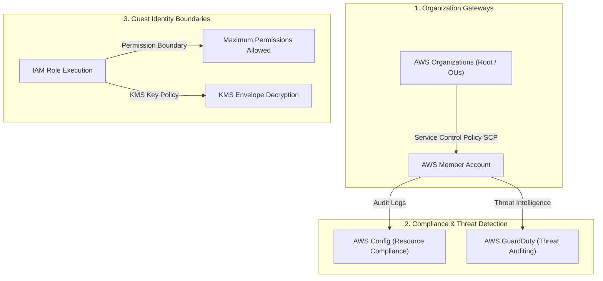
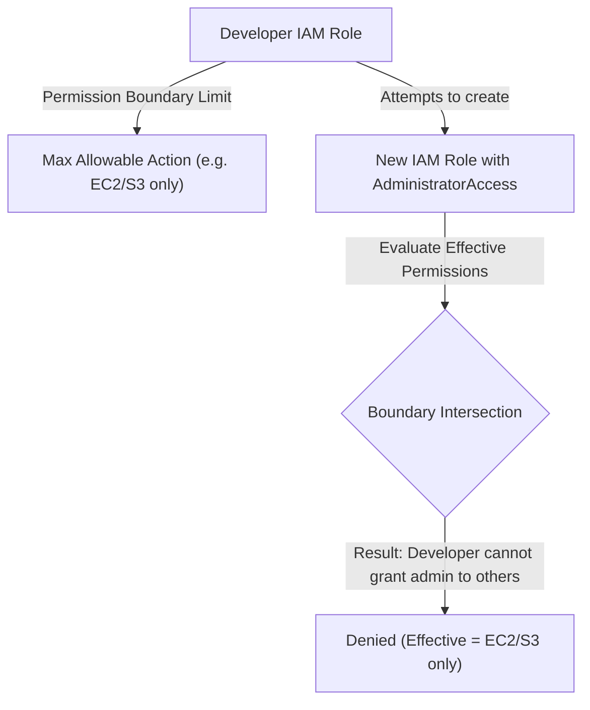

# Module 11-5: Cloud Governance, Security Compliance & Auditing

This module details multi-account structures, restricting regions via Service Control Policies (SCPs), continuous compliance checks using AWS Config, and enforcing IAM boundaries to restrict developer permissions.

---

## 🗺️ Cognitive Map: How to Think About the Flow of Knowledge

To implement enterprise cloud governance, configure access boundaries from the organization layer down to individual API policies:



1. **Step 1: Structural Controls (Section 1):** Apply organization-wide rules to deny unauthorized regions and services globally.
2. **Step 2: Continuous Compliance Auditing (Section 2):** Use AWS Config rules to monitor and auto-remediate non-compliant resources.
3. **Step 3: Identity Guardrails (Section 3):** Enforce IAM permission boundaries to prevent privilege escalation.

---

## 1. Multi-Account Governance & SCPs

AWS Organizations links multiple AWS accounts, enabling consolidated billing and centralized control.

### Service Control Policies (SCPs)
SCPs are organization policy files that specify the maximum permissions allowed for accounts within an Organization Unit (OU).
*   **Default Allow Override:** SCPs act as guardrails. They do not grant permissions; they define a filter. Even if an IAM user has `AdministratorAccess` inside a member account, if an SCP denies an action (e.g. `s3:DeleteBucket`), the action is blocked.

### AARF Breakdown: Region-Restriction SCP
1.  **The Answer (Core Pattern):** Create an SCP that denies any API action executed outside your approved regions (e.g. allowing only `us-east-1`):
    ```hcl
    resource "aws_organizations_policy" "region_lock" {
      name        = "deny-unapproved-regions"
      description = "Blocks API actions outside us-east-1"
      type        = "SERVICE_CONTROL_POLICY"

      content = jsonencode({
        Version = "2012-10-17"
        Statement = [
          {
            Sid      = "DenyOutsideApprovedRegions"
            Effect   = "Deny"
            NotAction = [
              "iam:*",
              "organizations:*",
              "route53:*",
              "support:*",
              "cloudfront:*",
              "waf:*" # Global services must be excluded from region limits
            ]
            Resource = "*"
            Condition = {
              StringNotEquals = {
                "aws:RequestedRegion" = ["us-east-1"]
              }
            }
          }
        ]
      })
    }
    ```
2.  **The Assumptions (Context):** You must exclude global services (IAM, Route 53, CloudFront) from the NotAction list. If omitted, global service APIs will fail, locking you out of IAM management.
3.  **The Rationale (Why):** Large organizations must block developers from provisioning resources in unmonitored regions to prevent security leaks and control costs.
4.  **The Failure Loop (What if not):** Without region-restriction SCPs, a compromised account can be used to spin up hundreds of high-cost EC2 instances in an unmonitored region (e.g. ap-east-1). Security dashboards monitoring only standard regions will not detect the intrusion, resulting in massive billing charges.
5.  **Alternative Case (When to use 'if not'):** For test environments where engineers require testing latency-sensitive applications globally, region limits are not applied.

---

## 2. Compliance Auditing (AWS Config & Threat Detection)

Continuous compliance auditing is managed using AWS Config, while threat detection is managed by GuardDuty.

### AWS Config Rules & Remediation
AWS Config records configurations of AWS resources and evaluates them against rules (e.g. "Ensure all S3 buckets block public access").

### AARF Breakdown: S3 Public Access Block Config Rule
1.  **The Answer (Core Pattern):** Declare the Config Rule resource and wire it to a Systems Manager remediation runbook:
    ```hcl
    # 1. Config Rule checking public access
    resource "aws_config_config_rule" "s3_public_block" {
      name = "s3-bucket-public-access-blocked"

      source {
        owner             = "AWS"
        source_identifier = "S3_BUCKET_PUBLIC_ACCESS_BLOCKED"
      }
    }

    # 2. Config Remediation target
    resource "aws_config_remediation_configuration" "auto_fix" {
      config_rule_name = aws_config_config_rule.s3_public_block.name
      resource_type    = "AWS::S3::Bucket"
      target_type      = "SSM_DOCUMENT"
      target_id        = "AWS-ConfigureS3BucketPublicAccessBlock"

      parameter {
        name         = "BucketName"
        resource_value = "RESOURCE_ID"
      }

      parameter {
        name         = "RestrictPublicBuckets"
        static_value = "true"
      }

      automatic                  = true
      maximum_automatic_attempts = 3
      retry_attempt_seconds      = 60
    }
    ```
2.  **The Assumptions (Context):** The AWS Config recorder must be initialized and active inside the target region.
3.  **The Rationale (Why):** Combining Config with SSM runbooks enables self-healing compliance. If a user manually removes S3 public access blocks, Config immediately detects the violation and triggers the SSM runbook to restore the blocks within minutes.
4.  **The Failure Loop (What if not):** If auto-remediation is omitted, non-compliant configurations (like public databases or unencrypted volumes) remain exposed until manual audits identify them weeks later, increasing vulnerability windows.
5.  **Alternative Case (When to use 'if not'):** For minor testing environments, configure email alerts via SNS instead of executing destructive auto-remediations.

---

## 3. Data Protection and Access Controls

To secure data at rest, KMS Key Policies control access to encryption keys, while IAM Permission Boundaries prevent privilege escalation.



### AARF Breakdown: IAM Permission Boundaries
1.  **The Answer (Core Pattern):** Create a policy defining the maximum allowable actions, and require this policy as a boundary whenever roles are created:
    ```hcl
    # 1. The Boundary Policy (Limits maximum access)
    resource "aws_iam_policy" "boundary" {
      name   = "developer-permission-boundary"
      policy = jsonencode({
        Version = "2012-10-17"
        Statement = [
          {
            Effect   = "Allow"
            Action   = ["ec2:*", "s3:*", "cloudwatch:*"]
            Resource = "*"
          }
        ]
      })
    }

    # 2. Developer Role with IAM creation rights limited by the boundary
    resource "aws_iam_role" "developer" {
      name = "developer-execution-role"
      permissions_boundary = aws_iam_policy.boundary.arn
      # ... assume policy
    }
    ```
2.  **The Assumptions (Context):** The developer role must have a policy condition forcing them to attach this specific boundary whenever they create new IAM roles:
    ```json
    "Condition": {
      "StringEquals": {
        "iam:PermissionsBoundary": "arn:aws:iam::123456789012:policy/developer-permission-boundary"
      }
    }
    ```
3.  **The Rationale (Why):** Junior administrators or automation pipelines often need to create IAM roles. Without boundaries, a developer with `iam:CreateRole` permissions can create a new role containing `AdministratorAccess` and assume it, bypassing all policy limits (privilege escalation). Boundaries enforce that no role they create can exceed the boundary's permissions.
4.  **The Failure Loop (What if not):** If boundaries are omitted, any user or container with `iam:CreateRole` and `iam:AttachRolePolicy` permissions can elevate their privileges to full Administrator access, compromising the entire AWS account.
5.  **Alternative Case (When to use 'if not'):** For secure accounts managed strictly by a small team of master administrators via IAM identity federation, permission boundaries are not needed.
