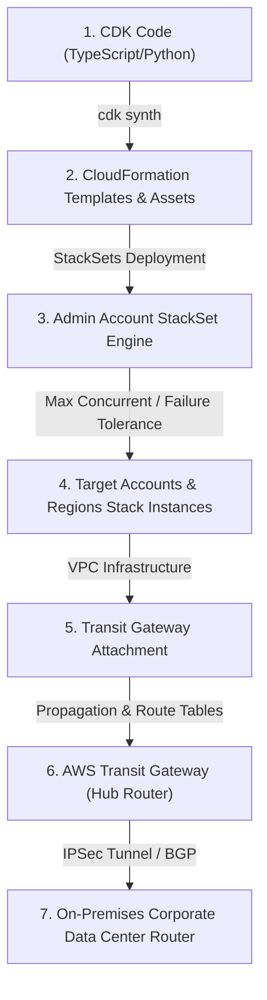
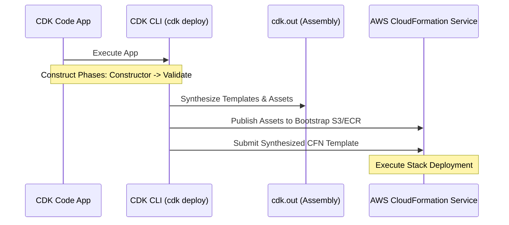

# Module 11-6: Deployment Automation, CloudFormation & Hybrid Networks

This module covers multi-region deployment scaling using CloudFormation StackSets, the compilation and deployment lifecycle of the AWS Cloud Development Kit (CDK), and central routing architecture using Transit Gateway (TGW) alongside hybrid IPSec VPN network troubleshooting.

---

## 🗺️ Cognitive Map: How to Think About the Flow of Knowledge

To manage infrastructure at scale and maintain hybrid connectivity, route configuration logic from local definitions to global deployments and physical connections:



1. **Step 1: Local Synthesis (Section 2):** Define infrastructure in code using CDK constructs, packaging it into raw CloudFormation templates.
2. **Step 2: Distributed Orchestration (Section 1):** Deploy the compiled templates across organizational units and multiple regions using StackSets.
3. **Step 3: Network Consolidation (Section 3):** Interconnect the newly provisioned VPCs via Transit Gateway and troubleshoot hybrid connectivity back to on-premises routers.

---

## 1. CloudFormation StackSets Configurations

AWS CloudFormation StackSets allow you to deploy a single template across multiple AWS accounts and regions in a unified operation controlled from an administrator account.

### AARF Breakdown: StackSets Multi-Account Orchestration
1.  **The Answer (Core Pattern):** Deploy service-managed StackSets targeted at AWS Organizations Organizational Units (OUs) with automatic deployment triggers enabled:
    ```hcl
    resource "aws_cloudformation_stack_set" "security_baselines" {
      name             = "security-baselines-stackset"
      permission_model = "SERVICE_MANAGED"
      capabilities     = ["CAPABILITY_NAMED_IAM"]

      auto_deployment {
        enabled                          = true
        retain_stacks_on_account_removal = false
      }

      template_body = jsonencode({
        AWSTemplateFormatVersion = "2010-09-09"
        Resources = {
          ReadOnlyIAMRole = {
            Type = "AWS::IAM::Role"
            Properties = {
              RoleName = "CentralReadOnlyRole"
              AssumeRolePolicyDocument = {
                Version = "2012-10-17"
                Statement = [{
                  Effect    = "Allow"
                  Principal = { AWS = "arn:aws:iam::111122223333:root" } # Admin Account ID
                  Action    = "sts:AssumeRole"
                }]
              }
              ManagedPolicyArns = ["arn:aws:iam::aws:policy/ReadOnlyAccess"]
            }
          }
        }
      })
    }

    resource "aws_cloudformation_stack_set_instance" "security_baselines_instances" {
      stack_set_name = aws_cloudformation_stack_set.security_baselines.name
      region         = "us-east-1"
      
      deployment_targets {
        organizational_unit_ids = ["ou-abcd-12345678"]
      }

      operation_preferences {
        max_concurrent_count    = 2
        failure_tolerance_count = 1
        region_concurrency_type = "SEQUENTIAL"
      }
    }
    ```
2.  **The Assumptions (Context):** For `SERVICE_MANAGED` permissions, AWS Organizations must have trusted access enabled for CloudFormation (`cloudformation.amazonaws.com`). StackSets automatically creates the necessary `AWSServiceRoleForCloudFormationStackSetsOrg` IAM roles.
3.  **The Rationale (Why):** Manually deploying templates to 50+ accounts in 3 regions requires writing bespoke scripts that coordinate API calls and handle cross-account credentials. StackSets native Org integration listens to organization membership changes: if an account joins the OU, StackSets automatically spins up the resources; if it leaves, StackSets removes them.
4.  **The Failure Loop (What if not):** If deployment parameters (`max_concurrent_count` and `failure_tolerance_count`) are misconfigured, a syntax error or resource quota breach (e.g. running out of IAM Roles) can trigger a cascade of failures. If failure tolerance is too high (e.g., set to 100%), the system will blindly attempt to deploy to all accounts simultaneously, failure logs will swamp the operator, and half-configured resources will drift before the stack aborts.
5.  **Alternative Case (When to use 'if not'):** For custom pipelines requiring complex pre-deployment testing or multi-stage integration, use **AWS CDK Pipelines** or **Terraform Cloud/GitHub Actions** workspaces to orchestrate cross-account state files directly.

---

## 2. AWS CDK Construct Lifecycle

The AWS Cloud Development Kit (CDK) compiles high-level code (TypeScript, Python, Go) into standard JSON/YAML CloudFormation templates. It translates object-oriented constructs into structural cloud configurations.



### AARF Breakdown: CDK Compilation and Bootstrapping
1.  **The Answer (Core Pattern):** Build constructs mapping L1, L2, and L3 hierarchies, and deploy them using bootstrap execution roles:
    ```typescript
    import * as cdk from 'aws-cdk-lib';
    import * as s3 from 'aws-cdk-lib/aws-s3';
    import { Construct } from 'constructs';

    export class SecureBucketStack extends cdk.Stack {
      constructor(scope: Construct, id: string, props?: cdk.StackProps) {
        super(scope, id, props);

        // L2 Construct: High-Level Sane Defaults
        const bucket = new s3.Bucket(this, 'SecureDataBucket', {
          versioned: true,
          encryption: s3.BucketEncryption.S3_MANAGED,
          blockPublicAccess: s3.BlockPublicAccess.BLOCK_ALL,
          removalPolicy: cdk.RemovalPolicy.RETAIN, // Prevents deletion of stateful resources
        });

        // L1 Construct: Raw CloudFormation mapping override (if needed)
        const cfnBucket = bucket.node.defaultChild as s3.CfnBucket;
        cfnBucket.addPropertyOverride('BucketEncryption.ServerSideEncryptionConfiguration.0.ServerSideEncryptionByDefault.SSEAlgorithm', 'aws:kms');
      }
    }
    ```
    Synthesize and deploy via the CLI:
    ```bash
    # Prepare target environment with assets S3 bucket and roles (CDKToolkit stack)
    cdk bootstrap aws://123456789012/us-east-1

    # Compile code and verify output templates in cdk.out/
    cdk synth

    # Deploy stack to CloudFormation using the CloudFormation execution role
    cdk deploy --require-approval never
    ```
2.  **The Assumptions (Context):** The CLI client must have credentials with permissions to assume the `cdk-hnb659fds-deploy-role` generated in the target account during bootstrapping.
3.  **The Rationale (Why):** AWS CDK executes code in phases. First, `Construction` instantiates the construct tree. Second, it performs `Validation` on properties. Third, `Synthesis` serializes assets and writes the CloudFormation templates to the `cdk.out` directory. Without a bootstrap stack (`CDKToolkit`), local file assets (like Lambda code zip files) or Docker images have no repository/bucket destination to be uploaded to before CloudFormation attempts to load them.
4.  **The Failure Loop (What if not):** If bootstrapper roles are modified or deleted, deployments will fail with `sts:AssumeRole` errors. Additionally, if developers treat CDK as a runtime environment (e.g. attempting to fetch active database passwords from AWS Secrets Manager during `synth` using synchronous API calls), compilation will fail or produce static, stale values embedded in the CloudFormation templates, breaking deployment determinism.
5.  **Alternative Case (When to use 'if not'):** If your organization strictly enforces static declarative files and avoids programming language runtimes (Node.js/Python dependencies) in infrastructure code, stick to pure **Terraform (HCL)** or raw **YAML CloudFormation**.

---

## 3. Transit Gateway Pathing & Hybrid VPN Diagnostics

AWS Transit Gateway (TGW) acts as a centralized cloud router, simplifying network connections between hundreds of VPCs, AWS Site-to-Site VPNs, and Direct Connect connections.

### AARF Breakdown: Hybrid Routing loop prevention & IPSec/BGP Diagnostics
1.  **The Answer (Core Pattern):** Connect VPCs and Customer Gateways (CGW) using Transit Gateway route tables with dynamic BGP propagation:
    ```hcl
    # Central Hub Router
    resource "aws_ec2_transit_gateway" "hub" {
      description                     = "Central Hybrid Transit Gateway"
      default_route_table_association = "disable"
      default_route_table_propagation = "disable"
      amazon_side_asn                 = 64512
      tags                            = { Name = "tgw-hub", Environment = "Production" }
    }

    # Custom Route Table for On-Premises traffic
    resource "aws_ec2_transit_gateway_route_table" "hybrid_rt" {
      transit_gateway_id = aws_ec2_transit_gateway.hub.id
      tags               = { Name = "tgw-hybrid-rt", Environment = "Production" }
    }

    # Dynamic Propagation of On-Premises BGP routes into the Route Table
    resource "aws_ec2_transit_gateway_route_table_propagation" "vpn_prop" {
      transit_gateway_attachment_id = aws_vpn_connection.on_prem.transit_gateway_attachment_id
      transit_gateway_route_table_id = aws_ec2_transit_gateway_route_table.hybrid_rt.id
    }
    ```
    Perform diagnostics on the CGW router to verify IPSec tunnel status and BGP advertisements:
    ```bash
    # Check IPSec Security Association (IPSec SA) status (On-Premises Linux VPN Gateway)
    ipsec statusall

    # Introspect BGP routes received from AWS Transit Gateway (BGP ASN 64512)
    vtysh -c "show ip bgp neighbors 169.254.10.1 routes"

    # Trace route pathing from host to detect routing loops
    traceroute -T -p 80 10.0.1.55
    ```
2.  **The Assumptions (Context):** The customer gateway router must support IPSec VPNs and the Border Gateway Protocol (BGP). Firewalls must allow IP Protocol 50 (ESP), UDP Port 500, and UDP Port 4500 (NAT-Traversal).
3.  **The Rationale (Why):** When connecting many VPCs to an on-premises network, setting up VPC Peering requires a mesh of connections ($N(N-1)/2$). Transit Gateway acts as a central hub, routing traffic between attachments using TGW Route Tables. Dynamic BGP propagation dynamically populates routes, ensuring that if an on-premise subnet goes down, routes automatically update without needing manual VPC static route edits.
4.  **The Failure Loop (What if not):** If static routes are used instead of BGP, or if BGP ASN paths are not filtered, routing loops can occur. If a route propagates from AWS to on-premises, and the on-premises router advertises that same route back to AWS with a shorter path preference, traffic will loop endlessly between the TGW and the CGW, saturating the IPSec tunnels and causing high latency, packet loss, and full connectivity loss.
5.  **Alternative Case (When to use 'if not'):** For small, simple networks (e.g. 2 VPCs and 1 corporate office), a simple **VPC Peering** mesh and static Site-to-Site VPN connections are cheaper and less complex than Transit Gateway.
