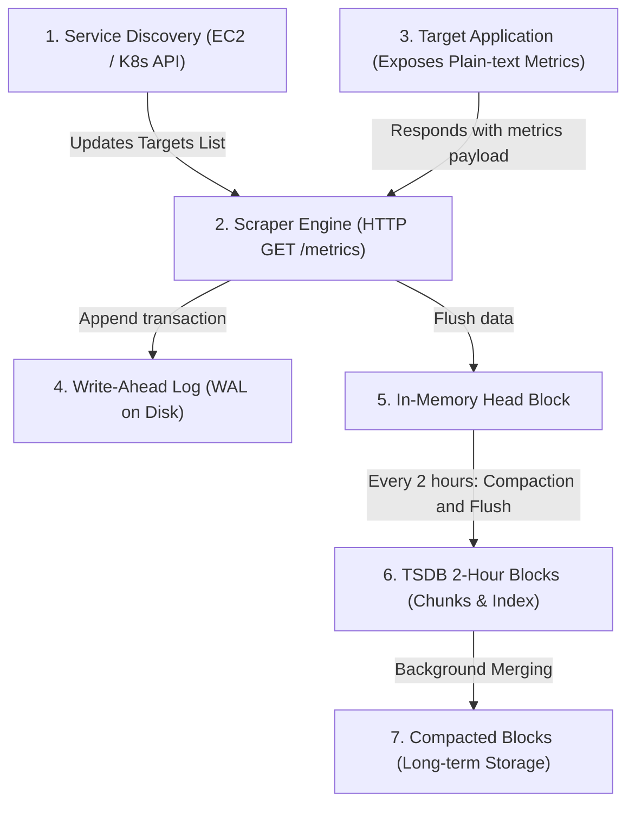

# Module 12-4: Prometheus and Grafana Observability Stack

This module details the architectural internals, storage engine structures, metrics exposition formats, query algebra (PromQL), and alerting mechanisms of the CNCF Prometheus and Grafana observability stack.

---

## 🗺️ Cognitive Map: Prometheus Pull Scraping and TSDB Storage Pipeline



---

## 1. Prometheus Architecture: The Pull Scraper

Prometheus is designed as a pull-based monitoring system. It retrieves metrics by polling HTTP endpoints exposed by target systems, rather than requiring targets to push data to a central queue.

### A. Service Discovery & Targets Resolution
Rather than relying on static IP lists, Prometheus utilizes dynamic **Service Discovery (SD)** modules:
*   **Kubernetes SD:** Queries the `kube-apiserver` endpoints to track Pod namespaces, labels, and annotations. It dynamically rebuilds the list of targets to scrape as Pods are scheduled or deleted.
*   **AWS EC2 SD:** Queries AWS EC2 APIs to discover instances matching specific tags (e.g. `monitoring = prometheus`).
*   **Static Config:** A fallback mechanism where targets are hardcoded:
    ```yaml
    scrape_configs:
      - job_name: 'node-exporter'
        static_configs:
          - targets: ['10.0.1.15:9100', '10.0.1.16:9100']
    ```

### B. Pull vs. Push Models (Systems Rationale)
*   **Target Protection:** In a push-based system (e.g. Datadog agent, InfluxDB push), if a cluster scales out to 5,000 nodes, all 5,000 nodes will simultaneously flood the metrics server. During a network partition recovery, this causes a "thundering herd" DDoS attack against the monitoring infrastructure. In a pull model, the Prometheus server controls the ingestion rate based on its own resource constraints.
*   **Liveness Tracking:** If a scrape request fails, Prometheus marks the target down (`up{job="jobname"} = 0`). In push systems, if a server crashes, the server simply stops sending data. The monitoring system cannot distinguish between a dead server and a server with no active traffic.

---

## 2. Time Series Database (TSDB) Internals

Prometheus stores time series (a stream of timestamped values belonging to the same metric and labels) in a custom write-efficient database.

### A. Directory Layout on Disk
The Prometheus storage directory is organized as follows:
```plaintext
/var/lib/prometheus/
├── data/
│   ├── 01H3B89X... (2-hour block directory)
│   │   ├── chunks/          # Raw compressed time-series data
│   │   │   └── 000001
│   │   ├── index            # Maps labels to chunks
│   │   ├── meta.json        # Block metadata (min/max time, source)
│   │   └── tombstones       # Marks deleted data (soft deletes)
│   ├── wal/                 # Write-Ahead Log directory
│   │   ├── 00000001
│   │   └── checkpoint.000000
```

### B. The Life of a Scrape: WAL to Disk Block
1.  **Write-Ahead Log (WAL):** When a target is scraped, raw data points are appended immediately to the `wal/` files. The WAL is uncompressed and optimized for sequential disk writes. This acts as a recovery safeguard: if the host loses power, Prometheus replays the WAL on reboot to reconstruct the in-memory cache.
2.  **In-Memory Head Block:** Simultaneously, data is written to the in-memory Head block. The Head block caches active series to answer instant queries quickly.
3.  **Compaction & Flush:** Every 2 hours, the Head block is closed, compacted (removing duplicated label metadata), and written to disk as a new block directory containing its own `chunks` and `index`.
4.  **Tombstones:** When a delete query is run, Prometheus does not delete files immediately (which causes costly sector shifting). It writes the target block offset to `tombstones`. During background compaction, these sectors are skipped and deleted.

---

## 3. Metrics Exposition & Metric Types

Prometheus expects metrics served via HTTP in a simple, plain-text format. Comments start with `#` and specify the metric `HELP` description and `TYPE`.

### A. Plain-Text Exposition Example
```plaintext
# HELP http_requests_total Total number of HTTP requests processed.
# TYPE http_requests_total counter
http_requests_total{method="POST",status="200"} 1027
http_requests_total{method="GET",status="404"} 12
```

### B. The Four Metric Types
1.  **Counter:** A cumulative metric that only increases (or resets to 0 on service restart).
    *   *SLA Rule:* Never apply arithmetic directly on counters. Always wrap them in `rate()` or `increase()`.
2.  **Gauge:** A metric that fluctuates up and down (e.g. CPU load, active connections, memory footprint).
3.  **Histogram:** Measures the frequency of observations (latencies, sizes) mapped across pre-defined bucket boundaries (`le` label), alongside total sum and count.
    *   *Exposition output:*
        ```plaintext
        http_request_duration_seconds_bucket{le="0.05"} 120
        http_request_duration_seconds_bucket{le="0.1"} 450
        http_request_duration_seconds_bucket{le="+Inf"} 600
        http_request_duration_seconds_sum 45.2
        http_request_duration_seconds_count 600
        ```
    *   *Aggregation:* Histograms are fully aggregatable across multiple instances.
4.  **Summary:** Similar to a histogram, but calculates specific percentiles (e.g., 90th, 95th) client-side.
    *   *Pitfall:* You **cannot** aggregate summaries across instances (e.g., you cannot calculate the average 95th percentile latency of a cluster by averaging the 95th percentiles of individual nodes). Use Histograms for cluster-level SLOs.

---

## 4. PromQL: Query Primitives & Algebra

PromQL (Prometheus Query Language) allows you to select, aggregate, and calculate metrics in real-time.

### A. Vector Types
*   **Instant Vector:** A set of time series containing a single sample value for each series, sharing the same timestamp (e.g., `up` or `node_memory_Active_bytes`). Instant vectors can be graphed.
*   **Range Vector:** A set of time series containing a buffer of data points over a duration of time (e.g., `node_cpu_seconds_total[5m]` captures all raw data points collected over the last 5 minutes). Range vectors cannot be graphed directly.

### B. Rate Calculations: `rate()` vs. `irate()`
Both functions compute the per-second rate of increase over a range vector:
*   **`rate(counter_metric[5m])`:** Computes the average rate of change over the *entire* 5-minute window. Smooths out temporary spikes. Recommended for alerting thresholds and SLO tracking.
*   **`irate(counter_metric[5m])`:** Computes the rate based only on the *last two data points* in the range vector. Capture rapid, short-lived spikes. Recommended for real-time dashboards during active troubleshooting.

### C. PromQL Aggregation Formulas

#### 1. Calculating Total Error Rate
Calculate the per-second rate of HTTP 5xx errors grouped by endpoint:
`sum(rate(http_requests_total{status=~"5.."}[5m])) by (endpoint)`

#### 2. Calculating HTTP Latency Quantiles (95th Percentile)
Find the boundary below which 95% of request latencies fall, calculated over the last 10 minutes:
`histogram_quantile(0.95, sum(rate(http_request_duration_seconds_bucket[10m])) by (le))`

---

## 5. Alerting & Alertmanager Integration

Prometheus generates alerts based on thresholds defined in YAML files.

### A. Alerting Rule Configuration
```yaml
# alerts.yaml
groups:
  - name: node-alerts
    rules:
      - alert: HostOutOfMemory
        expr: (node_memory_MemAvailable_bytes / node_memory_MemTotal_bytes) * 100 < 10
        for: 5m
        labels:
          severity: warning
        annotations:
          summary: "Host {{ $labels.instance }} out of memory"
          description: "Available memory has dropped below 10% for more than 5 minutes."
```
*   **`for` parameter:** Delays transition to active alerting state. The alert enters `Pending` first. If the condition remains true for the duration (`5m`), the alert enters `Firing` and is sent to Alertmanager.

### B. Alertmanager Processing Tree
Once Alertmanager receives a firing alert, it executes three routing controls:
1.  **Grouping (Deduplication):** Combines similar alerts. If 50 pods in a replica set crash simultaneously, Alertmanager groups them by `replica_set_name` and fires a single notification rather than 50 separate Slack alerts.
2.  **Inhibition:** Suppresses alerts if a parent alert is already firing. If `HostDown` is firing for Node A, Alertmanager silences all `AppOutOfMemory` and `DiskFull` alerts belonging to containers on Node A.
3.  **Silences:** Prevents notifications during scheduled maintenance.

---

## 6. Grafana Provisioning & Dashboard Automation

To avoid configuring Grafana manually via the UI (which violates IaC/SaC compliance), use declarative provisioning configurations.

### A. Declarative Data Sources
Place datasource configurations inside `/etc/grafana/provisioning/datasources/`:
```yaml
# datasources.yaml
apiVersion: 1

datasources:
  - name: Prometheus
    type: prometheus
    access: proxy
    url: http://prometheus:9090
    isDefault: true
    jsonData:
      httpMethod: POST
      timeInterval: 15s
```

### B. Dashboard Provisioning
Configure Grafana to watch local directory paths for dashboard JSON files:
```yaml
# dashboards.yaml
apiVersion: 1

providers:
  - name: 'CNFCDashboards'
    orgId: 1
    folder: 'CNFC'
    type: file
    disableDeletion: false
    updateIntervalSeconds: 10
    options:
      path: /var/lib/grafana/dashboards # Grafana watches this folder for JSONs
```
*See complete dashboards JSON setups and Alertmanager routing patterns in [[Reference Notes/8-6_monitoring_logs_and_diagnostics]] and [[Reference Notes/0-14_cluster_administration_and_observability]].*
