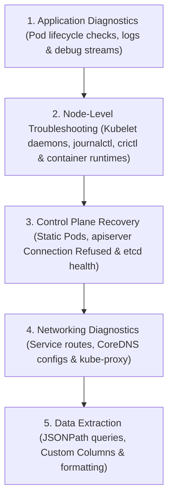
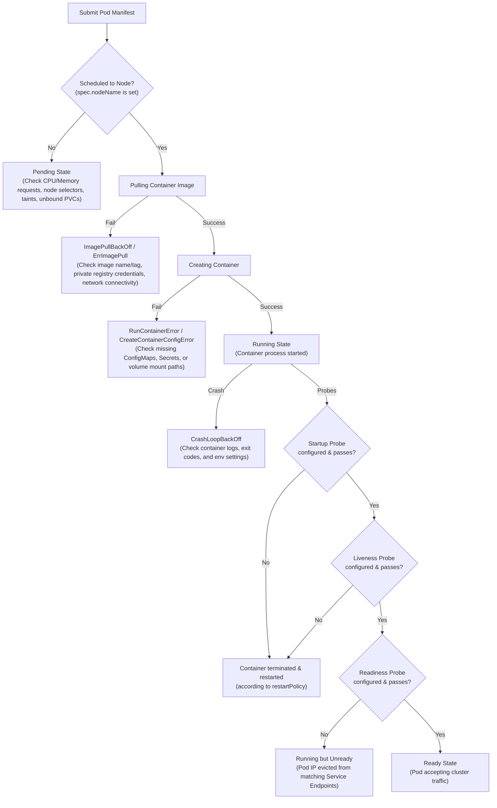

# Module 12: Cluster Troubleshooting & Diagnostics

This module covers the core diagnostics and troubleshooting workflows required for resolving failures across Kubernetes applications, the control plane, worker nodes, cluster networking, and advanced data extraction using `kubectl`.

---

## 🗺️ Cognitive Map: How to Think About the Flow of Knowledge

To build a strong intuition for Kubernetes troubleshooting, think of the topics as a top-down diagnostic pathway, starting from the application layer and progressing through the host node, the control plane, the network fabric, and advanced data extraction:



1. **Step 1: Application Diagnostics (Section 1):** We start at the user application layer. We trace Pod lifecycles (CrashLoopBackOff, ImagePullBackOff), parse logs, check environments, and inspect API events to fix application containers.
2. **Step 2: Node-Level Troubleshooting (Section 2):** We drop down to the worker host. When worker nodes show `NotReady`, we check the local Kubelet service (`systemctl`/`journalctl`), query container runtime processes (`crictl`), and check swap or disk settings.
3. **Step 3: Control Plane Recovery (Section 3):** We debug core cluster engines. We repair Control Plane outages (API Server "Connection Refused"), inspect local static pod manifests, check authentication credentials, and verify `etcd` database health.
4. **Step 4: Networking Diagnostics (Section 4):** We inspect service-to-service communication. We audit DNS resolution (`CoreDNS` ConfigMaps), trace service routing rules, check `kube-proxy` routing modes, and run networking diagnostic tools.
5. **Step 5: Data Extraction (Section 5):** Finally, we gather advanced telemetry. We master JSONPath and Custom Columns to extract, filter, and sort cluster data quickly, speeding up our root-cause analysis during production incidents.

By following this flow, you progress from **Application Log Inspections (Software) $\rightarrow$ Node Daemon Debugging (Infrastructure) $\rightarrow$ Control Plane Static Pods (Administration) $\rightarrow$ Service Traffic Audits (Networking) $\rightarrow$ Live Cluster Queries (Data Extraction)**.

---


## 1. Troubleshooting Application Failures

Application failures typically present as pods failing to start, crashlooping, or failing to receive external or service-to-service traffic.

### A. Pod Status Flowchart
Use this diagram to trace the status of a Pod from submission to a healthy state, identifying potential failure points:



### B. Pod Lifecycle Phases and Common Failures
To inspect the status of workloads, use:
```bash
kubectl get pods -n <namespace> -o wide
```

| Pod Status / Reason | Primary Causes | Diagnostic Actions & Fixes |
| :--- | :--- | :--- |
| **`ImagePullBackOff`** / **`ErrImagePull`** | Incorrect image name or tag; Private registry authentication issues; Node DNS/Internet routing block. | Check typos in `spec.containers[*].image`. Verify that the correct `imagePullSecrets` are defined in the pod spec. Verify registry connection from host. |
| **`CrashLoopBackOff`** | Application configuration typos; Missing required environment variables; Database connection failures; Disk permission issues. | Container starts but repeatedly exits. Check pod logs (especially `--previous`). Verify env variables and startup parameters. |
| **`RunContainerError`** | Failed to mount ConfigMap, Secret, or PersistentVolumeClaim. | Run `kubectl describe pod`. Verify that all mounted ConfigMaps/Secrets exist in the namespace. Check PVC storage bindings. |
| **`CreateContainerConfigError`** | Missing ConfigMap/Secret referenced in `envFrom` or `valueFrom`. | Verify that env sources exist and contain the exact keys referenced in the manifest. |
| **`OOMKilled` (Exit Code 137)** | Container exceeded its memory limits (`spec.containers[*].resources.limits.memory`). | Pod is instantly killed. Unlike CPU limits (which throttle resources using CFS quotas), memory exhaustion triggers immediate termination. Increase memory limits. |

### B. Diagnostic Toolkit for Pods
1. **Describe Details:** Inspect events and conditions (Ready, Initialized, ContainersReady, PodScheduled):
   ```bash
   kubectl describe pod <pod-name> -n <namespace>
   ```
2. **View Live Logs:**
   ```bash
   kubectl logs <pod-name> -n <namespace> --tail=100
   ```
3. **View Crashed Instance Logs (CrashLoopBackOff):**
   ```bash
   kubectl logs <pod-name> -n <namespace> --previous
   ```
4. **Exec into a Running Container:**
   ```bash
   kubectl exec -it <pod-name> -c <container-name> -n <namespace> -- /bin/sh
   ```
5. **Debug Containerless/Distroless Pods:**
   If a container lacks a shell, inject a temporary debugging sidecar container:
   ```bash
   kubectl debug -it <pod-name> --image=busybox --target=<container-name> -n <namespace>
   ```

### C. Pod Health Probes
Kubernetes uses three types of probes to monitor container health:
1. **Startup Probe:** Protects slow-starting applications. Disables liveness and readiness checks until it succeeds.
2. **Liveness Probe:** Detects if a container is running. If it fails, the kubelet kills the container and initiates its restart policy.
3. **Readiness Probe:** Detects if a container is ready to accept traffic. If it fails, the pod's IP is removed from all matching Service endpoints.

#### Probes Configuration Template
```yaml
apiVersion: v1
kind: Pod
metadata:
  name: health-probe-demo
  namespace: default
  labels:
    app: secure-app
spec:
  containers:
  - name: web-server
    image: nginx:1.25.3
    ports:
    - containerPort: 80
      name: http-port
    startupProbe:
      httpGet:
        path: /healthz
        port: 80
      initialDelaySeconds: 2
      periodSeconds: 5
      failureThreshold: 15 # Allows up to 75s (15 * 5) for startup before being killed
    livenessProbe:
      httpGet:
        path: /healthz
        port: 80
      periodSeconds: 10
      timeoutSeconds: 2
      failureThreshold: 3
    readinessProbe:
      exec:
        command:
        - cat
        - /tmp/healthy
      periodSeconds: 5
      successThreshold: 1
      failureThreshold: 2
  restartPolicy: Always
```

> [!WARNING]
> **Circular Readiness Probes:** Avoid configuring readiness probes that check external cluster dependencies (like databases) if those databases require the application to be online first. This creates a circular dependency, preventing the application from ever becoming `Ready` and accepting traffic.

### D. Service Endpoints & Traffic Routing
If an application is running but clients get connection timeouts or refused errors:
1. **Check Endpoint Membership:**
   ```bash
   kubectl get endpoints <service-name> -n <namespace>
   ```
2. **Troubleshooting Checklist:**
   * **Selector Typos:** Compare the Service selector (`spec.selector`) with the Pod labels (`metadata.labels`). Note that the deployment-injected `pod-template-hash` label should be ignored.
   * **Port Mismatches:** Ensure the Service's `spec.ports[*].targetPort` matches the container's listening port (configured in the application code, not just in the pod's `containerPort` declaration).
   * **Readiness Failure:** If the pod is `Running` but not `Ready` (readiness probe failing), the kubelet excludes its IP from the Service endpoints list.
3. **Validate Connectivity from Within the Cluster:**
   ```bash
   kubectl run curl-debug --image=curlimages/curl -i --rm --restart=Never -- curl -iv http://<service-name>.<namespace>.svc.cluster.local:<port>
   ```
4. **Port Forwarding for Local Diagnostics:**
   Bypass routing layers and connect directly to a pod or service port:
   ```bash
   kubectl port-forward svc/<service-name> 8080:<service-port> -n <namespace>
   ```

### E. Standalone Pod Re-Creation Workflow
Unlike Deployments, standalone pods have immutable specs for most fields (e.g. ports, environment variables). To fix a broken standalone pod:
1. Export the existing configuration:
   ```bash
   kubectl get pod <pod-name> -n <namespace> -o yaml > pod-recovery.yaml
   ```
2. Edit `pod-recovery.yaml` to fix the environmental variables or ports.
3. Force replace the pod instantly:
   ```bash
   kubectl replace --force -f pod-recovery.yaml
   ```

---

## 2. Troubleshooting Control Plane Failures

The control plane consists of `kube-apiserver`, `kube-controller-manager`, `kube-scheduler`, and `etcd`. These are either deployed as **Static Pods** (using kubeadm) or managed as **Systemd Services**.

### A. API Server "Connection Refused" & Static Pod Manifest Auditing (`/etc/kubernetes/manifests`)
When running `kubectl` commands returns a connection refused error:
`The connection to the server <IP>:6443 was refused - did you specify the right host or port?`
This indicates that the `kube-apiserver` process is down. Because `kubectl` relies on the API server, you cannot use it to troubleshoot itself. You must SSH into the affected control plane node directly and escalate privileges to `root` (`sudo -i`).

#### Control Plane Manifest File Paths
* API Server: `/etc/kubernetes/manifests/kube-apiserver.yaml`
* Controller Manager: `/etc/kubernetes/manifests/kube-controller-manager.yaml`
* Scheduler: `/etc/kubernetes/manifests/kube-scheduler.yaml`
* ETCD: `/etc/kubernetes/manifests/etcd.yaml`

#### Diagnostic Checklist when API Server is Down
1. **Verify Kubelet Service:** Static pods are managed locally by the node's Kubelet. If the Kubelet is stopped or crashing, no static pods (including the API server) will run:
   ```bash
   sudo systemctl status kubelet
   sudo journalctl -u kubelet -n 100 --no-pager
   ```
2. **Inspect Containers Directly:** Bypass the API server and inspect the container runtime directly (using the CRI utility `crictl`) to see if control plane containers are stopped or crashlooping:
   ```bash
   sudo crictl ps -a
   ```
3. **Inspect Logs of Crashed Control Plane Container:** If `crictl ps -a` shows a exited `kube-apiserver` container, retrieve its logs to identify the crash reason:
   ```bash
   sudo crictl logs <container-id>
   ```
4. **Common Static Pod Manifest Errors:**
   * **CA/Cert Directory Paths:** Typo in PKI volume mounts (e.g., mounting `/etc/kubernetes/pki-typo` instead of `/etc/kubernetes/pki`).
   * **Kubeconfig File Paths:** Typo in configuration files (e.g., pointing to `/etc/kubernetes/controller-manager-typo.conf` instead of `/etc/kubernetes/controller-manager.conf`).
   * **Exec Command Typo:** Typos in starting binaries (e.g., `command: ["kube-apiserverrrrr"]`).
   * **YAML Formatting Errors:** Duplicate keys, tabs instead of spaces, or incorrect indentations. Check syntax:
     ```bash
     python3 -c 'import yaml, sys; yaml.safe_load(open("/etc/kubernetes/manifests/kube-apiserver.yaml"))'
     ```

> [!TIP]
> **Static Pod Reload Trick:**
> When editing static pod manifests, the kubelet instantly re-applies changes. If a static pod is stuck, you can force a reload by temporarily moving the manifest out of the directory and moving it back:
> ```bash
> mv /etc/kubernetes/manifests/kube-apiserver.yaml /tmp/
> # Wait 10 seconds
> mv /tmp/kube-apiserver.yaml /etc/kubernetes/manifests/
> ```

### B. SystemD Control Plane Service Logs
For binary-installed clusters where the control plane components run as systemd services:
1. **Check Service Status:**
   ```bash
   systemctl status kube-apiserver
   systemctl status kube-controller-manager
   systemctl status kube-scheduler
   systemctl status etcd
   ```
2. **Review Service Logs:**
   ```bash
   journalctl -u kube-apiserver -n 150 --no-pager
   ```
3. **Identify Configuration Files:** Inspect systemd unit files to find the paths of service configuration files:
   ```bash
   systemctl cat kube-apiserver
   ```
   Look for `EnvironmentFile=` or specific command-line arguments pointing to configuration paths (e.g., `/etc/kubernetes/apiserver`).

### C. ETCD Failures & Endpoint Health Checks
If ETCD is down, the API server cannot read/write cluster state and will crash.
1. **Verify ETCD Container Logs:**
   ```bash
   crictl ps | grep etcd
   crictl logs <etcd-container-id>
   ```
2. **Perform Health and Membership Audits:** Run `etcdctl` inside the control plane host using the local certificates:
   ```bash
   ETCDCTL_API=3 etcdctl \
     --endpoints=https://127.0.0.1:2379 \
     --cacert=/etc/kubernetes/pki/etcd/ca.crt \
     --cert=/etc/kubernetes/pki/etcd/server.crt \
     --key=/etc/kubernetes/pki/etcd/server.key \
     endpoint health
   ```
3. **Verify Cluster Membership Status:**
   ```bash
   ETCDCTL_API=3 etcdctl \
     --endpoints=https://127.0.0.1:2379 \
     --cacert=/etc/kubernetes/pki/etcd/ca.crt \
     --cert=/etc/kubernetes/pki/etcd/server.crt \
     --key=/etc/kubernetes/pki/etcd/server.key \
     member list -w table
   ```

---

## 3. Troubleshooting Worker Node Failures

Worker node failures manifest as nodes switching to the **`NotReady`** state or reporting resource starvation.

### A. Node Readiness and Conditions
Check general node statuses:
```bash
kubectl get nodes -o wide
```

To diagnose a specific node, inspect its conditions:
```bash
kubectl describe node <node-name>
```

#### Key Node Conditions (Look for abnormal values)
* **`Ready`:** If `False` or `Unknown`, the kubelet on the node is either stopped or cannot communicate with the control plane.
* **`MemoryPressure` / `DiskPressure` / `PIDPressure`:** If `True`, resource starvation is occurring, and the kubelet will begin evicting lower-priority pods.
* **`NetworkUnavailable`:** If `True`, the node's container network interface (CNI) configuration has failed.

Run resource checks on the worker node:
```bash
top          # CPU/RAM processes
free -h      # Memory allocation
df -h        # Disk utilization (crucial for local image cache limits)
```

### B. Kubelet Service Debugging
SSH to the affected worker node to debug the kubelet service:
1. **Verify Kubelet Service Status:**
   ```bash
   systemctl status kubelet
   ```
2. **Start/Restart Kubelet:**
   ```bash
   systemctl daemon-reload
   systemctl restart kubelet
   ```
3. **Analyze Kubelet Logs:**
   ```bash
   journalctl -u kubelet -n 100 --no-pager -f
   ```

#### Common Kubelet Service Errors & Fixes
* **Missing or Misspelled CA Certificate File:**
  * **Symptom:** Kubelet status is `activating (auto-restart)` and logs show:
    `failed to construct kubelet dependencies: unable to load client CA file /etc/kubernetes/pki/WRONG-CA-FILE.crt: no such file or directory`
  * **Fix:** Locate the configuration path (look for `--config` in `systemctl cat kubelet`, usually `/var/lib/kubelet/config.yaml`). Edit the config file:
    ```yaml
    # /var/lib/kubelet/config.yaml
    authentication:
      x509:
        clientCAFile: /etc/kubernetes/pki/ca.crt # Fix the CA certificate path
    ```
    Then restart the service: `systemctl restart kubelet`.
* **Incorrect API Server Port in Kubeconfig:**
  * **Symptom:** Kubelet runs but reports:
    `Unable to register node with API server: Post "https://controlplane:6553/api/v1/nodes": dial tcp 192.10.46.12:6553: connect: connection refused`
  * **Fix:** Identify the kubeconfig path from Kubelet arguments (typically `/etc/kubernetes/kubelet.conf`). Edit `/etc/kubernetes/kubelet.conf` to fix the API server port:
    ```yaml
    clusters:
    - cluster:
        server: https://controlplane:6443 # Fix port from 6553 to 6443
    ```
    Then restart Kubelet: `systemctl restart kubelet`.

### C. Container Runtime Interface (CRI) Socket Auditing
Kubernetes uses CRI-compliant runtimes (e.g. `containerd`, `CRI-O`) to manage containers.

1. **Verify Runtime Status:**
   ```bash
   systemctl status containerd
   ```
2. **Validate Kubelet Socket Flag:** Check the Kubelet service arguments or config file for the correct `--container-runtime-endpoint` value:
   * **Containerd Socket:** `unix:///run/containerd/containerd.sock` (or `/var/run/containerd/containerd.sock`)
   * **CRI-O Socket:** `unix:///var/run/crio/crio.sock`
   * **Docker (via cri-dockerd):** `unix:///var/run/cri-dockerd.sock`

#### Debugging at Runtime Level using `crictl`
Create or edit `/etc/crictl.yaml` to set runtime endpoints:
```yaml
runtime-endpoint: unix:///run/containerd/containerd.sock
image-endpoint: unix:///run/containerd/containerd.sock
timeout: 10
debug: false
```

Use `crictl` for localized troubleshooting:
* **List Active Pod Sandboxes:**
  ```bash
  crictl pods
  ```
* **List Containers:**
  ```bash
  crictl ps -a
  ```
* **Extract Container Logs Directly:**
  ```bash
  crictl logs <container-id>
  ```
* **Inspect Container Metadata:**
  ```bash
  crictl inspect <container-id>
  ```

---

## 4. Troubleshooting Cluster Networking

Kubernetes networking issues usually manifest as pods failing to allocate IPs, pods failing to communicate, services failing to route traffic, or DNS name resolution failing.

### A. CNI (Container Network Interface) Failures
If CNI is missing, misconfigured, or crashing, pods will remain stuck in `ContainerCreating` or `Pending`.
1. **Analyze Pod Network Failures:**
   ```bash
   kubectl describe pod <pod-name>
   ```
   Look for errors like: `NetworkPluginNotReady: Network plugin cni not initialized` or `unable to allocate IP address`.
2. **Inspect CNI Configuration Directory:** Kubelet reads configuration from `/etc/cni/net.d/` to initialize the pod networks.
   ```bash
   ls -la /etc/cni/net.d/
   ```
   Verify that a valid configuration file exists (e.g., `10-flannel.conflist`, `10-calico.conflist`, `10-weave.conflist`).
3. **Verify CNI Binaries:** Check that CNI binaries exist under the default directory:
   ```bash
   ls -la /opt/cni/bin/
   ```
4. **Deploy CNI DaemonSet (e.g., Weave Net):** If no CNI is running, deploy Weave Net:
   ```bash
   kubectl apply -f https://github.com/weaveworks/weave/releases/download/v2.8.1/weave-daemonset-k8s.yaml
   ```

### B. Service Routing & Kube-Proxy Failures
If pod-to-pod IP routing works, but service-to-pod IP routing fails, the issue is likely related to `kube-proxy`.
1. **Verify Kube-Proxy Pod Status:**
   ```bash
   kubectl get pods -n kube-system -l k8s-app=kube-proxy
   ```
2. **Check Logs for Startup Configuration Errors:**
   ```bash
   kubectl logs -n kube-system -l k8s-app=kube-proxy --tail=100
   ```
   * **Common Error:** Kube-proxy crashloops because its configuration command points to an incorrect file path (e.g., `--config=/var/lib/kube-proxy/configuration.conf` instead of the mounted ConfigMap target `config.conf`).
3. **Fixing Kube-Proxy DaemonSet Args:**
   ```bash
   kubectl edit ds -n kube-system kube-proxy
   ```
   Modify the volume mounts or the command arguments:
   ```yaml
   spec:
     template:
       spec:
         containers:
         - command:
           - /usr/local/bin/kube-proxy
           - --config=/var/lib/kube-proxy/config.conf # Fix filename configuration
   ```
4. **Audit iptables Rules on Host Node:**
   SSH to the worker node and verify if the service's ClusterIP NAT rules have been generated:
   ```bash
   iptables -t nat -L PREROUTING -n -v
   # Or search for specific ClusterIP mapping
   iptables-save | grep <service-cluster-ip>
   ```

### C. CoreDNS Resolution Failures
CoreDNS resolves internal service names (e.g. `mysql-service.alpha.svc.cluster.local`).
1. **Check DNS Pods and Service:**
   ```bash
   kubectl get pods -n kube-system -l k8s-app=kube-dns
   kubectl get svc -n kube-system kube-dns
   ```
2. **Test DNS Lookups with a Temporary Utility Pod:**
   ```bash
   kubectl run dns-test-utility --image=registry.k8s.io/e2e-test-images/jessie-dnsutils:1.7 --restart=Never -- sleep 3600
   ```
   Perform testing lookup commands:
   ```bash
   kubectl exec dns-test-utility -- nslookup kubernetes.default
   kubectl exec dns-test-utility -- nslookup <service-name>.<namespace>.svc.cluster.local
   ```
3. **Check CoreDNS ConfigMap:**
   ```bash
   kubectl get cm -n kube-system coredns -o yaml
   ```
   Ensure the Corefile contains proper forward directives pointing to host configurations:
   ```text
   Corefile: |
     .:53 {
         errors
         health {
            lameduck 5s
         }
         ready
         kubernetes cluster.local in-addr.arpa ip6.arpa {
            pods insecure
            fallthrough in-addr.arpa ip6.arpa
            ttl 30
         }
         prometheus :9153
         forward . /etc/resolv.conf
         cache 30
         loop
         reload
         loadbalance
     }
   ```
4. **Inspect CoreDNS Pod Logs:**
   ```bash
   kubectl logs -n kube-system -l k8s-app=kube-dns --tail=100
   ```
   Ensure that CoreDNS is not loop-blocking on upstream servers (common when resolving network names loops back onto CoreDNS itself).

---

## 5. Advanced Kubectl Usage

Using advanced `kubectl` query parameters allows for rapid diagnosis and data collection without raw JSON processing in external utilities.

### A. JSONPATH Parsing Syntax
Use JSONPATH expressions to filter and output specific nested fields from API objects.

#### Basic Syntax Operators
* `$` : Root object (implicit in kubectl, usually starts with `.`)
* `.` : Child operator (e.g. `.metadata`)
* `..` : Recursive descent search
* `*` : Wildcard operator matching all elements in a list
* `[index]` : Array access (0-indexed)
* `[?()]` : Filter expression querying attributes

#### High-Yield JSONPATH CLI Snippets
1. **Get Names of All Cluster Nodes:**
   ```bash
   kubectl get nodes -o jsonpath='{.items[*].metadata.name}'
   ```
2. **Get OS Image for All Nodes:**
   ```bash
   kubectl get nodes -o jsonpath='{.items[*].status.nodeInfo.osImage}'
   ```
3. **List Internal IPs of All Nodes:**
   ```bash
   kubectl get nodes -o jsonpath='{.items[*].status.addresses[?(@.type=="InternalIP")].address}'
   ```
4. **Extract All Container Images in a Namespace:**
   ```bash
   kubectl get pods -n <namespace> -o jsonpath='{.items[*].spec.containers[*].image}'
   ```
5. **Get Kubeconfig Users List:**
   ```bash
   kubectl config view --kubeconfig=my-kube-config -o jsonpath='{.users[*].name}'
   ```
6. **Find Context Name Bound to Specific User:**
   ```bash
   kubectl config view --kubeconfig=my-kube-config -o jsonpath='{.contexts[?(@.context.user=="aws-user")].name}'
   ```
7. **Find Pod IP by Pod Name:**
   ```bash
   kubectl get pod <pod-name> -o jsonpath='{.status.podIP}'
   ```

### B. Custom Columns Formatting
Format output into clean, user-defined tabular columns directly within the CLI:
`kubectl get <resource> -o=custom-columns=<HEADER>:<JSONPATH>,<HEADER2>:<JSONPATH>`

1. **Extract Node Names and CPU Capacities:**
   ```bash
   kubectl get nodes -o=custom-columns=NODE:.metadata.name,CPU:.status.capacity.cpu
   ```
2. **Extract Pod Names, Container Names, and Running Images:**
   ```bash
   kubectl get pods -o=custom-columns=POD:.metadata.name,CONTAINER:.spec.containers[*].name,IMAGE:.spec.containers[*].image
   ```
3. **Extract Persistent Volumes and Resource Requests:**
   ```bash
   kubectl get pv -o=custom-columns=PV_NAME:.metadata.name,CAPACITY:.spec.capacity.storage,ACCESS_MODE:.spec.accessModes[*]
   ```

### C. Resource Sorting
Sort resources using JSONPATH values with the `--sort-by` flag.

1. **Sort Nodes Alphabetically by Name:**
   ```bash
   kubectl get nodes --sort-by=.metadata.name
   ```
2. **Sort Nodes by CPU Capacity:**
   ```bash
   kubectl get nodes --sort-by=.status.capacity.cpu
   ```
3. **Sort Persistent Volumes by Storage Size:**
   ```bash
   kubectl get pv --sort-by=.spec.capacity.storage
   ```
4. **Combine Sort with Custom Columns:**
   ```bash
   kubectl get pv --sort-by=.spec.capacity.storage -o=custom-columns=NAME:.metadata.name,CAPACITY:.spec.capacity.storage
   ```

### D. Resource Filtering
Filter outputs using labels or resource attributes.

1. **Filter by Label Selector:**
   ```bash
   kubectl get pods -l app=mysql,tier=backend
   kubectl get pods -l 'app in (frontend, api)'
   ```
2. **Filter by Field Selector:**
   * Get running pods only:
     ```bash
     kubectl get pods --field-selector status.phase=Running
     ```
   * Get pods scheduled on a specific node:
     ```bash
     kubectl get pods --field-selector spec.nodeName=node01 -A
     ```
   * Get all pods except those in the running phase:
     ```bash
     kubectl get pods --field-selector status.phase!=Running --all-namespaces
     ```
