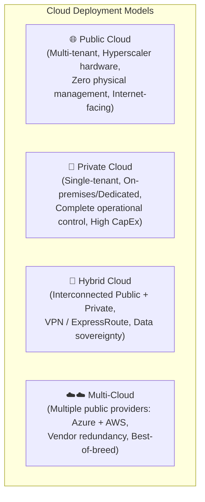
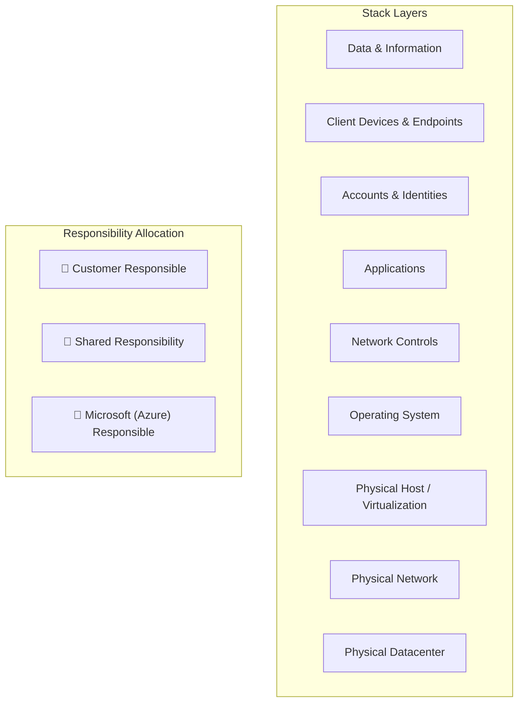
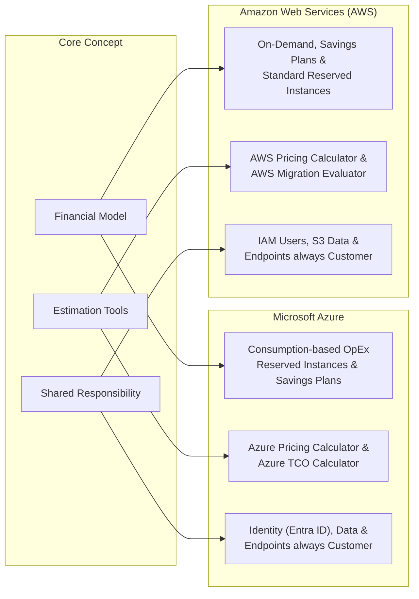

# Module 13-1: Cloud Concepts, Service Types & Cloud Economics

**Breadcrumbs:** [[--Index--|🏠 Index]] > [[13-Index - Azure|☁️ Azure Reference MOC]] > **Module 13-1**

---

## 1. Cloud Computing Paradigms & Deployment Models

Cloud computing is the delivery of computing services—including servers, storage, databases, networking, software, analytics, and intelligence—over the internet ("the cloud") to offer faster innovation, flexible resources, and economies of scale.

### 1.1 Detailed Model Breakdown
1. **Public Cloud:**
   - Owned and operated by third-party cloud service providers (e.g. Microsoft Azure).
   - Resources (hardware, storage, network devices) are delivered over the internet and shared across multiple tenants, though isolated logically via hypervisors and software-defined networking.
   - **Characteristics:** Zero CapEx, near-infinite scalability, pay-as-you-go, no maintenance of physical infrastructure.
2. **Private Cloud:**
   - Computing infrastructure used exclusively by a single business or organization.
   - Can be physically located at an on-premises datacenter or hosted by a third-party service provider.
   - **Characteristics:** High initial CapEx, total control over hardware and compliance, responsible for hardware refresh and physical security.
3. **Hybrid Cloud:**
   - Combines public and private clouds, bound together by standardized technology allowing data and applications to be shared between them.
   - Enables **cloud bursting**: running baseline workloads on-premises and bursting into Azure during peak traffic demands.
4. **Multi-Cloud:**
   - Utilizing multiple public cloud providers simultaneously (e.g. running compute in Azure while utilizing AWS S3 or Google BigQuery).
   - Mitigates vendor lock-in and satisfies strict geo-political data residency requirements.

---

## 2. Cloud Service Types & Shared Responsibility Model

Understanding the boundaries of operational responsibility between the cloud customer and Microsoft is fundamental to cloud security and administration.

### 2.1 The Shared Responsibility Breakdown Matrix

| Architectural Layer | On-Premises | IaaS (Infrastructure as a Service) | PaaS (Platform as a Service) | SaaS (Software as a Service) |
| :--- | :--- | :--- | :--- | :--- |
| **Data & Information** | Customer | **Customer** | **Customer** | **Customer** |
| **Client Devices & Endpoints** | Customer | **Customer** | **Customer** | **Customer** |
| **Accounts & Identities (Entra ID)**| Customer | **Customer** | **Customer** | **Customer** |
| **Application Logic & Code** | Customer | **Customer** | **Customer** | Microsoft |
| **Network Controls (NSGs/Firewalls)**| Customer | **Customer** | Shared | Microsoft |
| **Operating System & Patching** | Customer | **Customer** | Microsoft | Microsoft |
| **Runtime & Middleware** | Customer | **Customer** | Microsoft | Microsoft |
| **Virtualization & Hypervisor** | Customer | Microsoft | Microsoft | Microsoft |
| **Physical Compute & Hosts** | Customer | Microsoft | Microsoft | Microsoft |
| **Physical Datacenter & Power** | Customer | Microsoft | Microsoft | Microsoft |

> [!IMPORTANT]
> **Universal Truth of Cloud Security:** Regardless of the cloud service model (IaaS, PaaS, or SaaS), the **Customer ALWAYS retains 100% responsibility** for:
> 1. The data stored in the cloud.
> 2. The client endpoints accessing the cloud.
> 3. Account credentials, identity governance, and access management.

---

## 3. Financial Models & Cloud Economics

### 3.1 CapEx vs. OpEx
- **Capital Expenditure (CapEx):** Upfront spending on physical infrastructure (servers, storage arrays, networking switches, cooling, real estate, and backup generators). CapEx investments are deducted over time via depreciation on balance sheets.
- **Operational Expenditure (OpEx):** Continuous spending on business operational costs (services, subscription fees, pay-per-use compute). OpEx can be deducted in the same tax year the expense occurs.
- **The Cloud Shift:** Azure transitions enterprise IT from a rigid, predictable **CapEx** paradigm to an agile, dynamic **OpEx** consumption model.

### 3.2 Consumption-Based Pricing & Cost Drivers
Under Azure's consumption-based model, organizations pay only for the resources they provision and consume:
- **Compute:** Billed per second of execution time when instances are in the `Running` state (deallocated VMs incur no compute charges, only persistent disk storage charges).
- **Storage:** Billed per GB per month stored, access tier selected (Hot, Cool, Cold, Archive), and read/write transaction volume.
- **Networking Ingress vs. Egress:**
  - **Ingress (Data In):** Inbound data transfer into Azure datacenters is **100% free**.
  - **Egress (Data Out):** Outbound data transfer leaving Azure datacenters across internet or inter-region backbones is **billable** per GB.

### 3.3 Azure Pricing Calculator vs. TCO Calculator
- **Azure Pricing Calculator:** Used to estimate real-time monthly operational costs for deploying new Azure resources based on VM size, storage tiers, regions, and bandwidth.
- **Total Cost of Ownership (TCO) Calculator:** Used to compare the comprehensive cost of running an existing on-premises datacenter environment (including hardware, software licenses, power, cooling, real estate, and IT labor) versus migrating the equivalent workload to Azure over a 3- to 5-year timeframe.

---

## 4. Fundamental Cloud Benefits & Architectural Pillars

1. **High Availability (HA):** Ensuring systems remain operational without downtime through redundancy, fault domains, and automated health checks.
2. **Scalability:** The ability to handle growing workloads:
   - **Vertical Scalability (Scaling Up):** Adding more CPU, RAM, or IOPS to an existing VM.
   - **Horizontal Scalability (Scaling Out):** Adding more identical compute instances (e.g. VM Scale Sets).
3. **Elasticity:** The dynamic, automated provisioning and de-provisioning of resources in direct response to real-time traffic spikes and dips (auto-scaling).
4. **Agility:** The speed with which developers can spin up environments, test, deploy, and iterate without waiting for hardware procurement.
5. **Geo-Distribution:** Deploying workloads across geographically dispersed regions to position compute and data close to global end-users, minimizing latency.
6. **Disaster Recovery (DR):** Preserving business continuity and data integrity following a catastrophic datacenter or regional outage via automated replication (e.g. Azure Site Recovery).

---

## 5. 🌉 Cognitive Comparative Bridge: Azure vs. AWS Cloud Fundamentals

### Key Architectural Nuances:
1. **Billing Hierarchies:** In AWS, billing rolls up to the Management Account in AWS Organizations via Consolidated Billing. In Azure, billing is managed at the **Subscription** and **Billing Account / Enterprise Agreement (EA)** level, with fine-grained **Cost Management Budgets** assigned per Resource Group or Subscription.
2. **License Portability:** Azure uniquely features the **Azure Hybrid Benefit (AHB)**, allowing existing on-premises Windows Server and SQL Server licenses with Software Assurance to be applied directly to Azure VMs, reducing compute costs by up to 85% compared to AWS.

<!-- Documentation References -->
[Microsoft Learn: Describe cloud concepts](https://learn.microsoft.com/en-us/training/modules/describe-cloud-compute/)
[Microsoft Learn: Azure Pricing Calculator](https://azure.microsoft.com/en-us/pricing/calculator/)
[Microsoft Learn: Shared responsibility in the cloud](https://learn.microsoft.com/en-us/azure/security/fundamentals/shared-responsibility)
