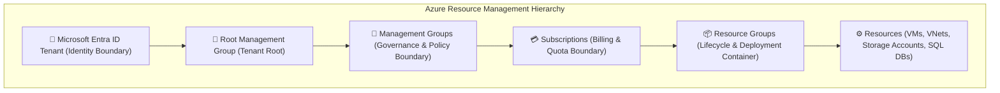
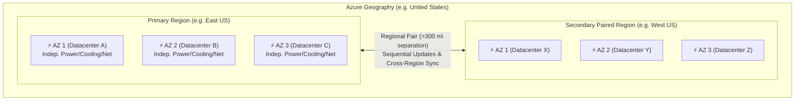
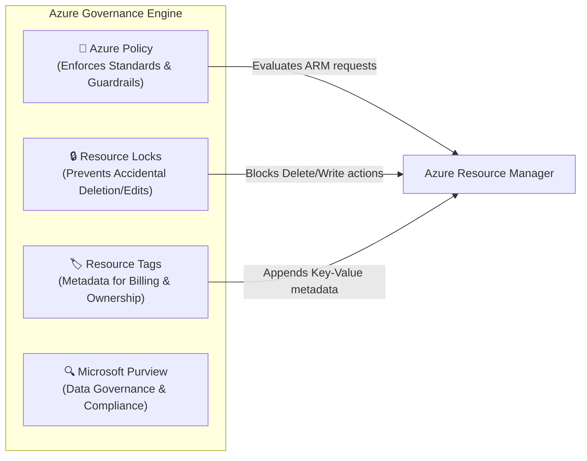
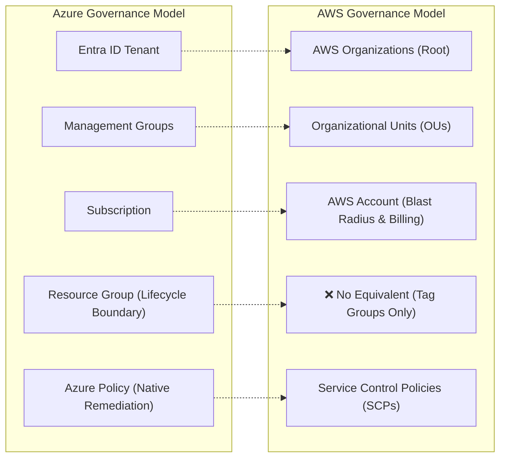

# Module 13-2: Azure Architecture Hierarchy, Regions, AZs & Governance

**Breadcrumbs:** [[--Index--|🏠 Index]] > [[13-Index - Azure|☁️ Azure Reference MOC]] > **Module 13-2**

---

## 1. The 4-Tier Azure Resource Management Hierarchy

Azure organizes all cloud resources into a strictly enforced four-level organizational hierarchy. Access control (RBAC), policies, budgets, and compliance rules inherit downwards from top to bottom.

### 1.1 Detailed Tier Breakdown
1. **Management Groups:**
   - Containers above subscriptions that facilitate enterprise-wide governance.
   - You can organize subscriptions into management groups and apply **Azure Policy** or **Azure RBAC** role assignments once at the management group level, which automatically inherit to all subscriptions within that tree.
   - Can nest up to **6 levels deep** beneath the Root Management Group.
2. **Subscriptions:**
   - The fundamental **billing unit and quota boundary** in Azure.
   - Every Azure resource must belong to exactly one subscription.
   - Subscriptions isolate cost tracking, credit limits, and service quotas (e.g. max vCPUs per region).
3. **Resource Groups:**
   - A logical container that holds related resources for an Azure solution.
   - **The Golden Lifecycle Rule:** All resources in a resource group should share the same application lifecycle (provisioned together, updated together, and deleted together).
   - **Cascading Deletion:** Deleting a Resource Group automatically deletes **every resource** contained within it.
   - A resource can belong to only **one** resource group at a time, but resources can be moved between resource groups.
   - **Deployment Location:** A Resource Group has its own metadata location, but can contain resources located in completely different geographical regions!
4. **Resources:**
   - Instances of services deployed in Azure (e.g. a Virtual Machine, a Virtual Network, an Azure SQL database).

---

## 2. Azure Physical Infrastructure: Regions, Availability Zones & Pairs

### 2.1 Regional Footprint & Architecture
- **Region:** A geographical area containing one or more datacenters networked together through a dedicated, low-latency regional network (round-trip latency < 2 milliseconds).
- **Specialized / Sovereign Regions:**
  - **Azure Government:** Physically and logically isolated cloud instances dedicated to US federal, state, and local government agencies (e.g. US Gov Virginia, US DoD Central).
  - **Azure China (21Vianet):** Operated independently by 21Vianet to comply with Chinese regulatory frameworks; physically separated from global Azure.
- **Availability Zones (AZs):**
  - Physically separate datacenter locations within an Azure region.
  - Each AZ consists of one or more datacenters equipped with **independent power, cooling, and networking**.
  - Provides isolation against localized physical datacenter fires, floods, or hardware failures.
  - Guarantees **99.99% VM uptime SLA** when two or more instances are deployed across distinct AZs.
- **Regional Pairs:**
  - Each Azure region is paired with another region within the same geography (at least **300 miles apart**) to ensure high availability and disaster recovery.
  - **Sequential Platform Updates:** Microsoft rolls out system updates to only one paired region at a time to minimize the risk of global downtime.
  - **Disaster Recovery Priority:** If a massive geopolitical event or natural disaster impacts multiple regions, recovery of one region from every pair is prioritized.

---

## 3. Governance & Resource Control Engine

### 3.1 Azure Policy vs. Azure RBAC
- **Azure RBAC (Who):** Governs **user access permissions** (e.g. *"Can User A deploy a Virtual Machine in Subscription B?"*).
- **Azure Policy (What):** Governs **resource properties and compliance** (e.g. *"Can any VM be deployed with a public IP?"* or *"Are VMs restricted to the East US region only?"*).
  - **Policy Definition:** An individual JSON document defining specific conditions and effects (e.g., `Deny`, `Audit`, `Append`, `Modify`).
  - **Policy Initiative (Policy Set):** A collection of policy definitions grouped together to achieve a specific regulatory goal (e.g., PCI-DSS, ISO 27001, HIPAA).
  - **Inheritance:** Policies assigned at a Management Group automatically apply to all child subscriptions and resource groups.

### 3.2 Resource Locks
Resource locks prevent accidental deletion or modification of mission-critical production assets, regardless of a user's RBAC role (even Subscription `Owner` permissions are blocked by locks):

| Lock Type | REST API Name | Behavior |
| :--- | :--- | :--- |
| **Delete** | `CanNotDelete` | Authorized users can read and modify the resource, but **cannot delete** it. |
| **Read-Only** | `ReadOnly` | Authorized users can read the resource, but **cannot modify, update, or delete** it. |

> [!NOTE]
> Resource locks inherit downwards. Placing a `CanNotDelete` lock on a Resource Group prevents any resource inside that group from being deleted! To delete a locked resource, an administrator must explicitly remove the lock first.

### 3.3 Resource Tags
Key-value pairs (`Department: Finance`, `Environment: Production`, `CostCenter: 1045`) attached to resources:
- Crucial for billing allocation in **Microsoft Cost Management**.
- Tags do **not** inherit automatically from Resource Groups to child resources (use Azure Policy with the `Modify` effect to enforce tag inheritance).

---

## 4. 🌉 Cognitive Comparative Bridge: Azure Hierarchy vs. AWS

### Critical Mental Model Shifts:
1. **The Resource Group Concept:** AWS has no direct equivalent to an Azure Resource Group. In AWS, resources exist globally within an account and are grouped only via tags or CloudFormation stacks. In Azure, **every resource must be created inside a Resource Group**, which acts as a hard boundary for deployment templates, lifecycle deletion, and RBAC scoping.
2. **Management Groups vs. AWS OUs:** Azure Management Groups mirror AWS Organizational Units (OUs). However, Azure Policy allows automatic in-place remediation (`Modify`/`DeployIfNotExists`), whereas AWS SCPs only act as guardrails denying unauthorized actions.

<!-- Documentation References -->
[Microsoft Learn: Azure management hierarchy](https://learn.microsoft.com/en-us/azure/governance/management-groups/overview)
[Microsoft Learn: Azure regions and availability zones](https://learn.microsoft.com/en-us/azure/reliability/availability-zones-overview)
[Microsoft Learn: Azure Policy overview](https://learn.microsoft.com/en-us/azure/governance/policy/overview)
