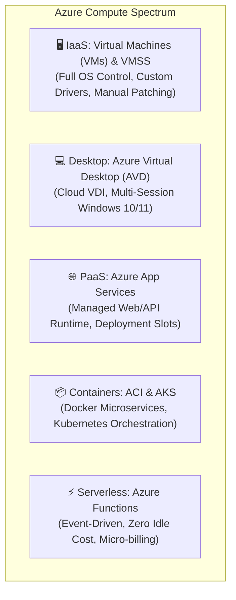
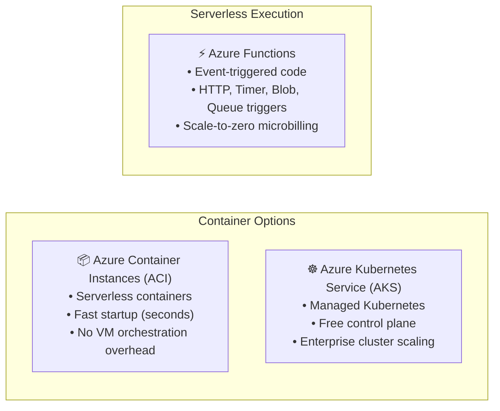
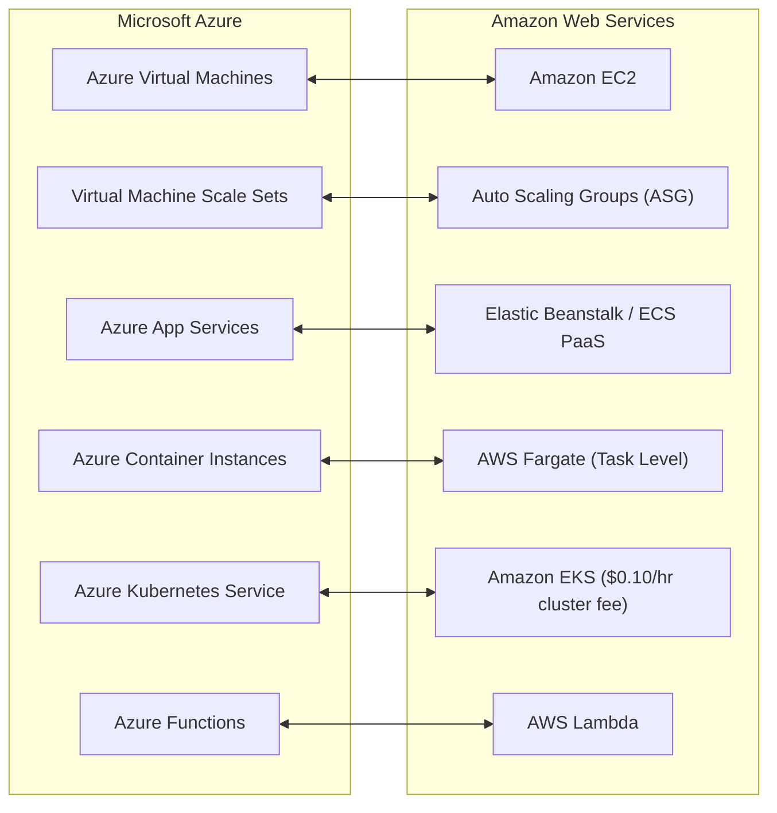

# Module 13-3: Azure Compute Services & Workload Paradigms

**Breadcrumbs:** [[--Index--|🏠 Index]] > [[13-Index - Azure|☁️ Azure Reference MOC]] > **Module 13-3**

---

## 1. Overview of Azure Compute Paradigms

Azure compute provides on-demand computing power for running cloud applications, spanning Infrastructure as a Service (IaaS), Platform as a Service (PaaS), and Serverless architectures.

---

## 2. Infrastructure Compute: Azure Virtual Machines & Scale Sets

### 2.1 Azure Virtual Machines (VMs)
- **Concept:** Software-based emulation of physical computers, providing total control over operating system (Windows/Linux), configuration, and installed software.
- **Storage Disks:**
  - **OS Disk:** Contains the operating system; typically a managed disk formatted with standard OS file systems.
  - **Temporary Disk:** Located on physical host solid-state drives; used for page files. **Non-persistent** across VM reboots/deallocations!
  - **Data Disks:** Managed disks attached for application data storage.
- **VM Series Sizing:**
  - **B-Series:** Burstable (cost-effective for low baseline usage with occasional bursts).
  - **D-Series:** General purpose (balanced vCPU-to-memory ratio).
  - **E-Series:** Memory optimized (ideal for relational databases, in-memory caches).
  - **F-Series:** Compute optimized (high CPU-to-memory ratio for batch processing).

### 2.2 Virtual Machine Scale Sets (VMSS)
- **Concept:** An Azure compute resource that lets you deploy and manage a set of identical, auto-scaling Virtual Machines.
- **Auto-Scaling:** Automatically increases or decreases the number of VM instances in response to demand (e.g. CPU > 75% adds 2 instances) or scheduled metrics.
- **High Availability Spreading:** VMSS automatically distributes VM instances across **Fault Domains** (hardware racks with independent power and networking) and **Update Domains** (groups of VMs rebooted sequentially during host updates).

---

## 3. Desktop Virtualization: Azure Virtual Desktop (AVD)

- **Concept:** A comprehensive desktop and app virtualization service running in the cloud.
- **Key Capabilities:**
  - Delivers virtual Windows 10 and Windows 11 desktop environments accessible from any device (Windows, Mac, iOS, Android, web browser).
  - **Multi-Session Windows:** Allows multiple concurrent remote users on a single Windows 10/11 enterprise VM, dramatically slashing compute licensing costs compared to traditional single-user VDI solutions.
  - Integrates natively with Microsoft 365 Apps for Enterprise.

---

## 4. Platform Compute: Azure App Services

- **Concept:** A fully managed HTTP-based platform (PaaS) for building, hosting, and scaling web applications, RESTful APIs, and mobile app backends.
- **Supported Runtimes:** .NET, .NET Core, Java, Ruby, Node.js, PHP, Python, or custom Docker containers.
- **App Service Plan:** Defines the region, instance size, and compute hardware capacity shared by apps deployed within it.
- **Deployment Slots:**
  - Staging environments with their own live hostnames (e.g. `my-app-staging.azurewebsites.net`).
  - Allows zero-downtime testing of new releases, followed by an instantaneous **Slot Swap** with the production slot. If issues occur, swapping back provides instant rollback.

---

## 5. Container & Serverless Solutions

### 5.1 Azure Container Instances (ACI)
- The fastest and simplest way to run a container in Azure without provisioning virtual machines or adopting an orchestrator.
- Highly suited for isolated batch jobs, automated build agents, and burst processing.

### 5.2 Azure Kubernetes Service (AKS)
- Fully managed production-grade Kubernetes cluster management.
- **Pricing Advantage:** Microsoft manages the Kubernetes Control Plane (API server, etcd, scheduler) for **free**; customers pay only for the worker node VMs running in their cluster.

### 5.3 Azure Functions
- Serverless event-driven compute engine allowing developers to run small snippets of code ("functions") without managing infrastructure.
- **Hosting Plans:**
  - **Consumption Plan:** Automatically scales instances based on incoming event triggers and scales down to zero when idle (bypassing all compute costs when inactive).
  - **Premium Plan:** Keeps instances warm to eliminate cold starts and provides VNet integration.

---

## 6. Compute Decision Matrix

| Service | Abstraction | Scaling Metric | Statefulness | Best For |
| :--- | :--- | :--- | :--- | :--- |
| **Azure VMs** | Full OS (IaaS) | Manual / Vertical | Stateful | Legacy apps, custom OS dependencies, lift-and-shift. |
| **VM Scale Sets** | VM Fleet (IaaS) | Auto-scale metrics | Stateless / Stateful | Large web farms, big data clusters, container hosts. |
| **Azure App Services** | Managed Runtime (PaaS) | Auto-scale instances | Stateless | Standard web applications, REST APIs, enterprise portals. |
| **Azure ACI** | Single Container | Fast on-demand | Stateless | Ephemeral jobs, CI/CD runners, quick batch tasks. |
| **Azure AKS** | Container Orchestrator | Pod & Node Autoscaling | Microservices | Complex multi-tier distributed microservices. |
| **Azure Functions** | Serverless Code | Event-driven triggers | Stateless | Webhook processors, background queues, reactive automation. |

---

## 7. 🌉 Cognitive Comparative Bridge: Azure Compute vs. AWS

### Key Architectural Differences:
1. **Kubernetes Control Plane Cost:** Standard AKS clusters feature a **free master control plane**, whereas AWS charges $0.10/hour (~$73/month) for every active Amazon EKS cluster control plane.
2. **Web Hosting Deployment Slots:** Azure App Services has native, built-in **Deployment Slots** with zero-downtime routing swaps, a feature that requires manual blue/green setup via Route 53 or ALB target groups in AWS.

<!-- Documentation References -->
[Microsoft Learn: Azure compute services](https://learn.microsoft.com/en-us/azure/architecture/guide/technology-choices/compute-overview)
[Microsoft Learn: Virtual Machine Scale Sets overview](https://learn.microsoft.com/en-us/azure/virtual-machine-scale-sets/overview)
[Microsoft Learn: Azure App Service overview](https://learn.microsoft.com/en-us/azure/app-service/overview)
