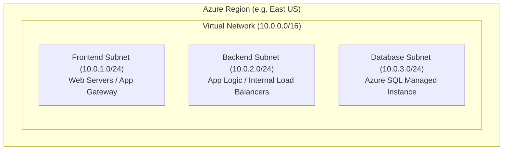
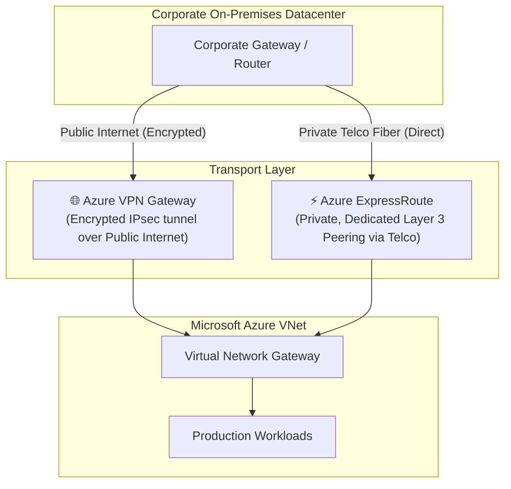
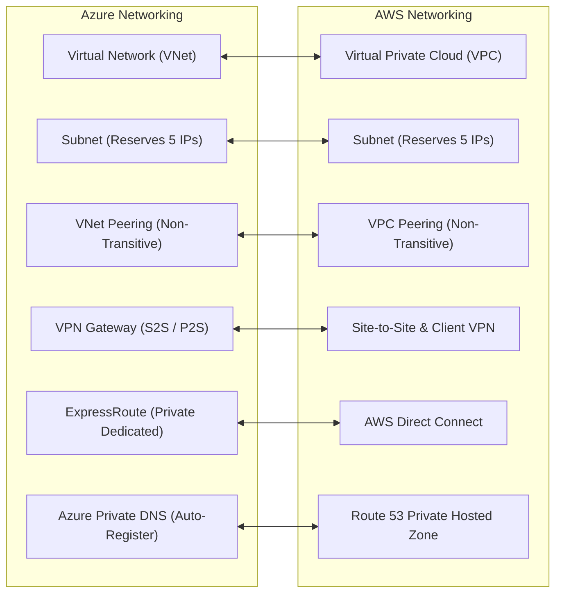

# Module 13-4: Virtual Networks (VNets) & Hybrid Connectivity

**Breadcrumbs:** [[--Index--|🏠 Index]] > [[13-Index - Azure|☁️ Azure Reference MOC]] > **Module 13-4**

---

## 1. Azure Virtual Network (VNet) Fundamentals

An **Azure Virtual Network (VNet)** is the fundamental building block for your private network in Azure. VNets enable Azure resources (like VMs and databases) to securely communicate with each other, the internet, and on-premises networks.

### 1.1 Key Characteristics of VNets:
- **Regional Isolation:** A VNet is strictly bound to a single Azure region. It cannot span across multiple regions (inter-region communication requires VNet Peering).
- **Address Space (CIDR):** Defined using Classless Inter-Domain Routing blocks from RFC 1918 private address ranges (`10.0.0.0/8`, `172.16.0.0/12`, `192.168.0.0/16`).
- **Subnets:** Segmenting the VNet into smaller subnets for security isolation.

### 1.2 The 5 Reserved IP Addresses per Subnet Rule
Whenever you create a subnet in Azure, Azure automatically reserves **5 IP addresses** for internal routing and management services. You cannot assign these addresses to workloads:

| IP Offset | Purpose |
| :--- | :--- |
| **`x.x.x.0`** | Network address. |
| **`x.x.x.1`** | Default Gateway assigned by Azure. |
| **`x.x.x.2`** | Azure DNS mapping service. |
| **`x.x.x.3`** | Azure DNS mapping service (backup). |
| **`x.x.x.255`** | Network broadcast address (Azure virtual networks do not use broadcast, but the address is reserved). |

> [!TIP]
> A `/24` subnet has 256 theoretical IP addresses, but only **251 usable IP addresses** for your VMs and resources.

---

## 2. VNet Communication & Peering

- **Intra-VNet Communication:** By default, all resources within any subnet of the same VNet can communicate with each other directly without additional configuration.
- **VNet Peering:** Connects two or more Virtual Networks directly via the Microsoft private backbone network:
  - **Regional VNet Peering:** Peering VNets in the same Azure region.
  - **Global VNet Peering:** Peering VNets located in completely different Azure regions.
  - **Low Latency & High Bandwidth:** Traffic traverses Microsoft's private fiber infrastructure, never touching the public internet.
  - **Non-Transitive:** If VNet A is peered with VNet B, and VNet B is peered with VNet C, **VNet A cannot talk to VNet C** unless an explicit peering between A and C is created, or VNet B acts as a router via Network Virtual Appliances (NVAs).

---

## 3. Hybrid Cloud Connectivity Solutions

When bridging an enterprise on-premises datacenter to Microsoft Azure, organizations deploy one or both of the following hybrid networking technologies:

### 3.1 Azure VPN Gateway
- Sends encrypted network traffic between an Azure Virtual Network and an on-premises location across the **public internet**.
- **Point-to-Site (P2S) VPN:**
  - Connects individual client devices (telecommuters, administrators) to an Azure VNet.
  - Uses OpenVPN, SSTP, or IKEv2 protocols; client software installed on laptop.
- **Site-to-Site (S2S) VPN:**
  - Connects an entire corporate office/datacenter router to an Azure VNet.
  - Uses IPsec/IKE VPN tunnels. Maximum bandwidth typically capped at 1.25 Gbps per tunnel.

### 3.2 Azure ExpressRoute
- Connects on-premises networks directly to Microsoft cloud services over a **private, dedicated connection** facilitated by a connectivity provider (e.g. Equinix, AT&T).
- **Key Characteristics:**
  - Traffic **does NOT traverse the public internet**.
  - Provides ultra-high security, predictable ultra-low latency, and massive bandwidth (from 50 Mbps up to 100 Gbps).
  - Can connect simultaneously to private VNets and Microsoft 365 services.

### 3.3 VPN Gateway vs. ExpressRoute Comparison

| Architectural Attribute | Azure VPN Gateway | Azure ExpressRoute |
| :--- | :--- | :--- |
| **Transport Medium** | Public Internet (Encrypted) | Dedicated Private Circuit (Provider) |
| **Default Encryption** | IPsec tunnel encryption | Unencrypted private line (can add MACsec) |
| **Throughput Capacity** | Up to ~1.25 Gbps | Up to 100 Gbps |
| **Latency Profile** | Variable (internet dependent) | Consistent, ultra-low |
| **Cost Profile** | Low (Gateway fees + egress data) | High (Circuit fee + port fees + provider fee) |
| **Primary Use Case** | Small/medium branch offices, backup line. | Enterprise hybrid ERP, high-volume replication. |

---

## 4. Domain Name System: Azure DNS

- **Azure Public DNS:** Hosts the DNS domains for your public web applications, resolving internet domain names (e.g. `www.company.com`) to public Azure IP addresses with ultra-fast anycast name servers.
- **Azure Private DNS:** Manages and resolves domain names in a Virtual Network without needing custom DNS servers:
  - Supports **Auto-Registration**: Automatically registers the hostnames and private IPs of VMs launched in the VNet.
  - Eliminates the need to maintain private BIND or Windows DNS servers for internal microservice discovery.

---

## 5. 🌉 Cognitive Comparative Bridge: Azure Networking vs. AWS

### Key Differences to Note:
1. **Subnet Scope:** An Azure subnet spans across **all Availability Zones** in that region by default! In AWS, every subnet must be bound to a single, specific Availability Zone.
2. **Private Link vs. Private Endpoints:** Both offer private access to PaaS services, but in Azure, Private Endpoints inject a virtual network interface (NIC) with a private IP directly into your subnet, mapped to services like Azure Storage or Azure SQL.

<!-- Documentation References -->
[Microsoft Learn: Azure Virtual Network overview](https://learn.microsoft.com/en-us/azure/virtual-network/virtual-networks-overview)
[Microsoft Learn: Azure VPN Gateway overview](https://learn.microsoft.com/en-us/azure/vpn-gateway/vpn-gateway-about-vpngateways)
[Microsoft Learn: What is Azure ExpressRoute?](https://learn.microsoft.com/en-us/azure/expressroute/expressroute-introduction)
