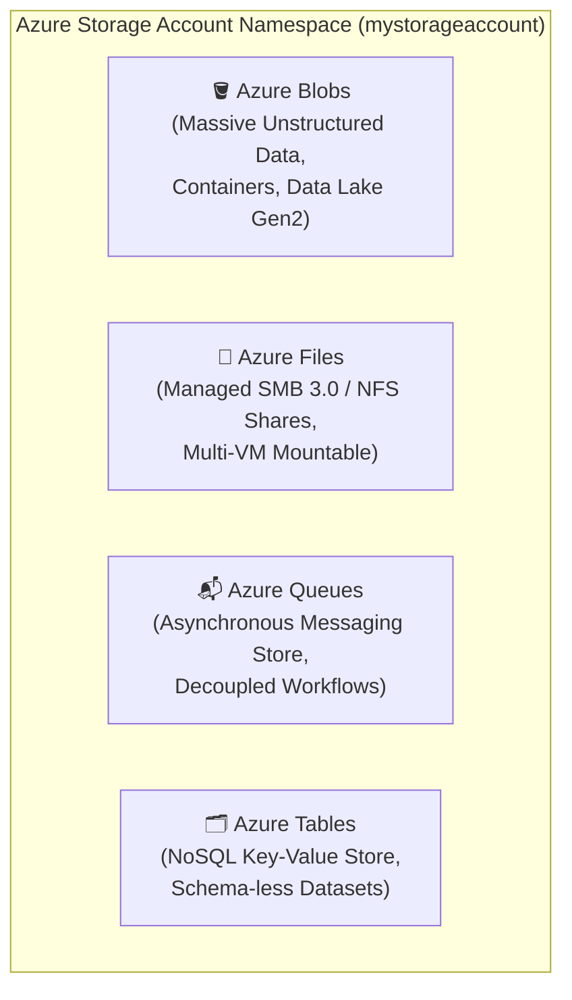
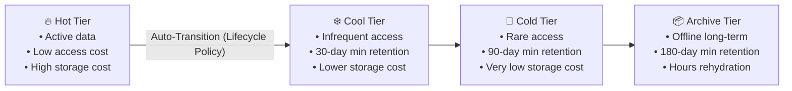
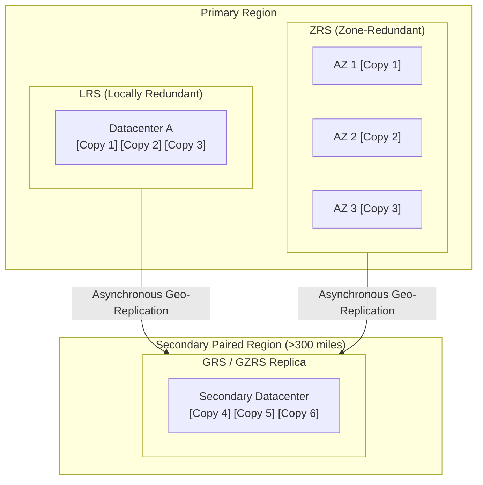
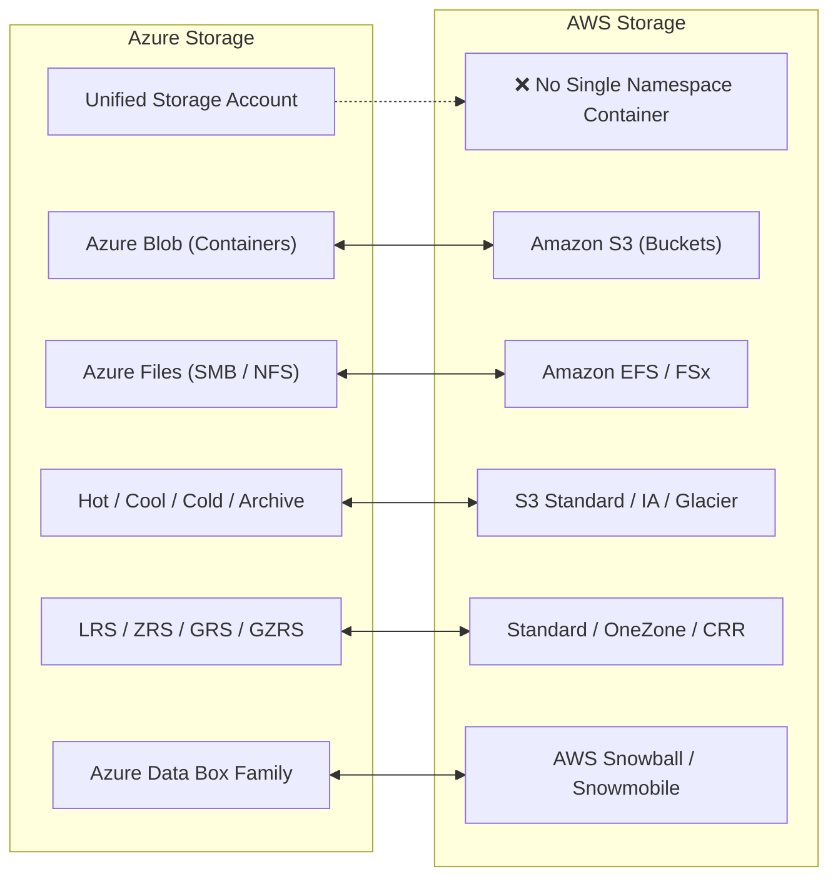

# Module 13-5: Storage Accounts, Data Redundancy & Migration

**Breadcrumbs:** [[--Index--|🏠 Index]] > [[13-Index - Azure|☁️ Azure Reference MOC]] > **Module 13-5**

---

## 1. The Azure Storage Account Architecture

An **Azure Storage Account** provides a unique global namespace in the cloud for your data. Every object stored in Azure Storage has an address that includes your unique account name (e.g. `https://mystorageaccount.blob.core.windows.net`).

### 1.1 The Four Core Storage Services
1. **Azure Blob Storage:**
   - Object storage solution optimized for storing massive amounts of unstructured data (text or binary).
   - Structured into **Storage Account ➔ Container ➔ Blob**.
   - **Blob Types:**
     - **Block Blobs:** Standard files, documents, media streams, and backups (up to ~190.7 TiB).
     - **Append Blobs:** Optimized for append operations (e.g., continuous log files).
     - **Page Blobs:** Random-access 512-byte pages used for Azure Virtual Machine Virtual Hard Disks (VHDs).
2. **Azure Files:**
   - Fully managed file shares in the cloud accessible via industry-standard **SMB (Server Message Block) 3.0** and **NFS (Network File System)** protocols.
   - Can be mounted concurrently by cloud VMs (Windows, Linux, macOS) or on-premises servers without running a dedicated file server VM.
3. **Azure Queues:**
   - Reliable messaging store capable of storing millions of messages (up to 64 KB each) for asynchronous task processing between application components.
4. **Azure Tables:**
   - Low-cost NoSQL key-value store for rapid development with massive semi-structured datasets.

---

## 2. Blob Access Tiers & Lifecycle Management

Azure provides four distinct access tiers for Blob Storage to optimize costs based on access frequency:

| Access Tier | Typical Access Frequency | Minimum Storage Duration | Rehydration Latency | Primary Use Case |
| :--- | :--- | :--- | :--- | :--- |
| **Hot** | Frequent / Daily | None | Immediate (ms) | Active websites, live media streaming, active processing. |
| **Cool** | Infrequent (Monthly) | 30 days | Immediate (ms) | Short-term backups, older telemetry, staging data. |
| **Cold** | Rare (Quarterly) | 90 days | Immediate (ms) | Secondary backups, compliance logs accessed rarely. |
| **Archive** | Exceptional (Years) | 180 days | **Hours (High/Standard Priority)** | Long-term legal retention, regulatory compliance archives. |

> [!CAUTION]
> **Archive Rehydration Trap:** Data in the Archive tier is **offline** and cannot be read directly. To read an archived blob, you must first **rehydrate** it to the Hot, Cool, or Cold tier (which takes several hours). Attempting an immediate read API call fails with `BlobArchived`.

---

## 3. Data Redundancy Strategies

Azure Storage always replicates multiple copies of your data to protect against planned and unplanned events (hardware failures, power outages, natural disasters):

### 3.1 Primary Region Redundancy
1. **Locally Redundant Storage (LRS):**
   - Replicates your data **three times within a single physical datacenter**.
   - Lowest-cost redundancy option; provides at least **99.999999999% (11 nines)** of durability over a given year.
   - Vulnerable if an entire datacenter suffers a catastrophic flood or fire.
2. **Zone-Redundant Storage (ZRS):**
   - Replicates data synchronously across **three distinct Azure Availability Zones** in the primary region.
   - Provides at least **12 nines** of durability. Withstands datacenter-level outages.

### 3.2 Secondary Region Redundancy (Disaster Recovery)
3. **Geo-Redundant Storage (GRS):**
   - Combines **LRS in the primary region** (3 copies) with **LRS in a secondary paired region** (3 copies asynchronously replicated >300 miles away).
   - Provides **16 nines** of durability.
4. **Geo-Zone-Redundant Storage (GZRS):**
   - Combines **ZRS in the primary region** (3 copies across 3 AZs) with **LRS in the secondary paired region**.
   - Maximum enterprise resiliency; provides **16 nines** of durability and protection against both regional disasters and zone failures.
5. **Read-Access Options (RA-GRS & RA-GZRS):**
   - By default, the secondary region in GRS/GZRS is dark until Microsoft initiates a failover.
   - Enabling **Read-Access** provides a secondary read-only DNS endpoint (`mystorageaccount-secondary.blob.core.windows.net`), allowing applications to read data from the secondary region during primary degradation.

---

## 4. Migration & Bulk Data Transfer Options

### 4.1 Azure Migrate
A centralized hub to discover, assess, and migrate on-premises workloads, virtual machines (VMware, Hyper-V, physical servers), databases, and web applications to Azure with automated readiness reports and cost estimations.

### 4.2 The Azure Data Box Family (Physical Appliances)
For transferring terabytes or petabytes of data where internet network upload would take weeks or months:

| Appliance | Usable Capacity | Form Factor | Connection Interface |
| :--- | :--- | :--- | :--- |
| **Data Box Disk** | 8 TB per disk (up to 35 TB pack) | Ruggedized SSDs | USB 3.0 / SATA |
| **Data Box** | 80 TB usable (100 TB raw) | 50 lb Ruggedized Box | 1x 1GbE / 2x 10GbE RJ45/SFP+ |
| **Data Box Heavy** | 800 TB usable (1 PB raw) | 500 lb Wheeled Case | Multiple 40 GbE optical ports |

### 4.3 Command-Line & Desktop Utilities
- **AzCopy:** High-performance command-line utility optimized for copying blobs or files to and from a storage account via SAS tokens.
- **Azure Storage Explorer:** Free standalone GUI application for Windows, macOS, and Linux to easily manage Azure storage resources.

---

## 5. 🌉 Cognitive Comparative Bridge: Azure Storage vs. AWS

### Key Differences to Note:
1. **The Unified Namespace Concept:** In AWS, S3 (object), EFS (file), and SQS (queue) are entirely distinct services with separate consoles and authorization models. In Azure, a **Storage Account** is a single overarching administrative boundary that unifies Blobs, Files, Queues, and Tables under one encryption key, one network firewall, and one redundancy configuration.
2. **Azure Files SMB Compatibility:** Azure Files supports direct mounting via standard SMB 3.0 over internet port 445 (with encryption), allowing on-premises legacy desktop apps to connect directly to cloud file shares without a dedicated VPN gateway.

<!-- Documentation References -->
[Microsoft Learn: Azure Storage account overview](https://learn.microsoft.com/en-us/azure/storage/common/storage-account-overview)
[Microsoft Learn: Azure Storage redundancy](https://learn.microsoft.com/en-us/azure/storage/common/storage-redundancy)
[Microsoft Learn: Blob storage access tiers](https://learn.microsoft.com/en-us/azure/storage/blobs/access-tiers-overview)
