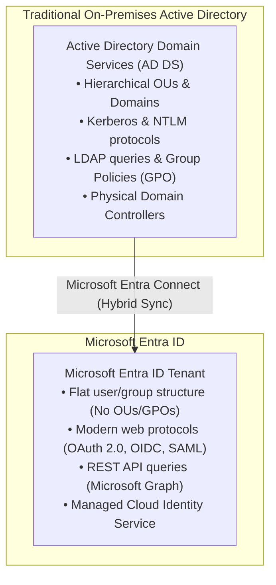
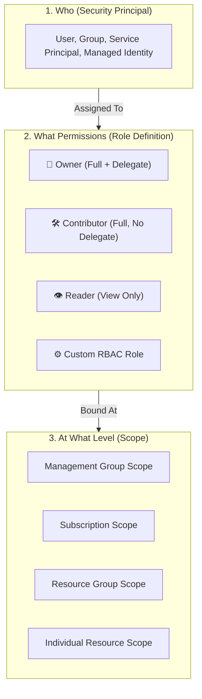
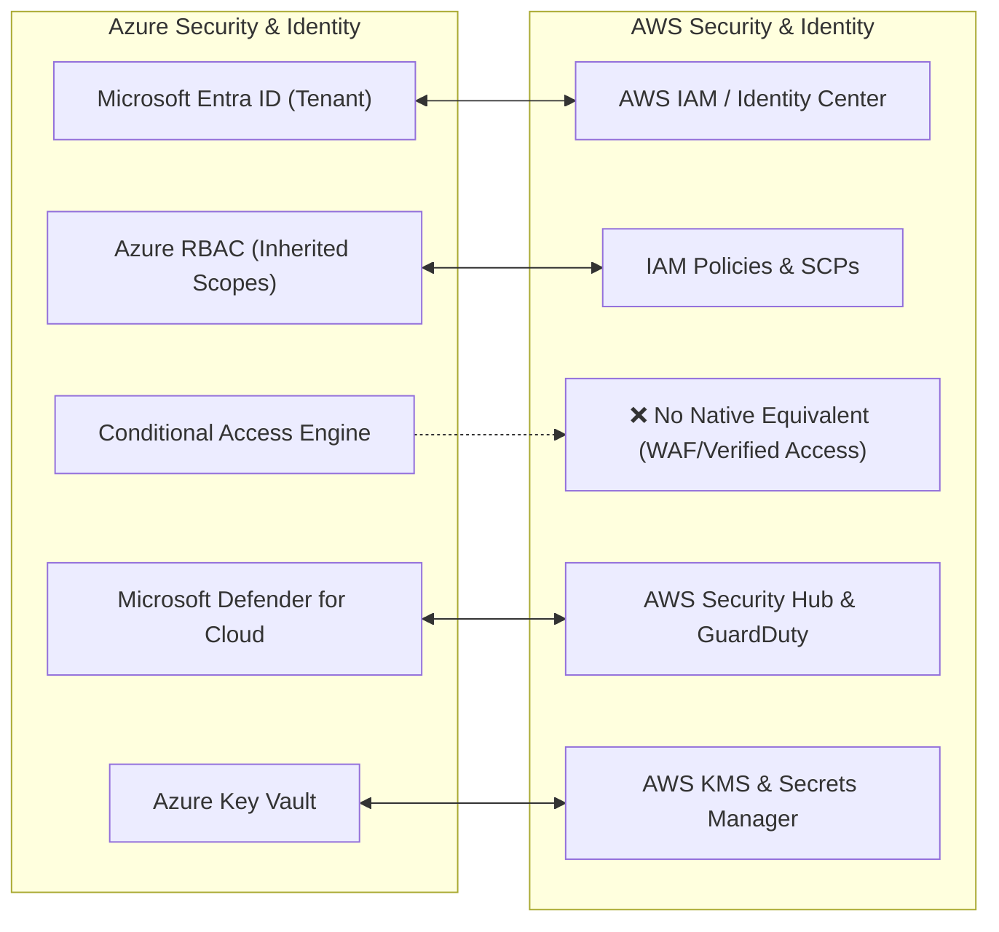

# Module 13-6: Microsoft Entra ID, Azure RBAC & Security Architecture

**Breadcrumbs:** [[--Index--|🏠 Index]] > [[13-Index - Azure|☁️ Azure Reference MOC]] > **Module 13-6**

---

## 1. Identity Foundation: Microsoft Entra ID

**Microsoft Entra ID** (formerly known as **Azure Active Directory / Azure AD**) is Microsoft's cloud-based identity and access management service. It provides authentication and authorization for internal corporate employees, cloud resources, external partners, and SaaS applications (like Microsoft 365, Salesforce, and custom apps).

### 1.1 Microsoft Entra Domain Services
- A managed service providing compatible domain services (such as domain join, group policy, LDAP, Kerberos/NTLM authentication) without deploying and patching domain controller VMs in Azure.
- Allows legacy applications that require Kerberos authentication to migrate to the cloud seamlessly.

### 1.2 Authentication vs. Authorization
- **Authentication (AuthN):** The process of **verifying the identity** of a person, device, or service (answering: *"Who are you?"*). Examples: Username/password, smart card, biometrics, MFA.
- **Authorization (AuthZ):** The process of **determining permissions** and access levels of an authenticated identity (answering: *"What are you allowed to do?"*). Examples: Azure RBAC role assignments.

---

## 2. Advanced Identity Protection: MFA & Conditional Access

```mermaid
flowchart LR
    subgraph Signals ["1. Evaluate Signals"]
        S1["👤 User / Group"]
        S2["📍 Location (IP / Country)"]
        S3["📱 Device Compliance"]
        S4["🌐 Application Accessed"]
        S5["⚠️ Real-Time Risk Score"]
    end

    subgraph Engine ["2. Decision Engine"]
        CA["🧠 Conditional Access Policy"]
    end

    subgraph Enforcement ["3. Enforce Outcome"]
        E1["✅ Allow Access"]
        E2["🛡️ Require MFA"]
        E3["🔄 Require Password Reset"]
        E4["⛔ Block Access"]
    end

    Signals --> CA
    CA --> Enforcement
```

### 2.1 Multi-Factor Authentication (MFA)
Requires two or more identity verification elements before granting access:
1. **Something you know:** Password, PIN, or secret answer.
2. **Something you have:** Smartphone (Microsoft Authenticator push notification, SMS code) or hardware FIDO2 key.
3. **Something you are:** Biometric fingerprint or facial recognition (Windows Hello).

### 2.2 Conditional Access Engine
- An intelligent "if-then" rule engine at the heart of Microsoft Entra ID.
- Uses real-time signals (user risk, sign-in risk, device health, trusted corporate IP ranges) to dynamically enforce security controls (e.g. *"If signing in from outside the corporate network, require MFA; if signing in from an untrusted country, block access immediately"*).

### 2.3 External Identities: B2B vs. B2C
- **Entra External ID (B2B - Business to Business):** Invite external partners and contractors to access your internal corporate apps and subscriptions using their own existing corporate credentials.
- **Azure AD B2C (Business to Customer):** A customer identity and access management solution for consumer-facing mobile and web applications, allowing end users to sign up using social identities (Google, Facebook, Apple, LinkedIn) or local accounts.

---

## 3. Azure Role-Based Access Control (Azure RBAC)

Azure RBAC is an authorization system built on Azure Resource Manager (ARM) that provides fine-grained access management of Azure resources.

### 3.1 The 4 Core Built-In Roles:
1. **`Owner`:** Has full access to all resources, including the right to delegate access to others (assign RBAC roles) and manage resource locks.
2. **`Contributor`:** Can create, modify, and delete all types of Azure resources, but **cannot grant access to others**.
3. **`Reader`:** Can view existing Azure resources, but cannot make any modifications.
4. **`User Access Administrator`:** Lets you manage user access to Azure resources without granting contributor rights to the resources themselves.

### 3.2 Scope Inheritance
A role assigned at a parent scope automatically inherits downwards to all child scopes:
`Management Group ➔ Subscription ➔ Resource Group ➔ Resource`

> [!NOTE]
> **Entra Roles vs. Azure RBAC Roles:**
> - **Entra ID Roles (Global Administrator, User Administrator):** Manage Entra tenant objects (users, groups, domains, licenses).
> - **Azure RBAC Roles (Owner, Contributor, Reader):** Manage Azure cloud resources (VMs, VNets, Storage Accounts). Being a Global Admin in Entra does **not** grant Owner rights over Azure subscriptions unless explicitly elevated!

---

## 4. Architectural Security Frameworks: Zero Trust & Defense-in-Depth

### 4.1 The Three Core Principles of Zero Trust
1. **Verify Explicitly:** Always authenticate and authorize based on all available data points (identity, location, device health, service or workload, data classification, and anomalies).
2. **Use Least Privilege Access:** Limit user access with Just-In-Time (JIT) and Just-Enough-Access (JEA), risk-based adaptive policies, and data protection.
3. **Assume Breach:** Minimize blast radius by segmenting access by network, user, devices, and application awareness. Encrypt all sessions end-to-end and use analytics to gain visibility.

### 4.2 The 7 Concentric Rings of Defense-in-Depth
- **Physical Security:** Microsoft datacenter gates, biometric guards, and perimeter alarms.
- **Identity & Access:** Microsoft Entra ID, MFA, Conditional Access, and RBAC.
- **Perimeter:** Azure DDoS Protection, Azure Firewall, and WAF.
- **Network:** VNets, Subnet isolation, Network Security Groups (NSGs).
- **Compute:** OS patching, endpoint detection (Defender for Endpoint), disk encryption.
- **Application:** Secure coding, SSL/TLS certificates, API management.
- **Data:** Encryption at rest, customer-managed keys (CMK) in Azure Key Vault.

### 4.3 Microsoft Defender for Cloud
- A unified Cloud Security Posture Management (CSPM) and Cloud Workload Protection Platform (CWPP).
- **Secure Score:** A continuous measurement score (0-100%) indicating the overall security posture of your Azure subscriptions against industry baselines and compliance standards.

---

## 5. 🌉 Cognitive Comparative Bridge: Azure Security vs. AWS

### Critical Architectural Nuances:
1. **Tenant vs. Account Boundary:** In AWS, an IAM user or role belongs strictly to a specific AWS account. In Azure, users reside in an **Entra ID Tenant** that can be granted access to dozens of independent subscriptions across the enterprise via RBAC.
2. **Unified Secrets & Keys:** In AWS, cryptographic keys (KMS) and application secrets (Secrets Manager / Parameter Store) are separate products with different pricing structures. In Azure, **Azure Key Vault** natively unifies Keys, Secrets, and X.509 Certificates in a single hardware-backed vault namespace.

<!-- Documentation References -->
[Microsoft Learn: Microsoft Entra ID overview](https://learn.microsoft.com/en-us/entra/fundamentals/whatis)
[Microsoft Learn: What is Azure role-based access control (Azure RBAC)?](https://learn.microsoft.com/en-us/azure/role-based-access-control/overview)
[Microsoft Learn: What is Microsoft Defender for Cloud?](https://learn.microsoft.com/en-us/azure/defender-for-cloud/defender-for-cloud-introduction)
